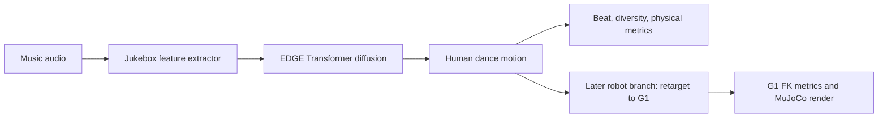
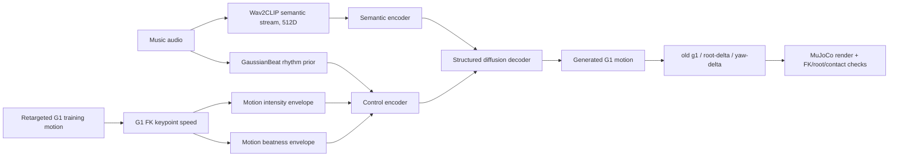
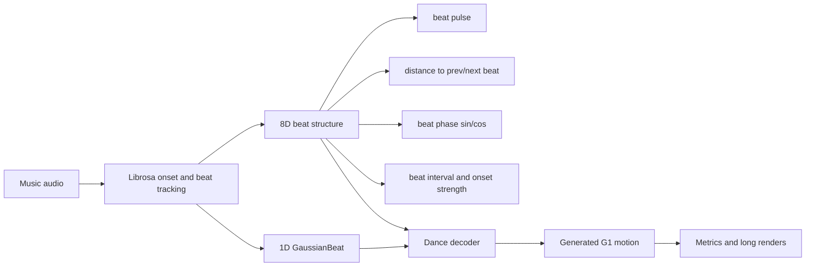
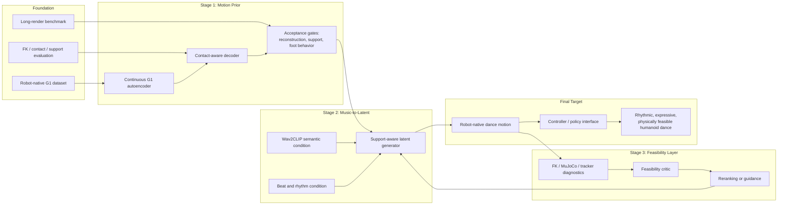

# Music2Dance 阶段进度报告

更新日期：2026-06-23

## 研究目标与路线
本项目的长期目标是构建一个面向人形机器人的、具备节奏感知能力的、物理可行的音乐驱动舞蹈生成框架。与现有多数音乐舞蹈生成方法不同，我们的目标不是先生成 SMPL 人体动作，再通过后处理或 retargeting 转换到机器人上，而是直接在机器人原生表示空间中生成舞蹈动作。目前我们以 Unitree G1 作为主要平台，希望生成的动作不仅能够和音乐节奏对齐、具有舞蹈表现力，同时也符合机器人自身的运动结构、足部接触、支撑稳定性、关节限制以及未来真实执行的需求。

这个问题的核心动机来自当前音乐舞蹈生成研究中的几个局限。首先，现有方法大多仍然是 SMPL-centric 的，即主要面向人体动作建模，而不是机器人动作建模。这类方法生成的人体舞蹈动作在视觉上可能合理，但当它们被迁移到人形机器人上时，容易产生脚滑、漂浮、支撑不稳定、root 运动异常、关节不可达、姿态不自然等问题。其次，很多舞蹈生成系统是离线动作生成系统，并没有为机器人实时或低延迟表演场景进行设计。对于真实机器人舞蹈而言，生成结果不仅要像舞蹈，还需要具备向控制层或仿真验证连接的可能性。第三，现有方法中的 beat 和 rhythm 往往只是作为普通音频特征或评价指标使用，而不是作为舞蹈动作结构中的核心因素。对于机器人舞蹈来说，节奏不只是“动作峰值和音乐拍点是否接近”，还应该影响机器人何时换重心、何时停顿、何时卡点、何时转身，以及身体和四肢如何协调地响应音乐。

因此，我们的整体研究路线主要围绕三个方向展开。第一是从人体动作生成转向机器人原生动作生成。我们不把机器人部署看作 SMPL 生成后的后处理问题，而是直接围绕 G1 机器人动作建立数据、表示、渲染和评估流程。第二是建立 robot-aware evaluation。除了传统的 beat alignment、diversity 等舞蹈生成指标，我们还需要评估足部接触、支撑状态、脚滑、地面穿透、root 稳定性、root drift、端点抖动等机器人相关失败模式。第三是先学习一个 robot motion prior。我们不希望一个模型同时从零学习音乐对齐、舞蹈多样性和机器人可行性，而是先让模型学习什么是合理的 G1 舞蹈动作空间，再在这个动作空间中学习音乐和节奏如何驱动舞蹈生成。

目前项目已经完成了第一阶段的基础设施搭建和方法诊断。我们已经准备了 G1 robot-native dance 数据，建立了基于 forward kinematics 的评估方式，完成了渲染、benchmark 和对比流程，并测试了多种条件输入和动作表示，包括音频特征、Gaussian beat、motion intensity、motion beatness 以及不同的 root representation。这些实验表明，单纯增加更丰富的音频特征，或者继续堆叠手工设计的 control signal 和 loss，并不能从根本上解决问题。部分方法虽然可以提升 beat score 或动作幅度，但仍然会出现动作平均化、手部抖动、脚漂浮、支撑不自然、异常转身等问题。这说明我们需要从建模结构上引入机器人动作可行性的约束，而不是只在原始 trajectory diffusion 上继续做局部修补。

基于这些发现，我们当前正在进入下一阶段：学习 robot-native G1 motion prior。这一阶段暂时不加入音乐条件，而是只使用 ground-truth G1 舞蹈动作训练一个 motion prior 或 autoencoder，目标是验证模型是否能够稳定地重建自然、有支撑、接触合理的机器人舞蹈动作。如果这一阶段能够通过 reconstruction、support/contact 和 naturalness 相关评估，那么下一步将是在这个 prior latent space 上训练 music-to-latent generation model，使音乐特征和节奏信息驱动机器人动作 latent，而不是直接生成原始关节轨迹。再往后，我们会进一步加入 feasibility critic、simulation-aware filtering 或 guidance，并最终连接到更适合机器人实时表演和控制的接口。

总结来说，本项目的目标是从传统的音乐到人体动作生成，推进到面向机器人原生表示、强调节奏结构、并具备物理可行性的音乐驱动人形机器人舞蹈生成。目前我们已经完成了机器人数据、表示、评估和 baseline 诊断，正在从 raw trajectory diffusion 转向 robot motion prior 的阶段。接下来最关键的工作是验证 G1 motion prior 的质量，在 prior space 中实现 rhythm-conditioned music-to-dance generation，并进一步引入面向真实机器人执行的 feasibility 和 control 机制。

## Abstract
本报告总结 Music2Dance / FineDance-G1 当前阶段的成果、问题诊断和下一步计划。项目已经从早期的“音乐到人体舞蹈生成”，推进到“直接生成 Unitree G1 机器人舞蹈动作”的研究问题。我们已经完成了 G1 数据准备、动作表示、渲染、对比视频和机器人相关评估，并系统测试了 Jukebox、Wav2CLIP、GaussianBeat、8D beat、motion intensity、motion beatness、root-delta 和 yaw-delta 等路线。

截至 2026-06-23，V6a body/support raw-control 实验已经跑完 500 epoch 和全量评估，但根据指标和 90 秒视频被判定为不适合作为主线继续推进。它能提高动作幅度和多样性，但仍有明显脚部悬空、支撑不自然和动作不合理的问题，说明继续在原始关节轨迹上堆控制信号并不能根本解决机器人可行性。

因此项目现在进入 V6b：先训练 G1 motion prior。这个阶段暂时不加入音乐，只验证模型能否稳定重建真实 G1 舞蹈动作、保持脚部接触和支撑，再进入 music-to-latent generation。当前 V6b 代码、数据缓存和 smoke test 已经通过；下一步是在 Isambard 上从头重启训练，并以 checkpoint 100 和 500 作为关键检查点。

## Key Findings
- Wav2CLIP 主线证明了音乐语义有用，但还不够。 它能提供风格线索，仍需要节拍、动作强度、动作落点和 G1 表示共同约束。
- V5 是重要进展，不是最终模型。 g1_yaw_delta 改善了 root 行为并提升指标，但接触、支撑和端点抖动仍是主要问题。
- V6a 是一次明确的消融结论。 body/support controls 跑通并完成评估，但即使用真实控制信号，视频仍出现脚漂浮和支撑不自然，所以不继续加训。
- V6b 是当前最新主线。 下一步先学习 G1 自身的合理动作空间，再让音乐去驱动这个空间，而不是直接生成原始关节轨迹。
- Beat-only 仍有研究价值。 1D beat 暴露风格信息不足；8D beat 的部分视频可看，说明更丰富的节拍结构可以作为后续 rhythm representation 的参考。
- 评价必须同时看指标和视频。 BAS、Beat F1、动作分布、foot sliding、ground penetration、支撑接触、root 稳定和长视频观感需要一起判断。

## Sections
| Section | Contents |
| --- | --- |
| Music2Dance｜实验结果与证据库 | 统一结果大表、逐版本实验记录、指标判断、视频证据。 |
| Music2Dance｜技术路线与方法 | EDGE/Jukebox、Wav2CLIP、Beat ablation、motion pipeline、GMR/retarget、G1 表示和控制信号解释。 |
| Music2Dance｜后续长期路线与论文参考 | G1-native dance prior 路线、选择原因、优势、风险、阶段计划和相关论文。 |

# Music2Dance｜实验结果与证据库

更新日期：2026-06-23

## 2026-06-23 最新更新

最新结论是：V6a body/support raw-control 实验已经完整跑完 500 epoch，并完成 pred/oracle/zero-control 等评估，但不作为主线继续推进。它证明“更多手工控制信号”确实会改变动作幅度和多样性，但仍没有学到足够稳定的 G1 支撑和接触模式。

更具体地说，V6a pred-controls 的 BAS 约为 0.431，Beat F1 约为 0.189，G1Dist 约为 6.87，G1Div 约为 17.91；oracle-controls 的 G1Dist 改到约 6.24，ground penetration 也下降到约 0.069，但 no-near-support 仍约 0.305，foot high-lift 约 0.188，foot sliding 约 0.937。也就是说，即使给模型真实控制信号，脚部悬空、支撑不自然和动作不合理的问题仍然明显。

因此当前主线切换到 V6b motion prior。V6b 暂时不加入音乐，只学习真实 G1 舞蹈动作本身。代码、缓存和 smoke test 已通过；训练缓存包含 train/test 47,817 / 3,265 clips。本地 r01 在迁移前被停止，没有 checkpoint 可继续用，下一步是在 Isambard 上重新启动，并先看 checkpoint 100，再看 checkpoint 500 的完整重建评估。

## 当前总判断

历史 raw-generation baseline 里，最强组合仍然是：`Wav2CLIP 音乐语义 + GaussianBeat 节拍先验 + root-local motion intensity/beatness + yaw-delta G1 root 表示`。V5 在节奏、分布和 root 稳定性上最强，但视频暴露了手腕抖动、脚部悬空、高抬脚和支撑不足。

最新结论是：V6a 已证明继续加 raw-control 不是最稳路线，当前研究主线应转向 V6b G1 motion prior。V3b 仍是稳定的 Wav2CLIP 对比锚点；8D beat-only 仍是有价值的节拍消融，不能简单写成负面。

## 统一结果大表

表中 BAS 统一使用 `G1FKRoboPerformBAS`。`G1Dist` 越低越好；`G1Div` 要和动作质量一起看，不能单独解释为越高越好。

| 模型/版本 | checkpoint | 条件与动作表示 | BAS | Beat F1 | G1Dist | G1Div | Foot slide | Ground pen. | 当前判断 |
| --- | --- | --- | --- | --- | --- | --- | --- | --- | --- |
| Librosa35 baseline | 2000 | Librosa35，old `g1` | 0.4504 | 0.2139 | 9.2544 | 11.3661 | 0.5349 | 0.0352 | 接触和节奏参考强，但动作保守 |
| 1D GaussianBeat | 1000 | 只有 GaussianBeat，old `g1` | 0.4199 | 0.1913 | 9.2000 | 20.5369 | 0.6015 | 0.0803 | beat-only 下界；风格和音乐容易错位 |
| Wav2CLIP/STFT r01 | 500 | Wav2CLIP + STFT + GaussianBeat，old `g1` | 0.4329 | 0.1924 | 11.8843 | 17.4055 | 0.8473 | 0.0751 | 朴素融合可训练，但质量差 |
| Wav2CLIP/STFT r02 | 2000 | Wav2CLIP + STFT + GaussianBeat，old `g1` | 0.4245 | 0.1979 | 8.9113 | 12.8445 | 0.5572 | 0.0408 | 更稳的轻量音频栈，但动作偏平均 |
| R05 intensity control | 1000 | Wav2CLIP + GaussianBeat + predicted intensity，old `g1` | 0.4353 | 0.1866 | 5.3518 | 18.0232 | 0.7267 | 0.0861 | 分布变好，但 speed-max 不是真正 beatness |
| V3 world-frame controls | 1000 | Wav2CLIP + GaussianBeat + intensity/beatness，old `g1` | 0.4568 | 0.2050 | 6.0560 | 18.4838 | 0.7462 | 0.0483 | 控制有效，但会被 root yaw exploit |
| V3b root-local controls | 1500 | Wav2CLIP + GaussianBeat + root-local controls，old `g1` | 0.4517 | 0.2106 | 5.7822 | 14.0929 | 0.7639 | 0.0517 | V5 前最重要 Wav2CLIP anchor |
| V4 root-delta | 1500 | V3b controls，`g1_root_delta` | 0.4418 | 0.2025 | 3.3720 | 14.4285 | 0.8544 | 0.0614 | yaw spike 降低，但长视频倾斜 |
| V5 yaw-delta | 1000 | V3b controls，`g1_yaw_delta` | 0.4693 | 0.2340 | 3.9908 | 16.5609 | 0.8384 | 0.0757 | 指标最强，但接触和手腕失败 |
| 8D beat-only | 1000 | 8D beat structure only，old `g1` | 0.4296 | 0.1934 | 9.1177 | 14.4888 | 0.6561 | 0.1580 | 有价值消融；视频有可看性，但不能替代 Wav2CLIP 主线 |
| V6a body/support raw | 500 pred | Wav2CLIP + GaussianBeat + body/support/upper/contact controls，`g1_yaw_delta` | 0.4307 | 0.1891 | 6.8711 | 17.9140 | 0.9593 | 0.1190 | 完整跑完但拒绝；动作活跃，脚漂浮和支撑失败明显 |
| V6a body/support raw | 500 oracle | 同上，但评估时使用真实控制信号 | 0.4315 | 0.1879 | 6.2433 | 18.4137 | 0.9373 | 0.0693 | oracle 也未解决支撑问题，说明不是 predictor 单点失败 |
| V6b G1 motion prior | smoke / r01 stopped | 无音乐条件；只重建真实 G1 动作，AE latent `[75,128]` | N/A | N/A | N/A | N/A | N/A | N/A | 新主线已实现并 smoke 通过；需在 Isambard 从头重启正式训练 |

## 逐版本记录

### 原始 EDGE + Jukebox
做了什么：沿用 EDGE 思路，用 Jukebox 音乐特征作为 diffusion model 的主要音乐条件，生成舞蹈动作。
达成了什么：建立了 music-to-dance 的基础生成框架，也给后续 G1 改造提供了训练、评估和渲染入口。
问题：Jukebox 特征重，路线偏 human dance。迁移到 G1 后，动作像舞蹈还不够，还必须满足机器人身体结构、脚接触和根节点稳定。

### G1 FK beat / lbeat 早期方向
做了什么：把训练目标从 human motion 推向 G1，用 Unitree G1 FK 提取 motion beat，并引入 beat loss。
达成了什么：早期 lbeat fine-tune 能显著提高 G1 节奏指标，说明模型可以被明确的 beat supervision 拉动。
问题：节奏分数提升同时带来 foot sliding 和 ground penetration 变差。后续结论是：beat loss 有价值，但不能单独作为主目标。

### Librosa35 baseline
做了什么：用轻量传统音频特征作为 FineDance-G1 稳定参考。
达成了什么：接触质量、foot sliding 和 ground penetration 相对干净，节奏也不差。
问题：动作偏保守，多样性低，不足以覆盖更丰富的舞蹈风格。

### 1D GaussianBeat
做了什么：移除 Wav2CLIP/STFT/Jukebox，只保留一条 Gaussian beat 曲线。
达成了什么：建立 beat-only lower bound，并保留较高动作多样性。
问题：音乐风格信息几乎没有，视频中会出现舞蹈风格和音乐不相符的情况。它不是失败样本，而是说明“只给 beat 位置不够”。

### Wav2CLIP/STFT r01/r02
做了什么：把 Wav2CLIP、STFT、GaussianBeat 拼成轻量音乐条件。
达成了什么：证明不用 Jukebox 也能训练，Wav2CLIP 路线可行；r02 比 r01 稳。
问题：动作仍偏平均，节奏和分布没有达到后续 structured controls 的水平。

### R05 motion energy/intensity
做了什么：从 G1 FK keypoint speed 中抽取节拍附近速度峰值，作为 motion energy/intensity 控制。
达成了什么：分布质量明显改善，说明显式动作控制能缓解平均化。
问题：speed maxima 描述的是动作强度，不是真正 beatness。它和当前 beat metric 的局部低谷/停顿逻辑不完全一致。

### V3 world-frame intensity/beatness
做了什么：把控制拆成 motion intensity 和 motion beatness，并加入 structured semantic/control encoder。
达成了什么：zero beatness、zero all controls 等 ablation 证明模型不是忽略这些条件。
问题：控制在 world frame 里算，模型可以通过 root yaw 快速旋转制造世界坐标速度，长视频会出现 root-yaw exploit。

### V3b root-local controls
做了什么：把 motion intensity/beatness 改到 root-local frame，并加入 root angular 诊断。
达成了什么：避免了 V3 的主要 world-frame 漏洞，成为 V5 前最重要的 Wav2CLIP anchor。
问题：root angular tail 仍存在，长视频里仍可能出现极端 root 行为；接触和端点平滑也没有彻底解决。

### V4 root-delta
做了什么：把 G1 root 表示改成局部 root delta 和完整 SO(3) root rotation。
达成了什么：极端 yaw spike 明显下降，说明 root representation 是关键变量。
问题：完整旋转积分带来 roll/pitch 漂移，90 秒 render 会出现侧倒、漂浮或姿态累积错误。

### V5 yaw-delta
做了什么：保留局部 root translation，但 root heading 改成 yaw-only delta，去掉 roll/pitch 积分。
达成了什么：目前统一表里指标最强，root-up 和 root angular 诊断明显改善。
问题：模型把问题转移到端点和接触：手腕 jitter、脚离地、高抬脚、near support 不足。V5 是后续 prior 的基础，不是最终模型。

### 8D beat-only
做了什么：把 1D GaussianBeat 扩展成 8D beat structure，但仍不使用 Wav2CLIP、STFT、Jukebox 或 motion-control predictor。
达成了什么：训练到 1000 并完成全量 eval。和 1D 相比，它提供更丰富的 beat 相位、距离、onset 强度信息；部分 90 秒 render 有可看性。
问题：指标上仍落后 Wav2CLIP-family，尤其是 rhythm、distribution 和 ground/contact 组合评价。它是节拍表示设计的 ablation，不是当前主线替代方案。

### V6a body/support raw
做了什么：把控制信号进一步拆成 body intensity、support beatness、upper beatness 和左右脚 support contact，并继续使用 V5 的 `g1_yaw_delta` 表示。
达成了什么：训练和评估流程完整跑通，500 epoch 完成；pred、oracle 和多种 zero-control ablation 都有结果。结果证明这些控制信号确实影响动作：zero-all-controls 会让动作更保守、接触指标更干净，但动作幅度和分布明显变差。
问题：V6a 没有解决核心失败。pred 和 oracle 都有高 foot sliding、高 no-near-support、高 foot high-lift，固定 90 秒 render 里仍能看到脚漂浮、支撑不自然和不合理动作。所以结论不是“继续训到 1000”，而是停止 raw-control patching，转向 G1 motion prior。
最新视频证据：`renders/EXP-20260622-finedance-g1-v6a-body-support-raw/checkpoint_comparison_012_90s_seed1234_extract_v6a500_v3b1500_librosa35/comparison.mp4`。本地已保留原质量版本：`videos/original/v6a_body_support_raw_test012_90s_v6a500_v3b1500_librosa35_comparison.mp4`。

### V6b G1 motion prior
做了什么：暂时不使用音乐，只训练一个 G1 motion autoencoder 来重建真实 G1 舞蹈动作。目标是先证明模型能学到合理的机器人动作空间，再把音乐条件接进 latent space。
达成了什么：代码、数据缓存、单元测试、smoke train 和 eval CLI 已验证。V6b 缓存记录了 motion、左右脚 contact、near-support、最低脚高、ground 和 source 信息；train/test 数量是 47,817 / 3,265 clips。
当前状态：本地 r01 被手动停止在 checkpoint 100 之前，没有可用权重。smoke 只是流程验证，不是模型质量结果；正式结果需要在 Isambard 上从头训练。
下一步判定门槛：checkpoint 100 看重建是否明显正常；checkpoint 500 看 FK reconstruction、Contact F1、脚部支撑、foot sliding、ground penetration、动作幅度和固定 render。

# Music2Dance｜技术路线与方法

更新日期：2026-06-24

## 2026-06-23 最新更新
方法路线的最新变化是：V6a 已完成，但不继续作为主线；V6b 成为当前新阶段。
V6a 的意义是把“动作强度、支撑节奏、上肢节奏、脚部接触”拆成更清楚的控制模块，验证 raw diffusion 是否能靠这些信号修好脚漂浮和支撑问题。实验结果说明，这些模块能改变生成动作，但仍不能让模型稳定生成合理的 G1 支撑动作。
V6b 因此把问题拆开：先不听音乐，只学习真实 G1 舞蹈动作本身。如果模型连真实动作的重建都不能保持脚部接触、支撑和自然幅度，那么后面加音乐也不会真正解决问题。

## 当前架构图
这张图替换了之前的简化流程图。它更贴合本项目：左侧是音乐输入和 G1 舞蹈数据；中间是先学习 G1 motion prior，再做 music-to-latent；右侧是机器人相关评估和最终 G1 舞蹈输出。
图片文件：`figures/music2dance_method_overview_project_specific_v3.png`。当前 Notion API 工具不能直接上传本地 PNG；请在 Notion 中把该图片拖到这里，或提供一个可访问的图片链接后可自动嵌入。
本地图文件：`figures/music2dance_method_overview_project_specific_v3.png`。

## 三条主流程

### 原始 EDGE / Jukebox 路线

原始 EDGE 的核心是用 Jukebox 作为强音乐特征，再用 diffusion model 生成舞蹈。这个起点适合 human dance generation，但迁移到 G1 后，评价标准变了：动作不能只像舞蹈，还要能被 Unitree G1 的身体结构、脚接触和根节点稳定性接受。

### 当前 Wav2CLIP 主线

这条线把音乐条件拆开：Wav2CLIP 负责音乐语义和风格线索，GaussianBeat 提供节拍位置，motion intensity/beatness 从真实 G1 动作中抽取“动作如何响应音乐”的中间控制目标。

### Beat 消融路线

Beat-only 路线回答的是消融问题：如果没有 Wav2CLIP、STFT、Jukebox，也没有 motion-control predictor，只给节拍结构，模型能学到什么。

## Motion pipeline
现在的 pipeline 要同时看音乐条件和机器人动作空间。
1. 数据源：早期 EDGE/AIST++ 提供 human dance + music 的基础设定；FineDance 提供更细的手部动作、更多舞种和更长的动作音乐配对。
2. Human-to-G1：项目使用已经 retarget 到 Unitree G1 的 FineDance 动作。GMR/retarget 不是边角问题，因为后面所有训练和评价都依赖这批 G1 reference motion 的质量。
3. Dataset preparation：动作切成 5 秒、30 FPS、150 帧训练片段，并配上相同长度的音频特征。
4. G1 motion representation：old `g1` 简单但 root 容易出问题；`g1_root_delta` 改善 yaw spike 但会累积 roll/pitch 漂移；`g1_yaw_delta` 只保留 yaw heading delta，是目前最有希望的 root 表示。
5. Evaluation：用 Unitree G1 的 MuJoCo/MJCF 模型做 FK，得到 FK beat、foot sliding、ground penetration、root-up、root angular、wrist jerk 等诊断。
6. Render and deployment direction：90 秒长视频用于发现 5 秒指标不容易暴露的问题；如果后续接 SONIC/WBC，还要看策略执行后的接触和稳定性。

## Wav2CLIP 方向

### Wav2CLIP + STFT + GaussianBeat
这一阶段的输入是 5 秒音频片段，输出是 150 帧条件，每帧对应 30 FPS 的一个时间点。

| 模块 | 维度 | 怎么实现 | 直观含义 | 主要发现 |
| --- | --- | --- | --- | --- |
| Wav2CLIP | 512 | 音频以 16kHz 输入 Wav2CLIP，得到 embedding，再重采样到 150 帧 | 给模型音乐语义、音色和风格线索 | 比 Jukebox 轻很多，可训练，但单独不足以保证动作幅度和节奏动作 |
| STFT | 193 | 用 librosa STFT，`n_fft=384`，log magnitude，裁剪或补齐到 150 帧 | 给模型短时频谱纹理 | r02 比 r01 稳，但仍容易平均化 |
| GaussianBeat | 1 | librosa onset + beat tracking，在 beat frame 周围生成 Gaussian 曲线 | 明确告诉模型哪里有主节拍 | 有用，但一条曲线表达不了风格、段落和动作类型 |
| Fusion | 706 total | r01/r02 用 concat_norm 或 stream_adapter 处理三路特征 | 把语义、频谱和节拍合到 diffusion 条件里 | 可替代 heavy Jukebox 起步，但不是最终答案 |

核心结论：轻量音频特征可以跑通，但只是让模型“听见音乐”。它没有告诉模型“什么时候该大动作，什么时候该停顿，哪种动作更像这个音乐风格”。

### Motion intensity 和 motion beatness
R05 开始把真实 G1 动作也用来生成控制信号。V3 之后进一步把控制拆成两类。

| 控制信号 | 怎么从 G1 动作里算 | 它想表达什么 | 为什么重要 |
| --- | --- | --- | --- |
| motion intensity | 在每个 audio beat 附近的窗口里，取加权 FK 速度最大值 | 这个节拍附近动作应该多大、多活跃 | 防止模型生成低幅度、平均化动作 |
| motion beatness | 先平滑 FK 速度，在 beat 附近找速度低谷，再看低谷两侧是否有明显速度差 | 这个节拍附近是否有停顿、回弹、转向或动作落点 | 更贴近当前 beat metric 检测的 motion beat event |

当前关键点权重是：左右手腕各 0.35，左右脚踝各 0.10，torso 0.10。这个设计解释了 V5 的问题：手腕权重很高，模型可能用高频手腕运动满足 intensity/beatness，而不是用更自然的全身重心和脚步动作匹配音乐。

### V3 和 V3b 的坐标系差异
V3 在 world frame 里算关键点速度。这样模型可以通过快速转 root yaw，让手腕、脚踝和躯干在世界坐标中移动很快，即使身体动作本身并不自然。这就是 root-yaw exploit。
V3b 把速度计算改成 root-local frame：先减去 root position，再旋转到 root 局部坐标系，再计算 FK keypoint speed 和 intensity/beatness。这样控制信号更关注身体相对自身的动作，而不是全局朝向快速变化。

### 训练和推理时怎么用控制
模型条件分成两支：semantic branch 输入 Wav2CLIP；control branch 输入 GaussianBeat、motion intensity、motion beatness。训练时可以使用真实 G1 动作提取出来的控制信号，也会逐步混入预测控制。推理时没有真实动作，所以需要 predictor 根据 Wav2CLIP + GaussianBeat 预测 intensity 和 beatness，再送进 diffusion decoder。

## V6a body/support 控制模块
V6a 不是简单再加一个 loss，而是把动作控制拆成几个更具体的模块：

| 模块 | 怎么实现 | 想解决的问题 | 实验后判断 |
| --- | --- | --- | --- |
| body_intensity | 用 torso 和脚部 FK 速度生成动作强度曲线，不再主要依赖手腕 | 让模型知道哪些节拍附近应该有大动作 | 能提高动作活跃度，但不能保证动作合理 |
| support_beatness | 在身体和脚部速度中找节拍附近的低谷、停顿和回弹，并用 near-support 过滤 | 让节拍落点更接近换重心、支撑和脚步动作 | 方向正确，但 raw diffusion 仍没有形成稳定支撑模式 |
| upper_beatness | 单独描述上肢和手腕附近的节奏响应 | 避免所有节奏都被支撑脚解释，也保留上肢舞蹈表现 | 有助于做消融，但仍可能带来端点抖动 |
| support_contact | 从 G1 FK 脚高和接触阈值中得到左右脚 contact 条件 | 让模型知道什么时候哪只脚应该接近地面并承担支撑 | 即使用 oracle contact，生成结果仍有明显支撑失败 |

V6a 的关键结论是：控制信号本身不是没用，而是 raw trajectory diffusion 没有足够强的机器人动作先验。它可以学到“动作更大”或“信号有影响”，但不能稳定学到“怎样的动作对 G1 来说是自然、有支撑、可执行的”。

## V6b G1 motion prior
V6b 把音乐暂时拿掉，只问一个更基础的问题：模型能不能重建真实 G1 舞蹈动作，并保持脚接触、支撑、root 稳定和动作幅度。
当前实现方式是一个 G1 motion autoencoder：输入 150 帧、34 维的 `g1_yaw_delta` 动作，编码成更低维的连续 latent，再解码回 G1 动作。同时模型还预测左右脚 contact，训练时用 motion、速度、加速度、FK keypoint、contact、脚高和滑动相关损失共同约束。
这一步的重要性在于：如果 V6b-A 能通过重建门槛，后续音乐模型就不再直接生成原始关节轨迹，而是生成这个 G1 latent space 中的动作表示。这样音乐负责选择动作，motion prior 负责保证动作仍像真实 G1 舞蹈。
当前 V6b 已完成代码和 smoke 验证，但正式 r01 需要在 Isambard 重新训练。checkpoint 100 是第一轮 sanity check；checkpoint 500 是完整 reconstruction gate。

## Beat 方向

### 1D GaussianBeat
1D 版本只给一个 Gaussian beat 曲线。它的价值是提供 beat-only 下界：模型在没有 Wav2CLIP、STFT、Jukebox 的情况下还能生成动作，说明训练集本身和 beat prior 能提供一些节奏结构。
但它的问题也清楚：音乐风格信息几乎没有；只知道哪里有 beat，不知道音乐风格、强弱和段落；condition sensitivity 差别不够大；本地对比视频里 1D 可能生成和音乐风格完全不相符的舞蹈。

### 8D beat-only
8D 版本仍然是 beat-only，但比 1D 多了节拍结构。

| 通道 | 作用 |
| --- | --- |
| beat_pulse | 在 beat frame 上给离散脉冲 |
| gaussian_beat | 给平滑节拍曲线 |
| dist_to_prev_beat_norm | 当前帧离上一个 beat 多远 |
| dist_to_next_beat_norm | 当前帧离下一个 beat 多远 |
| beat_phase_sin / beat_phase_cos | 用周期相位表达两个 beat 之间的位置 |
| beat_interval_norm | 当前 beat 间隔长度 |
| onset_strength_norm | 局部 onset 强度 |

8D 比 1D 更合理，因为模型不仅知道“这里有 beat”，还知道“我在两个 beat 之间的哪个相位，离前后 beat 多远，这段 beat 稀疏还是密集，onset 强不强”。
当前判断：8D 指标没有超过 Wav2CLIP-family，接触和 ground penetration 也有明显问题；但 8D render 并非完全不可看，有些 90 秒视频的节奏和动作观感是能成立的。它是节拍表示设计的 ablation，对主线有启发。

# Music2Dance｜后续长期路线与论文参考

更新日期：2026-06-24

## 2026-06-23 当前执行计划
当前不再继续 V6a raw-control 加训。V6a 已经完成 500 epoch 和全量评估，结论足够明确：它能改变动作幅度和多样性，但不能稳定解决脚漂浮、支撑不自然和动作不合理的问题。
下一步主线是 V6b G1 motion prior，分三步推进：
1. **服务器迁移与环境验证。** 把 repo、FineDance-G1 数据和 V6b 缓存迁移到 Isambard，重建 `.venv311`，用单元测试和 smoke job 验证 Slurm、MuJoCo/FK、数据路径和日志输出。
2. **V6b-A：只训练 G1 motion prior。** 暂时不加音乐，从真实 G1 舞蹈动作中学习一个可重建、可诊断的 G1 动作空间。checkpoint 100 先看是否能正常重建；checkpoint 500 做完整评估。
3. **V6b-B：通过后再做 music-to-latent。** 如果 V6b-A 能保持脚部接触、支撑、root 稳定和动作幅度，再让 Wav2CLIP、GaussianBeat 和 rhythm/support controls 去生成 latent，而不是直接生成 raw joint trajectory。

这样做的优势是把问题拆清楚：先证明模型知道什么是合理的 G1 舞蹈动作，再讨论音乐如何驱动动作。主要风险是 motion prior 可能把动作变平，或者重建误差看起来低但脚接触仍不好，所以不能只看 loss，必须看 FK/contact 指标和固定 render。

## 最终目标路线图
这张图表达最终研究主张：先学习 G1 自身合理的动作空间，再让音乐驱动这个空间，最后用可执行性诊断把生成结果连接到机器人控制。


本地图文件：`figures/target_roadmap.svg`，预览版：`figures/target_roadmap.png`。

## 总路线
后续主线不应该继续在 raw G1 joint diffusion 上不断叠加小 loss，而是转向 G1-native dance prior。
核心路线是：
```
Wav2CLIP + GaussianBeat + rhythm/support controls
    -> music-to-G1 latent or token generator
    -> G1-feasible dance prior / decoder
    -> robot-native pose sequence
    -> optional feasibility critic or action decoder
```
这个路线的关键不是“用 latent”本身，而是先学习 G1 可行动作空间，再让音乐去选择这个空间里的动作。这样可以把三个问题拆开：什么动作对 G1 是可行的；音乐应该选择什么样的动作；生成结果是否真的能通过接触、支撑、root 和执行诊断。

## V6b-A 验收门槛
checkpoint 500 的核心判断不是“loss 是否下降”，而是重建出来的动作是否仍然像真实 G1 舞蹈。

| 检查项 | 目标 | 为什么重要 |
| --- | --- | --- |
| FK reconstruction | FK MPJPE 进入可接受范围 | 说明关节轨迹在机器人身体上重建后没有大幅变形 |
| Contact F1 | 左右脚接触预测稳定 | 后续音乐生成必须知道什么时候脚应该贴近地面 |
| No-near-support / high-lift foot | 不明显差于真实 G1 数据 | 防止 V6a 那种脚悬空和支撑不自然继续出现 |
| Foot sliding / ground penetration | 不明显破坏真实数据水平 | 这是机器人执行前最容易暴露的问题 |
| 动作幅度 | 不能只靠变小来变稳 | 舞蹈需要表现力，不能退化成保守小动作 |
| 固定 render | 无漂浮、侧倒、重复拼接、严重手部抖动 | 视频能发现单个数字看不出的失败模式 |

## 为什么要这样做
当前 raw motion generation 太难一次性学完所有事情：音乐语义、节奏、舞蹈结构、手脚协调、foot support、ground contact、root dynamics 和 G1 morphology 都被压进同一个 denoiser。V5 的结果说明，修好 root 之后，问题会转移到手腕 jitter、脚部悬空、高抬脚和支撑不足。
G1-native prior 的好处是先学“G1 能自然做什么动作”，再学“音乐应该选哪些动作”。这比继续给 raw pose model 加手写 loss 更容易形成清楚的研究故事，也更容易解释为什么某个模型好或不好。

## Phase 0：统一评估门槛
目标：先把 V3b、V5、8D 和后续 V6 的评估标准统一，不再只看一个 beat score。
需要长期保留的指标包括：rhythm、distribution、root 稳定、foot sliding、ground penetration、support/contact、wrist/foot jerk、长视频 render，以及未来可能接入的 MuJoCo/tracker 结果。
优势：可以避免“指标最高但视频更差”的判断错误。V5 就是典型例子：节奏和分布强，但 contact/support 和手腕质量不够。
风险：指标太多会变成难读的大表。因此主表应该保留关键列，诊断指标放在证据库或 failure panel 里。

## Phase 1：G1 motion prior
目标：先不加音乐，训练一个能重建 G1 舞蹈动作的 motion prior。第一版建议从 continuous AE/VAE 开始，输入使用当前稳定的 `g1_yaw_delta` 表示，并加入 contact/support head。
推荐顺序：
1. Deterministic AE。
2. AE with light KL / VAE。
3. Part-wise continuous latent。
4. RVQ/HRVQ。
5. Hierarchical coarse/detail latent。
6. Action 或 PD-target latent，只在 pose/contact prior 稳定后再考虑。
为什么 continuous AE/VAE 先做：当前最容易坏的是 foot height、support contact、endpoint jerk、root yaw continuity、body/hand coordination 和 dance amplitude。RVQ/HRVQ 虽然很流行，但如果 codebook 太粗，会把 contact 和手脚细节量化坏。它应该作为第二阶段 ablation，而不是第一主线。
能带来的优势：
- 把 G1 可行动作空间先学稳。
- 降低 raw joint denoising 的难度。
- 为后续 music-to-latent、rerank、streaming 和 policy 留统一接口。
- 可以直接诊断 decoder 是否破坏 contact/support，而不是和音乐生成错误混在一起。
可能的问题：
- VAE 的 KL 可能让动作变平、手部和接触细节被抹掉。
- RVQ/HRVQ 可能 codebook collapse，或者提升多样性但损坏 foot support。
- Part-wise latent 可能降低手腕 jitter，但破坏全身协调。
- reconstruction MSE 好不代表 FK/contact 好，所以不能只看重建误差。

## Phase 2：Music-to-latent generator
目标：等 G1 motion prior 能稳定重建后，再训练音乐条件模型生成 latent，而不是直接生成 raw joint sequence。
第一路线建议是 continuous latent diffusion：
```
Wav2CLIP + GaussianBeat + body/support controls
    -> latent diffusion
    -> G1 motion decoder
```
条件应该保持 compact and typed：Wav2CLIP 负责语义和风格；GaussianBeat 提供节拍；body_intensity 和 support_beatness 表达动作强度、支撑和节奏落点。STFT、Librosa、Jukebox 不应回到主线，除非有明确 ablation 理由。
能带来的优势：
- 比 raw pose diffusion 维度更低，更容易学长程结构。
- Wav2CLIP 和 rhythm/support controls 分工更清楚。
- 可以直接和当前 raw pose baseline 对比，证明 prior 是否真的有帮助。
- 未来可扩展到 masked latent、RVQ token 或 hierarchical latent。
可能的问题：
- 如果 motion prior 本身太弱，latent diffusion 仍会平均化。
- decoder 可能把 generator 错误 smoothing 掉，导致动作幅度低。
- 强 guidance 可能提高 beat score 但破坏 contact/root。
- 如果一开始 joint training，decoder failure 和 generator failure 会纠缠，难以判断问题来源。

## Phase 3：Feasibility critic
目标：把 FK、MuJoCo、tracker 或未来控制器产生的执行信号变成 feasibility label，再训练轻量 critic。第一步用于 report 和 rerank，不急着做 training guidance。
推荐路线：
```
generated motion
    -> FK/MuJoCo/tracker diagnostics
    -> feasibility labels
    -> feasibility critic
    -> rerank or guide latent generation
```
可用 label 包括 foot sliding、ground penetration、no-near-support、high-lift foot、wrist/foot jerk、root drift、root angular velocity、fall/termination、tracking error、action jerk 和 joint limit pressure。
能带来的优势：
- 把“看起来像舞蹈”和“机器人能执行”连接起来。
- 先做 rerank 风险较低，不会直接破坏 generator。
- 可以把 MuJoCo/tracker 的慢评估结果转成更便宜的内部评分。
可能的问题：
- critic 可能偏爱低幅度甚至接近不动的动作。
- critic 可能学到指标漏洞，而不是真实可执行性。
- guidance 可能 exploit critic blind spot。
- tracker 纠正动作后，可能隐藏 generator 本身的问题。

## Phase 4：Streaming / policy compatibility
目标：当前不把 streaming 或 real-time policy 当第一创新点，但从现在开始保留接口，避免未来重写。
需要长期保留的接口包括：chunk-first generation、history-conditioned generation、bounded lookahead、standalone latent decoder、support/contact history、action bridge metadata。
长期有两条路线：

| 路线 | 做法 | 优势 | 风险 |
| --- | --- | --- | --- |
| Distillation path | offline high-quality generator -> causal student -> receding-horizon motion policy | 工程上最稳，能复用离线模型 | 容易和 RoboPerform / DiscoForcing 的 teacher-student 叙事撞车 |
| Non-distillation path | 直接训练 latency-conditioned latent generator | 创新边界更清楚，不依赖离线 teacher | 训练更难，可能有延迟、漂移和历史误差累积 |

更有潜力的非蒸馏方向是：`past audio + latency_budget + latent/motion history + support/contact history -> next G1 support-aware dance latent chunk`。`latency_budget` 可以采样为 0ms、250ms、500ms、1000ms 或 full_context。
为什么现在要保留接口：如果 decoder 和 full-song audio conditioning 绑死，未来很难接 streaming、policy 或 action decoder。即使当前先做 offline generator，也应该让 full-song generation 成为 chunk generation 的 wrapper。

## 论文和项目参考

### 当前基础和直接相关
- EDGE: Editable Dance Generation From Music: https://arxiv.org/abs/2211.10658
- EDGE project page: https://edge-dance.github.io/
- Jukebox: A Generative Model for Music: https://arxiv.org/abs/2005.00341
- Wav2CLIP: Learning Robust Audio Representations From CLIP: https://arxiv.org/abs/2110.11499
- AIST++ / AI Choreographer: https://arxiv.org/abs/2101.08779
- FineDance: A Fine-grained Choreography Dataset for 3D Full Body Dance Generation: https://arxiv.org/abs/2212.03741
- GMR, Retargeting Matters: General Motion Retargeting for Humanoid Motion Tracking: https://arxiv.org/abs/2510.02252

### Motion prior / token / hierarchy
- MLD: https://chenxin.tech/mld/
- MoMask: https://arxiv.org/abs/2312.00063
- DanceMosaic: https://ojs.aaai.org/index.php/AAAI/article/view/37833
- DuetGen: https://arxiv.org/abs/2506.18680
- SoulDance: https://arxiv.org/html/2507.14915v1

### Robot feasibility / execution / policy
- SONIC: https://arxiv.org/abs/2511.07820
- BeyondMimic: https://arxiv.org/abs/2508.08241
- KungfuBot: https://arxiv.org/abs/2506.12851
- PDP: https://arxiv.org/abs/2406.00960
- RoboPerform: https://arxiv.org/abs/2512.23650

### Streaming / real-time extension
- DiscoForcing: https://arxiv.org/abs/2605.28491
- MotionStreamer: https://arxiv.org/abs/2503.15451
- Diffusion Policy: https://diffusion-policy.cs.columbia.edu/
- RTC: https://arxiv.org/abs/2506.07339
