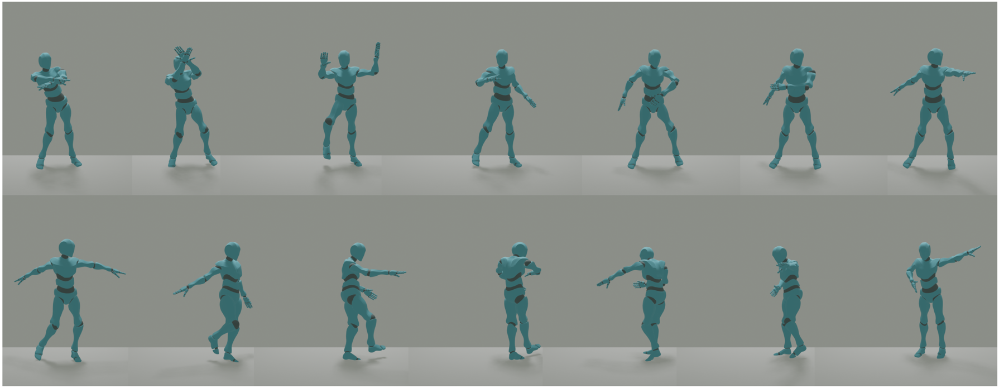
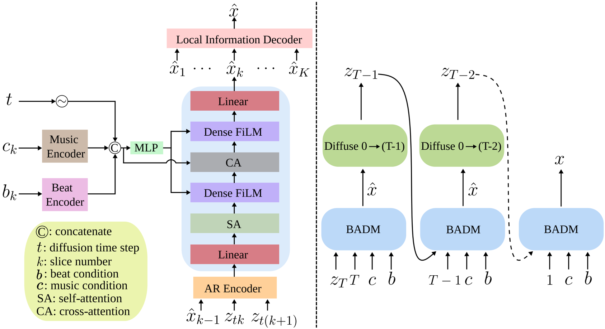
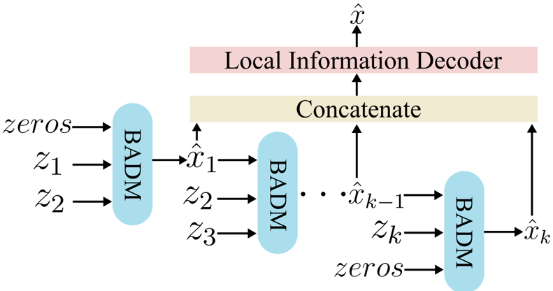
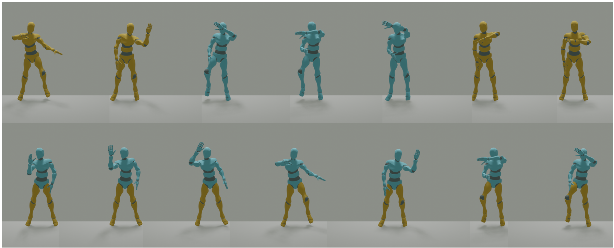

## Bidirectional Autoregressive Diffusion Model for Dance Generation

Canyu Zhang University of South Carolina Youbao Tang PAII Inc.

Jing Xiao

PAII Inc.

## Abstract

Dance serves as a powerful medium for expressing human emotions, but the lifelike generation of dance is still a considerable challenge. Recently, diffusion models have showcased remarkable generative abilities across various domains. They hold promise for human motion generation due to their adaptable many-to-many nature. Nonetheless, current diffusion-based motion generation models often create entire motion sequences directly and unidirectionally, lacking focus on the motion with local and bidirectional enhancement. When choreographing high-quality dance movements, people need to take into account not only the musical context but also the nearby music-aligned dance motions. To authentically capture human behavior, we propose a Bidirectional Autoregressive Diffusion Model (BADM) for music-to-dance generation, where a bidirectional encoder is built to enforce that the generated dance is harmonious in both the forward and backward directions. To make the generated dance motion smoother, a local information decoder is built for local motion enhancement. The proposed framework is able to generate new motions based on the input conditions and nearby motions, which foresees individual motion slices iteratively and consolidates all predictions. To further refine the synchronicity between the generated dance and the beat, the beat information is incorporated as an input to generate better musicaligned dance movements. Experimental results demonstrate that the proposed model achieves state-of-the-art performance compared to existing unidirectional approaches on the prominent benchmark for music-to-dance generation.

## 1. Introduction

Dance is a highly effective medium for expressing emotions, facilitating communication, and fostering social in- Ning Zhang PAII Inc.

Ruei-sung Lin PAII Inc.

Song Wang University of South Carolina

teraction. Nevertheless, the creation of new dances remains a formidable challenge, given the inherently expressive and freeform nature of dance movements. In order to generate new dance sequences that seamlessly integrate with both preceding motions and the musical context, various deep learning-based methods have been proposed [9, 20, 21, 28, 30, 35]. However, they typically treat dance generation as a matching problem. For example, some works [42, 51] rely on constructing a codebook for music-to-motion matching, which hinders their potential for creative dance generation. And they exclusively rely on past movements as the sole guide, neglecting the insights offered by future distributions. These methods also encounter limitations when attempting to generate dances from music based on user-defined constraints.

Currently, diffusion models have shown remarkable promise in image processing tasks. Notable initiatives [46, 47] have explored the potential of diffusion models in the context of human motion generation. However, a significant drawback is the insufficient attention given to interframe transitions, resulting in sequences that lack coherence. When designing new motions, people always need to consider the music condition and nearby motions within a range. But these models primarily emphasize conditioning input and global relationships, often neglecting the intricate details crucial for crafting fluid and harmonious motion. Consequently, the generated dance movements for each frame may not align smoothly with the motions in nearby frames, leading to inconsistencies in the overall sequence.

In response to the limitations inherent in current methodologies, we present the innovative bidirectional Autoregressive diffusion model (BADM). Our model introduces a novel strategy by breaking down the entire noise sequence into smaller, manageable slices. During the generation of each slice, our model considers the preceding dance sequences and forwarding noise distributions using a cross-

Mei Han PAII Inc.

Figure 1. Proposed bidirectional Autoregressive diffusion model (BADM) generates harmony, physically plausible dance based on music and beat conditions.

**[Image: figure_0014.png (1790x695, 589.0KB)]**

attention layer in a bidirectional way. The motivation is that the dances generated in both the forward and backward directions should be as similar as possible. Then refined noise slices are sent into the decoder along with conditions iteratively. The output dance slices are then concatenated and refined by a local information decoder to ensure a cohesive and harmonious overall sequence from a local perspective.

Another observation is that the beat information plays an important role in the art of dance generation, as it guides the timing of impressive movements. Prior methodologies such as EDGE [47] exclusively rely on music features. To rectify this limitation, we extract the beat information as a distinct and independent condition. Those features are fused with diffusion timestep as the whole condition. Furthermore, we also segment both the music and beat features into corresponding slices, allowing the model to focus solely on each slice. This iterative approach ensures a more precise alignment with the rhythm and musical dynamics.

Our approach also offers exceptional editing capabilities ideally suited for dance choreography. It encompasses joint-wise conditioning and the ability to seamlessly interpolate between movements. BADM also gains a remarkable ability to generate sequences of arbitrary length, granting it a high degree of versatility and adaptability. In summary, our contributions are the following:

- We propose a bidirectional autoregressive diffusion model based framework (BAMD) for music-to-dance generation. BADM first considers each motion slice separately and then refines them by utilizing their bidirectional dependencies and the local motion enhancement, so as to generate more harmony dances.
- In order to enhance the beat information and generate better music-aligned dances, our model takes music beat as an independent condition. The music and beat information are segmented to help the model focus on each dance

slice iteratively.

- Comprehensive experiments on the widely utilized music-to-dance datasets AIST++ [29] demonstrate that our proposed method surpasses previous models by a significant margin across various metrics.

## 2. Related Work

## 2.1. Human Motion Generation

The quest to achieve lifelike human motion generation has been a longstanding pursuit. Many prevalent approaches [1, 23, 26] are rooted in graph-based methods, where motion sequences are decomposed into discrete nodes and then reassembled following predefined rules. In recent years, deep neural networks have emerged as a promising alternative avenue for generating human motion. Some methods focus on predicting motion sequences based on initial pose sequences [10, 12], while others [7, 11, 19] employ bidirectional GRU and Transformer architectures for tasks like in-betweening and super-resolution. For instance, Holden et al.[15] utilize autoencoder to acquire a latent representation of motion, which is then used to manipulate and control motion with respect to spatial factors such as root trajectory and bone lengths. Moreover, motion generation can be guided at a higher level by external cues, including action classes [4], audio signals [2], and natural language descriptions [40]. Notably, Tevet et al. [46] harnesses the power of pre-trained large language models like CLIP [41] to establish a shared latent space for both language and motion.

## 2.2. Music-to-dance Generation

The challenge of generating dances that synchronize with the input music has fueled the development of a wide array of deep learning-based techniques. These methods span a diverse spectrum, encompassing CNN [15], GANs [25, 45], and Transformer models [27, 28]. Their common goal is to directly translate the provided music into a continuous sequence of human poses. For instance, Esser et al. [8] encodes intricate visual elements into quantized patches, employing Transformers to generate contextually coherent images at high resolutions, bridging the visual and musical aspects of dance generation. In a different approach, Bailando [42] adopts VQ-VAE [48] to maintain temporal coherence across various music genres, a crucial element in dance generation, ensuring that the movements align with the music's rhythm and style. And EDGE [47] leverages conditional diffusion models to craft human dance movements in direct response to musical cues, utilizing the potent audio feature extractor Jukebox [6].

Figure 2. Our bidirectional Autoregressive diffusion model (BADM) employs a denoising mechanism to enhance dance sequences from time t = T to t = 0 . BADM begins with a noisy sequence z T at time T , and proceeds to generate an estimated dance sequence ˆ x . The denoising procedure is iteratively applied until t = 0 . Our autoregressive (AR) model treats the whole noise sequence as K slices. On the left, we show our model processing the k -th slice at the diffusion timestep t .

**[Image: figure_0028.png (1686x919, 237.0KB)]**

## 2.3. Diffusion Model

Diffusion models [14, 43] belong to the realm of neural generative models. They draw inspiration from the stochastic diffusion process, a concept in thermodynamics . In this paradigm, data distribution samples undergo a gradual introduction of noise through the diffusion process. Subsequently, a neural model is trained to reverse this process, gradually restoring the original sample to its pristine state. Sampling from the learned data distribution involves denoising an initially pure noise vector. The evolution of diffusion models in the field of image generation has been enriched by earlier works [14, 44]. For conditioned generation tasks, Dhariwal et al. [5] introduce classifier-guided diffusion, a concept later embraced and extended by GLIDE [37], which enables conditioning based on CLIP textual representations. In recent developments, some works [18, 22, 24, 31, 40, 46] have advocated for the adoption of diffusion models in the context of motion generation tasks and earn promising results.

## 2.4. Autoregressive Model

An autoregressive model is a statistical or machine learning paradigm designed to analyze and predict sequential data. It operates by making predictions for each data point based on its dependencies on previous observations within the sequence. In essence, it posits that each data point's value is influenced by the values of its predecessors. While autoregressive models have found wide-ranging applications in fields such as image processing [16, 34, 49], they have been relatively underutilized in the domain of motion generation [50]. Given the unique characteristics of dance generation, we introduce an autoregressive diffusion model to address this specific task.

## 3. Method

## 3.1. Pose Representation

Our objective is to generate a human motion sequence with a length of N , given arbitrary musical condition c and beat condition b . We represent these dance sequences as a series of poses using the 24-joint SMPL format [32]. Each joint's orientation is represented using a 6-DOF rotation representation [52], and a single translation vector for the root, resulting in a total pose vector p ∈ R 24 × 6+3=147 . Following previous work EDGE [47], we incorporate binary contact labels for the heel and toe of each foot, resulting in a binary contact label vector l ∈ R 2 × 2=4 . Consequently, the complete representation of the pose sequence is x ∈ R N × 151 .

## 3.2. Diffusion Framework

Our diffusion process is represented as a Markov noise process [14]. We generate the noise sequence { z t } T t =0 for each timestep t . In the forward noising process, x ∼ p ( x ) is initially sampled from the data distribution. The forward noise process is defined as follows:

<!-- formula-not-decoded -->

α t ∈ (0 , 1) represents constant hyper-parameters. When α t is sufficiently small, we can approximate the output as z T ∼ N (0 , 1) .

To recover the clean dance sequence, our conditioned diffusion motion model treats the distribution ˆ x θ ( z t , t, c, b ) ≈ x as the reverse diffusion process for gradually cleaning z t , with model θ for all diffusion timestep t . Instead of predicting the variation ϵ t as formulated by DDPM [14], we predict the signal itself, using the following simple objective:

<!-- formula-not-decoded -->

## 3.3. Geometric Losses

In addition to the reconstruction loss L simple , we adopt geometric auxiliary losses similar to HDM [46] and EDGE [47], which encourage the matching in three aspects of physical realism: joint positions ( L pos , 3), velocities ( L vel , 4), and foot contact ( L foot , 5). These losses enforce physical properties and prevent artifacts, encouraging natural and coherent motions

<!-- formula-not-decoded -->

<!-- formula-not-decoded -->

<!-- formula-not-decoded -->

the function FK ( · ) represents the forward kinematic process, which translates joint rotations into joint positions, and the variable i is the frame index. In L foot , f i signifies the model's internal estimation of the binary foot contact label's influence on the pose at each frame. This approach not only incentivizes the model to forecast foot contact accurately but also enforces it to maintain coherence with its self-generated predictions. Overall, our training loss is the weighted sum of the simple objective and the geometric losses:

<!-- formula-not-decoded -->

## 3.4. Model

Our model architecture is depicted in Figure 2 and Figure 3. The inputs of our model are noise slice z t , diffusion timestep t , music condition c , and beat condition b , where z t , c , and b have the same length. To ensure that the newly generated motion remains faithful to the preceding and future motions, we segment the entire noise sequence into smaller slices. Our model takes into consideration the previous motions and future noise distributions when generating the new motion slice. To elaborate on the process, we divide the complete noise sequence z t into K slices at the timestep t, represented as ( z t 1 , z t 2 , ..., z tK ) . Each noise slice z tk undergoes a cross-attention layer that considers the previously generated dance sequence ˆ x ( k -1) and the subsequent noise part z t ( k +1) as shown:

<!-- formula-not-decoded -->

Each processed noise slice ˆ z tk is subsequently sent into the decoder, which contains feature-wise linear modulation (FiLM) [39], alongside the segmented music feature c k and beat information b k :

<!-- formula-not-decoded -->

the output is the generated dance slice ˆ x k .

We also include zero padding for the initial and final parts to ensure a smooth transition and maintain the integrity of the generated dance motions. To ensure temporal context is preserved, we incorporate timestep information through a token that is concatenated with the music conditioning. The resulting dance sequences (ˆ x 1 , ˆ x 2 , . . . , ˆ x K ) are concatenated and sent into a local information decoder. The local information encoder is constructed using 1D convolutional layers. This step is essential to ensure that the motions from nearby frames exhibit harmony and cohesion. The final output ˆ x is the generated dance which is faithful to music and beat conditions.

## 3.5. Sampling

At each denoising timestep t , BADM predicts the denoised sample, then reverberates the effect back to timestep t -1 as follows: ˆ z t -1 ∼ q (ˆ x θ (ˆ z t , c, b ) , t -1) , ultimately concluding this process when t reaches zero. Following previous works, our model's training approach utilizes classifier-free guidance [13]. This strategy is implemented by randomly substituting the conditioning variable with { c, b } = ∅ during training, albeit with low probability. The outcome of guided inference is a blend of unconditionally generated samples and conditionally generated samples, expressed as a weighted summation:

Figure 3. BADM processes noise slices in a bidirectional way. Generated dance slices are concatenated and sent to the local information decoder.

**[Image: figure_0059.png (791x416, 65.9KB)]**

<!-- formula-not-decoded -->

We can amplify the conditions by setting guidance weight w&gt; 1 during sampling.

## 3.6. Long-form Sampling

The capability to create dance sequences of diverse lengths, even spanning several minutes, stands as a vital necessity in dance generation. The simple idea is to increase the length of the condition input, but it can result in a linear escalation of computational demands as sequences grow in length. Additionally, the conditioning factors c and b can exert additional pressure on memory resources.

In order to produce extended sequences, we employ a methodology based on segmenting the sequences into N -frame slices. To maintain uniformity across adjacent N/ 2 -frame slices, we apply interpolation, employing a linearly decreasing weight. Since the frames within each slice have been encoded through an autoregressive encoder, we contend that the entire slice inherently encapsulates valuable autoregressive information.

## 3.7. Editing

To facilitate the post-processing of dances generated by BADM, we employ a well-established masked denoising technique inspired by previous models [33, 46]. Our model offers the flexibility to accommodate a variety of constraints, allowing users to apply both temporal and jointwise specifications. When provided with a joint-wise or temporal constraint x known with positions indicated by a binary mask m , the following operations are performed at each denoising timestep:

<!-- formula-not-decoded -->

where ⊙ refers to the Hadamard product, which operates element-wise to replace the regions of prior knowledge with forward-diffused samples of the constraint. This technique ensures that the dance sequences remain editable during the inference phase, without requiring any additional training processes.

## 3.8. Implement Details

We draw inspiration from recent advancements and utilize Jukebox features as the music condition input. The research in music information retrieval [3] has shown that pre-trained Jukebox [6] model can generate highly effective representations for audio tasks. However, the jukebox feature doesn't contain enough beat information, which can be reflected in generated motions directly. To augment the rhythmic aspect, we incorporate one-hot encoding of the music beat as a condition, which is extracted by the public audio processing toolbox Librosa [17].

In our experiments, we set the hyperparameter K = 6 . When training our models, we employ the Adan optimizer with a learning rate of 0.0002. All models undergo training for 2000 epochs, utilizing four NVIDIA Tesla V100 GPUs for a period of about 1 day, and the batch size is set to 128.

## 4. Experiments

## 4.1. Dataset

In our study, we leverage the AIST++ dataset [29], which is composed of 1,408 meticulously curated dance motions intricately synchronized with music spanning a wide spectrum of genres. We adhere to the train/test partitioning scheme established by the dataset creators. To maintain consistency and facilitate analysis, all training examples have been truncated to a uniform duration of 5 seconds, captured at 30 frames per second (FPS).

## 4.2. Baselines

We have selected FACT [29], Bailando [42], and EDGE [47] as the baselines for our study. FACT [29] is a full attention cross-modal transform model that can generate a long sequence of realistic 3D dance motion. Bailando [42] is a subsequent approach, demonstrating remarkable qualitative performance improvements. Lastly, EDGE [47] is the most recent transformer-based diffusion model dance generation. They are the state-of-the-art traditional and diffusion based music-to-dance generation models.

Table 1. We compare BADM against FACT [29], Bailando [42], and EDGE [47]. ↑ means higher is better, ↓ means lower is better, and → means closer to ground truth is better. We obtain the quantitative results from their respective publications [42, 47], or re-evaluation results using published code.

| Method                   |   Dist k → |   Dist g → |   BA ↑ |   PFC ↓ | Ours Win Rate     | Fixed bones   | Editing   |
|--------------------------|------------|------------|--------|---------|-------------------|---------------|-----------|
| Ground Truth             |       8.19 |       7.45 | 0.2374 |   1.332 | 66 . 6% ± 10 . 0% | ✓             | N/A       |
| FACT [29] (ICCV2021)     |       5.94 |       6.18 | 0.2209 |   2.254 | 91 . 6% ± 5 . 0%  | ✓             | ✗         |
| Bailando [42] (CVPR2022) |       7.83 |       6.34 | 0.2332 |   1.754 | 86 . 6% ± 6 . 6%  | ✗             | ✗         |
| EDGE [47] (CVPR2023)     |       9.48 |       5.72 | 0.2281 |   1.654 | 64 . 9% ± 8 . 3%  | ✓             | ✓         |
| BADM (ours)              |       8.29 |       6.76 | 0.2366 |   1.424 | N/A               | ✓             | ✓         |

## 4.3. Results

Generation diversity. To evaluate our model's ability to generate diverse dance motions when given various input music, we compute the average feature distance (DIV) in the feature space as proposed in [27, 42]. We evaluate the generated dances in two feature spaces: kinetic feature [38] (denoted as 'k') and geometric feature [36] (denoted as 'g'). The quantitative results are presented in Table 1. Our method outperforms EDGE in terms of both Dist k and Dist g , achieving improvements of 1.19 and 1.04 in each metric. Furthermore, when compared with Bailando, BADM demonstrates a remarkable enhancement of 0.46 in Dist k , showcasing its ability to generate diverse choreographies instead of converging to a limited set of templates. The BADM autoregressive encoder takes into account only the motions in nearby frames, providing it with the flexibility to adapt to the specific context of each frame.

Motion-music correlation. To determine how well the generated dance sequences align with the accompanying music, we calculate the Beat Align Score (BA) following [42]. This score quantifies the average temporal distance between each beat in the music and its nearest corresponding beat in the dance sequence. As shown in Table 1, BADM beats all previous methods on this metric. These findings also highlight BADM's proficiency in improving the correlation between music and motion.

Physical plausibility. The Physical Foot Contact score (PFC) [47] evaluates the plausibility of foot-ground interaction, without presuming that the feet should maintain static contact throughout the entire dance sequence. As shown in Table 1, BADM demonstrates a substantial improvement of 0.23 compared to EDGE. And BADM boosts the PFC performance by 0.67 compared to Bailando. These results signify BADM's superior physical plausibility, driven by the local information decoder, which allows the model to focus on the motion at each frame.

Motion quality. Some dance generation works [29, 42] use the Fr´ echet Inception Distance (FID) metric [12] to evaluate the quality of generated dance sequences. FID is employed to quantify the dissimilarity between the generated dance sequences and the entirety of motion sequences present in the AIST++ dataset, encompassing both the training and test data. Nevertheless, the reliability of this metric has been called into question by EDGE [47], based on their insightful observations. EDGE has pointed out potential issues, particularly concerning the limited coverage of the AIST++ test set given its relatively small size. In spite of these concerns, our model (20.24) still outperforms EDGE (24.71) when assessed using the FID g ↓ metric, which means BADM can generate the dance with high quality.

User study. To gain a deeper understanding of the true visual performance of our method, we conducted a comprehensive user study, comparing the dance sequences generated by our approach with the baselines on AIST++ dataset. This study involved 12 participants, each participating in individual evaluations. Each participant was presented with a series of 30 pairs of comparison videos, each lasting approximately 10 seconds. These pairs included our generated results and those generated by one of our competing methods, all synchronized to the same music track. Participants were tasked with discerning which of the two videos exhibited better synchronization with the music.

The detailed statistics derived from this user study can be found in Table 1. Notably, our method significantly surpasses the compared state-of-art method EDGE with 64.9% winning rates. Our method even has a 66.6% rate to beat the ground truth dance. This achievement is particularly remarkable given that the baseline dances exhibited noticeable distortions during intricate movements.

In-the-wild music. While our method has showcased impressive performance on the AIST++ dataset, it is crucial to acknowledge that these achievements may not automatically extend to the 'in-the-wild' music inputs. To evaluate this critical aspect of generalization, we conducted an assessment of the proposed method and the baseline approaches. We select several popular songs from YouTube for this evaluation. As shown in Table 2, BADM has an 83.3% rate to win the Bailando, and a 61.6% rate to beat EDGE. Those results reflect that our model succeeds in generating the dances based on diverse music inputs.

Figure 4. Yellow parts represent fixed motion inputs and blue parts are the generated motion parts. For motion in-betweening (Top), the first and last frames are fixed. For specific body part editing (Bottom), the lower body joints are fixed to the input motion while the upper body is altered to fit the input.

**[Image: figure_0088.png (1791x724, 548.3KB)]**

Table 2. User study results from in-the-wild music. We compare BADM against Bailando [42] and EDGE [47].

| Method                                          | Ours Win Rate                     |
|-------------------------------------------------|-----------------------------------|
| Bailando [42] (CVPR 2022) EDGE [47] (CVPR 2023) | 83 . 3% ± 6 . 7% 61 . 6% ± 8 . 3% |
| BADM (ours)                                     | N/A                               |

Qualitative results. We present several qualitative examples in Figure 1, where our model's capabilities are on full display. Our model excels in generating harmonious dance sequences that seamlessly incorporate both footwork and hand movements. In contrast, previous methods, such as EDGE [47], often falter during complex movements. For instance, they may produce inaccuracies, causing the generated human body to be 'lying down' when it should be 'turning around'.

## 4.4. Additional Study

Fixed bones. Preserving fixed bone length is a fundamental criterion for assessing physical plausibility. Our approach excels in this aspect by operating within the reduced coordinate space (joint angle space), enabling us to consistently maintain bone lengths. In contrast, methods that operate in the joint Cartesian space, often result in substantial variations in bone lengths. For example, Bailando can fluctuate bone lengths by as much as 20%.

Motion editing. In this section, we introduce two motion editing applications: 'in-between' and 'body part editing,' each following certain restrictions in the temporal and spatial domains, respectively. In the 'in-between' application, we maintain the initial and final motions as fixed reference parts and challenge the model to generate the intermediate motions. In the case of 'body part editing,' we identify the joints to remain unaltered, allowing the model to autonomously create the desired adjustments. In our experiments, we focus on exploring the possibilities of exclusively editing the upper body joints. As showcased in Figure 4 (TOP), our method demonstrates its proficiency in generating fluid and coherent motion sequences that seamlessly bridge the initial and final motions. Furthermore, as depicted in Figure 4 (Bottom), our method excels in generating upper body motions in sync with the music while keeping the lower body fixed.

## 4.5. Ablation Study

Beat information. In our setup, we introduce one-hot beat information as a conditioning factor, and we also explored the model's performance when this condition is removed. As illustrated in Table 3, the addition of the beat condition yields a notable improvement in the beat alignment score, showcasing an increase of 0.0131. This outcome underscores the importance of this condition, as it provides the model with more precise and specific guidance for generating dance sequences.

Table 3. Ablation study results from beat information, segmentation step, and unidirectional encoder. ↑ means higher is better, ↓ means lower is better, and → means closer to ground truth is better.

| Method       |   Dist k → |   Dist v → |   BA ↑ |   PFC ↓ |
|--------------|------------|------------|--------|---------|
| GT           |       8.19 |       7.45 | 0.2374 |   1.332 |
| K = 3        |       8.49 |       6.34 | 0.2290 |   1.655 |
| K = 5        |       8.38 |       6.68 | 0.2338 |   1.482 |
| K = 10       |       7.75 |       5.82 | 0.2189 |   1.756 |
| w/o Beat     |       7.93 |       6.62 | 0.2235 |   1.537 |
| Unidirection |       7.86 |       6.46 | 0.2339 |   1.582 |
| Removing LID |       8.02 |       6.60 | 0.2319 |   1.542 |
| BADM         |       8.29 |       6.76 | 0.2366 |   1.424 |

Segmentation step size. In our experiments, we conducted a comprehensive analysis of different choices for the hyperparameter K . Initially, we set K = 6 , and we explored various alternatives. As summarized in Table 3, the results unequivocally favor the model with K = 6 as the top-performing configuration. Specifically, the model with K = 6 surpasses its counterpart with K = 3 by a significant margin of 0.2 on the Dist k metric. Additionally, our model outperforms the model with K = 10 by 0.332 on the PFC metric. An optimal choice of K can lead to a substantial increase in performance. When K is excessively large, each time slice encompasses multiple movements, bringing too many restrictions to the model. Conversely, when K is too small, individual movements are segmented into excessively meaningless parts, limiting the information available for analysis.

Unidirectional encoder. In our experimental setup, the autoregressive encoder incorporates a bidirectional approach, allowing it to consider the input from both forward and backward directions. We also conducted experiments with a unidirectional encoder. In the unidirectional encoder configuration, each noise slice z tk undergoes a crossattention layer that only takes into account the dance sequence ˆ x ( k -1) generated up to that point. The results are depicted in Table 3. The bidirectional approach can increase the PFC by 0.158 and boost the Dist k metric by 0.43. Those results reflect that incorporating both forward and backward information is pivotal in enabling the model to generate dance sequences that are harmonious and consistent. It's worth mentioning that the noise sequence gradually aligns with the original dance, as the added noises become progressively smaller.

Local information decoder. In our model, we leverage 1D convolution layers to enhance the intricacies of the dance sequence from a local perspective. The impact of this refinement is evident in the outcomes presented in Table 3. Notably, when the local information decoder is omitted, both the PFC and Dist k experience a discernible decline, amounting to 0.118 in the former and a degradation of 0.27 in the latter. These findings serve as compelling evidence supporting the efficacy of our chosen components.

## 5. Discussion

In the final stage of our proposed model, we employ a local information decoder to enhance the harmony of the generated motions. We also experimented with a global information encoder to refine the output. In this process, the concatenated motions are processed through a transformer layer. However, the results were less than satisfying. The spatial freedom of the body's hand and foot movements became constrained, and the body struggled to execute certain complex movements. Upon careful examination, we attribute this issue to the global information component, which compels the motion at each frame to account for actions in distant frames, ultimately restricting creative expression. These results further validate our decision to generate each motion based on nearby motions rather than considering the entire sequence of motions.

## 6. Future Work

In our current model, we segment the entire dance sequence using a fixed step size. In reality, a dance performance consists of distinct lengths and meaningful movements, such as 'jumping', 'turning around', and 'pirouette'. Our existing segmentation method may inadvertently split these complete movements into separate segments, destroying the original meaning and disrupting the dance's fluidity. In contrast, when the segment length is too long, it might encompass multiple independent movements. In our future research, we aim to enhance our segmentation technique by taking into account the semantic meaning of each movement. This means that we will strive to identify and segment the dance sequence in a way that respects the integrity of individual movements, ensuring a more accurate representation of the dancer's artistry and choreography.

## 7. Conclusion

In our research, we introduce a bidirectional autoregressive diffusion model (BADM) to tackle the challenge of music-to-dance generation. Recognizing the shortcomings of prior approaches, we have devised an autoregressive encoder specifically tailored for processing dance slices. This novel encoder allows our model to create motion at each frame while taking into account the neighboring frame motions in a range, resulting in generating smoother and more coherent dance sequences. And we propose the local information decoder to further refine the final prediction. Moreover, we have enriched our model by incorporating beat information, which significantly enhances the connection between the generated movements and the underlying music. Through a series of comprehensive experiments and meticulous ablation studies, we have demonstrated the superior performance of our methods over existing techniques on the AIST++ dataset across various evaluation metrics. Our research offers a new means to produce harmonious and lifelike dances that resonate with music.

## References

- [1] Okan Arikan and David A Forsyth. Interactive motion generation from examples. TOG , 21(3):483-490, 2002. 2
- [2] Andreas Aristidou, Anastasios Yiannakidis, Kfir Aberman, Daniel Cohen-Or, Ariel Shamir, and Yiorgos Chrysanthou. Rhythm is a dancer: Music-driven motion synthesis with global structure. IEEE Transactions on Visualization and Computer Graphics , 2022. 2
- [3] Rodrigo Castellon, Chris Donahue, and Percy Liang. Codified audio language modeling learns useful representations for music information retrieval. arXiv preprint arXiv:2107.05677 , 2021. 5
- [4] Pablo Cervantes, Yusuke Sekikawa, Ikuro Sato, and Koichi Shinoda. Implicit neural representations for variable length human motion generation. In ECCV , pages 356-372. Springer, 2022. 2
- [5] Prafulla Dhariwal and Alexander Nichol. Diffusion models beat gans on image synthesis. NeurIPS , 34:8780-8794, 2021. 3
- [6] Prafulla Dhariwal, Heewoo Jun, Christine Payne, Jong Wook Kim, Alec Radford, and Ilya Sutskever. Jukebox: A generative model for music. arXiv preprint arXiv:2005.00341 , 2020. 3, 5
- [7] Yinglin Duan, Tianyang Shi, Zhengxia Zou, Yenan Lin, Zhehui Qian, Bohan Zhang, and Yi Yuan. Singleshot motion completion with transformer. arXiv preprint arXiv:2103.00776 , 2021. 2
- [8] Patrick Esser, Robin Rombach, and Bjorn Ommer. Taming transformers for high-resolution image synthesis. In CVPR , pages 12873-12883, 2021. 3
- [9] Kehong Gong, Dongze Lian, Heng Chang, Chuan Guo, Zihang Jiang, Xinxin Zuo, Michael Bi Mi, and Xinchao Wang. Tm2d: Bimodality driven 3d dance generation via music-text integration. In ICCV , pages 9942-9952, 2023. 1
- [10] Wen Guo, Yuming Du, Xi Shen, Vincent Lepetit, Xavier Alameda-Pineda, and Francesc Moreno-Noguer. Back to mlp: A simple baseline for human motion prediction. In WACV , pages 4809-4819, 2023. 2
- [11] F´ elix G Harvey, Mike Yurick, Derek Nowrouzezahrai, and Christopher Pal. Robust motion in-betweening. TOG , 39(4): 60-1, 2020. 2
- [12] Alejandro Hernandez, Jurgen Gall, and Francesc MorenoNoguer. Human motion prediction via spatio-temporal inpainting. In ICCV , pages 7134-7143, 2019. 2, 6
- [13] Jonathan Ho and Tim Salimans. Classifier-free diffusion guidance. arXiv preprint arXiv:2207.12598 , 2022. 5
- [14] Jonathan Ho, Ajay Jain, and Pieter Abbeel. Denoising diffusion probabilistic models. NeurIPS , 33:6840-6851, 2020. 3, 4
- [15] Daniel Holden, Jun Saito, and Taku Komura. A deep learning framework for character motion synthesis and editing. TOG , 35(4):1-11, 2016. 2
- [16] Mengqi Huang, Zhendong Mao, Zhuowei Chen, and Yongdong Zhang. Towards accurate image coding: Improved autoregressive image generation with dynamic vector quantization. In Proceedings of the IEEE/CVF Conference on Computer Vision and Pattern Recognition , pages 22596-22605, 2023. 3
- [17] Yanghua Jin, Jiakai Zhang, Minjun Li, Yingtao Tian, Huachun Zhu, and Zhihao Fang. Towards the automatic anime characters creation with generative adversarial networks. arXiv preprint arXiv:1708.05509 , 2017. 5
- [18] Korrawe Karunratanakul, Konpat Preechakul, Supasorn Suwajanakorn, and Siyu Tang. Guided motion diffusion for controllable human motion synthesis. In Proceedings of the IEEE/CVF International Conference on Computer Vision , pages 2151-2162, 2023. 3
- [19] Manuel Kaufmann, Emre Aksan, Jie Song, Fabrizio Pece, Remo Ziegler, and Otmar Hilliges. Convolutional autoencoders for human motion infilling. In 3DV , pages 918-927. IEEE, 2020. 2
- [20] Jinwoo Kim, Heeseok Oh, Seongjean Kim, Hoseok Tong, and Sanghoon Lee. A brand new dance partner: Musicconditioned pluralistic dancing controlled by multiple dance genres. In CVPR , pages 3490-3500, 2022. 1
- [21] Jinwoo Kim, Heeseok Oh, Seongjean Kim, Hoseok Tong, and Sanghoon Lee. A brand new dance partner: Musicconditioned pluralistic dancing controlled by multiple dance genres. In CVPR , pages 3490-3500, 2022. 1
- [22] Jihoon Kim, Jiseob Kim, and Sungjoon Choi. Flame: Freeform language-based motion synthesis &amp; editing. In AAAI , pages 8255-8263, 2023. 3
- [23] Lucas Kovar, Michael Gleicher, and Fr´ ed´ eric Pighin. Motion graphs. In Seminal Graphics Papers: Pushing the Boundaries, Volume 2 , pages 723-732. 2023. 2
- [24] Doyup Lee, Chiheon Kim, Saehoon Kim, Minsu Cho, and Wook-Shin Han. Autoregressive image generation using residual quantization. In Proceedings of the IEEE/CVF Conference on Computer Vision and Pattern Recognition , pages 11523-11532, 2022. 3
- [25] Hsin-Ying Lee, Xiaodong Yang, Ming-Yu Liu, Ting-Chun Wang, Yu-Ding Lu, Ming-Hsuan Yang, and Jan Kautz. Dancing to music. NeurIPS , 32, 2019. 2
- [26] Jehee Lee, Jinxiang Chai, Paul SA Reitsma, Jessica K Hodgins, and Nancy S Pollard. Interactive control of avatars animated with human motion data. In Proceedings of the 29th annual conference on Computer graphics and interactive techniques , pages 491-500, 2002. 2
- [27] Jiaman Li, Yihang Yin, Hang Chu, Yi Zhou, Tingwu Wang, Sanja Fidler, and Hao Li. Learning to generate diverse dance motions with transformer. arXiv preprint arXiv:2008.08171 , 2020. 3, 6
- [28] Ruilong Li, Shan Yang, David A Ross, and Angjoo Kanazawa. Ai choreographer: Music conditioned 3d dance generation with aist++. In ICCV , pages 13401-13412, 2021. 1, 3
- [29] Ruilong Li, Shan Yang, David A. Ross, and Angjoo Kanazawa. Learn to dance with aist++: Music conditioned 3d dance generation, 2021. 2, 5, 6
- [30] Ronghui Li, Junfan Zhao, Yachao Zhang, Mingyang Su, Zeping Ren, Han Zhang, Yansong Tang, and Xiu Li. Finedance: A fine-grained choreography dataset for 3d full body dance generation. In ICCV , pages 10234-10243, 2023. 1
- [31] Ronghui Li, Junfan Zhao, Yachao Zhang, Mingyang Su, Zeping Ren, Han Zhang, Yansong Tang, and Xiu Li. Finedance: A fine-grained choreography dataset for 3d full body dance generation. In Proceedings of the IEEE/CVF International Conference on Computer Vision , pages 1023410243, 2023. 3
- [32] Matthew Loper, Naureen Mahmood, Javier Romero, Gerard Pons-Moll, and Michael J Black. Smpl: A skinned multiperson linear model. In Seminal Graphics Papers: Pushing the Boundaries, Volume 2 , pages 851-866. 2023. 3
- [33] Andreas Lugmayr, Martin Danelljan, Andres Romero, Fisher Yu, Radu Timofte, and Luc Van Gool. Repaint: Inpainting using denoising diffusion probabilistic models. In CVPR , pages 11461-11471, 2022. 5
- [34] Shishira R Maiya, Sharath Girish, Max Ehrlich, Hanyu Wang, Kwot Sin Lee, Patrick Poirson, Pengxiang Wu, Chen Wang, and Abhinav Shrivastava. Nirvana: Neural implicit representations of videos with adaptive networks and autoregressive patch-wise modeling. In Proceedings of the IEEE/CVF Conference on Computer Vision and Pattern Recognition , pages 14378-14387, 2023. 3
- [35] Matthew Marchellus and In Kyu Park. M2c: Concise music representation for 3d dance generation. In Proceedings of the IEEE/CVF International Conference on Computer Vision , pages 3126-3135, 2023. 1
- [36] Meinard M¨ uller, Tido R¨ oder, and Michael Clausen. Efficient content-based retrieval of motion capture data. In ACM SIGGRAPH 2005 Papers , pages 677-685. 2005. 6
- [37] Alex Nichol, Prafulla Dhariwal, Aditya Ramesh, Pranav Shyam, Pamela Mishkin, Bob McGrew, Ilya Sutskever, and Mark Chen. Glide: Towards photorealistic image generation and editing with text-guided diffusion models. arXiv preprint arXiv:2112.10741 , 2021. 3
- [38] Kensuke Onuma, Christos Faloutsos, and Jessica K Hodgins. Fmdistance: A fast and effective distance function for motion capture data. In Eurographics (Short Papers) , pages 8386, 2008. 6
- [39] Ethan Perez, Florian Strub, Harm De Vries, Vincent Dumoulin, and Aaron Courville. Film: Visual reasoning with a general conditioning layer. In AAAI , 2018. 4
- [40] Mathis Petrovich, Michael J Black, and G¨ ul Varol. Temos: Generating diverse human motions from textual descriptions. In ECCV , pages 480-497. Springer, 2022. 2, 3
- [41] Alec Radford, Jong Wook Kim, Chris Hallacy, Aditya Ramesh, Gabriel Goh, Sandhini Agarwal, Girish Sastry,

Amanda Askell, Pamela Mishkin, Jack Clark, et al. Learning transferable visual models from natural language supervision. In ICML , pages 8748-8763. PMLR, 2021. 2

- [42] Li Siyao, Weijiang Yu, Tianpei Gu, Chunze Lin, Quan Wang, Chen Qian, Chen Change Loy, and Ziwei Liu. Bailando: 3d dance generation via actor-critic gpt with choreographic memory. In CVPR , 2022. 1, 3, 5, 6, 7
- [43] Jascha Sohl-Dickstein, Eric Weiss, Niru Maheswaranathan, and Surya Ganguli. Deep unsupervised learning using nonequilibrium thermodynamics. In ICML , pages 22562265. PMLR, 2015. 3
- [44] Jiaming Song, Chenlin Meng, and Stefano Ermon. Denoising diffusion implicit models. arXiv preprint arXiv:2010.02502 , 2020. 3
- [45] Guofei Sun, Yongkang Wong, Zhiyong Cheng, Mohan S Kankanhalli, Weidong Geng, and Xiangdong Li. Deepdance: music-to-dance motion choreography with adversarial learning. IEEE Transactions on Multimedia , 23:497-509, 2020. 2
- [46] Guy Tevet, Sigal Raab, Brian Gordon, Yonatan Shafir, Daniel Cohen-Or, and Amit H Bermano. Human motion diffusion model. arXiv preprint arXiv:2209.14916 , 2022. 1, 2, 3, 4, 5
- [47] Jonathan Tseng, Rodrigo Castellon, and C Karen Liu. Edge: Editable dance generation from music. arXiv preprint arXiv:2211.10658 , 2022. 1, 2, 3, 4, 5, 6, 7
- [48] Aaron Van Den Oord, Oriol Vinyals, et al. Neural discrete representation learning. NeurIPS , 30, 2017. 3
- [49] Xing Wei, Yifan Bai, Yongchao Zheng, Dahu Shi, and Yihong Gong. Autoregressive visual tracking. In Proceedings of the IEEE/CVF Conference on Computer Vision and Pattern Recognition , pages 9697-9706, 2023. 3
- [50] Yu-Hui Wen, Zhipeng Yang, Hongbo Fu, Lin Gao, Yanan Sun, and Yong-Jin Liu. Autoregressive stylized motion synthesis with generative flow. In Proceedings of the IEEE/CVF Conference on Computer Vision and Pattern Recognition , pages 13612-13621, 2021. 3
- [51] Hongwei Yi, Hualin Liang, Yifei Liu, Qiong Cao, Yandong Wen, Timo Bolkart, Dacheng Tao, and Michael J. Black. Generating holistic 3d human motion from speech. In CVPR , pages 469-480, 2023. 1
- [52] Yi Zhou, Connelly Barnes, Jingwan Lu, Jimei Yang, and Hao Li. On the continuity of rotation representations in neural networks. In CVPR , pages 5745-5753, 2019. 4
---

## Extracted Images

| # | File | Dimensions | Size |
|---|------|------------|------|
| 1 | figure_0014.png | 1790x695 | 589.0KB |
| 2 | figure_0028.png | 1686x919 | 237.0KB |
| 3 | figure_0059.png | 791x416 | 65.9KB |
| 4 | figure_0088.png | 1791x724 | 548.3KB |
