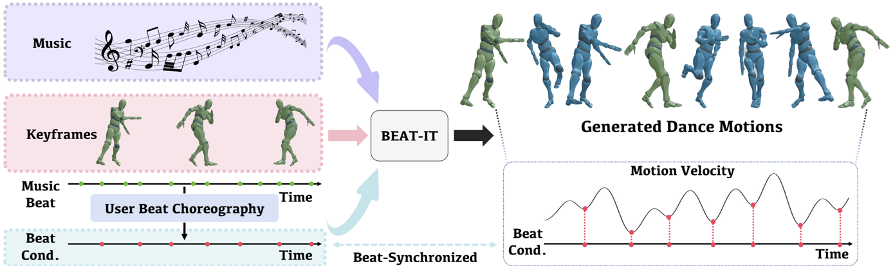
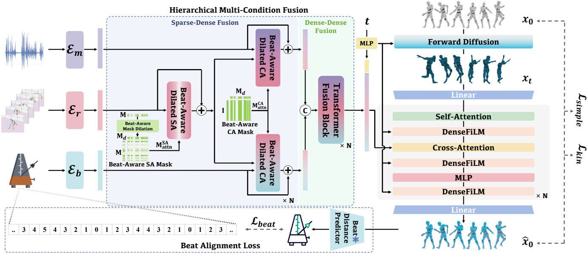
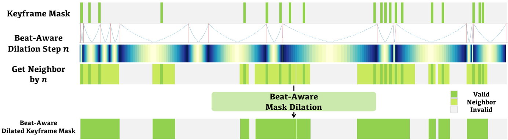
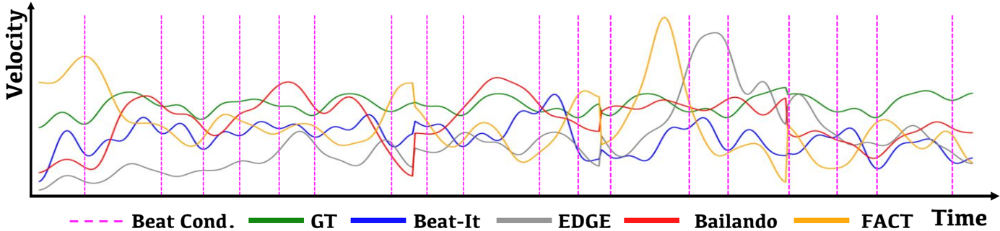
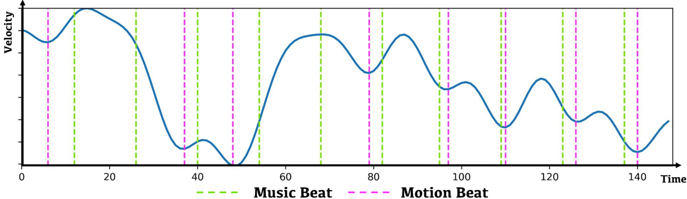

## Beat-It: Beat-Synchronized Multi-Condition 3D Dance Generation

Zikai Huang 1 , Xuemiao Xu 1 , 3 , 4( /Letter ) , Cheng Xu 2( /Letter ) , Huaidong Zhang 1 , Chenxi Zheng 1 , Jing Qin 2 , and Shengfeng He 5

1 South China University of Technology, China

xuemx@scut.edu.cn BEAT-IT

2 The Hong Kong Polytechnic University, Hong Kong SAR, China

cschengxu@gmail.com

- 3 Guangdong Engineering Center for Large Model and GenAI Technology

music beat

- 4 Guangdong Provincial Key Lab of Computational Intelligence and Cyberspace Information User Beat Choreography

input beat

condition

5 Singapore Management University, Singapore https://zikaihuangscut.github.io/Beat-It/ generated dance motion velocity

Velocity Fig. 1: We introduce Beat-It , a novel method for generating 3D dance motions with beat alignment and motion controllability. Our approach explicitly injects beat awareness and seamlessly integrates multiple conditions to guide the generation process, leading to beat-synchronized, key pose-guided dance generation.

**[Image: figure_0012.png (1388x415, 258.1KB)]**

Time GT Beat-It EDGE Bailando FACT GT Beat Abstract. Dance, as an art form, fundamentally hinges on the precise synchronization with musical beats. However, achieving aesthetically pleasing dance sequences from music is challenging, with existing methods often falling short in controllability and beat alignment. To address these shortcomings, this paper introduces Beat-It, a novel framework for beatspecific, key pose-guided dance generation. Unlike prior approaches, BeatIt uniquely integrates explicit beat awareness and key pose guidance, effectively resolving two main issues: the misalignment of generated dance motions with musical beats, and the inability to map key poses to specific beats, critical for practical choreography. Our approach disentangles beat conditions from music using a nearest beat distance representation and employs a hierarchical multi-condition fusion mechanism. This mechanism

- 2 Z. Huang et al.

seamlessly integrates key poses, beats, and music features, mitigating condition conflicts and offering rich, multi-conditioned guidance for dance generation. Additionally, a specially designed beat alignment loss ensures the generated dance movements remain in sync with the designated beats. Extensive experiments confirm Beat-It's superiority over existing stateof-the-art methods in terms of beat alignment and motion controllability.

Keywords: Dance generation · Beat synchronization · Multi-condition diffusion generation

## 1 Introduction

Dance, a time-honored art form, resonates across various ages and cultures due to its artistic and aesthetic significance, playing a vital role in the cultural and entertainment sectors. Traditional dance choreography creation, which demands an intricate balance of aesthetic movements, emotional expression, and precise synchronization with musical beats, often presents itself as a costly, laborious, and time-intensive endeavor, even for seasoned artists.

Notwithstanding the remarkable progress, achieving precise synchronization between dance motions and musical beats, coupled with flexible motion controllability in dance generation, remains a formidable challenge. In real-world choreography, the goal is often to assign specific key poses to particular musical beats and then fill in the connecting movements to form the complete dance sequence. This process requires not only the creation of designated key poses but also their harmonious synchronization with the musical beats. While few methods have explored key pose conditions [42,52], none of them has considered explicit beat synchronization and controllability, rendering inferior dance motion generation. Furthermore, previous methods typically merge keyframe features with music features through simple concatenation or temporal/spatial blending. This approach, however, is flawed due to the sparse nature of keyframes. Consequently, these methods disproportionately emphasize dense music features at the expense of key pose conditions, leading to a notable misalignment between the generated dance motions and the specified keyframes.

Recent advances in deep learning, particularly in generative models, have catalyzed efforts to automate the choreography process. Initial approaches predominantly focused on single-condition dance generation, learning a direct mapping from music to dance motions [1,15,21-23,35,39,43]. The advent of diffusion models, renowned for their exceptional content generation capabilities, has marked a paradigm shift in this domain. For instance, Tseng et al. [42] introduced a transformer-based diffusion model that sets a new benchmark in music-to-dance conversion, showcasing the potential of these models in elevating the quality of generated dance sequences.

To combat the above issues, we aim to completely disentangle beats from input music and simultaneously incorporate explicit beat and key pose guidance to enable beat-controllable, key pose-guided dance generation. We introduce BeatIt, a diffusion-based, multi-condition framework designed for this purpose (see Fig. 1). Our approach begins by formulating beat condition as a nearest beat distance representation, which is a straightforward yet effective method to serve as beat guidance within our framework. To effectively harness and balance the multiple conditions involved, we propose a hierarchical multi-condition fusion mechanism. Initially, we integrate sparse key pose condition with dense beat and music conditions using a tailored beat-aware dilated cross-attention strategy. We further blend refined beat and music features to generate comprehensive multi-condition features. This strategy not only enhances beat and motion controllability in dance generation but also maintains the realism and coherence of the produced dance motions. Additionally, leveraging our beat representation, we introduce a novel beat alignment loss, explicitly ensuring synchronization between dance motions and the given beat condition, thereby significantly enhancing the overall quality of generation. Extensive experiments confirm that our method outperforms current state-of-the-art approaches in terms of beat alignment and motion controllability. Beyond the advantages above, our framework also supports arbitrary beat designation and flexible frame assignments of key poses.

In summary, our main contributions are fourfold:

- -We introduce a multi-condition dance generation framework that achieves beat synchronization and enhanced motion controllability. To the best of our knowledge, our method makes the first attempt at beat-controllable key pose-guided dance generation.
- -We delve into the property of beats and formulate it as a nearest beat distance representation. A beat alignment loss is further tailored to offer explicit supervision signals to the generated dance motions, largely elevating the synchronization between the generated motions and the given beat conditions.
- -We present a hierarchical multi-condition fusion mechanism to effectively suppress the conflicts and fully exploit the complementary information among different conditions.
- -Extensive experiments demonstrate our method performs favorably against the state-of-the-art approaches, especially in motion controllability and motion-beat alignment.

## 2 Related Work

## 2.1 Human Motion Generation

Human motion generation aims to generate realistic human motion automatically. Previous works can be generally categorized into three genres according to the input condition: text-conditioned [5,18,24,56,61], audio-conditioned, and sceneconditioned [4,10,16,45]. Our work belongs to audio-conditioned human motion generation. But different from the primary audio-conditioned human motion generation, music-to-dance generation requires a comprehensive consideration of aesthetic movements, emotional expression, and precise synchronization with musical beats, making it extremely challenging to render convincing results. Recently, researchers have widely explored the application of diffusion models in human motion generation [2,3,5,16,18,61,62], which shows unprecedented performance than traditional generative models. In this paper, we get a deep insight into the beat synchronization problem and investigate a multi-condition diffusion-based scheme for controllable dance generation.

## 2.2 Dance Generation

With the emergence of deep learning [47-49], dance generation has attracted lots of research interest in recent years. Previous methods have explored various frameworks with different types of backbones to achieve single-condition dance generation, including CNN [14], RNN [1, 15, 39, 51], GCN [7, 32], VAE [9, 38], GAN [19,20,37], and Transformer [21-23,35,36,43,53]. FACT [23] proposes a full-attention cross-modal transformer model to capture the correlations between music and dance. Danceformer [21] presents a two-stage deterministic framework for audio-driven single-condition dance generation. It first generates key poses from the input music and then performs interpolation between the key poses. However, it falls short of arbitrary beat choreography and flexible key pose controllability due to its single-condition nature. Bailando [35] utilizes separate VQ-VAEs on upper/lower half bodies and a motion GPT to map the music and seed poses to dance sequences. Several recent attempts have investigated the diffusion models for dance generation [29,42,55], which significantly pushes the boundaries of music-to-dance performance. Compared to applying only a single input condition, multi-condition dance generation incorporates additional conditions beyond music into the generation process for better controllability, such as dance style labels [2], text [11], and keyframes [42, 52]. For example, LDA [2] introduced dance style labels as auxiliary conditions. However, it is limited to generating pre-defined styles and lacks flexibility. TM2D [11] adopts a VQ-VAE based model to support dual-modal music and text-driven dance motion generation. Yang et al. [52] employ normalizing flows to model dance motion probability distributions and utilize time embedding to achieve keyframe control. EDGE [42] adopts a diffusion-based framework and enables key pose control via temporal/spatial blending during inference. Although the existing methods have investigated additional conditions for better dance generation control, they typically neglect explicit guidance and supervision to align the generated motion dances with specified beats. Consequently, these methods struggle to produce both beat-specific and key pose-guided dance sequences. In contrast, we propose to explicitly disentangle the beat condition from music and inject flexible beat and key pose controllability into the entire generation process, significantly enhancing the beat alignment while supporting flexible frame assignments of key poses.

## 2.3 Multi Condition Diffusion Generation

Multi-condition diffusion generative models seek to inject multi-condition guidance into the generation process for versatile controllability [6, 8, 25, 28, 31, 34, 44,50,54,59,60]. Benefiting from large-scale training data, Stable Diffusion [33]

constructs a powerful foundation for image generation. Building upon this, ControlNet [57] and T2I-Adapter [27] efficiently integrate trainable parameters into existing models, enabling the inclusion of spatially localized input conditions in a pre-trained text-to-image diffusion model. Uni-ControlNet [58] proposes a framework equipped with two additional control modules for multi-condition control. Qin et al. [30] present a unified model capable of handling various visual conditions, resulting in a more streamlined scheme. Codi [40] acquire multi-modal synthesis skills through the mapping of diverse modalities into a unified space, training on lists of different multi-modal generation tasks. The aforementioned works typically controllable generation using pre-trained models under diverse conditions. Our work, conversely, focuses on the effective and comprehensive fusion of multiple conditions by presenting a hierarchical multi-condition fusion mechanism aimed at better integrating sparse keyframe control conditions with dense music and beat control conditions, resulting in more controllable dance generation.

## 3 Method

## 3.1 Problem Definition

Dance generation aims to create realistic dance motion sequences X = { x 1 , x 2 , x 3 , · · · , x L } from a given piece of music C with a duration of L . Here, x i ∈ R D represents a human pose at the i -th frame, which is denoted as a D -dimentional vector. In this paper, we endeavor to disentangle beat condition from the input music and simultaneously incorporate explicit beat and key pose guidance to achieve beat-synchronized, key pose-guided dance generation. Given a music condition C , a sparse set of keyframes X ref = X ⊙ M , where M ∈ { 0 , 1 } L is a temporal binary mask that specifies the assigned locations of the keyframes, and a beat condition B , our goal is to generate a beat-specific, and key poseguided dance motion sequence ˆ X = { ˆ x 1 , ˆ x 2 , ˆ x 3 , · · · , ˆ x L } that conforms to the music C , consistent with reference frames X ref at positions specified by M , and synchronized with the beat condition B .

## 3.2 Preliminaries

In this work, we adopt diffusion model [13,28] as the backbone of our framework. Diffusion models establish a consistent Markovian forward process that incrementally introduces noise into clean sample data x 1: L 0 ∈ q ( x 0 ) , and a corresponding reverse process that progressively eliminates noise from noisy samples. For brevity, we use x t to represent the entire sequence. During the forward process, a predefined noise variance schedule β t is employed to regulate the noise increments at each step. The forward process can be formulated as follows:

<!-- formula-not-decoded -->

Q Mask K/V Mask Ref Mask 5 ... 4 3 × = \_ Beat-Aware Mask Dilation Beat-Aware SA Mask Beat-Aware CA Mask / \_ Fig. 2: Overview of our proposed method, Beat-It. We generate a beatsynchronized dance sequence utilizing music, keyframes, and beat conditions. Conditional embeddings are derived and subsequently fused in a two-stage process: initially integrating sparse keyframe condition with other dense conditions, followed by the fusion of these dense conditions. The final fused condition is then processed by the conditional diffusion module. To ensure precise beat control, a beat alignment loss is employed to explicitly supervise the generated motions at the beat level.

**[Image: figure_0042.png (1382x598, 275.7KB)]**

Dilated Mask Predictor Beat Distance Generated Dance

After T steps, the sample data progressively transforms into a noise distribution q ( x T ) , which is usually a standard Gaussian distribution N ( 0 , I ) . In the reverse process, the noise is gradually removed from the noisy sample x T to produce the clean sample x 0 . In our task, multi-conditional dance generation aims to model the distribution p ( x 0 | C ) with a set of conditions C . Following Ho et al. [13], we directly predict the clean sample x 0 from the noise distribution q ( x T ) with the following objective:

<!-- formula-not-decoded -->

A spatial or temporal constraint x c with positions specified by a binary mask m can be directly incorporated into the denoising process without additional training. This can be achieved by simply performing the following operation at every timestep:

where ⊙ denotes the Hadamard product. By doing so, regions under constraint can be replaced with forward-diffused samples of the constraint, while the remaining regions are left unchanged. However, it is worth noting that this simplistic approach tends to render inferior results when given sparse constraints.

<!-- formula-not-decoded -->

## 3.3 Overview

The pipeline of our proposed model is illustrated in Fig. 2. To begin with, we feed the music condition C , keyframe condition X ref , and beat condition B into

2

Predicted Beat

Distance three encoders respectively: the music encoder E m , keyframe encoder E r , and beat encoder E b . This process yields the corresponding music embedding e m , keyframe embedding e r , and beat embedding e b , where e m , e r , e b ∈ R L × d . Then, we forward these condition embeddings to a hierarchical multi-condition fusion module to produce comprehensive multi-condition features c f , which are finally sent to the conditional diffusion denoising module to render the denoised dance motion sequence ˆ X .

## 3.4 Beat Representation

As mentioned in previous studies [23,35,42], there exists a strong consistency between musical beats and dance motion beats. In practical dance choreography, the arrangement of motion beats is relatively flexible and does not require a strict point-to-point alignment with musical beats. Therefore, we introduce an independent beat condition disentangled from the music, to allow for flexible motion beat controllability in dance generation. For an input music sequence of duration L , each frame can be categorized as either a beat or non-beat frame. A straightforward way to represent the beat condition is using a binary mask, where 1 and 0 denote the beat and non-beat frames respectively. However, such a simple binary presentation exhibits high sparsity as the beat frames only account for a small portion of the whole music sequence. This makes it less informative and, at times, perceived as noise or disregarded by the model. As an alternative, we propose to represent the beat condition as a vector b , with each entry b i ∈ N denoting the distance between the current frame and the nearest beat frame. This representation not only mitigates the sparsity caused by binary formulations but also provides the model with local temporal context. This significantly facilitates the precise acquisition of rhythmic characteristics within the choreography and injects more effective beat controllability into the learning process. The beat embedding e b ∈ R L × d is obtained using a separate embedding layer, followed by the transformer-based encoder E b . Please refer to the supplementary materials for detailed representations of music and dance.

## 3.5 Hierarchical Multi-Condition Fusion

Although the keyframe constraint offers precise pose specifications for specific frames, it is still too sparse which significantly increases the learning difficulty of the model. Naively incorporating this condition with others introduces a vast of padding, leading to excessive noises that may impair the effectiveness of keyframe constraints. By contrast, music condition and beat condition are much more denser, with valid values for each frame. To harmoniously combine these three conditions, we introduce a novel multi-condition hierarchical fusion mechanism.

Specifically, in the first stage, we inject sparse keyframe condition into other dense conditions through a beat-aware dilation attention strategy, which shares a similar spirit of DiffKFC [46]. We observe that dance movements on motionbeat frames are often more iconic in the whole sequence, distinguished by their higher emphasis and significance. As these movements typically serve as guiding elements, influencing the choreography and style of the entire dance, they exert a more substantial influence on the surrounding frames. To utilize this property, we design a beat-aware mask dilation scheme. Unlike DiffKFC which uses identical dilation steps for all keyframes, treating them uniformly, we opt for different dilation weights based on the distance between the keyframe and the nearest designated beat frame. The dilation step n is calculated as n = ⌈ s · e -2 b i d i ⌉ , where b i and d i are the ground truth beat distance at frame i and the distance between frame i 's adjacent motion-beat frames, respectively. Base dilation step s is a hyper-parameter controlling overall dilation speed. The closer the keyframe is to the nearest beat frame, the larger the dilation step. This strategy enables the model to gradually propagate the keyframe condition to the surrounding frames with beat awareness. The beat-aware mask dilation scheme is illustrated in Fig. 3. Given the keyframe binary mask M and dilation step n , the beat-aware dilated mask M d is obtained as follows:

Fig. 3: Illustration of the beat-aware mask dilation scheme. The first row visualizes the keyframe mask, with deep green indicating valid control constraints and gray indicating invalid ones. The second row presents the dilation step curve with red lines marking beat frames. The third row is a heatmap of the dilation step. The fourth row shows the neighborhood range of keyframes, with light green indicating the expanded valid region from beat-aware mask dilation. The final row displays the beat-aware dilated keyframe mask.

**[Image: figure_0060.png (1385x383, 86.0KB)]**

<!-- formula-not-decoded -->

The beat-aware dilated attention mask is then calculated as M attn = MM ᵀ d . This beat-aware mask dilation scheme enables beat-aware keyframe condition propagation, thereby amplifying the synergy among conditions characterized by varying degrees of sparsity, thus significantly boosting the generation quality.

In the second phase, we concatenate two refined dense conditions, namely keyframe-fused music embedding and keyframe-fused beat embedding. These concatenated conditions are fed into a transformer condition fusion module, yielding the final fused features that can be subsequently sent to the conditional diffusion denoising block.

## 3.6 Beat Alignment Loss

For controllable dance generation, it is crucial to ensure precise beat alignment between the generated dance motions and the given beat conditions. Current methods typically ignore the explicit constraints on the beats of the generated dance sequences. As a consequence, these approaches lack necessary beat controllability and struggle to guarantee beat synchronization between the generated dance motions and musical beats, which severely deteriorates the overall generation quality. To conquer this issue, building upon our beat representation, we present a beat alignment loss to provide explicit supervision that enforces the beats of the generated motions to precisely align with the given beat conditions. To this end, we first pre-train a beat distance estimator, which accepts a motion sequence as input and predicts the distance from the current frame to the nearest motion beat frame for each frame in the sequence. During the training process, the pre-trained beat distance estimator is responsible for providing supervision signals on the beats of the generated motions. The beat alignment loss L beat can be formulated as follows:

<!-- formula-not-decoded -->

where w i s = 1 1+ e a · ( c -‖ b i -ˆ b i ‖ /b i ) , and w i b = e -2 b i d i . Here, ˆ b i represents the predicted beat distance at frame i . w i s denotes an adaptive weight, which is derived from [26]. It aims to accentuate supervision in regions where beat alignment is imprecise. This is achieved by suppressing the loss magnitude in well-aligned beat regions. This strategy enables the model to focus more attention on challenging instances. The hyper-parameters a and c are used for controlling the degree of penalization and the threshold for beat alignment accuracy, respectively. MSE ( · , · ) denotes the mean squared error. w i b is an adaptive weight that enhances the supervision of frames closely aligned with the beats while diminishing the supervision of frames distantly related to the beats. Benefiting from the beat alignment loss, our model can yield dance motions with superior beat alignment and controllability, largely elevating the quality of the generated results.

## 3.7 Other Losses

Apart from the proposed beat alignment loss L beat , we also employ the basic diffusion loss L simple (Eq. 2) and several additional auxiliary losses to govern the training.

Kinematic Loss. We adopt the same auxiliary losses as [41,42]. The joint positions loss L joint (Eq. 6) and velocities loss L vel (Eq. 7) are used to improve the overall physical plausibility of the generated dance motions.

<!-- formula-not-decoded -->

<!-- formula-not-decoded -->

The contact consistency loss L contact (Eq. 8) proposed in EDGE [42] is employed to alleviating the foot-slilding.

<!-- formula-not-decoded -->

where i denotes the index of the frame, and FK ( · ) is the forward kinematics function that converts the generated 6-DOF rotation representation into 3D key points in Cartesian space. ˆ g i denotes the predicted binary foot contact label. In addition, we employ acceleration loss L acc to further improve the quality of generated dance motions, which is suggested in previous work [35], preventing jitters in the generated dance motions.

<!-- formula-not-decoded -->

The overall kinematic loss is formulated as follows:

<!-- formula-not-decoded -->

where λ joint , λ vel , λ contact , and λ acc are hyper-parameters controlling the weights of the corresponding losses. We set λ joint = 1 , λ vel = 2 . 5 , λ contact = 10 , and λ acc = 0 . 1 empirically. The overall loss function is formulated as follows:

<!-- formula-not-decoded -->

where λ kin and λ beat are hyper-parameters controlling the weights of the corresponding losses. λ kin and λ beat are set as 1 and 0.5, respectively.

## 4 Experiments

Dataset. Following previous works [35, 42], we choose the most widely used dataset, AIST++ [23] for both training and testing. This dataset comprises 1,408 dance sequences encompassing 10 distinct street dance genres. Each dance genre incorporates 6 musical pieces with different BPMs. 85% of these sequences are categorized as basic choreographies, where performers execute the same choreography across all 6 musical pieces, each featuring varying tempos to synchronize with distinct musical beats. With its high choreographic and beat diversity, this dataset is ideal for our controllable dance generation task.

Implementation Details. For the hierarchical multi-condition fusion module, we implement six sparse-dense fusion blocks and two dense-dense fusion blocks, utilizing a base dilation step s set to 4, 8, 12, 16, 20, 24. For diffusion process, we adopt the cosine schedule as beat schedule and set diffusion steps t as 1000 diffusion following [41]. The classifier-free guidance scale is set to 2. The diffusion module aligns with a transformer-based architecture similar to [42]. We adopt Adam optimizer with the learning rate set as 2e-4 and the training batch size is set to 64. During training, we randomly sample between 1% and 30% of the ground truth (GT) motion frames as the keyframe conditions. This training strategy can effectively improve the generalization capability of our method on different numbers of keyframes. We use the GT motion beats as beat conditions.

Evaluation Metrics. For quantitative evaluation, we measure the generated dance from three aspects: generation quality, diversity, and controllability. Due to the limited samples in the testing set of AIST++ [23], the prior work EDGE [42] has demonstrated that the Fréchet Inception Distance (FID) is not reliable for measuring the generation quality. Therefore, we do not adopt FID as the evaluation metric. Instead, we assess generation quality from two different perspectives: music-dance correlation and kinematic plausibility. In terms of music-dance correlation, we utilize the Beat Alignment Score (BAS) metric, following the approach presented in [35]. BAS quantifies the synchronization quality between the generated dance and the musical beat. For the evaluation of kinematic plausibility, we adopt the Physical Foot Contact score (PFC) metric proposed in [42]. PFC provides a metric for measuring the physical plausibility of the generated dance from a kinematic perspective. As for the diversity, we measure the average feature distance of kinetic (Div k ) and geometric (Div g ) features extracted by fairmotion [12] following the previous works [23,35,42].

To ensure fair comparisons, we follow EDGE [42] to crop all data into 5-second clips at 30 frames per second, with 2.5 seconds of overlapping. During testing, we randomly sample 10% of keyframes from unpaired samples in the testing set as keyframe conditions and subsets of testing musical beats as beat conditions to prevent data leakage. The musical beats used for experiments are extracted by the off-the-shelf audio toolkit Librosa [17]. All experiments are conducted on 4 NVIDIA RTX3090 GPUs.

For assessing controllability, we employ the Key Pose Distance (KPD) and Beat Assignment Precision (BAP) metrics to evaluate keyframe control and beat control, respectively. KPD quantifies the average mean square error of local joint positions in Cartesian space at the keyframes. To evaluate beat control, we measure the alignment between the generated dance and the designated beat condition. BAP is defined as the percentage of beats in the generated dance that are correctly assigned to the designated beat frames. Note that this metric differs from the BAS, as a dance sequence with a high BAS does not necessarily adhere to the specific motion beat choreography constraint we intend to impose.

## 4.1 Comparison to Existing Methods

Currently, only three music-to-dance methods are publicly accessible: EDGE [42], Bailando [35], and FACT [23]. Of these, EDGE [42] is most directly aligned with our approach, as it similarly accommodates keyframes as inputs for generating dance sequences. We therefore assess EDGE using the same keyframe conditions as our method to ensure a fair comparison. Conversely, certain approaches, like DanceFormer [21], are not open-source, thus hindering any direct evaluative comparison. We use the original test split of AIST++ [23] for evaluation, which has no overlap with the training split in terms of both the music and dance choreography.

Table 1: Quantitative comparisons among different methods on AIST++. Bold indicates best result. ↓ means lower is better, ↑ means higher is better and → means closer to the ground truth is better.

|                        | Quality   | Quality   | Diversity   | Diversity   | Controllability   | Controllability   |
|------------------------|-----------|-----------|-------------|-------------|-------------------|-------------------|
| Methods                | PFC ↓     | BAS ↑     | Div k →     | Div m →     | KPD ↓             | BAP ↑             |
| Ground Truth           | 1.338     | 0.384     | 9.773       | 7.212       | -                 | -                 |
| FACT [23]              | 2.698     | 0.202     | 9.704       | 7.342       | -                 | -                 |
| Bailando [35]          | 1.578     | 0.215     | 9.622       | 7.175       | -                 | -                 |
| EDGE [42](keyframes)   | 1.084     | 0.235     | 9.743       | 7.274       | 0.859             | -                 |
| Ours(beat & keyframes) | 0.966     | 0.661     | 9.660       | 7.248       | 0.306             | 0.793             |

| Table 2: Results of user study.   | Table 2: Results of user study.   | Table 2: Results of user study.   | Table 3: Ablation study on AIST++.   | Table 3: Ablation study on AIST++.   | Table 3: Ablation study on AIST++.   | Table 3: Ablation study on AIST++.   | Table 3: Ablation study on AIST++.   |
|-----------------------------------|-----------------------------------|-----------------------------------|--------------------------------------|--------------------------------------|--------------------------------------|--------------------------------------|--------------------------------------|
| User Study                        | Beat-It Win Rate                  | Beat-It Win Rate                  | Ablations                            | Quality                              | Quality                              | Controllability                      | Controllability                      |
| FACT                              |                                   | 92.2%                             | Ablations                            | PFC ↓                                | BAS ↑                                | KPD ↓                                | BAP ↑                                |
| Bailando                          |                                   | 78.8%                             | w/o HF                               | 25.626                               | 0.322                                | 0.477                                | 0.323                                |
| EDGE (keyframes)                  | Quality                           | Controllability                   | w/o BD                               | 1.632                                | 0.358                                | 0.389                                | 0.371                                |
| EDGE (keyframes)                  | Quality                           |                                   | w/o L beat                           | 1.342                                | 0.397                                | 0.343                                | 0.411                                |
| EDGE (keyframes)                  | Quality                           | (Keyframe)                        | Ours                                 | 0.966                                | 0.661                                | 0.306                                | 0.793                                |
| EDGE (keyframes)                  | 60.3%                             | 86.9%                             |                                      |                                      |                                      |                                      |                                      |

User Study. We also conduct a user study to assess the generation quality and controllability of our method. We randomly select 20 generated dance sequences

Quantitative Comparisons. The quantitative results are shown in Tab. 1. As is revealed, our method surpasses all the competitors in terms of generation quality, diversity, and controllability. Particularly, our method shows considerable advantages over the compared methods for BAS metrics, notably with an improvement of 0.426 compared with the SOTA method EDGE [42]. This demonstrates the effectiveness of our method in generating beat-synchronized dance sequences while maintaining diversity. Furthermore, in the aspect of controllability, our method also significantly excels EDGE [42] with a notable improvement of 0.553 in KPD. Fig. 4 shows the mean joint velocities over time for a specific dance motion concerning both the GT and the existing methods. Notably, compared with others, our approach demonstrates more motion beats (local minimum point of velocities) precisely at the beat frames. This contributes to a better visual alignment with the audio when compared to the other methods. The BAP further validates our method's superior ability to produce dance sequences precisely aligned with the beat condition. Due to limited space, we present additional quantitative experiments in the supplementary materials.

Fig. 4: Visualization comparison on beat alignment among different methods. The motion generated by our method shows precise beat alignment with the given beat condition, demonstrating the superiority of our method in beat control.

**[Image: figure_0096.png (1385x321, 254.3KB)]**

from the testing set and ask 18 participants to pick the best one among our method and the other compared methods. In particular, participants are required to choose the superior dance according to several criteria, namely, the overall visual plausibility of movements, synchronization with the dance beats, and keyframe controllability. The results of the user study are tabulated in Tab. 2. Our method shows noticeable advantages in terms of generation quality compared to other approaches, particularly in beat alignment. For qualitative evaluations on keyframe-conditioned controllability, we also provide the participants with the keyframe references for intuitive comparison between our method against EDGE [42]. The results show that our approach owns better motion controllability than EDGE [42].

## 4.2 Ablation Studies

To get a more comprehensive insight into our main contributions, we conduct ablation studies on the hierarchical multi-condition fusion module, the beataware dilation scheme, and the beat alignment loss to evaluate their efficacy. The quantitative results are shown in Tab. 3. The qualitative results can be also found in the supplementary video.

Beat-aware Dilation Scheme. To validate the effectiveness of our beataware dilation scheme, we replace it with a vanilla masked attention strategy (w/o

Hierarchical Multi-condition Fusion Module. To verify the significance of the hierarchical multi-condition fusion module, we remove it by simply concatenating all the conditions and feeding them into a one-stage encoder (w/o HF). As shown in Tab. 3, the simple one-stage fusion module can lead to inferior results in both quality and controllability. This is because the direct concatenation of multiple conditions can lead to inevitable condition conflicts, giving rise to suboptimal optimization of the model. Even worse, the naive padding of the sparse keyframe condition introduces severe noises, further complicating the learning process and resulting in unsatisfactory generation performance. By decently fusing multiple conditions gradually, our hierarchical multi-condition fusion mechanism effectively mitigates the conflicts among different conditions and yields more informative conditions, allowing for higher-quality generation with better controllability.

BD). As shown in Tab. 3, the absence of the beat-aware dilation scheme notably impairs both keyframe and beat choreography controllability. The reason behind this is that beat-aware dilation can dynamically adjust the expansion degree of the attention mask, contingent on the distance between the keyframe and the beat frames. This tactical approach significantly improves the synchronization between keyframes and their associated beat frames, thereby empowering the model to more effectively harness prior knowledge of beats. Consequently, this enhancement considerably bolsters beat control while augmenting keyframe controllability.

Beat Alignment Loss. To further validate the effectiveness of the beat alignment loss, we assess the model's performance by comparing it to its counterpart without it (w/o L beat ). As shown in Tab. 3, the ablated variant without the beat alignment loss demonstrated performance degradation in beat choreography, showcasing decreases of 0.264 and 0.382 in BAS and BAP, respectively. This decline in performance can be attributed to the advantageous impact of direct supervision during training, particularly in guiding the model to comprehend beat-level dance choreography through the proposed beat alignment loss. Consequently, this enhancement significantly improves the synchronization between motion sequences and designated beats.

## 5 Discussion and Conclusion

In this work, we propose a novel multi-condition diffusion-based framework, BeatIt, for beat-synchronized and key pose-guided dance generation. The proposed framework presents a hierarchical multi-condition fusion mechanism equipped with a beat-aware mask dilation scheme to integrate conditions with different information sparsity. To achieve precise beat synchronization, we explicitly disentangle the beats from the music and inject beat controllability throughout the entire generation process. Additionally, we introduce a specifically designed beat alignment loss to provide explicit guidance and supervision on motion beats. Both qualitative and quantitative experimental results on the AIST++ dataset validate the superiority of our method in producing high-quality dance sequences with precise beat synchronization and flexible keyframe control. Further limitations and broader impact are discussed in supplementary materials.

## Acknowledgements

The work is supported by China National Key R&amp;D Program (No. 2023YFE0202700), Key-Area Research and Development Program of Guangzhou City (No. 2023B01J0022), Guangdong Provincial Natural Science Foundation for Outstanding Youth Team Project (No. 2024B1515040010), Health and Medical Research Fund (HMRF) of Hong Kong Health Bureau (No. 10211516), Guangdong Natural Science Funds for Distinguished Young Scholar (No. 2023B1515020097), National Research Foundation Singapore under the AI Singapore Programme (No. AISG3-GV-2023-011).

## References

1. Alemi, O., Françoise, J., Pasquier, P.: Groovenet: Real-time music-driven dance movement generation using artificial neural networks. networks 8 (17), 26 (2017) 2, 4
3. Ao, T., Zhang, Z., Liu, L.: Gesturediffuclip: Gesture diffusion model with clip latents. arXiv preprint arXiv:2303.14613 (2023) 4
2. Alexanderson, S., Nagy, R., Beskow, J., Henter, G.E.: Listen, denoise, action! audio-driven motion synthesis with diffusion models. ACM TOG 42 (4), 1-20 (2023) 4
4. Araújo, J.P., Li, J., Vetrivel, K., Agarwal, R., Wu, J., Gopinath, D., Clegg, A.W., Liu, K.: Circle: Capture in rich contextual environments. In: CVPR. pp. 21211-21221 (2023) 3
6. Ding, M., Yang, Z., Hong, W., Zheng, W., Zhou, C., Yin, D., Lin, J., Zou, X., Shao, Z., Yang, H., et al.: Cogview: Mastering text-to-image generation via transformers. NeurIPS 34 , 19822-19835 (2021) 4
5. Dabral, R., Mughal, M.H., Golyanik, V., Theobalt, C.: Mofusion: A framework for denoising-diffusion-based motion synthesis. In: CVPR. pp. 9760-9770 (2023) 3, 4
7. Ferreira, J.P., Coutinho, T.M., Gomes, T.L., Neto, J.F., Azevedo, R., Martins, R., Nascimento, E.R.: Learning to dance: A graph convolutional adversarial network to generate realistic dance motions from audio. Computers &amp; Graphics 94 , 11-21 (2021) 4
9. Gao, X., Hu, L., Zhang, P., Zhang, B., Bo, L.: Dancemeld: Unraveling dance phrases with hierarchical latent codes for music-to-dance synthesis. arXiv preprint arXiv: 2401.10242 (2023) 4
8. Gafni, O., Polyak, A., Ashual, O., Sheynin, S., Parikh, D., Taigman, Y.: Makea-scene: Scene-based text-to-image generation with human priors. In: ECCV. pp. 89-106. Springer (2022) 4
10. Ghosh, A., Dabral, R., Golyanik, V., Theobalt, C., Slusallek, P.: Imos: Intent-driven full-body motion synthesis for human-object interactions. In: CGF. vol. 42, pp. 1-12. Wiley Online Library (2023) 3
12. Gopinath, D., Won, J.: fairmotion - tools to load, process and visualize motion capture data. Github (2020), https://github.com/facebookresearch/fairmotion 11
11. Gong, K., Lian, D., Chang, H., Guo, C., Jiang, Z., Zuo, X., Mi, M.B., Wang, X.: Tm2d: Bimodality driven 3d dance generation via music-text integration. In: ICCV. pp. 9942-9952 (2023) 4
13. Ho, J., Jain, A., Abbeel, P.: Denoising diffusion probabilistic models. NeurIPS 33 , 6840-6851 (2020) 5, 6
15. Huang, R., Hu, H., Wu, W., Sawada, K., Zhang, M., Jiang, D.: Dance revolution: Long-term dance generation with music via curriculum learning. arXiv preprint arXiv:2006.06119 (2020) 2, 4
14. Holden, D., Saito, J., Komura, T.: A deep learning framework for character motion synthesis and editing. ACM TOG 35 (4), 1-11 (2016) 4
16. Huang, S., Wang, Z., Li, P., Jia, B., Liu, T., Zhu, Y., Liang, W., Zhu, S.C.: Diffusion-based generation, optimization, and planning in 3d scenes. In: CVPR. pp. 16750-16761 (2023) 3, 4
17. Jin, Y., Zhang, J., Li, M., Tian, Y., Zhu, H., Fang, Z.: Towards the automatic anime characters creation with generative adversarial networks. arXiv preprint arXiv:1708.05509 (2017) 11

18. Kim, J., Kim, J., Choi, S.: Flame: Free-form language-based motion synthesis &amp; editing. In: AAAI. vol. 37, pp. 8255-8263 (2023) 3, 4
20. Lee, H.Y., Yang, X., Liu, M.Y., Wang, T.C., Lu, Y.D., Yang, M.H., Kautz, J.: Dancing to music. NeurIPS 32 (2019) 4
19. Kim, J., Oh, H., Kim, S., Tong, H., Lee, S.: A brand new dance partner: Musicconditioned pluralistic dancing controlled by multiple dance genres. In: CVPR. pp. 3490-3500 (2022) 4
21. Li, B., Zhao, Y., Zhelun, S., Sheng, L.: Danceformer: Music conditioned 3d dance generation with parametric motion transformer. In: AAAI. vol. 36, pp. 1272-1279 (2022) 2, 4, 12
23. Li, R., Yang, S., Ross, D.A., Kanazawa, A.: Ai choreographer: Music conditioned 3d dance generation with aist++. In: ICCV. pp. 13401-13412 (2021) 2, 4, 7, 10, 11, 12
22. Li, J., Yin, Y., Chu, H., Zhou, Y., Wang, T., Fidler, S., Li, H.: Learning to generate diverse dance motions with transformer. arXiv preprint arXiv:2008.08171 (2020) 2, 4
24. Lin, J., Chang, J., Liu, L., Li, G., Lin, L., Tian, Q., Chen, C.w.: Being comes from not-being: Open-vocabulary text-to-motion generation with wordless training. In: CVPR. pp. 23222-23231 (2023) 3
26. Lu, X., Ma, C., Shen, J., Yang, X., Reid, I., Yang, M.H.: Deep object tracking with shrinkage loss. IEEE TPAMI 44 (5), 2386-2401 (2020) 9
25. Liu, H., Xu, C., Yang, Y., Zeng, L., He, S.: Drag your noise: Interactive point-based editing via diffusion semantic propagation. In: CVPR. pp. 6743-6752 (2024) 4
27. Mou, C., Wang, X., Xie, L., Zhang, J., Qi, Z., Shan, Y., Qie, X.: T2i-adapter: Learning adapters to dig out more controllable ability for text-to-image diffusion models. arXiv preprint arXiv:2302.08453 (2023) 5
29. Qi, Q., Zhuo, L., Zhang, A., Liao, Y., Fang, F., Liu, S., Yan, S.: Diffdance: Cascaded human motion diffusion model for dance generation. In: ACM MM. pp. 1374-1382 (2023) 4
28. Nichol, A., Dhariwal, P., Ramesh, A., Shyam, P., Mishkin, P., McGrew, B., Sutskever, I., Chen, M.: Glide: Towards photorealistic image generation and editing with textguided diffusion models. arXiv preprint arXiv:2112.10741 (2021) 4, 5
30. Qin, C., Zhang, S., Yu, N., Feng, Y., Yang, X., Zhou, Y., Wang, H., Niebles, J.C., Xiong, C., Savarese, S., et al.: Unicontrol: A unified diffusion model for controllable visual generation in the wild. arXiv preprint arXiv:2305.11147 (2023) 5
32. Ren, X., Li, H., Huang, Z., Chen, Q.: Self-supervised dance video synthesis conditioned on music. In: ACM MM. pp. 46-54 (2020) 4
31. Ramesh, A., Pavlov, M., Goh, G., Gray, S., Voss, C., Radford, A., Chen, M., Sutskever, I.: Zero-shot text-to-image generation. In: ICML. pp. 8821-8831. PMLR (2021) 4
33. Rombach, R., Blattmann, A., Lorenz, D., Esser, P., Ommer, B.: High-resolution image synthesis with latent diffusion models. In: CVPR. pp. 10684-10695 (2022) 4
35. Siyao, L., Yu, W., Gu, T., Lin, C., Wang, Q., Qian, C., Loy, C.C., Liu, Z.: Bailando: 3d dance generation by actor-critic gpt with choreographic memory. In: CVPR. pp. 11050-11059 (2022) 2, 4, 7, 10, 11, 12
34. Saharia, C., Chan, W., Saxena, S., Li, L., Whang, J., Denton, E.L., Ghasemipour, K., Gontijo Lopes, R., Karagol Ayan, B., Salimans, T., et al.: Photorealistic text-toimage diffusion models with deep language understanding. NeurIPS 35 , 36479-36494 (2022) 4
36. Siyao, L., Yu, W., Gu, T., Lin, C., Wang, Q., Qian, C., Loy, C.C., Liu, Z.: Bailando++: 3d dance gpt with choreographic memory. IEEE TPAMI (2023) 4

37. Sun, G., Wong, Y., Cheng, Z., Kankanhalli, M.S., Geng, W., Li, X.: Deepdance: music-to-dance motion choreography with adversarial learning. IEEE TMM 23 , 497-509 (2020) 4
38. Sun, J., Wang, C., Hu, H., Lai, H., Jin, Z., Hu, J.F.: You never stop dancing: Non-freezing dance generation via bank-constrained manifold projection. NeurIPS 35 , 9995-10007 (2022) 4
39. Tang, T., Jia, J., Mao, H.: Dance with melody: An lstm-autoencoder approach to music-oriented dance synthesis. In: ACM MM. pp. 1598-1606 (2018) 2, 4
40. Tang, Z., Yang, Z., Zhu, C., Zeng, M., Bansal, M.: Any-to-any generation via composable diffusion. arXiv preprint arXiv: 2305.11846 (2023) 5
41. Tevet, G., Raab, S., Gordon, B., Shafir, Y., Cohen-Or, D., Bermano, A.H.: Human motion diffusion model. arXiv preprint arXiv:2209.14916 (2022) 9, 11
42. Tseng, J., Castellon, R., Liu, K.: Edge: Editable dance generation from music. In: CVPR. pp. 448-458 (2023) 2, 4, 7, 9, 10, 11, 12, 13
43. Valle-Pérez, G., Henter, G.E., Beskow, J., Holzapfel, A., Oudeyer, P.Y., Alexanderson, S.: Transflower: probabilistic autoregressive dance generation with multimodal attention. ACM TOG 40 (6), 1-14 (2021) 2, 4
44. Wang, T., Zhang, T., Zhang, B., Ouyang, H., Chen, D., Chen, Q., Wen, F.: Pretraining is all you need for image-to-image translation. arXiv preprint arXiv:2205.12952 (2022) 4
45. Wang, Z., Chen, Y., Liu, T., Zhu, Y., Liang, W., Huang, S.: Humanise: Languageconditioned human motion generation in 3d scenes. NeurIPS 35 , 14959-14971 (2022) 3
46. Wei, D., Sun, X., Sun, H., Li, B., Hu, S., Li, W., Lu, J.: Understanding text-driven motion synthesis with keyframe collaboration via diffusion models. arXiv preprint arXiv:2305.13773 (2023) 7
47. Xie, Y., Lin, Y., Cai, W., Xu, X., Zhang, H., Du, Y., He, S.: D3still: Decoupled differential distillation for asymmetric image retrieval. In: Proceedings of the IEEE/CVF Conference on Computer Vision and Pattern Recognition. pp. 1718117190 (2024) 4
48. Xu, C., Chen, Z., Mai, J., Xu, X., He, S.: Pose-and attribute-consistent person image synthesis. ACM TOMM 19 (2s), 1-21 (2023) 4
49. Xu, C., Li, K., Luo, X., Xu, X., He, S., Zhang, K.: Fully deformable network for multiview face image synthesis. IEEE TNNLS (1-15) (2022) 4
50. Xu, C., Xu, Y., Zhang, H., Xu, X., He, S.: Dreamanime: Learning style-identity textual disentanglement for anime and beyond. IEEE TVCG (2024) 4
51. Yalta, N., Watanabe, S., Nakadai, K., Ogata, T.: Weakly-supervised deep recurrent neural networks for basic dance step generation. In: IJCNN. pp. 1-8. IEEE (2019) 4
52. Yang, Z., Wen, Y.H., Chen, S.Y., Liu, X., Gao, Y., Liu, Y.J., Gao, L., Fu, H.: Keyframe control of music-driven 3d dance generation. IEEE TVCG (2023) 2, 4
53. Yin, W., Yin, H., Baraka, K., Kragic, D., Björkman, M.: Dance style transfer with cross-modal transformer. In: WACV. pp. 5058-5067 (2023) 4
54. Yu, Y., Liu, B., Zheng, C., Xu, X., Zhang, H., He, S.: Beyond textual constraints: Learning novel diffusion conditions with fewer examples. In: CVPR. pp. 7109-7118 (2024) 4
55. Zhang, C., Tang, Y., Zhang, N., Lin, R.S., Han, M., Xiao, J., Wang, S.: Bidirectional autoregressive diffusion model for dance generation. arXiv preprint arXiv: 2402.04356 (2024) 4

56. Zhang, J., Zhang, Y., Cun, X., Huang, S., Zhang, Y., Zhao, H., Lu, H., Shen, X.: T2m-gpt: Generating human motion from textual descriptions with discrete representations. arXiv preprint arXiv:2301.06052 (2023) 3
58. Zhao, S., Chen, D., Chen, Y.C., Bao, J., Hao, S., Yuan, L., Wong, K.Y.K.: Unicontrolnet: All-in-one control to text-to-image diffusion models. arXiv preprint arXiv:2305.16322 (2023) 5
57. Zhang, L., Rao, A., Agrawala, M.: Adding conditional control to text-to-image diffusion models. In: ICCV. pp. 3836-3847 (2023) 5
59. Zheng, C., Liu, B., Xu, X., Zhang, H., He, S.: Learning an interpretable stylized subspace for 3d-aware animatable artforms. IEEE TVCG (2024) 4
61. Zhou, Z., Wang, B.: Ude: A unified driving engine for human motion generation. In: CVPR. pp. 5632-5641 (2023) 3, 4
60. Zheng, C., Liu, B., Zhang, H., Xu, X., He, S.: Where is my spot? few-shot image generation via latent subspace optimization. In: CVPR. pp. 3272-3281 (2023) 4
62. Zhu, L., Liu, X., Liu, X., Qian, R., Liu, Z., Yu, L.: Taming diffusion models for audio-driven co-speech gesture generation. In: CVPR. pp. 10544-10553 (2023) 4

## Beat-It: Beat-Synchronized Multi-Condition 3D Dance Generation -Supplementary Materials-

## 1 Introduction

In this document, we first provide the details of the music and dance representations (Sec. 2). Next, we describe the architecture of the beat distance estimator (Sec. 3). Then, additional quantitative experiments are provided for a comprehensive evaluation of our methods (Sec. 4). Afterward, we show the qualitative results of our methods, including comparison results with existing approaches, ablation study, beat-synchronized keyframe-controlled dance generation, arbitrary beat-controlled dance generation, and the in-the-wild results (Sec. 5). Finally, we discuss the limitations and broader impact of our work (Sec. 6).

## 2 Representations of Music and Dance

In this section, we provide detailed explanations of the music and dance representations adopted in our method.

Dance Representation. Similar to prior works [1,2,4,5,7,10,11], we adopt the rotation matrix to represent dance motions. In particular, we use the root translation δ and 6-DOF rotation representation r [12] for 24 joints in SMPL format [6] for each frame. Following EDGE [11], we also include a binary contact label g for the heel and toe of each foot. The entire pose representation is therefore denoted as x i = { g, δ, r } ∈ R D =4+3+144=151 . Correspondingly, the keyframe condition embedding X ref ∈ R L × 151 can be projected into a keyframe embedding e r ∈ R L × d via the keyframe encoder E r . To relieve the negative impacts caused by the sparse nature of the keyframes, we explicitly introduce positional context information by adding learnable embeddings of the nearest keyframe distance to e r at the non-keyframe locations.

Music Representation. Previous works show that using the music feature extracted from large pre-trained models as music condition brings significant improvements to music-to-dance generation [7, 11]. Therefore, we adopt the same music feature representation as EDGE [11]. This music feature is then passed through a transformer encoder E m to produce the final music embedding e m ∈ R L × d .

## 3 The Beat Distance Estimator

The beat distance estimator is used to estimate the nearest beat distance of each frame for loss calculation. It is pre-trained on a beat distance regression task. In particular, it comprises a 6-layer 4-head transformer-based encoder with hidden size of 128. Given a sequence of motion as input, it is first processed through forward kinematics to obtain the 3D joint positions. Then we get the joint velocity and feed it into the beat distance estimator, followed by an MLP, to predict the nearest beat distance of each frame.

## 4 Additional Quantitative Experiments

Here we provide quantitative comparison between our method and the stateof-the-art motion interpolation approach, and the performance of our method with different keyframe condition ratios, different single conditions and different condition combinations.

Comparison with Motion Interpolation Method. For reference, we also present the comparison between our method and the state-of-the-art motion interpolation method [8] quantitatively. But note that the motion-interpolation task accepts key poses as the only input condition, which is essentially different from our setting of dance generation dominated by music. The results in Tab. 1 indicate that it is not feasible to directly apply the motion interpolation method to render beat-synchronized dance motions due to its lack of music and beat guidance. In comparison, our method demonstrates superior capability of generating highquality beat-synchronized dance motions.

Table 1: Quantitative comparison with Qin et al. [8] on AIST++ [5].

| Methods             | Quality   | Quality   | Diversity   | Diversity   | Controllability   |
|---------------------|-----------|-----------|-------------|-------------|-------------------|
| Methods             | PFC       | ↓ BAS ↑   | Div k →     | Div m →     | BAP ↑             |
| Ground Truth        | 1.338     | 0.384     | 9.773       | 7.212       | -                 |
| Qin et al. [8] Ours | 3.790     | 0.182     | 9.7981      | 7.112       | -                 |
|                     | 0.966     | 0.661     | 9.660       | 7.248       | 0.793             |

Different Ratios of Keyframes Condition. Additionally, we also report the performance of our method with varying ratios of keyframe conditions. The results, presented in Tab. 2, reveal that our approach can still produce compelling outcomes even if the input keyframes are highly sparse (e.g., 5% or no keyframes).

Different Single Conditions. Our method supports single conditional generation by directly setting the other conditions to 'null condition' during the training process. Tab. 3 presents the quantitative results of our model with different single conditions. We can observe that our music-only model has already shown significant advantages over the SOTAs. By integrating all three conditions, the overall performance of our full model is further enhanced, demonstrating considerable advantages over the variants with single input condition. Importantly, models with beat- or keyframe-only condition violate the original music-to-dance generation setting and generate dance sequences with severe freezing issue, thus leading to significantly lower PFC values.

Table 2: Quantitative results with different ratios of input keyframes on AIST++ [5].

| Keyframes Ratio   | Quality   | Quality   | Diversity   | Diversity   | Controllability   | Controllability   |
|-------------------|-----------|-----------|-------------|-------------|-------------------|-------------------|
| Keyframes Ratio   | PFC ↓     | BAS ↑     | Div k →     | Div m →     | KPD ↓             | BAP ↑             |
| Ground Truth      | 1.338     | 0.384     | 9.773       | 7.212       | -                 | -                 |
| 0%                | 1.157     | 0.644     | 11.298      | 7.310       | -                 | 0.782             |
| 5%                | 0.758     | 0.738     | 9.510       | 7.123       | 0.301             | 0.794             |
| 10%               | 0.966     | 0.661     | 9.660       | 7.248       | 0.306             | 0.793             |

Table 3: Quantitative comparison with different single conditions.

| Methods                         | Quality   | Quality   | Diversity   | Diversity   | Controllability   | Controllability   |
|---------------------------------|-----------|-----------|-------------|-------------|-------------------|-------------------|
|                                 | PFC ↓     | BAS ↑     | Div k →     | Div m →     | KPD ↓             | BAP ↑             |
| Ground Truth                    | 1.338     | 0.384     | 9.773       | 7.212       | -                 | -                 |
| FACT [5]                        | 2.698     | 0.202     | 9.704       | 7.342       | -                 | -                 |
| Bailando [9]                    | 1.578     | 0.215     | 9.622       | 7.175       | -                 | -                 |
| EDGE (keyframes) [11]           | 1.084     | 0.235     | 9.743       | 7.274       | 0.859             | -                 |
| Ours (beats only)               | 0.058     | 0.557     | 10.078      | 4.383       | -                 | 0.586             |
| Ours (keyframes only)           | 0.443     | 0.203     | 11.124      | 6.783       | 0.673             | -                 |
| Ours (music only)               | 0.879     | 0.237     | 9.782       | 6.997       | -                 | -                 |
| Ours (music + beat + keyframes) | 0.966     | 0.661     | 9.660       | 7.248       | 0.306             | 0.793             |

Different Conditions Combinations. Our framework can be easily extended to support different conditions combinations by directly setting the omitted condition to 'null condition' during the training process. Quantitative results of our methods with various condition combinations are tabulated in Tab. 4. The results affirm the versatility and flexibility of our approach in supporting diverse condition combinations.

## 5 Qualitative Results

For a comprehensive evaluation of our method, we include all the qualitative results in the supplementary demo video and make them accessible on our website for ease of reference. We recommend viewing these materials with audio enabled for the best experience.

Comparison with Existing Methods. We compare our method with the state-of-the-art methods EDGE [11], Bailando [9], and FACT [5] on the AIST++ [5] dataset. Note that EDGE [11] is the one and only open-source keyframe-conditioned dance generation method. Bailando [9] utilizes 3D Cartesian space key points for dance representation, which are not directly applicable for rendering 3D characters. To ensure a fair comparison, we directly utilize skeleton stick figures for visualization. The results indicate a remarkable improvement in both the quality and controllability of our method compared to these existing techniques. Please refer to the supplementary demo video for the full comparison results.

Table 4: Quantitative results under different combinations of conditions.

|                                  | Quality   | Quality   | Diversity   | Diversity   | Controllability   | Controllability   |
|----------------------------------|-----------|-----------|-------------|-------------|-------------------|-------------------|
| Methods                          | PFC ↓     | BAS ↑     | Div k →     | Div m →     | KPD ↓             | BAP ↑             |
| Ground Truth                     | 1.338     | 0.384     | 9.773       | 7.212       | -                 | -                 |
| music + keyframes                | 0.680     | 0.240     | 9.487       | 7.145       | 0.304             | -                 |
| music + beats                    | 1.157     | 0.644     | 11.298      | 7.310       | -                 | 0.782             |
| music + keyframes + beats (Ours) | 0.966     | 0.661     | 9.660       | 7.248       | 0.306             | 0.793             |

Ablation Study. As shown in the qualitative results of the ablation study in the supplementary demo video. Once the hierarchical multi-condition fusion module is removed (w/o HF), a notable degradation in performance with less coherent generated dance movements can be observed. This is mainly attributed to the direct concatenation of multiple conditions, which introduces conflicts among conditions and hampers optimal model optimization. In contrast, our proposed hierarchical multi-condition fusion mechanism effectively alleviates conflicts between conditions and generates more informative conditions for better guidance. Additionally, the absence of the beat-aware mask dilation scheme (w/o BD) causes significant jittering in the generated motions and significantly impairs keyframe controllability and beat synchronization. The rationale behind this is the inherent dynamic adjustment capability of beat-aware dilation for the adaptive expansion of attention masks, which is crucial for enhancing synchronization between keyframes and their associated beat frames, allowing the model to better leverage prior knowledge of beats. Omitting the beat alignment loss (w/o L beat ) results in generation with inferior beat alignment, demonstrating the significance of the explicit supervision signals from beats on improving beat synchronization.

Beat-Synchronized Keyframe-Controlled Dance Generation. To further demonstrate the superiority of our method in beat-synchronized keyframecontrolled dance generation, we conducted experiments using identical music and beats while varying the keyframes. The results, showcased in the supplementary demo video, highlight the remarkable ability of our model to generate dance sequences that not only adhere to specified keyframes but also precisely align with given beat conditions. To visually depict beat synchronization, mean joint velocity curves of the generated dance motions are incorporated, aligning with the provided beats indicated by vertical dashed lines. A noteworthy feature of Velocity Music Beat Motion Beat our method is its proficiency in producing motion beats, identified as local minimum velocity points, precisely aligned with the beat condition. This alignment serves as a clear indication of our method's advanced capability in achieving beat synchronization. Music Beat Motion Beat Arbitrary Beat-Controlled Dance Generation. In practical choreography, the arrangement of dance motion beats is highly diverse. Apart from the straightforward incorporation of a subset of music beats as motion beats, dance generation without strict alignment with the musical beats is also needed in some special circumstances (e.g., the synchrony between the musical beats and dance motions is often less pronounced in ballet.). Thanks to the explicit disentanglement of beat conditions, our approach enables dance generation with diverse motion beats. These beats can be controlled by any specified beat conditions, offering flexibility beyond strict adherence to the musical beats. To demonstrate this, we illustrate an example where the beat condition is not strictly aligned with the music beats. The generated dance motions, depicted in Fig. 1, confirm the effectiveness of our method in creating convincing results based on the specified motion beat condition, rather than by strict synchronization with the music beats. This underscores the significant generalizability of our approach to various dance genres with diverse beat patterns.

Fig. 1: Visualization of motion beat alignment given a beat condition not strictly aligned with the musical beats.

**[Image: figure_0200.png (1248x363, 200.8KB)]**

In-the-Wild Results. To further demonstrate the generalization ability of our method, we also evaluate our method on in-the-wild music videos. Specifically, we randomly select different samples from the AIOZ-GDANCE [3] dataset for evaluation. This dataset exhibits much higher diversity than our training data of AIST++ [5]. Our method can generate high-quality dance motions that are well-aligned with the given beats and keyframes.

## 6 Limitation and Broader Impact

Limitation. Similar to all diffusion-based methods (e.g., EDGE [11]), a general limitation of our method is the inference speed. Here we show the model size and runtime comparison of different methods for generating a 150-frame dance sequence in Tab. 5. Although our method involves increased computation time due to our multi-modal fusion and diffusion process, it establishes the first highly controllable dance generation paradigm, significantly surpassing existing methods in terms of generation quality, flexibility, and controllability, which are crucial for practical application. We believe our extra overhead is acceptable and can be further reduced via a more advanced sampling strategy or model distillation. While our method can be extended to dances with conditions in the wild, the sliding foot issue may arise in some extremely complex scenarios. The integration of a more sophisticated loss function based on physical kinematics holds promise for further enhancing the overall quality of generated dance sequences.

Table 5: Complexity comparison of different methods.

| Metrics   |   FACT [5] |   Bailando [9] |   EDGE |   [11] Ours |
|-----------|------------|----------------|--------|-------------|
| Params/M  |      120.4 |          173.4 |   49.5 |       106.4 |
| Runtime/s |       22.4 |            0.3 |    1.6 |         6.0 |

Broader Impact. Our research has potential positive impacts on the dance community, providing choreographers with a new tool for fine-grained dance creation, thereby supporting artistic endeavors. On the other hand, it may also lead to adverse societal impacts. Automated dance generation poses risks of copyright infringement, cultural appropriation, and devaluation of originality in dance creation. Addressing these issues requires ethical development within the dance community, emphasizing cultural sensitivity, and maintaining appreciation for human creativity.

## References

1. Kim, J., Oh, H., Kim, S., Tong, H., Lee, S.: A brand new dance partner: Musicconditioned pluralistic dancing controlled by multiple dance genres. In: CVPR. pp. 3490-3500 (2022) 1
2. Le, N., Pham, T., Do, T., Tjiputra, E., Tran, Q.D., Nguyen, A.: Music-driven group choreography. In: CVPR. pp. 8673-8682 (2023) 1
3. Le, N., Pham, T., Do, T., Tjiputra, E., Tran, Q.D., Nguyen, A.: Music-driven group choreography. CVPR (2023) 5
4. Li, B., Zhao, Y., Zhelun, S., Sheng, L.: Danceformer: Music conditioned 3d dance generation with parametric motion transformer. In: AAAI. vol. 36, pp. 1272-1279 (2022) 1
5. Li, R., Yang, S., Ross, D.A., Kanazawa, A.: Ai choreographer: Music conditioned 3d dance generation with aist++. In: ICCV. pp. 13401-13412 (2021) 1, 2, 3, 4, 5, 6
6. Loper, M., Mahmood, N., Romero, J., Pons-Moll, G., Black, M.J.: Smpl: A skinned multi-person linear model. In: Seminal Graphics Papers: Pushing the Boundaries, Volume 2, pp. 851-866 (2023) 1

7. Qi, Q., Zhuo, L., Zhang, A., Liao, Y., Fang, F., Liu, S., Yan, S.: Diffdance: Cascaded human motion diffusion model for dance generation. In: ACM MM. pp. 1374-1382 (2023) 1
9. Siyao, L., Yu, W., Gu, T., Lin, C., Wang, Q., Qian, C., Loy, C.C., Liu, Z.: Bailando: 3d dance generation by actor-critic gpt with choreographic memory. In: CVPR. pp. 11050-11059 (2022) 3, 4, 6
8. Qin, J., Zheng, Y., Zhou, K.: Motion in-betweening via two-stage transformers. ACM TOG (2022) 2
10. Sun, J., Wang, C., Hu, H., Lai, H., Jin, Z., Hu, J.F.: You never stop dancing: Non-freezing dance generation via bank-constrained manifold projection. NeurIPS 35 , 9995-10007 (2022) 1
12. Zhou, Y., Barnes, C., Lu, J., Yang, J., Li, H.: On the continuity of rotation representations in neural networks. In: CVPR. pp. 5745-5753 (2019) 1
11. Tseng, J., Castellon, R., Liu, K.: Edge: Editable dance generation from music. In: CVPR. pp. 448-458 (2023) 1, 3, 4, 5, 6
---

## Extracted Images

| # | File | Dimensions | Size |
|---|------|------------|------|
| 1 | figure_0012.png | 1388x415 | 258.1KB |
| 2 | figure_0042.png | 1382x598 | 275.7KB |
| 3 | figure_0060.png | 1385x383 | 86.0KB |
| 4 | figure_0096.png | 1385x321 | 254.3KB |
| 5 | figure_0200.png | 1248x363 | 200.8KB |
