## EDGE: Editable Dance Generation From Music

Jonathan Tseng, Rodrigo Castellon, C. Karen Liu Stanford University

{ jtseng20,rjcaste,karenliu } @cs.stanford.edu

Figure 1. EDGE generates diverse, physically plausible dance choreographies conditioned on music.

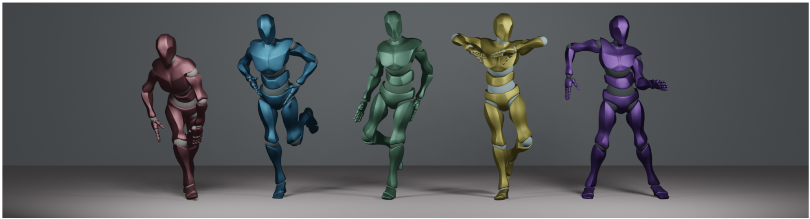

**[Image: figure_0003.png (1990x541, 575.1KB)]**

## Abstract

Dance is an important human art form, but creating new dances can be difficult and time-consuming. In this work, we introduce Editable Dance GEneration (EDGE), a state-of-the-art method for editable dance generation that is capable of creating realistic, physically-plausible dances while remaining faithful to the input music. EDGE uses a transformer-based diffusion model paired with Jukebox, a strong music feature extractor, and confers powerful editing capabilities well-suited to dance, including joint-wise conditioning, and in-betweening. We introduce a new metric for physical plausibility, and evaluate dance quality generated by our method extensively through (1) multiple quantitative metrics on physical plausibility, beat alignment, and diversity benchmarks, and more importantly, (2) a largescale user study, demonstrating a significant improvement over previous state-of-the-art methods. Qualitative samples from our model can be found at our website.

## 1. Introduction

Dance is an important part of many cultures around the world: it is a form of expression, communication, and social interaction [28]. However, creating new dances or dance animations is uniquely difficult because dance movements are expressive and freeform, yet precisely structured by music. In practice, this requires tedious hand animation or motion capture solutions, which can be expensive and impractical.

On the other hand, using computational methods to generate dances automatically can alleviate the burden of the creation process, leading to many applications: such methods can help animators create new dances or provide interactive characters in video games or virtual reality with realistic and varied movements based on user-provided music. In addition, dance generation can provide insights into the relationship between music and movement, which is an important area of research in neuroscience [2].

Previous work has made significant progress using machine learning-based methods, but has achieved limited success in generating dances from music that satisfy user constraints. Furthermore, the evaluation of generated dances is subjective and complex, and existing papers often use quantitative metrics that we show to be flawed.

In this work, we propose Editable Dance GEneration (EDGE), a state-of-the-art method for dance generation that creates realistic, physically-plausible dance motions based on input music. Our method uses a transformer-based diffusion model paired with Jukebox, a strong music feature extractor. This unique diffusion-based approach confers powerful editing capabilities well-suited to dance, including joint-wise conditioning and in-betweening. In addition to the advantages immediately conferred by the modeling choices, we observe flaws with previous metrics and propose a new metric that captures the physical accuracy of ground contact behaviors without explicit physical modeling. In summary, our contributions are the following:

1. We introduce a diffusion-based approach for dance generation that combines state-of-the-art performance with powerful editing capabilities and is able to generate arbitrarily long sequences.
2. We analyze the metrics proposed in previous works and show that they do not accurately represent humanevaluated quality as reported by a large user study.
3. Wepropose a new approach to eliminating foot-sliding physical implausibilities in generated motions using a novel Contact Consistency Loss, and introduce Physical Foot Contact Score, a simple new accelerationbased quantitative metric for scoring physical plausibility of generated kinematic motions that requires no explicit physical modeling.
4. We improve on previous hand-crafted audio feature extraction strategies by leveraging music audio representations from Jukebox [5], a pre-trained generative model for music that has previously demonstrated strong performance on music-specific prediction tasks [3, 7].

This work is best enjoyed when accompanied by our demo samples. Please see the samples at our website.

## 2. Related Work

## 2.1. Human motion generation

Human motion generation, the problem of automatically generating realistic human motions, is well-studied in computer vision, graphics, and robotics. Despite its importance and recent progress, it remains a challenging problem, with existing methods often struggling to capture the complexities of physically and stylistically realistic human motion.

Many early approaches fall under the category of motion matching , which operates by interpolating between sequences retrieved from a database [21]. While these approaches generate outputs that are physically plausible, their application has been primarily restricted to simple domains such as locomotion.

In recent years, deep neural networks have emerged as a promising alternative method for human motion generation. These approaches are often capable of generating diverse motions, but often fall short in capturing the physical laws governing human movement or rely on difficultto-train reinforcement learning solutions [33, 58]. Generating human motion conditioned on various inputs-e.g. joystick control [33], class-conditioning [15, 42], text-tomotion [43,61], seed motions [8,22,45,60]-is also an active area of study.

## 2.2. Dance Generation

The uniquely challenging task of generating dances stylistically faithful to input music has been tackled by many researchers. Many early approaches follow a motion retrieval paradigm [11, 29, 39], but tend to create unrealistic choreographies that lack the complexity of human dances. Later works instead synthesize motion from scratch by training on large datasets [1, 10, 23, 26, 30, 32, 44, 51, 57] and propose many modeling approaches, including adversarial learning, recurrent neural networks, and transformers. Despite achieving impressive performance, many such systems are complex [1,4,30,51], often involving many layers of conditioning and sub-networks. In contrast, our proposed method contains a single model trained with a simple objective, yet offers both strong generative and editing capabilities without significant hand-crafted design.

## 2.3. Generative Diffusion Models

Diffusion models [19, 52] are a class of deep generative models which learn a data distribution by reversing a scheduled noising process. In the past few years, diffusion models have been shown to be a promising avenue for generative modeling, exceeding the state-of-the-art in image and video generation tasks [18, 48]. Much like previous generative approaches like VAE [27] and GAN [12], diffusion models are also capable of conditional generation. Dhariwal et al. [6] introduced classifier guidance for image generation, where the output of a diffusion model may be 'steered' towards a target, such as a class label, using the gradients of a differentiable auxiliary model. Saharia et al. [47] proposed to use direct concatenation of conditions for Pix2Pix-like tasks, akin to Conditional GAN and CVAE [37, 53], and Ho et al. [20] demonstrated that classifier-free guidance can achieve state-of-the-art results while allowing more explicit control over the diversity-fidelity tradeoff.

Most recently, diffusion-based methods have demonstrated strong performance in generating motions conditioned on text [25,56,61]. While the tasks of text-to-motion and music-conditioned dance generation share high-level similarities, the dance generation task suffers more challenging computational scaling (see Sec. 3) and, due to its specialized nature, much lower data availability.

## 3. Method

Pose Representation We represent dances as sequences of poses in the 24-joint SMPL format [34], using the 6DOF rotation representation [62] for every joint and a single root translation: w ∈ R 24 · 6+3=147 . For the heel and toe of each foot, we also include a binary contact label: b ∈ { 0 , 1 } 2 · 2=4 . The total pose representation is therefore x = { b , w } ∈ R 4+147=151 . EDGE uses a diffusion-based framework to learn to synthesize sequences of N frames, x ∈ R N × 151 , given arbitrary music conditioning c .

Diffusion Framework We follow the DDPM [19] definition of diffusion as a Markov noising process with la- tents { z t } T t =0 that follow a forward noising process q ( z t | x ) , where x ∼ p ( x ) is drawn from the data distribution. The forward noising process is defined as

Figure 2. EDGE Pipeline Overview: EDGE learns to denoise dance sequences from time t = T to t = 0 , conditioned on music. Music embedding information is provided by a frozen Jukebox model [5] and acts as cross-attention context. EDGE takes a noisy sequence z T ∼ N (0 , I ) and produces the estimated final sequence ˆ x , noising it back to ˆ z T -1 and repeating until t = 0 .

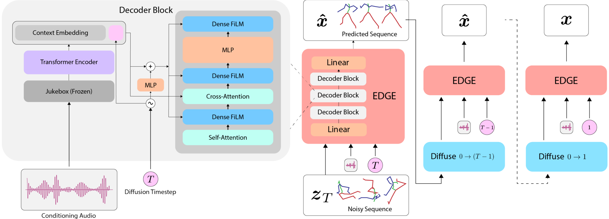

**[Image: figure_0030.png (1991x717, 218.9KB)]**

<!-- formula-not-decoded -->

where ¯ α t ∈ (0 , 1) are constants which follow a monotonically decreasing schedule such that when ¯ α t approaches 0, we can approximate z T ∼ N (0 , I ) .

In our setting with paired music conditioning c , we reverse the forward diffusion process by learning to estimate ˆ x θ ( z t , t, c ) ≈ x with model parameters θ for all t . We optimize θ with the 'simple' objective introduced in Ho et al. [19]:

<!-- formula-not-decoded -->

From now on, we refer to ˆ x θ ( z t , t, c ) as ˆ x ( z t , c ) for ease of notation.

Auxiliary losses Auxiliary losses are commonly used in kinematic motion generation settings to improve physical realism in the absence of true simulation [42,50,55]. In addition to the reconstruction loss L simple, we adopt auxiliary losses similar to those in Tevet et al. [56], which encourage matching three aspects of physical realism: joint positions (Eq. (3)), velocities (Eq. (4)), and foot velocities via our Contact Consistency Loss (Eq. (5)).

<!-- formula-not-decoded -->

<!-- formula-not-decoded -->

<!-- formula-not-decoded -->

where FK ( · ) denotes the forward kinematic function which converts joint angles into joint positions (though it only applies to the foot joints in Eq. (5)) and the ( i ) superscript denotes the frame index. In the Contact Consistency Loss, ˆ b ( i ) is the model's own prediction of the binary foot contact label's portion of the pose at each frame i . While this formulation is similar to the foot skate loss terms in previous works [55, 56], where foot velocity is penalized in frames where the ground truth motion exhibits a static foot contact, our Contact Consistency Loss formulation differs in that it encourages the model to (1) predict foot contact, and (2) maintain consistency with its own predictions . We find that this formulation significantly improves the realism of generated motions (see Sec. 4.1).

Our overall training loss is the weighted sum of the simple objective and the auxiliary losses:

<!-- formula-not-decoded -->

Sampling and Guidance At each of the denoising timesteps t , EDGE predicts the denoised sample and noises it back to timestep t -1 : ˆ z t -1 ∼ q ( ˆ x θ ( ˆ z t , c ) , t -1) , terminating when it reaches t = 0 (Fig. 2, right). We train our model using classifier-free guidance [20], which is commonly used in diffusion-based models [25, 46, 48, 56, 61]. Following Ho et al. [20], we implement classifier-free guidance by randomly replacing the conditioning with c = ∅ during training with low probability (e.g. 25%). Guided inference is then expressed as the weighted sum of unconditionally and conditionally generated samples:

<!-- formula-not-decoded -->

At sampling time, we can amplify the conditioning c by choosing a guidance weight w &gt; 1 .

Editing To enable editing for dances generated by EDGE, we use the standard masked denoising technique from diffusion image inpainting [35], and more recently text-tomotion models [25,56]. EDGE supports any combination of temporal and joint-wise constraints, shown in Fig. 4. Given a joint-wise and/or temporal constraint x known with positions indicated by a binary mask m , we perform the following at every denoising timestep:

<!-- formula-not-decoded -->

where ⊙ is the Hadamard (element-wise) product, replacing the known regions with forward-diffused samples of the constraint. This technique allows editability at inference time with no special training processes necessary.

For example, a user can perform motion in-betweening by providing a reference motion x known ∈ R N × 151 and a mask m ∈ { 0 , 1 } N × 151 , where m is all 1's in the first and last n frames and 0 everywhere else. This would result in a sequence N frames long, where the first and last n frames are provided by the reference motion and the rest is filled in with a plausible 'in-between' dance that smoothly connects the constraint frames, for arbitrary 2 n &lt; N . This editing framework provides a powerful tool for downstream applications, enabling the generation of dances that precisely conform to arbitrary constraints.

Long-form sampling The ability to synthesize sequences of arbitrary length, often many minutes long, is critical to the task of dance generation. However, since EDGE generates every frame of a dance sequence at once, naively increasing the maximum sequence length incurs a linear increase in computational cost. Moreover, dance generation requires that the conditioning c match the motion sequence in length, causing further scaling of memory demands, which is especially severe in the case of embeddings from large models like Jukebox [5]. To approach the challenge of long-form generation, EDGE leverages its editability to enforce temporal consistency between multiple sequences such that they can be concatenated into a single longer sequence. Refer to Fig. 3 for a depiction of this process.

Model Our model architecture is illustrated in Fig. 2. We adopt a transformer decoder architecture, which processes music conditioning projected to the transformer di- mension with a cross-attention mechanism following Saharia et al. [48]. Timestep information is incorporated both with a token concatenated with the music conditioning and feature-wise linear modulation (FiLM) [41].

Figure 3. Although EDGE is trained on 5-second clips, it can generate choreographies of any length by imposing temporal constraints on batches of sequences. In this example, EDGE constrains the first 2.5 seconds of each sequence to match the last 2.5 seconds of the previous one to generate a 12.5-second clip, as represented by the temporal regions of distinct clips in the batch that share the same color.

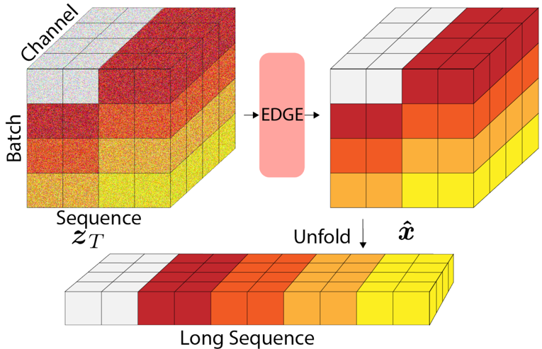

**[Image: figure_0053.png (765x493, 244.3KB)]**

Music Audio Features Past work [1, 10, 23, 26, 30, 32, 44, 51, 57] has largely focused on advancing the generative modeling approach for the dance generation problem, with little focus on the representation of the music signal itself, which we argue is equally important. Indeed, state-of-theart results in the text-to-image domain have found that scaling the text encoder is more important for performance than scaling the diffusion model [48].

In this vein, recent work [3, 7] in music information retrieval has demonstrated that Jukebox [5], a large GPTstyle model trained on 1M songs to generate raw music audio, contains representations that serve as strong features for music audio prediction tasks. We take inspiration from these advances and extract Jukebox features as the conditioning input for our diffusion model, and develop a new memory-efficient implementation that enables near real-time extraction on a single commodity GPU (see Appendix H for details).

## 4. Experiments

Dataset In this work, we use AIST++ [32], a dataset consisting of 1,408 high-quality dance motions paired to music from a diverse set of genres. We re-use the train/test splits provided by the original dataset. All training examples are cut to 5 seconds, 30 FPS.

Baselines Among recent state-of-the-art dance generation methods [1, 10, 23, 26, 30, 32, 44, 51, 57], we select the following baselines:

Figure 4. EDGE allows the user to specify both temporal and joint-wise constraints. Constraint joints / frames are highlighted in green and tan, generated joints / frames are in blue and gray. Pictured, top to bottom: dance completion from seed motion, dance that hits a specified keyframe mid-choreography, completion from specified upper-body joint angles, completion from specified lower-body joint angles and root trajectory.

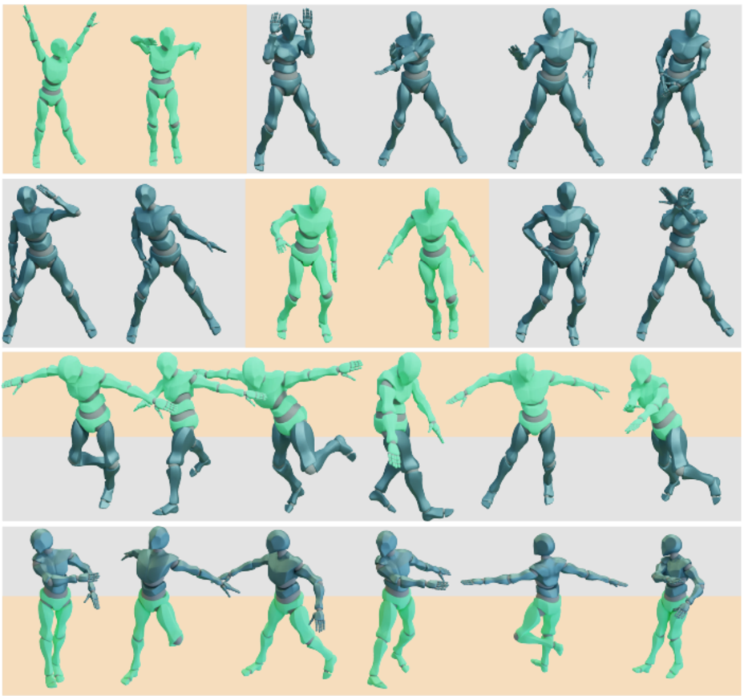

**[Image: figure_0060.png (928x869, 409.8KB)]**

- FACT [32], an autoregressive model introduced together with the AIST++ dataset
- Bailando [51], a follow-up approach that achieves the strongest qualitative performance to date.

Implementation details Our final model has 49M total parameters, and was trained on 4 NVIDIA A100 GPUs for 16 hours with a batch size of 512.

For long-form generation, we use 5-second slices and choose to enforce consistency for overlapping 2.5-second slices by interpolating between the two slices with linearly decaying weight. We find that this simple approach is sufficient to result in smooth, consistent generation, as demonstrated throughout our website.

We evaluate two separate feature extraction strategies. The 'baseline' strategy uses the popular audio package librosa [36] to extract beats and accompanying audio features using the same code as in Li et al. [32] (when the ground truth BPM is not known, we estimate it with librosa ). The 'Jukebox' [5] extraction strategy follows Castellon et al. [3], extracting representations from Jukebox and downsampling to 30 FPS to match our frame rates for motion data.

## 4.1. Comparison to Existing Methods

In this section, we compare our proposed model to several past works on (1) human evaluations, (2) our proposed physical plausibility metric, (3) beat alignment scores, (4) diversity, and (5) performance on in-the-wild music.

Human Evaluations To obtain the results in Tab. 1, we recruited 147 human raters via Prolific, a crowdsourcing platform for recruiting study participants. In aggregate, raters evaluated 11,610 pairs of clips randomly sampled from our models, ground truth, baseline models, or a checkpoint from our model training (as seen in Sec. 4.3). All dances were rendered in the same setting with music sampled uniformly at random. Raters were asked to select the dance that 'looked and felt better overall'. In addition to computing the raw win rate of our method when evaluated directly against competing methods shown in the table, we also computed each method's Elo rating, which, unlike flat win rate, is able to simultaneously capture the relative quality of more than 2 models [9].

The study reveals that human raters overwhelmingly prefer the dances generated by EDGE over previous methods, and even favor EDGE dances over real dances.

For more information about the exact details of our user studies, see Appendix A.

Physical Plausibility Any generated dance should be physically plausible; otherwise, its downstream applicability is dramatically limited. Previous works evaluate plausibility of foot-ground contact by measuring foot sliding [17,54]; however, dance is unique in that sliding is not only common but integral to many choreographies. This reflects a need for a metric that can measure the realism of footground contact that does not assume that feet should exhibit static contact at all times. In this work, we propose a new metric to evaluate physical plausibility, Physical Foot Contact score (PFC), that we believe captures this concept well.

PFC is a physically-inspired metric that requires no explicit physical modeling. Our metric arises from two simple, related observations:

1. On the horizontal (xy) plane, any center of mass (COM) acceleration must be due to static contact between the feet and the ground. Therefore, either at least one foot is stationary on the ground or the COM is not accelerating.
2. On the vertical (z) axis, any positive COMacceleration must be due to static foot contact.

Therefore, we can represent adherence to these conditions as an average over time of the below expression, scaled to normalize acceleration:

<!-- formula-not-decoded -->

Table 1. We compare our method against FACT [32] and Bailando [51]. In the table, w refers to the guidance weight at inference time. We evaluate all methods qualitatively via human raters to obtain Elo [9] and Win Rate, and compute the rest of the metrics automatically. For reference, the Elo rating system is designed such that a 400 point gap corresponds to a ∼ 90 %head-to-head win rate, which is reflected in our empirical results (the 'EDGE Win Rate' column). Refer to the Wikipedia page for the mathematical details. Error bars for 'EDGE Win Rate' correspond to a 95% confidence interval (see Appendix A for details). ↑ means higher is better, ↓ means lower is better, and - → means closer to ground truth is better.

| Method         |   Elo ↑ | EDGE Win Rate   |   PFC ↓ |   Beat Align. ↑ |   Dist k - → |   Dist g - → |   Fixed Bones | Editing   |
|----------------|---------|-----------------|---------|-----------------|--------------|--------------|---------------|-----------|
| EDGE ( w = 2 ) |    1751 | N/A             |  1.5363 |            0.26 |         9.48 |         5.72 |             3 | 3         |
| EDGE ( w = 1 ) |    1601 | 58.0% ± 3.8%    |  1.6545 |            0.27 |        10.58 |         7.62 |             3 | 3         |
| Bailando       |    1397 | 91.1% ± 5.9%    |   1.754 |            0.23 |         7.92 |         7.72 |             7 | 7         |
| FACT           |    1325 | 90.0% ± 7.0%    |  2.2543 |            0.22 |        10.85 |         6.14 |             3 | 7         |
| Ground Truth   |    1653 | 65.7% ± 11.1%   |   1.332 |            0.24 |        10.61 |         7.48 |             3 | N/A       |

Table 2. We test our model on in-the-wild music and ablate Jukebox features in this setting.

| Method (In-the-Wild)   |   Elo ↑ | EDGE Win Rate   |
|------------------------|---------|-----------------|
| EDGE                   |    1747 | 53.8% ± 11.1%   |
| w/o Jukebox            |    1603 | 83.3% ± 8.3%    |
| Bailando               |    1222 | 82.4% ± 5.5%    |
| FACT                   |    1367 | 89.3% ± 4.4%    |

<!-- formula-not-decoded -->

where

<!-- formula-not-decoded -->

and the i superscript denotes the frame index.

In our results (Tab. 1), we find that our method attains a greater level of physical plausibility than previous methods, and approaches the plausibility of ground truth motion capture data.

Maintaining fixed bone length is another important aspect of physical plausibility. Our method operates in the reduced coordinate (joint angle) space, which guarantees fixed bone length. However, methods that operate in the joint Cartesian space, such as Bailando , can produce significantly varying bone lengths. For example, on average, bone lengths change up to ± 20% over the course of dance sequences generated by Bailando .

Beat Alignment Scores Our experiments evaluate the tendency of our generated dances to follow the beat of the music, following previous work [51] for the precise implementation of this metric. The results demonstrate that EDGE outperforms past work, including Bailando , which includes a reinforcement learning module that explicitly op- timizes beat alignment. We further examine the robustness of this metric in Sec. 5.

Diversity Diversity metrics are computed following the methods of previous work [32, 51], which measure the distributional spread of generated dances in the 'kinetic' (Dist k ) and 'geometric' (Dist g ) feature spaces, as implemented by fairmotion [13, 38, 40]. We compute these metrics on 5-second dance clips produced by each approach. Given that the ultimate goal of dance generation is to automatically produce dances that emulate the ground truth distribution, we argue that models should aim to match the scores of the ground truth distribution rather than maximize their absolute values. Indeed, past work has found that jittery dances result in high diversity scores, in some cases exceeding the ground truth [31,32].

At low guidance weight ( w = 1 ), EDGE achieves a level of diversity that closely matches that of the ground truth distribution while attaining state-of-the-art qualitative performance. At high guidance weight ( w = 2 ), EDGE produces dances of markedly higher fidelity, reflected by a significantly higher Elo rating, while trading off diversity. These results reflect those of past studies, which show that sampling using guidance weights w &gt; 1 significantly increases fidelity at the cost of diversity [20, 48]. This simple control over the diversity-fidelity tradeoff via the modulation of a single scalar parameter provides a powerful tool for downstream applications.

In-the-Wild Music While past approaches achieve strong results on AIST++, these results are not necessarily indicative of the models' ability to generalize to in-the-wild music inputs. In order to evaluate generalization, we tested our proposed method and the baseline approaches on a diverse selection of popular songs from YouTube.

The results, as shown in Tab. 2, demonstrate that our proposed method continues to perform well on in-the-wild music. We find through ablation that Jukebox features are crit- ical for performance in this setting, bringing human-rated quality almost to par with in-distribution music; furthermore, we find that our approach continues to beat baselines in human evaluations for dance quality. We note that Bailando has an additional fine-tuning procedure available to improve performance on in-the-wild samples by training its actor-critic component. While we evaluated Bailando directly without additional fine-tuning, we found that human raters significantly preferred in-the-wild EDGE samples over in-distribution Bailando samples. We interpret these results as evidence that our proposed method is able to successfully generalize to in-the-wild music inputs.

Table 3. We ablate our contact consistency loss (CCL) and study its impact on qualitative and quantitative physical plausibility. While EDGE wins more on average against ground truth on overall quality evaluation (Tab. 1), the user study for this table specifically asks about physical plausibility, and we find that ground truth still performs favorably compared to EDGE.

| Method       | EDGE Win Rate   |   PFC ↓ |
|--------------|-----------------|---------|
| EDGE         | N/A             |  1.5363 |
| w/o CCL      | 61.8% ± 7.3%    |  3.0806 |
| Ground Truth | 40.6% ± 7.4%    |   1.332 |

## 4.2. Additional Evaluation

Editing We find that our model is capable of inbetweening, motion continuation, joint-conditioned generation, and long-form generation with quality on par with unconstrained samples. Please see our website for demo examples.

Physical Plausibility We test the soundness of our PFC metric and ablate our Contact Consistency Loss (CCL) term (see Eq. (5)) using a human evaluation study. Raters were shown pairs of dances from the ground truth distribution, EDGE with CCL, and EDGE without CCL, and asked which dance looked more physically plausible. The results (Tab. 3) show that CCL noticeably improves both the PFC metric and qualitative physical plausibility user evaluations, winning 61.8% of matchups against the version without CCL, and coming close to parity with ground truth samples. The results also indicate that PFC tracks well with human perception of physical plausibility.

For a discussion of limitations and implementation details of PFC, please see Sec. 5 and Appendix D, respectively.

## 4.3. FID Results

A reasonable solution to the problem of overall evaluation is to compute the difference between an empirical distribution of generated dances and a ground truth distribution. Several past works follow this intuition and auto- matically evaluate dance quality with Frechet Distance metrics [31, 32, 51]. As part of our experiments, we conduct a two-pronged analysis into the prevailing metrics, 'FID k ' and 'FID g ' [32], which compute the difference between distributions of heuristically extracted motion features, and show them to be unsound for the AIST++ dataset.

Figure 5. We plot FID k over the course of model training and find that it is inconsistent with overall quality evaluations.

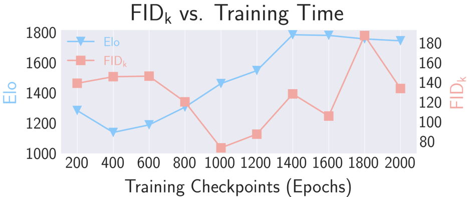

**[Image: figure_0101.png (932x394, 88.9KB)]**

'FID g ' We compute FID g on the ground truth AIST++ dataset following the implementation in Li et al. [32]. Specifically, we compute metrics on the test set against the training set and obtain a score of 41.4, a stark increase from metrics obtained from generated outputs: running on FACT outputs gives 12.75, running on Bailando outputs gives 24.82, and running on our final model's outputs gives 23.08. Given that FACT performs the best in 'FID g ' but performs the worst according to user studies and that all three models perform significantly better than ground truth, we conclude that the 'FID g ' values are unreliable as a measure of quality on this dataset.

'FID k ' We take 10 checkpoints throughout the training process for our model and poll raters on the overall quality of dances sampled from each checkpoint in a round-robin tournament. Intuitively, this should result in a consistentto-monotonic improvement in both qualitative performance and in the quantitative quality metrics. However, we observe that this is not the case. In Fig. 5, we show the results of this experiment with our proposed model's FID k .

While the qualitative performance of the generated motion improves considerably as we train the model, the FID k does not improve, and actually significantly worsens during the latter half of training.

## 5. Discussion

Developing automated metrics for the quality of generated dances is a fundamentally challenging undertaking, since the practice of dance is complex, subjective, and even culturally specific. In this section, we will discuss flaws in automated metrics currently in use and limitations with our proposed PFC metric.

Overall Quality Evaluation Our results suggest that despite the current standardized use of FIDs for evaluating dance generation models on the AIST++ dataset, these FID metrics, as they currently stand, are unreliable for measuring quality. One potential explanation may be that the AIST++ test set does not thoroughly cover the train distribution given its very small size. Additionally, due to data scarcity, both FID k and FID g depend on heuristic feature extractors that only compute superficial features of the data. By contrast, FID-based metrics in data-rich domains such as image generation (where FID originated) enjoy the use of learned feature extractors (e.g. pre-trained ImageNet models), which are known to directly extract semantically meaningful features [49]. Indeed, in the text-to-motion domain, where significantly more paired data is available [14], the standard feature extractors for FID-style metrics depend on deep contrastively learned models [56,61].

Our experiments suggest that the current FID metrics can be further improved for evaluating motion sequences. We believe that the idea of evaluating the difference between two featurized distributions of dance motions is not necessarily fundamentally flawed, but that more representative features could result in reliable automatic quality evaluations.

Beat Alignment Scoring In automated metrics, we should also aim to capture one of the core aspects of a dance performance: its ability to 'follow the beat' of the song. Previous work [32,51] has proposed using a beat alignment metric that rewards kinematic beats (local minima of joint speed) that line up with music beats. In Li et al. [32], the distance is computed per kinematic beat, and in Siyao et al. [51] the distance is computed per music beat.

Here, we argue that this metric has some fundamental issues and support this with empirical observations. Firstly, dance is not strictly about matching local minima in joint speed to beats. Instead, the beats of the music are a loose guide for timing, rhythm, and transitions between movements and dance steps. Secondly, while encouraging an overall alignment with the beat of the music is intuitive, the metric as presented in Li et al. [32] implies that highquality dances that contain motions with local minima between beats should be penalized, and the metric as presented in Siyao et al. [51] implies that dances that skip over beats should receive corresponding penalties. While each of these metrics holds some truth, neither is strictly correct: a perfectly valid dance which aligns with the music in double time or half time will be scored very poorly by at least one of the two metrics.

Empirically, we observe that in addition to exceeding scores of competing baselines, our beat alignment scores exceed those of ground truth samples. This potentially suggests that while the metric has served to drive progress on this problem in the past, it is possible that the metric loses its meaning when candidate examples reach quality on par with ground truth.

Physical Plausibility In this work, we introduce PFC, Eq. (10), a physically-inspired metric that specifically targets the challenging issue of foot sliding. While PFC is intuitive, it is not without its limitations. In its current form, PFC assumes that the feet are the only joints that experience static contact. This means that PFC cannot be applied without modification to motions such as gymnastics routines, where a variable number of non-foot (e.g. hand) contacts are integral to their execution. We believe that a careful analysis of other contact points (e.g. hands in gymnastics) could provide an extension of PFC that is more widely applicable. Another issue is the assumption that the COM can be accelerated only by static contact: though rare, it is possible to accelerate the COM using friction during extended sliding (which is not present in AIST++). For more analysis and discussion of PFC, see Appendix D.

## 6. Conclusion and Future Work

In this work, we propose a diffusion-based model that generates realistic and long-form dance sequences conditioned on music. We evaluate our model on multiple automated metrics (including our proposed PFC) and a large user study, and find that it achieves state-of-the-art results on the AIST++ dataset and generalizes well to inthe-wild music inputs. Importantly, we demonstrate that our model admits powerful editing capabilities, allowing users to freely specify both temporal and joint-wise constraints. The introduction of editable dance generation provides multiple promising avenues for future work. Whereas our method is able to create arbitrarily long dance sequences via the chaining of locally consistent, shorter clips, it cannot generate choreographies with very-long-term dependencies. Future work may explore the use of non-uniform sampling patterns such as those implemented in Harvey et al. [16], or a variation of the frame inbetweening scheme used in Ho et al. [18]. Editability also opens the door to the generation of more complex choreographies, including multi-person and scene-aware dance forms. We are excited to see the future that this new direction of editable dance generation will enable.

## References

- [1] Ho Yin Au, Jie Chen, Junkun Jiang, and Yike Guo. Choreograph: Music-conditioned automatic dance choreography over a style and tempo consistent dynamic graph. In Proceedings of the 30th ACM International Conference on Multimedia , pages 3917-3925, 2022. 2, 4
- [2] Steven Brown and Lawrence M Parsons. The neuroscience of dance. Scientific American , 299(1):78-83, 2008. 1

- [3] Rodrigo Castellon, Chris Donahue, and Percy Liang. Codified audio language modeling learns useful representations for music information retrieval. arXiv preprint arXiv:2107.05677 , 2021. 2, 4, 5, 14
- [4] Kang Chen, Zhipeng Tan, Jin Lei, Song-Hai Zhang, YuanChen Guo, Weidong Zhang, and Shi-Min Hu. Choreomaster: choreography-oriented music-driven dance synthesis. ACM Transactions on Graphics (TOG) , 40(4):1-13, 2021. 2
- [5] Prafulla Dhariwal, Heewoo Jun, Christine Payne, Jong Wook Kim, Alec Radford, and Ilya Sutskever. Jukebox: A generative model for music. arXiv preprint arXiv:2005.00341 , 2020. 2, 3, 4, 5
- [6] Prafulla Dhariwal and Alexander Nichol. Diffusion models beat gans on image synthesis. Advances in Neural Information Processing Systems , 34:8780-8794, 2021. 2
- [7] Chris Donahue and Percy Liang. Sheet sage: Lead sheets from music audio. 2021. 2, 4, 14
- [8] Yinglin Duan, Yue Lin, Zhengxia Zou, Yi Yuan, Zhehui Qian, and Bohan Zhang. A unified framework for real time motion completion. 2022. 2
- [9] Arpad E Elo. The rating of chessplayers, past and present . Arco Pub., 1978. 5, 6
- [10] Di Fan, Lili Wan, Wanru Xu, and Shenghui Wang. A bidirectional attention guided cross-modal network for music based dance generation. Computers and Electrical Engineering , 103:108310, 2022. 2, 4
- [11] Rukun Fan, Songhua Xu, and Weidong Geng. Examplebased automatic music-driven conventional dance motion synthesis. IEEE transactions on visualization and computer graphics , 18(3):501-515, 2011. 2
- [12] Ian Goodfellow, Jean Pouget-Abadie, Mehdi Mirza, Bing Xu, David Warde-Farley, Sherjil Ozair, Aaron Courville, and Yoshua Bengio. Generative adversarial networks. Communications of the ACM , 63(11):139-144, 2020. 2
- [13] Deepak Gopinath and Jungdam Won. fairmotion - tools to load, process and visualize motion capture data. Github, 2020. 6
- [14] Chuan Guo, Shihao Zou, Xinxin Zuo, Sen Wang, Wei Ji, Xingyu Li, and Li Cheng. Generating diverse and natural 3d human motions from text. In Proceedings of the IEEE/CVF Conference on Computer Vision and Pattern Recognition , pages 5152-5161, 2022. 8
- [15] Chuan Guo, Xinxin Zuo, Sen Wang, Shihao Zou, Qingyao Sun, Annan Deng, Minglun Gong, and Li Cheng. Action2motion: Conditioned generation of 3d human motions. In Proceedings of the 28th ACM International Conference on Multimedia , pages 2021-2029, 2020. 2
- [16] William Harvey, Saeid Naderiparizi, Vaden Masrani, Christian Weilbach, and Frank Wood. Flexible diffusion modeling of long videos. arXiv preprint arXiv:2205.11495 , 2022. 8
- [17] Chengan He, Jun Saito, James Zachary, Holly Rushmeier, and Yi Zhou. Nemf: Neural motion fields for kinematic animation. arXiv preprint arXiv:2206.03287 , 2022. 5
- [18] Jonathan Ho, William Chan, Chitwan Saharia, Jay Whang, Ruiqi Gao, Alexey Gritsenko, Diederik P Kingma, Ben Poole, Mohammad Norouzi, David J Fleet, et al. Imagen video: High definition video generation with diffusion models. arXiv preprint arXiv:2210.02303 , 2022. 2, 8
- [19] Jonathan Ho, Ajay Jain, and Pieter Abbeel. Denoising diffusion probabilistic models. Advances in Neural Information Processing Systems , 33:6840-6851, 2020. 2, 3
- [20] Jonathan Ho and Tim Salimans. Classifier-free diffusion guidance. arXiv preprint arXiv:2207.12598 , 2022. 2, 3, 6
- [21] Daniel Holden, Oussama Kanoun, Maksym Perepichka, and Tiberiu Popa. Learned motion matching. ACM Transactions on Graphics (TOG) , 39(4):53-1, 2020. 2
- [22] Daniel Holden, Jun Saito, and Taku Komura. A deep learning framework for character motion synthesis and editing. ACM Transactions on Graphics (TOG) , 35(4):1-11, 2016. 2
- [23] Yuhang Huang, Junjie Zhang, Shuyan Liu, Qian Bao, Dan Zeng, Zhineng Chen, and Wu Liu. Genre-conditioned longterm 3d dance generation driven by music. In ICASSP 20222022 IEEE International Conference on Acoustics, Speech and Signal Processing (ICASSP) , pages 4858-4862. IEEE, 2022. 2, 4
- [24] Ryan Kennedy, Scott Clifford, Tyler Burleigh, Philip D Waggoner, Ryan Jewell, and Nicholas JG Winter. The shape of and solutions to the mturk quality crisis. Political Science Research and Methods , 8(4):614-629, 2020. 12
- [25] Jihoon Kim, Jiseob Kim, and Sungjoon Choi. Flame: Freeform language-based motion synthesis &amp; editing. arXiv preprint arXiv:2209.00349 , 2022. 2, 3, 4
- [26] Jinwoo Kim, Heeseok Oh, Seongjean Kim, Hoseok Tong, and Sanghoon Lee. A brand new dance partner: Musicconditioned pluralistic dancing controlled by multiple dance genres. In Proceedings of the IEEE/CVF Conference on Computer Vision and Pattern Recognition , pages 34903500, 2022. 2, 4
- [27] Diederik P Kingma, Max Welling, et al. An introduction to variational autoencoders. Foundations and Trends® in Machine Learning , 12(4):307-392, 2019. 2
- [28] Kimerer LaMothe. The dancing species: how moving together in time helps make us human. Aeon, June , 1, 2019. 1
- [29] Minho Lee, Kyogu Lee, and Jaeheung Park. Music similarity-based approach to generating dance motion sequence. Multimedia tools and applications , 62(3):895-912, 2013. 2
- [30] Buyu Li, Yongchi Zhao, Shi Zhelun, and Lu Sheng. Danceformer: Music conditioned 3d dance generation with parametric motion transformer. In Proceedings of the AAAI Conference on Artificial Intelligence , volume 36, pages 12721279, 2022. 2, 4
- [31] Jiaman Li, Yihang Yin, Hang Chu, Yi Zhou, Tingwu Wang, Sanja Fidler, and Hao Li. Learning to generate diverse dance motions with transformer. arXiv preprint arXiv:2008.08171 , 2020. 6, 7
- [32] Ruilong Li, Shan Yang, David A Ross, and Angjoo Kanazawa. Ai choreographer: Music conditioned 3d dance generation with aist++. In Proceedings of the IEEE/CVF International Conference on Computer Vision , pages 1340113412, 2021. 2, 4, 5, 6, 7, 8, 12
- [33] Hung Yu Ling, Fabio Zinno, George Cheng, and Michiel Van De Panne. Character controllers using motion vaes. ACM Transactions on Graphics (TOG) , 39(4):40-1, 2020. 2

- [34] Matthew Loper, Naureen Mahmood, Javier Romero, Gerard Pons-Moll, and Michael J Black. Smpl: A skinned multiperson linear model. ACM transactions on graphics (TOG) , 34(6):1-16, 2015. 2
- [35] Andreas Lugmayr, Martin Danelljan, Andres Romero, Fisher Yu, Radu Timofte, and Luc Van Gool. Repaint: Inpainting using denoising diffusion probabilistic models. In Proceedings of the IEEE/CVF Conference on Computer Vision and Pattern Recognition , pages 11461-11471, 2022. 4
- [36] Brian McFee, Colin Raffel, Dawen Liang, Daniel P Ellis, Matt McVicar, Eric Battenberg, and Oriol Nieto. librosa: Audio and music signal analysis in python. In Proceedings of the 14th python in science conference , volume 8, pages 18-25, 2015. 5
- [37] Mehdi Mirza and Simon Osindero. Conditional generative adversarial nets. arXiv preprint arXiv:1411.1784 , 2014. 2
- [38] Meinard M¨ uller, Tido R¨ oder, and Michael Clausen. Efficient content-based retrieval of motion capture data. In ACM SIGGRAPH 2005 Papers , pages 677-685. 2005. 6
- [39] Ferda Ofli, Engin Erzin, Y¨ ucel Yemez, and A Murat Tekalp. Learn2dance: Learning statistical music-to-dance mappings for choreography synthesis. IEEE Transactions on Multimedia , 14(3):747-759, 2011. 2
- [40] Kensuke Onuma, Christos Faloutsos, and Jessica K Hodgins. Fmdistance: A fast and effective distance function for motion capture data. In Eurographics (Short Papers) , pages 8386, 2008. 6
- [41] Ethan Perez, Florian Strub, Harm De Vries, Vincent Dumoulin, and Aaron Courville. Film: Visual reasoning with a general conditioning layer. In Proceedings of the AAAI Conference on Artificial Intelligence , volume 32, 2018. 4
- [42] Mathis Petrovich, Michael J Black, and G¨ ul Varol. Actionconditioned 3d human motion synthesis with transformer vae. In Proceedings of the IEEE/CVF International Conference on Computer Vision , pages 10985-10995, 2021. 2, 3
- [43] Mathis Petrovich, Michael J Black, and G¨ ul Varol. Temos: Generating diverse human motions from textual descriptions. arXiv preprint arXiv:2204.14109 , 2022. 2
- [44] Junfu Pu and Ying Shan. Music-driven dance regeneration with controllable key pose constraints. arXiv preprint arXiv:2207.03682 , 2022. 2, 4
- [45] Davis Rempe, Tolga Birdal, Aaron Hertzmann, Jimei Yang, Srinath Sridhar, and Leonidas J Guibas. Humor: 3d human motion model for robust pose estimation. In Proceedings of the IEEE/CVF International Conference on Computer Vision , pages 11488-11499, 2021. 2
- [46] Robin Rombach, Andreas Blattmann, Dominik Lorenz, Patrick Esser, and Bj¨ orn Ommer. High-resolution image synthesis with latent diffusion models. In Proceedings of the IEEE/CVF Conference on Computer Vision and Pattern Recognition , pages 10684-10695, 2022. 3
- [47] Chitwan Saharia, William Chan, Huiwen Chang, Chris Lee, Jonathan Ho, Tim Salimans, David Fleet, and Mohammad Norouzi. Palette: Image-to-image diffusion models. In ACM SIGGRAPH 2022 Conference Proceedings , pages 110, 2022. 2
- [48] Chitwan Saharia, William Chan, Saurabh Saxena, Lala Li, Jay Whang, Emily Denton, Seyed Kamyar Seyed Ghasemipour, Burcu Karagol Ayan, S Sara Mahdavi, Rapha Gontijo Lopes, et al. Photorealistic text-to-image diffusion models with deep language understanding. arXiv preprint arXiv:2205.11487 , 2022. 2, 3, 4, 6
- [49] Ali Sharif Razavian, Hossein Azizpour, Josephine Sullivan, and Stefan Carlsson. Cnn features off-the-shelf: an astounding baseline for recognition. In Proceedings of the IEEE conference on computer vision and pattern recognition workshops , pages 806-813, 2014. 8
- [50] Mingyi Shi, Kfir Aberman, Andreas Aristidou, Taku Komura, Dani Lischinski, Daniel Cohen-Or, and Baoquan Chen. Motionet: 3d human motion reconstruction from monocular video with skeleton consistency. ACM Transactions on Graphics (TOG) , 40(1):1-15, 2020. 3
- [51] Li Siyao, Weijiang Yu, Tianpei Gu, Chunze Lin, Quan Wang, Chen Qian, Chen Change Loy, and Ziwei Liu. Bailando: 3d dance generation by actor-critic gpt with choreographic memory. In Proceedings of the IEEE/CVF Conference on Computer Vision and Pattern Recognition , pages 1105011059, 2022. 2, 4, 5, 6, 7, 8
- [52] Jascha Sohl-Dickstein, Eric Weiss, Niru Maheswaranathan, and Surya Ganguli. Deep unsupervised learning using nonequilibrium thermodynamics. In International Conference on Machine Learning , pages 2256-2265. PMLR, 2015. 2
- [53] Kihyuk Sohn, Honglak Lee, and Xinchen Yan. Learning structured output representation using deep conditional generative models. Advances in neural information processing systems , 28, 2015. 2
- [54] Omid Taheri, Vasileios Choutas, Michael J Black, and Dimitrios Tzionas. Goal: Generating 4d whole-body motion for hand-object grasping. In Proceedings of the IEEE/CVF Conference on Computer Vision and Pattern Recognition , pages 13263-13273, 2022. 5
- [55] Xiangjun Tang, He Wang, Bo Hu, Xu Gong, Ruifan Yi, Qilong Kou, and Xiaogang Jin. Real-time controllable motion transition for characters. arXiv preprint arXiv:2205.02540 , 2022. 3
- [56] Guy Tevet, Sigal Raab, Brian Gordon, Yonatan Shafir, Daniel Cohen-Or, and Amit H Bermano. Human motion diffusion model. arXiv preprint arXiv:2209.14916 , 2022. 2, 3, 4, 8
- [57] Guillermo Valle-P´ erez, Gustav Eje Henter, Jonas Beskow, Andre Holzapfel, Pierre-Yves Oudeyer, and Simon Alexanderson. Transflower: probabilistic autoregressive dance generation with multimodal attention. ACM Transactions on Graphics (TOG) , 40(6):1-14, 2021. 2, 4
- [58] Jungdam Won, Deepak Gopinath, and Jessica Hodgins. Physics-based character controllers using conditional vaes. ACM Transactions on Graphics (TOG) , 41(4):1-12, 2022. 2
- [59] Xingyu Xie, Pan Zhou, Huan Li, Zhouchen Lin, and Shuicheng Yan. Adan: Adaptive nesterov momentum algorithm for faster optimizing deep models. arXiv preprint arXiv:2208.06677 , 2022. 14

- [60] Wenjie Yin, Hang Yin, Kim Baraka, Danica Kragic, and M˚ arten Bj¨ orkman. Dance style transfer with cross-modal transformer. arXiv preprint arXiv:2208.09406 , 2022. 2
- [61] Mingyuan Zhang, Zhongang Cai, Liang Pan, Fangzhou Hong, Xinying Guo, Lei Yang, and Ziwei Liu. Motiondiffuse: Text-driven human motion generation with diffusion model. arXiv preprint arXiv:2208.15001 , 2022. 2, 3, 8
- [62] Yi Zhou, Connelly Barnes, Jingwan Lu, Jimei Yang, and Hao Li. On the continuity of rotation representations in neural networks. In Proceedings of the IEEE/CVF Conference on Computer Vision and Pattern Recognition , pages 57455753, 2019. 2

## A. User Study

Quality responses were ensured by three separate mechanisms:

- Prolific's automatic vetting, which ensures that participants whose survey responses are rejected too often are kicked from the platform.
- Restriction to participants from the United States, which is known to mitigate the frequency of fraudulent responses [24].
- Filtering out participants via identifying survey responses which incorrectly answer control questions. By this process, we eliminated 20 participants, resulting in a filtered total of 147 participants.

For our overall evaluations, we also evaluated against the 10 checkpoints taken throughout model training in order to increase coverage across skill levels for our Elo calculations.

In our physical plausibility survey, we ask 'Which dance is more physically plausible?', but otherwise the survey is exactly the same.

Over the course of 24 days, we collected responses from all of the raters and plot them below in a win table. We compute our Elo and win rate metrics from this table's numbers. Elo was computed using the Elo package in Python by randomly sorting all matchups and obtaining the average Elo over 1000 trials. See Tab. 4 for the raw win numbers across all of the methods we tested.

For our confidence intervals, we treated each pair of methods independently, and then each win or fail as an independent Bernoulli trial, computing the 95% confidence interval based on the number of wins and fails for that pair (Binomial distribution).

## B. FACT and Bailando

We use the official implementation for our FACT experiments. We noted that the published FACT checkpoints were not fully trained, so we re-trained the model from scratch for 300 k steps, following the original paper [32]. After inference, we downsample the model predictions to 30 FPS and perform forward kinematics. We also use the official Bailando implementation and their published checkpoints for inference. After inference, we downsample the predictions to 30 FPS and render the joint positions directly.

## C. Metrics and Evaluation

For automatic evaluation (PFC, beat alignment, Dist k , and Dist g ), we sampled 5-second clips from each model, using slices taken from the test music set sampled with a stride of 2.5 seconds as music input. For qualitative evaluation via the Prolific study, we sampled 10-second clips Dance1of180

## DanceA:

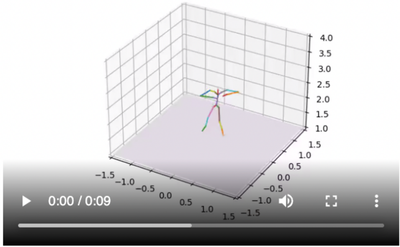

**[Image: figure_0193.png (783x483, 211.2KB)]**

DanceB:

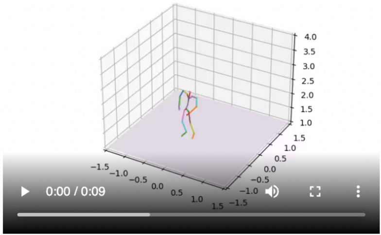

**[Image: figure_0195.png (784x485, 206.9KB)]**

Overall, which dance looks and feels better?


**[Image: figure_0197.png (38x37, 2.3KB)]**


**[Image: figure_0198.png (38x40, 2.3KB)]**

Dance A

DanceB

Figure 6. A screenshot of the user interface from our surveys. We use simple stick figures as the skeleton for our dance to (1) ensure fair comparisons with Bailando , which is difficult to rig due to the fact that it operates in Cartesian space, and (2) computational efficiency.

from each model, using slices taken from the test music set sampled with a stride of 5 seconds as music input.

To extract features for FID and diversity results, we directly use the official FACT GitHub repository, which borrows code from fairmotion.

Table 4. This table shows the total number of wins of Method A against Method B across our large-scale user study. For the method names, 'J' means Jukebox features, 'C' means CCL, ' C ′ ' means an early CCL prototype, w means guidance weight, OOD means out-of-domain (in-the-wild), and each 'Checkpoint N' method refers to the checkpoint taken from epoch N of training, as seen in Fig. 5.

| Method A / Method B      | Checkpoint 200   | Checkpoint 400   | Checkpoint 600   |   Checkpoint 800 | Checkpoint 1000   |   Checkpoint 1200 |   Checkpoint 1400 Checkpoint 1600 |   Checkpoint 1800 |      |   Checkpoint 2000 |   Ground Truth |   FACT | EDGE (J+C' ( w = 2 ))   |   EDGE (J+C ( w = 2 )) |   EDGE (J ( w = 2 )) |     | EDGE ( w = 2 )   | Bailando   |   EDGE (J+C OOD ( w = 2 | EDGE (J+C ( w = 1 ))   | EDGE (C OOD ( w = 2 )) EDGE (J ( w = 1 ))   | EDGE (J+C' ( w = 1   | )) FACT (OOD)   |     | Bailando   |   (OOD) |   (OOD) |
|--------------------------|------------------|------------------|------------------|------------------|-------------------|-------------------|-----------------------------------|-------------------|------|-------------------|----------------|--------|-------------------------|------------------------|----------------------|-----|------------------|------------|-------------------------|------------------------|---------------------------------------------|----------------------|-----------------|-----|------------|---------|---------|
| Checkpoint 200           | 0                | 3                | 3                |                3 | 1                 |                 2 |                                 0 |                 1 | 0    |                 0 |              1 |      0 | 0                       |                      0 |                      | 0   | 1                | 0          |                       0 | 1                      | 0                                           |                      | 0               | 0   | 0          |       0 |       0 |
| Checkpoint 400           | 37               | 0                | 4                |                0 | 1                 |                 0 |                                 0 |                 2 | 1    |                 1 |              0 |      0 | 0                       |                      0 |                      | 0   | 0                | 0          |                         | 0                      | 1                                           | 0                    | 0               | 0   | 1          |       2 |       2 |
| Checkpoint 600           | 37               | 36               | 0                |                4 | 3                 |                 0 |                                 1 |                 2 | 1    |                 1 |              2 |      7 | 0                       |                        |                    1 | 2   |                  | 0          |                       0 | 0                      | 0                                           | 0                    | 1               | 1   | 1          |      16 |      16 |
| Checkpoint 800           | 37               | 40               | 36               |                0 | 9                 |                 5 |                                 5 |                 0 | 4    |                 0 |              1 |     10 | 1                       |                        |                    4 | 1   | 2                |            |                       1 | 0                      | 1                                           | 0                    | 2               | 1   | 7          |      16 |      16 |
| Checkpoint 1000          | 39               | 39               | 37               |               31 | 0                 |                11 |                                 1 |                 7 | 9    |                 4 |              4 |     19 | 6                       |                        |                    5 | 6   | 2                | 16         |                       3 |                        | 1                                           | 0                    | 1               | 0   | 15         |      17 |      17 |
| Checkpoint 1200          | 38               | 40               | 40               |               35 | 29                |                 0 |                                17 |                13 | 13   |                 8 |              9 |     21 | 6                       |                        |                   11 |     | 11               | 14         |                      22 | 7                      | 4                                           | 0                    | 7               | 1   | 27         |      24 |      24 |
| Checkpoint 1400          | 40               | 40               | 39               |               35 | 39                |                23 |                                 0 |                14 | 11   |                11 |             20 |     27 | 5                       |                        |                   43 | 14  | 18               | 33         |                      21 | 16                     | 0                                           |                      | 7               | 5   | 29         |      34 |      34 |
| Checkpoint 1600          | 39               | 38               | 38               |               40 | 33                |                27 |                                26 |                 0 | 19   |                15 |             18 |     25 | 5                       |                        |                   34 | 21  |                  | 20 20      |                      13 |                        | 8                                           | 0                    | 5               | 5   | 26         |      33 |      33 |
| Checkpoint 1800          | 40               | 39               | 39               |               36 | 31                |                27 |                                29 |                21 | 0    |                29 |             22 |     28 | 8                       |                        |                   35 | 26  | 30               | 30         |                       4 | 21                     |                                             | 0                    | 4               | 5   | 30         |      30 |      30 |
| Checkpoint 2000          | 40               | 39               | 39               |               40 | 36                |                32 |                                29 |                25 | 11   |                 0 |             12 |     23 | 7                       |                     49 |                      | 26  | 18               | 29         |                       5 |                        | 19                                          | 0                    | 8               | 8   | 31         |      28 |      28 |
| Ground Truth             | 27               | 28               | 26               |               27 | 24                |                19 |                                 8 |                10 | 6    |                16 |              0 |     66 | 0                       |                        |                   24 | 0   |                  | 0          |                       0 | 0                      | 0                                           | 404                  | 0               | 0   | 0          |       0 |       0 |
| FACT                     | 28               | 28               | 21               |               18 | 9                 |                 7 |                                 1 |                 3 | 0    |                 5 |              4 |      0 | 0                       |                      7 |                      | 0   | 0                | 0          |                       0 |                        | 0                                           | 137                  | 0               | 0   | 0          |       0 |       0 |
| EDGE (J+C' ( w = 2 ))    | 14               | 14               | 14               |               13 | 8                 |                 8 |                                 9 |                 9 | 6    |                 7 |              0 |      0 | 0                       |                        |                    0 | 58  | 0                | 0          |                         | 0                      | 0                                           | 0                    | 71              | 62  | 0          |       0 |       0 |
| EDGE (J+C ( w = 2 ))     | 48               | 48               | 47               |               44 | 43                |                85 |                                53 |                62 | 61   |                47 |             46 |     63 | 0                       |                        |                      | 0   | 49               | 53         |                      82 | 42                     | 65                                          | 383                  | 0               | 0   | 167        |     154 |     154 |
| EDGE (J ( w = 2 ))       | 32               | 32               | 30               |               31 | 26                |                39 |                                36 |                29 | 24   |                24 |              0 |      0 |                         |                     82 |                   41 | 0   | 45               | 87         |                       0 |                        | 0                                           | 446                  | 83              | 80  | 0          |       0 |       0 |
| EDGE ( w = 2 )           | 17               | 18               | 18               |               16 | 16                |                22 |                                18 |                16 | 6    |                18 |              0 |        | 0                       |                      0 |                   37 |     | 45               | 0          |                      85 | 0                      | 0                                           | 353                  | 0               | 0   | 0          |       0 |       0 |
| Bailando                 | 18 13            | 18 13            | 18 13            |               17 | 2 10              |                14 |                                 3 |                16 | 6 22 |                 7 |              0 |      0 | 0                       |                      8 |                   36 | 3 0 | 5 0              | 0 0        |                       0 | 0                      | 0 57                                        | 193 0                | 0 0             | 0 0 | 0 0        |       0 |       0 |
| EDGE (J+C OOD ( w = 2 )) |                  |                  |                  |               13 |                   |                19 |                                 5 |                13 |      |                21 |              0 |      0 | 0                       |                        |                      | 0   |                  |            |                      21 |                        |                                             |                      |                 |     |            |       0 |       0 |
| EDGE (C OOD ( w = 2 ))   | 12               | 12               | 13               |               12 | 12                |                22 |                                10 |                18 | 5    |                 7 |              0 |      0 | 0                       |                        |                   13 |     | 0                | 0          |                         |                        | 0                                           | 0                    | 0               | 0   | 0          |       0 |       0 |
| EDGE (J+C ( w = 1 ))     | 0                | 0                | 0                |                0 | 0                 |                 0 |                                 0 |                 0 | 0    |                 0 |            256 |    523 |                         |                      0 |                  277 | 214 |                  | 307        |                     467 | 0                      | 0                                           | 0                    | 0               | 0   | 0          |         |       0 |
|                          | 14               |                  | 13               |               12 | 13                |                 7 |                                 7 |                 9 | 10   |                 6 |                |        | 69                      |                        |                    0 | 57  | 0                |            |                       0 | 0                      | 0                                           | 0                    | 0 75            | 0   | 0          |       0 |       0 |
| EDGE (J ( w = 1 ))       |                  | 14               |                  |                  |                   |                   |                                   |                   | 9    |                   |              0 |        | 0                       |                        |                      |     |                  |            |                         |                        |                                             |                      |                 |     | 0          |       0 |       0 |
| EDGE (J+C' ( w = 1 ))    | 14               | 14               | 13               |               13 | 14                |                13 |                                 9 |                 9 |      |                 6 |              0 |        | 0 78                    |                      0 |                      | 60  | 0                |            |                       0 |                        | 0                                           | 0                    | 0               | 65  | 0          |      73 |      73 |
| FACT (OOD) Bailando      | 17 17            | 16 15            | 16               |               10 | 2                 |                 7 |                                 5 |                 8 | 4    |                 3 |              0 |      0 | 0                       |                     20 |                   33 | 0 0 | 0 0              |            |                       0 | 0                      |                                             | 0 0 0                | 0 0             | 0   | 0          |       0 |       0 |
| (OOD)                    |                  |                  | 1                |                1 | 0                 |                10 |                                 0 |                 1 | 4    |                 6 |              0 |      0 | 0                       |                        |                      |     |                  |            |                         | 0 0                    |                                             |                      | 0               | 0   | 29         |         |         |

## D. PFC

We explain two implementation details of PFC:

1. The PFC equation (Eq. (10)) depends on the acceleration of the center of mass; since masses are not explicitly annotated in the AIST++ dataset, we use the acceleration of the root joint as a practical approximation.
2. The PFC equation (Eq. (10)) normalizes only the COM acceleration, and not the foot velocities. Under the assumptions of static contact, a body with at least one static foot is able to generate arbitrary (within physical reason) amounts of COM acceleration. Under these assumptions, two sequences where the root acceleration differs but the foot velocity is the same are equally plausible . In contrast, two sequences with the same root acceleration but different foot velocities are not equally plausible.

We perform an analysis in which we take the same checkpoints as from Sec. 4.3 and evaluate their PFC scores.

As can be seen from Fig. 7, PFC scores tend to improve over the course of training, providing further evidence that this metric measures physical plausibility.

## PFC vs. Training Time

Figure 7. PFC decreases throughout training.

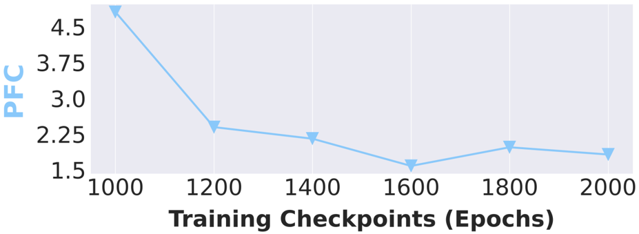

**[Image: figure_0213.png (927x339, 51.5KB)]**

## E. In-the-wild Music

Weuse the below songs for our in-the-wild music demos:

- [Doja Cat - Woman](https://www.youtube.com/watch?v=S05hfsRbw3M)
- [Luis Fonsi - Despacito ft. Daddy Yankee](https://www.youtube.com/watch?v=kJQP7kiw5Fk)
- [ITZY - LOCO](https://www.youtube.com/watch?v=MjCZfZfucEc)
- [Saweetie - My Type](https://www.youtube.com/watch?v=x5c2iRHlAHA)
- [Rihanna - Only Girl (In The World))](https://www.youtube.com/watch?v=Xv9023cub0Y)

## F. Hyperparameters

| Hyperparameter                                                                                                                                                        | Value     |
|-----------------------------------------------------------------------------------------------------------------------------------------------------------------------|-----------|
| Optimizer Learning Rate Diffusion Steps β schedule Motion Duration Motion FPS Motion Dimension Dropout Num Heads Num Layers Transformer Dim MLP Dim Dropout EMA Steps | Adan [59] |
|                                                                                                                                                                       | 4e-4      |
|                                                                                                                                                                       | 1000      |
|                                                                                                                                                                       | cosine    |
|                                                                                                                                                                       | 5 seconds |
|                                                                                                                                                                       | 30        |
|                                                                                                                                                                       | 151       |
| Classifier-Free                                                                                                                                                       | 0.25      |
|                                                                                                                                                                       | 8         |
|                                                                                                                                                                       | 8         |
|                                                                                                                                                                       | 512       |
|                                                                                                                                                                       | 1024      |
|                                                                                                                                                                       | 0.1       |
|                                                                                                                                                                       | 1         |
| EMA Decay                                                                                                                                                             | 0.9999    |

## G. Guidance Weight at Inference Time

In our experiments, we find that dropping out the guidance at early denoising steps (i.e. set w = 0 from step 1000 to step 800) further helps to increase diversity. We perform this dropout for the version of our model sampled at w = 1 , dropping out 40% of the steps.

## H. Memory-efficient Jukebox Implementation

Jukebox extraction implementations from previous work [3, 7] are limited in memory efficiency (cannot load in the full model on a GPU with 16GB VRAM) and speed on short clips (performs inference as if the clip has full sequence length).

We improve upon these implementations and develop a new implementation that (1) improves memory efficiency two-fold and (2) speeds up extraction time 4x for 5-second clips.

- For memory efficiency, we use HuggingFace Accelerate to initialize the model on the 'meta' device followed by loading in the checkpoint with CUDA, meaning that only half of the memory is used (using the traditional loading mechanism, PyTorch does not deallocate the initial random weights allocated before the checkpoint is loaded in).
- For speed, we adapt the codebase to accept and perform inference on shorter clips. Our new implementation takes only ∼ 5 seconds for a 5-second clip on a Tesla T4 GPU.

These improvements make extracting representations from Jukebox more accessible to researchers and practitioners.

Additionally, to downsample to 30 FPS we use librosa 's resampling method with 'fft' as the resampling type to avoid unnecessary slowness.

We plan to release this new implementation together with our code release.

## I. Long-Form Generation

Shown below is the pseudocode for long-form sampling.

```
1 def long_generate(): 2 z = randn((batch, sequence, dim)) 3 half = z.shape[1] // 2 4 for t in range(0, num_timesteps)[::-1]: 5 # sample z from step t to step t-1 6 z = p_sample(z, cond, t) 7 # enforce constraint 8 if t > 0: 9 z[1:,:half] = z[:-1,half:] 10 x = z 11 return x
```

## J. Rigging

In order to render generated dances in three dimensions for our website, we export joint angle sequences to the FBX file format to be imported into Blender, which provides the final rendering. The character avatar used in all our renders except for those of dances from Bailando is 'Y-Bot', downloaded from Mixamo. Dances from Bailando are rendered using ball-and-rod stick figures to ensure fair comparison, since dances are generated in Cartesian joint position space. Although inverse kinematic (IK) solutions are available, we sought to avoid the potential introduction of extraneous artifacts caused by poorly tuned IK, and instead rendered the joint positions directly. We perform no post-processing on model outputs.

## K. Extra Figures

Figure 8. Joint-wise Conditioning: EDGE can generate upper body motion given a lower body motion constraint.

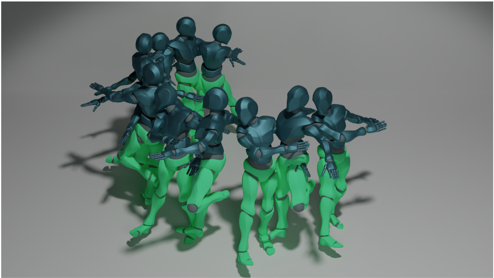

**[Image: figure_0240.png (1790x1009, 1067.9KB)]**

Figure 9. Joint-wise Conditioning: EDGE can generate lower body motion given an upper body motion constraint.

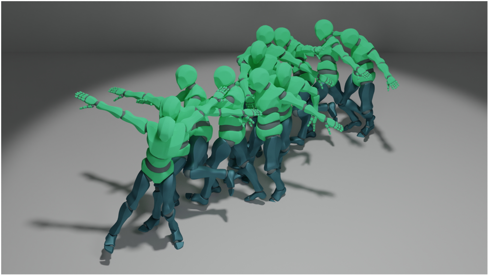

**[Image: figure_0242.png (1789x1010, 1034.3KB)]**

Figure 10. Temporal Conditioning: In-Betweening Given start and end poses, EDGE can generate diverse in-between dance sequences.

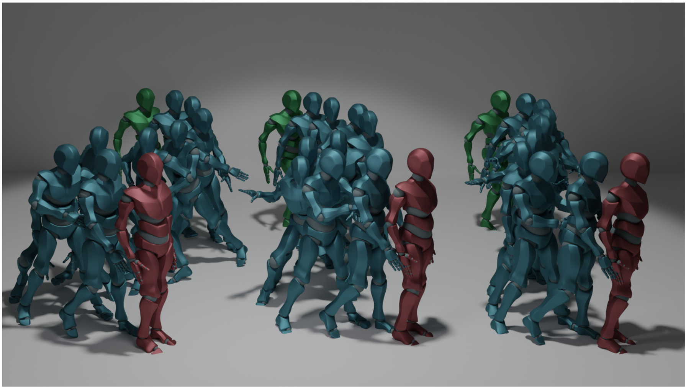

**[Image: figure_0244.png (1791x1011, 1248.0KB)]**

Figure 11. Temporal Conditioning: Continuation Given a seed motion, EDGE can continue the dance in response to arbitrary music conditioning.

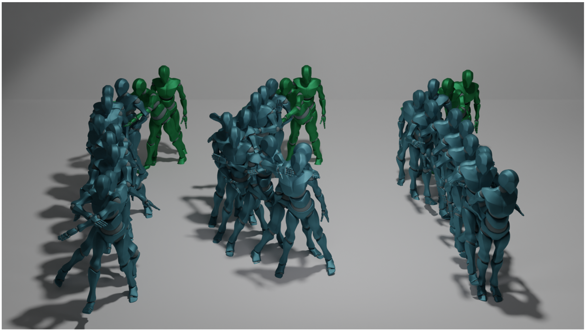

**[Image: figure_0246.png (1791x1012, 1126.5KB)]**
---

## Extracted Images

| # | File | Dimensions | Size |
|---|------|------------|------|
| 1 | figure_0003.png | 1990x541 | 575.1KB |
| 2 | figure_0030.png | 1991x717 | 218.9KB |
| 3 | figure_0053.png | 765x493 | 244.3KB |
| 4 | figure_0060.png | 928x869 | 409.8KB |
| 5 | figure_0101.png | 932x394 | 88.9KB |
| 6 | figure_0193.png | 783x483 | 211.2KB |
| 7 | figure_0195.png | 784x485 | 206.9KB |
| 8 | figure_0197.png | 38x37 | 2.3KB |
| 9 | figure_0198.png | 38x40 | 2.3KB |
| 10 | figure_0213.png | 927x339 | 51.5KB |
| 11 | figure_0240.png | 1790x1009 | 1067.9KB |
| 12 | figure_0242.png | 1789x1010 | 1034.3KB |
| 13 | figure_0244.png | 1791x1011 | 1248.0KB |
| 14 | figure_0246.png | 1791x1012 | 1126.5KB |
