## InfiniteDance : Scalable 3D Dance Generation Towards in-the-wild Generalization

Ronghui Li ⋆ 1 , 2 Zhongyuan Hu ⋆, 1 Li Siyao 3 Youliang Zhang 1 Haozhe Xie 3 Mingyuan Zhang 3 Jie Guo 2 Xiu Li † , 1 Ziwei Liu 3

1 Tsinghua University , 2 Peng Cheng Laboratory 3 S-Lab, Nanyang Technological University

MOE

[Project Page: https://infinitedance.github.io/](https://infinitedance.github.io/)

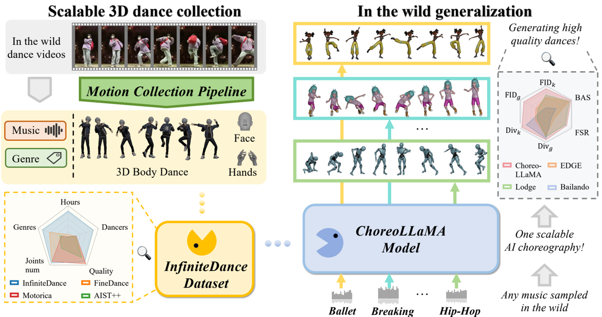

**[Image: figure_0005.png (1169x615, 365.0KB)]**

FID\_k

ChoreoLLaMA Scalable dataset Fig. 1: We propose a fully automated Motion Collection Pipeline that extracts high-fidelity and physically plausible 3D dance motions from large amounts of in-thewild videos. Based on this pipeline, we construct InfiniteDance Dataset , a 100.69 hours music-dance paired dataset. We further propose the ChoreoLLaMA , trained on InfiniteDance, which generates high-quality 3D dances that match the tempo and style of in-the-wild music.

Abstract. Although existing 3D dance generation methods perform well in controlled scenarios, they often struggle to generalize in the wild. When conditioned on unseen music, existing methods often produce unstructured or physically implausible dance, largely due to limited musicto-dance data and restricted model capacity. This work aims to push the frontier of generalizable 3D dance generation by scaling up both data and model design. 1) On the data side, we develop a fully automated pipeline that reconstructs high-fidelity 3D dance motions from monocular videos. To eliminate the physical artifacts prevalent in existing reconstruction methods, we introduce a Foot Restoration Diffusion Model (FRDM) guided by foot-contact and geometric constraints that enforce physical plausibility while preserving kinematic smoothness and expressiveness, resulting in a diverse, high-quality multimodal 3D dance dataset totaling 100.69 hours. 2) On model design, we propose Choreographic LLaMA (ChoreoLLaMA), a scalable LLaMA-based architecture. To enhance robustness under unfamiliar music conditions, we integrate a retrieval-augmented generation (RAG) module that injects reference dance as a prompt. Additionally, we design a slow/fast-cadence Mixtureof-Experts (MoE) module that enables ChoreoLLaMA to smoothly adapt motion rhythms across varying music tempos. Extensive experiments across diverse dance genres show that our approach surpasses existing methods in both qualitative and quantitative evaluations, marking a step toward scalable, real-world 3D dance generation.

⋆ co-first authors; † corresponding author

## 1 Introduction

Generating high-quality 3D dance is essential for a wide range of applications, including 3D animation, filmmaking, digital performance, and interactive entertainment. In recent years, there has been increasing interest in deep learningbased methods for automatic dance generation, with the goal of developing an AI choreographer that can significantly reduce the costly and time-consuming manual efforts involved in traditional 3D choreography pipelines, thereby enabling scalable content creation.

Despite notable progress in recent years, state-of-the-art 3D dance generation methods are still not ready to be deployed in real-world applications. This is mainly due to two key limitations: (1) Dance motion quality remains suboptimal. Current methods still often produce basic artifacts such as foot skating and mesh penetration. (2) Limited generalization across inthe-wild music conditions. Although many existing approaches can excel in controlled settings, they often collapse into unstructured motions under diverse musical conditions. On one hand, this limitation arises from the scarcity and imbalance of existing music-to-dance datasets, which fail to provide sufficient scale and diversity for models to learn the broad genres of musical and choreographic patterns needed for robust generalization. On the other hand, existing methods often depend on handcrafted and biased music-conditioning designs, yielding limited adaptability to diverse musical styles and tempos. For example, Lodge [22] performs reliably on fast-tempo tracks but struggles with slower rhythms, as its manually crafted rules are tailored for high-energy dance.

Inspired by recent breakthroughs in large-scale models, particularly in LLMs and video generation, we explore whether scaling up data and model capacity can benefit 3D dance generation. In this work, we propose InfiniteDance , a scalable 3D dance generation framework by jointly scaling both data and model capacity, with the goal of advancing deep learning-based methods toward more practical and deployable dance synthesis.

First, on the data side, we introduce an automatic pipeline that converts monocular videos into 3D dance motion and use it to construct a large-scale, high-quality dataset. Although MoCap-based datasets provide high-fidelity motion, their scale is limited to only a few hours. In contrast, monocular reconstruction is more scalable but frequently suffers from artifacts, including penetration, jittering, floating, and foot skating. Recent motion imitation methods [28, 51], built on physical simulators [7,31], improve physical plausibility but often suffer from foot jittering due to inaccurate estimation of diverse in-the-wild ground friction. To address these issues, we propose a Foot Restoration Diffusion Model (FRDM), which repairs foot-related artifacts in a self-supervised manner using velocity, position, and rotation cues, while preserving fidelity to the original motion. With geometric guidance during inference, FRDM significantly improves motion realism and brings reconstruction quality close to professional MoCap. Based on this pipeline, we build InfiniteDance , a dataset containing 100.69hours of high-quality 3D dance-music pairs covering 30 dance genres, along with RGB videos, 2D keypoints, and other annotations.

Second, on the modeling side, we propose ChoreoLLaMA , a scalable architecture that maps music and motion conditions into learnable tokens instead of relying on handcrafted priors. We use a pretrained LLaMA [1, 42, 43] backbone and feed continuous token embeds extracted by MuQ (for music) and an RVQ-VAE (for dance). To mitigate performance degradation under unseen musical conditions, we adopt a cross-modal Retrieval-Augmented Generation (RAG) strategy that selects reference dance motions paired with the music to guide generation. Furthermore, we introduce Cadence-MoE, a Mixture of Cadence Experts designed to learn choreography behaviors across different rhythmic patterns. It jointly models music, genre, and dance tokens under varying tempos, while an adaptive gating network dynamically selects expert modules, enhancing style alignment and improving tempo consistency.

Powered by large-scale training on InfiniteDance , our model produces stable and expressive dance motions, outperforming existing methods both qualitatively and quantitatively and pushing 3D dance generation closer to real-world applicability. In conclusion, our key contributions are as follows:

1. We propose a novel 3D dance collection pipeline that captures high-quality, physically plausible, and expressive motion from monocular videos. At its core is an efficient Foot Restoration Diffusion Model (FRDM) that effectively resolves foot-ground contact artifacts while preserving the geometric fidelity of the original motion.
2. We construct a large-scale, high-quality 3D dance dataset, InfiniteDance , comprising 100.69 hours of motion across 30 genres, paired with rich annotations including RGB videos, 2D keypoints, music, and genre labels.
3. We design a scalable LaMMA-based choreography framework that leverages retrieved reference dances to improve generalization to in-the-wild music and employs a Cadence-MoE to mitigate generation bias caused by dataset imbalance, thereby enhancing music-dance style consistency.

## 2 Related Works

## 2.1 Choreography Dataset

With the rise of data-driven generative models, 3D dance datasets have become essential for choreography research. Current approaches for collecting dance mo- tion data include marker-based or inertial motion capture, multi-view camera setups, manual keyframing, and monocular video-based pose estimation.

AIST++ [24] marked a milestone by providing 5.2 hours of music-dance paired data; They leverage multi-view camera systems and SMPLify [26] to reconstruct SMPL-format motion. MotoricaDance [2] employed professional motion capture equipment, offering 6.2 hours of high-quality data. FineDance [23] further collected 14.6 hours of dance data by a marker-based MoCap system and professional dancers with fine-grained hands. Although using MoCap equipment can ensure motion quality, the setup is expensive and restricts the capture environments.

Danceformer [17] introduced another important category of 3D dance datasets: those created using animation software through manual keyframing by professional animators. DanceCamera3D [48] further collected dance motions from the MMD (MikuMikuDance) community, which are typically keyframed by enthusiasts. However, the motions remain animator-edited and often lack natural dynamics.

Recently, PoPDanceSet [30] used monocular video-based motion capture to collect dance data from in-the-wild videos. They gathered popular dance clips online and used the HybrIK [18,19] model to estimate 3D poses, resulting in 3.56 hours of motion data. However, monocular estimation lacks physical modeling and often introduces artifacts such as jitter, mesh penetration, floating, and foot skating.

In summary, existing datasets struggle to achieve both scalability and high quality, and none of them include facial expressions. Our dataset addresses these gaps by providing 100.69 hours of high-quality 3D dance motion data across 30 diverse genres, with detailed hand movements and expressive facial annotations.

## 2.2 Music Driven Dance Generation

Generating music-synchronized dance has been studied extensively. Traditional motion-graph-based approaches [3-5,32] retrieve candidate dance clips based on musical features and stitch them together using hand-crafted choreography rules. However, these methods struggle to generalize across dance genres due to the complexity and diversity of choreographic patterns.

With the rise of deep learning, some early works [15, 24, 27, 52, 56] treat music2dance as a seq2seq task and use LSTM or Transformer to generate frameby-frame. However, these methods suffer from motion-freezing issues because of error accumulation. Diffusion-based methods [6, 8, 22, 23, 40, 44, 53] model motion features in continuous space through iterative denoising. EDGE [44] and FineDance [23] produce high-quality short clips, and Lodge [22] introduces a coarse-to-fine framework for long-term choreography, producing impressive results for fast-paced dances. However, its handcrafted dance primitives and rulebased choreography augmentation do not generalize well to diverse dance genres.

Token-based autoregressive methods [24, 27, 38] use discrete motion tokens for compact and high-quality motion representation and then train a sequence model to learn music-dance dependencies. Based on this, Bailando [38] enhances rhythmicity via reinforcement learning. However, it only takes low-level music features as input, making it challenging for the sequence model to model the high-level musical structure. As a result, the generated dances often lack coherent choreographic structure and may exhibit repetitive or meaningless motions, such as random hand waving without semantic intent.

Table 1: Comparisons of 3D Dance Datasets. /hand-paper denotes whether containing hand (finger) motion. /grin-wink represents facial expression. ¯ T(sec) denotes the average seconds per sequence. Acquisition methods: MoCap (captured with professional motion capture equipment), Pseudo (previous video-based motion estimation), Animator (manually keyframed by animators).

| Dataset                           | Acquisition                       | Joints num   | /hand-paper /grin-wink   |   Genres | Representation   | Dancers   |   T(h) | ¯ T(s)   |
|-----------------------------------|-----------------------------------|--------------|--------------------------|----------|------------------|-----------|--------|----------|
| Dance w/. Melody [41]             | MoCap                             | 21           | %%                       |        4 | 3D joints        | -         |    1.6 | 92.5     |
| Music2Dance [57]                  | MoCap                             | 55           | !%                       |        2 | 3D joints        | 2         |   0.96 | -        |
| EA-MUD [39]                       | Pseudo                            | 24           | %%                       |        4 | 3D joints        | -         |   0.35 | 73.8     |
| PhantomDance [17]                 | Animator                          | 24           | %%                       |       13 | SMPL             | 100+      |    9.6 | 133.3    |
| AIST++ [24]                       | Pseudo                            | 17/24        | %%                       |       10 | SMPL             | 30        |    5.2 | 13.3     |
| MMD [4]                           | MoCap                             | 52           | !%                       |        4 | FBX              | -         |    9.9 | -        |
| FineDance [23]                    | MoCap                             | 52           | !%                       |       22 | SMPL-X           | 27        |   14.6 | 152.3    |
| POPDG [30]                        | Pseudo                            | 24           | %%                       |       19 | SMPL             | -         |   3.56 | -        |
| Motorica [2]                      | MoCap                             | 52           | %%                       |        8 | BVH              | -         |   6.22 | -        |
| AIOZ [48]                         | Pseudo                            | 24           | %%                       |        7 | SMPL             | 4000+     |   16.7 | 37.5     |
| DCM [16]                          | Animator                          | 24           | %%                       |        4 | MMD              | -         |    3.2 | 106.67   |
| DD100 [37]                        | MoCap                             | 52           | !%                       |       10 | SMPL-X           | 10        |   1.92 | 69.3     |
| InterDance [21]                   | MoCap                             | 52           | !%                       |       15 | SMPL-X           | -         |   3.93 | 142.7    |
| InfiniteDance (Ours) Our Pipeline | InfiniteDance (Ours) Our Pipeline | 55           | !!                       |       30 | SMPL-X           | 1000+     | 100.69 | 30.01    |

Existing methods are limited to certain dance genres, resulting in poor generalization to diverse genres and unfamiliar music. Our approach supports multiple genres and improves choreography quality and generalization through a Retrieval Augmented Generation (RAG) mechanism and Cadence-MoE.

## 3 InfiniteDance Dataset

As shown in Table 1 , We collect the InfiniteDance dataset, sourced from wild video platforms, provides high-fidelity motions with complex actions and detailed hand and facial movements, spanning 6 main categories and 30 fine-grained genres with taxonomy verified by professional dancers.

As shown in Fig.2, the InfiniteDance dataset is collected using our proposed scalable and automated 3D motion collection pipeline, which extracts physically plausible motions from monocular videos. As shown in Fig. 2. The pipeline includes the following steps:

The first step is to extract high-quality whole-body motions from monocular videos using video-based motion estimation methods. We first preprocess the videos by using YOLOv8 [45] to extract single-person video sequences. Given its strong generalization ability and gravity-aware modeling, we employ GVHMR[35] to estimate body motion. We use SMPLest-X [49] to obtain SMPLX expression and hand parameters, as it captures visible features and estimates occluded faces and hands accurately.

Fig. 2: Overview of our motion collection pipeline. Step 1: We estimate whole-body motion from monocular videos, which contain artifacts. Step 2: We refine these motions through motion imitation in a physics simulator to obtain more physically plausible results, but this step often introduces frequent foot jittering. Step 3: We apply our Foot Restoration Diffusion Model (FRDM) to further correct foot motions. The fi nal results show stable root and foot contacts without jittering or penetration artifacts.

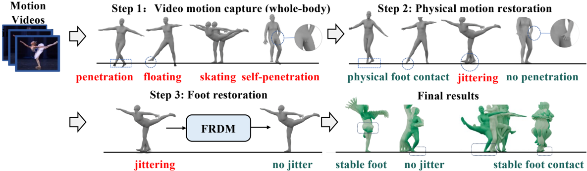

**[Image: figure_0038.png (1185x347, 183.5KB)]**

The motions estimated in the previous step are used as references for motion imitation [29] within a physical simulation environment, which helps correct nonphysical artifacts by enforcing physical constraints. This step effectively eliminates common artifacts such as body interpenetration, floating, and foot skating. However, because the physics-based simulation cannot accurately model the diverse ground-surface frictions involved in different dance movements, it often converts foot-skating artifacts into noticeable foot jittering .

To further address the foot-jittering issue commonly observed in motion imitation, we introduce a Foot Restoration Diffusion Model (FRDM).

## 3.1 Foot Restoration Diffusion Model

Given a flawed motion sequence x with foot-ground contact artifacts, our goal is to produce a corrected motion ˜ x that exhibits more stable foot contacts while preserving the original full-body geometric consistency. Since these artifacts mainly arise from instability in the root, knees, and feet, we restrict our correction to these joints and keep the upper body unchanged.

Optimizing for foot-skating artifacts directly is difficult, as SMPL pose parameters tend to amplify small errors near the root. We therefore operate in the linear joint position space. We adopt the motion representation similar to HumanML3D [10]. For a motion sequence x ∈ R L × 259 , where L is the motion frame number, each frame x can be represented as x = [ r , j v , j p , j r ] . r = [ ˙ r a , ˙ r x , ˙ r z , r y ] is the root data, ˙ r a is the angular velocity along the Y-axis (yaw angle), ˙ r x , ˙ r z are root linear velocities on the floor, r y is the root height. j v ∈ R L × 3 J , j p ∈ R L × 3( J -1) , j r ∈ R L × 6( J -1) correspond to the velocity, position, and rotation (smpl pose) of local keypoints relative to the root, with J = 22 denoting the number of joints and J -1 denoting all non-root joints. They are different representations of the same motion, Velocity aids foot stability, while Rotation helps maintain geometric consistency. Based on this representation, we perform implicit optimization during training and apply explicit guidance during inference to correct foot artifacts while preserving the original motion as much as possible.

̂j 0 1 𝑗 ! " 𝑗 " ! " Fig. 3: (a) The Foot Restoration Diffusion Model (FRDM) can be trained in a selfsupervised manner. We sample x 0 from ground-truth motions and obtain x t by adding noise. To repair only the artifacts in the root, knees, and feet, we replace these parts in x 0 with the corresponding components from x t to obtain ´ x t . We then train a foot denoising network f θ . ˆ x 0 = f θ (´ x t , t ) , j p 0 = Cumsum ( j v 0 ) , j p 0 = FK ( j r 0 ) . (b) Given the motion x with foot artifacts, we first sampel x T ∼ N (0 , I ) , and get ´ x t by replace the root, knee and foot reigon of x by those of x t . In the early denoising steps t &gt; t th , where t th is a threshold, we apply geometric guidance to keep the restored motion geometrically consistent with the original input. In the last steps t ≤ t th , we use footcontact guidance to explicitly improve foot stability.

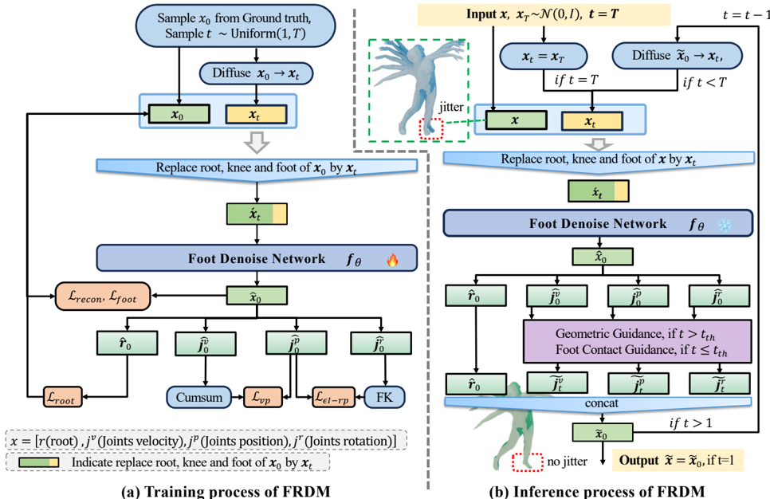

**[Image: figure_0045.png (966x626, 211.2KB)]**

Self-supervised Training. To train the FRDM for dance, we aggregate several high-quality dance datasets captured using marker-based MoCap systems, including MotoricaDance [2], FineDance [23], DD100 [37], and InterDance [21]. All motions are retargeted to a standard SMPL-X body shape.

In classic diffusion, the model predicts the clean motion x 0 from x t . As Fig. 3 (a) shows, the training process differs from standard diffusion pipelines. However, since we only aim to correct motion artifacts in the root, knee, and foot, we obtain ´ x t by replacing the root, knee, and foot features in ˆ x 0 with those of x t . Then we denoise from ´ x t . This ensures the upper body remains unchanged during denoising.

To ensure that the corrected root, knee, and foot motions remain faithful to the original sequence, we introduce several MSE-based loss terms, such as L recon (ˆ x 0 , x 0 ) , L root (ˆ r 0 , r 0 ) . To encourage more stable foot-ground contact, we introduce a foot loss:

<!-- formula-not-decoded -->

where Rec ( · ) is the recovery function to get global joints position ˆ P (details in the supplementary materials), k ∈ F means only select the foot joints, the b ( i ) k indicates the k-th foot joints whether contact with ground at frame i :

<!-- formula-not-decoded -->

where v th and h th are velocity and height thresholds, respectively. h ( P ( i ) k ) is to get the height of root form P ( i ) k . To constraint the generated ˆ j v 0 and ˆ j p 0 to be aligned, we introduce an loss L vp = ∥ ∥ ∥ cumsum ( ˆ j v 0 ) -ˆ j p 0 ∥ ∥ ∥ 2 2 , where cumsum () integrates velocities over time to recover positions. Notably, we expect ˆ j r 0 and ˆ j p 0 to remain approximately aligned, which helps balance their distinct roles during optimization: ˆ j r 0 aims to preserve geometric consistency between the repaired and original motions, while ˆ j p 0 emphasizes accurate foot-ground contact for artifact correction. Therefore, we design an epsilon insensitive loss L ϵI -rp :

<!-- formula-not-decoded -->

where k ∈ KF means only select the knee and foot joints, FK () is the forward kinematic function that calculates position from rotation, ϵ is a hyperparameter that defines the allowed error tolerance.

Inference. We argue that solely relying on a foot loss during the training phase is insufficient to fully resolve foot-ground contact issues. If the weight of foot loss is too small, it fails to sufficiently suppress foot artifacts; conversely, if set too large, it over-constrains the motion, leading to less dynamic results, thereby degrading motion expressiveness. To address these issues, we propose Foot Contact Guidance to explicitly improve foot stability and propose Geometric Guidance to encourage geometric consistency during inference.

As illustrated in Fig. 3 (b), given a full-body motion x exhibiting foot jittering and skating artifacts, At each denoising step, the Foot Denoise Network predicts ˆ x 0 = f θ (´ x t , t ) . At the early denoising steps, t &gt; t th , t th is a hyperparameter, Geometric Guidance is then applied to enforce global consistency between the restored motion and the input, formulated as:

<!-- formula-not-decoded -->

At the final stage of denoising, t &lt; t th , we use Foot Contact Guidance to further ensure more stable foot-ground contact:

<!-- formula-not-decoded -->

where b is a binary mask given by Equation 4. We then get ˜ x 0 = [ˆ r 0 , ˜ j v 0 , ˜ j p 0 , ˜ j r 0 ] . More detailed illustrations and experiments can be found at the supplementary materials.

Table 2: Motion quality of InfiniteDance vs. marker-based MoCap.

| Method           | Dataset        | FSR ↓   |   Jitter ↓ | Penetration ↓   |
|------------------|----------------|---------|------------|-----------------|
| MoCap            | FineDance [23] | 6.22%   |      12.69 | 0.6954%         |
| GVHMR            | -              | 28.63 % |      31.89 | 0.7864 %        |
| GVHMR+PHC        | -              | 8.87 %  |      78.60 | 0.0536 %        |
| GVHMR+PHC+Smooth | -              | 14.29 % |      15.39 | 0.0561 %        |
| GVHMR+PHC+FRDM   | InfiniteDance  | 5.09%   |      14.33 | 0.0559%         |

## 3.2 Quality of the InfiniteDance Dataset

As shown in Table 2, we use the Foot Skating Ratio (FSR) [22], Jitter [35] and Peneration Rate [20] to evaluate the motion quality. GVHMR, the advanced video motion capture method, also struggles with in-the-wild dance videos, showing high foot-skating-rate(FSR, 28.63 % ), jitter(31.89), and penetration(0.79 % ). Adding a physical environment based motion imitation module (PHC [29]) reduces skating and penetration but introduces fidelity loss and severe, unnatural leg jitter due to hard constraints. Simple smoothing reduces jitter but worsens motion fidelity, increasing skating. In contrast, FRM uses multi-view representation, data-driven priors, and diffusion guidance to better balance fidelity and realism. The final configuration (GVHMR+PTM+FRM) achieves the lowest FSR(5.09 % ) and jitter(14.33 % ), comparable to the marker-based FineDance dataset (FSR 6.22 % , jitter 12.69 % ),with low penetration. FRM follows EDGE's [44] architecture, trained for 16 hours on 2 A100, with an average inference time of 1.83s with 1024 frames. Our dataset achieves lower FSR and Penetration Rate than the marker-based MoCap FineDance dataset [23], confirming competitive physical fidelity.

## 4 Methodology

Our goal is to generate high-quality 3D dance motions that accurately match the tempo, style, and structural rhythm of in-the-wild music. To achieve this, we design ChoreoLLaMA, a scalable choreography framework composed of two key ideas: (1) RAG-based Choreography: Instead of relying solely on music embeds, we retrieve top-k reference dances that share similar musical attributes, providing strong choreographic priors for rare or unseen music. (2) CadenceMoE: We decompose the reference motions into multiple frequency bands and process them via specialized Experts. This design mitigates data imbalance, enables structured motion fusion, and produces expressive, multi-frequency conditioning signals.

## 4.1 Tokenizer

To enable LLaMA to model the cross-modal correspondence between music and dance, we first design a task-specific tokenization strategy for both modalities. Specifically, for music tokenization, we adopt the pretrained MuQ model [54] to extract music features m f ∈ R N × C m , which are then projected through a linear layer into the final music embeddings m e ∈ R N × C L . As to dance tokenization, As shown in Fig. 4, we train a dance tokenizer following RVQ-VAE [9] to enhance motion quality and preserve fine-grained details. In the Dance Projection module, we first obtain three-layer discrete tokens x idx and continuous quantized embeddings x q ∈ R N × C q . The quantized embeddings are then flattened and linearly projected to produce the final dance embeddings x e ∈ R N × C L .

Fig. 4: (a) Our residual tokenizer maintains multi-layer codebooks. (b) Previous methods input discrete indices (e.g., '[ 48 (1) ]') to LLaMA. (c) We project continuous quantized embeds x q into x e for LLaMA, preserving fine-grained features.

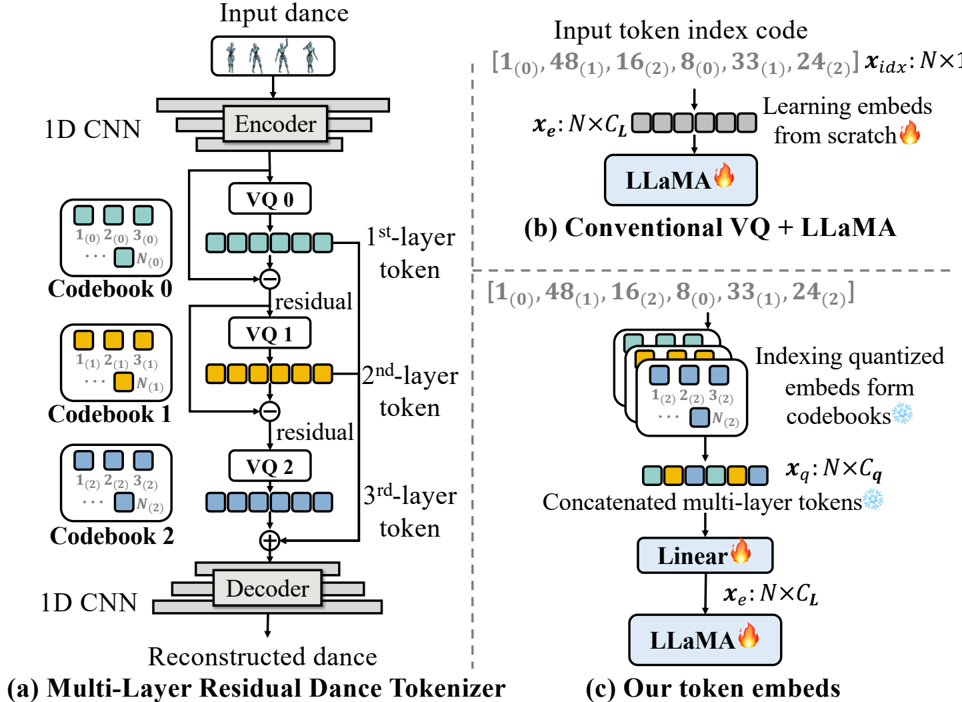

**[Image: figure_0070.png (962x702, 208.1KB)]**

Unlike prior approaches [14,25,50], which directly feed discrete token indices for both music and motion while ignoring their embedding representations, our design explicitly preserves continuous feature information. We argue that relying solely on token indices makes it difficult for the model to learn detailed and temporally aligned dependencies between music and motion.

Given a music clip m , previous methods first tokenize it into N discrete units and feed only the token indices m idx ∈ R N × 1 to LLaMA. LLaMA must then learn the corresponding embeddings m e ∈ R N × C L from scratch, where C L denotes the embedding dimension. This inevitably discards important musical cues (especially low-level rhythmic structures), leading to misalignment between the generated fine-grained motion and the underlying music.

As shown in Fig.4(c), ChoreoLLaMA instead operates on continuous embeddings rather than discrete token indices. This representation is temporally compact yet rich in expressive detail, allowing ChoreoLLaMA to more effectively model both global structures and local rhythmic dependencies between music and dance.

## 4.2 ChoreoLLaMA

To achieve scalable dance generation that is suitable for any given music, we propose ChoreoLLaMA, a music-driven dance generation model, as illustrated in Sum Weighted

0

…

1

…

Choreography

Genre Learnable embeds ··· IRFFT IRFFT Expert Module Expert Module 𝑁 &amp; /𝑘 ,C IRFFT Expert Module 0 0 1 RAG Fig. 5: (a) Given a music clip and a target genre, we first use RAG to retrieve the top-k most relevant reference dances. These retrieved dances, together with the given music and genre embeds, are then fed into the Cadence-MoE to produce fused embeds. ChoreoLLaMA then autoregressively predicts dance tokens that are decoded into dance sequences. (b) Each 'Expert' is a neural module composed of linear layers, multihead attention, and a Mamba block. The 'RFFT' and 'IRFFT' refer to the realvalued Fast Fourier Transform and its inverse, respectively. (c) At the inference phase, the ChoreoLLaMA predicts dance token indices ˆ x idx one by one, we then lookup the quantized embeds ˆ x q in codebooks and project them in to dance embeds ˆ x e .

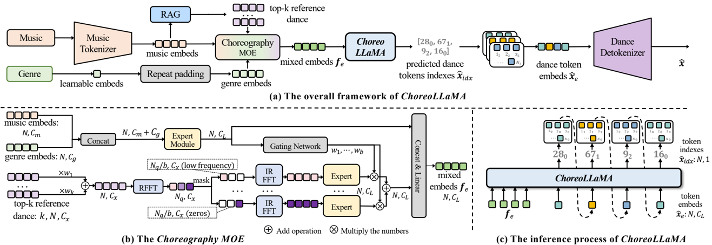

**[Image: figure_0082.png (1317x454, 217.8KB)]**

Fig.5. RAG-based Choreography. To improve generalization for diverse and even rare music, we propose a Retrieval Augmented Generation (RAG) based choreography method. We train a Music-Dance Cross-Modal Retrieval Network (MD-Retrieval), following the CLIP [34] architecture, where the Music Encoder and Dance Encoder utilize efficient attention [36], and the model is trained using the InfoNCE [33] loss on the training set of the InfiniteDance dataset.

During the training and inference of ChoreoLLaMA, we retrieve the top-k most relevant training-set reference dance { x r } k r =1 . Each x r is processed through a linear projection operation to obtain dance embeds x r e ∈ R N × C L . The final reference embeds ¯ x r ∈ R N × C L is the weighted sum of x r .

Cadence MoE. To capture both high-frequency motion dynamics and lowfrequency, graceful movements, and to effectively leverage choreographic priors from retrieved reference dances, we propose the Cadence-MoE Network. For genre g , we learn an embedding and repeat it to obtain g e ∈ R N × C g . As shown in Fig. 5(b), the reference dances are weighted by [ ω 1 , . . . , ω k ] , where k i = i/ ∑ k j =1 j , and summed to ¯ x r . We then apply the Real-valued Fast Fourier Transform (RFFT) to obtain frequency-domain features ¯ x f ∈ R N q × C x , where N q = N/ 2 + 1 corresponds to the Nyquist frequency. A frequency mask divides the spectrum into b bands, each containing ( N q /b, C x ) valid value and zeros elsewhere. Each band is processed by an Expert, and their outputs are combined using weights [ γ 1 , . . . , γ b ] predicted by a gating network consisting of a linear layer followed by a softmax. This design allows each expert to focus on different frequency characteristics, enabling the model to better adapt to various dance styles ranging from smooth, slow movements to fast, dynamic ones.

Table 3: Comparisons on the InfiniteDance dataset. The 'BAS' measures the beat alignment degree between the music and dance. 'Our Wins' denotes the percentage of pairwise comparisons in which participants preferred our generated results over competing methods.

| Method            | Motion Quality   | Motion Quality   | Motion Quality   | Motion Diversity   | Motion Diversity   |   BAS ↑ | Our Wins ↑       |
|-------------------|------------------|------------------|------------------|--------------------|--------------------|---------|------------------|
| Method            | FID k ↓          | FID g ↓          | FSR ↓            | Div k ↑            | Div g ↑            |         |                  |
| Ground Truth      | 2.55             | 0.60             | 5.09%            | 9.37               | 7.12               |  0.2332 | 34 . 8 ± 22 . 6% |
| Bailando [38]     | 117.38           | 82.37            | 15.56%           | 5.46               | 5.28               |  0.2137 | 88 . 7 ± 8 . 9%  |
| EDGE [44]         | 96.07            | 63.53            | 14.15%           | 4.36               | 4.97               |  0.2321 | 76 . 4 ± 7 . 7%  |
| Lodge [22]        | 89.52            | 60.38            | 6.72%            | 3.93               | 5.00               |  0.2329 | 68 . 1 ± 11 . 5% |
| ChoreoLLaMA(Ours) | 30.54            | 16.31            | 5.33%            | 6.23               | 5.11               |  0.2342 | -                |

## 5 Experiments

## 5.1 Experimental Setup

Datasets. We train ChoreoLLaMA on a dataset collection combining our InfiniteDance dataset with several public datasets [23, 24]. InfiniteDance is split into training, validation, and test sets (85%, 5%, and 10%), with genre distributions kept consistent across splits. Public datasets follow their original splits.

Implementation details. Dataset construction used eight A100 GPUs, involved running video-based motion capture for 5 days, performing physical motion imitation for one month, and applying FRDM-based post-processing for 4 days. Body motion was tokenized using an RVQ-VAE with 3 separate codebooks ( 512 entries, 1024 -dim), trained on one A100 GPU for 24 hours. For the Foot restoration model, We set ϵ as 0 . 1 , V th as 0 . 001 , set H toe th as 0 . 05 , set H ankle th as 0 . 08 . For dance generation, ChoreoLLaMA initialized from LLaMA3.2-1B . ChoreoLLaMA was trained with batch size of 8 and learning rate of 3 × 10 -4 . For the RAG, we retrieve the top-10 reference dance sequences. For the CadenceMoE, we divide ¯ x f into 2 frequency bands. The dimension C m = 1024 , C g = 256 , C x = 259 , C q = 1024 , C L = 2048 . ChoreoLLaMA used a temperature of 0 . 85 , top-k sampling with k = 30 , and top-p sampling with p = 0 . 8 .

## 5.2 Comparisons on the InfiniteDance dataset

As shown in Table 3, we evaluate our method in comparison with leading existing methods. To ensure a fair comparison, the results for EDGE, LODGE, and Bailando were reproduced by us on the same training dataset, following their official implementations.

Motion Quality. To evaluate the generated dance quality, we adopt the FID metric introduced in [22,38], which compares motion features between generated and ground-truth sequences using Frechet Inception Distance ( FID ) [11]. We further evaluate foot-ground contact quality using the Foot Skating Ratio ( FSR )

[22], which measures foot sliding during contact. Table 3 shows that our method yields significantly lower FID and FSR than prior works.

Motion Diversity. To assess the diversity of generated dance, we follow [38] and compute the average pairwise Euclidean distance in motion feature space. Specifically, Div k reflects diversity in kinematic features, while Div g captures geometric variation. As shown in Table 3, our ChoreoLLaMA achieves the highest Div k score, indicating richer variation in joint dynamics and motion patterns. Although the Div g score is slightly lower than Bailando's, this may result from our emphasis on motion plausibility and temporal consistency, which can limit spatial variation. In contrast, Bailando's higher foot skating ratio may inflate Div g by introducing unintended spatial variation.

Beat Alignment Score (BAS). We evaluate dance-music alignment using BAS [24]. Our method achieves the best BAS of 0.2342.

User study. We conducted a user study where 50 participants viewed 40 random video pairs. Each pair consists of two dance sequences: one created by our method and the other by different methods or ground truth. We report our method's win rate in Table 3. More user study results are in the supplementary material.

## 5.3 Generalization to In-the-Wild Music

We train models on InfiniteDance and test them under cross-dataset and out-ofdistribution (OOD) settings. For cross-dataset evaluation, we use AIST++ [24] and FineDance [23], which differ substantially from InfiniteDance in capture setups, choreography styles, and music distributions. For OOD evaluation, we curate an unseen-music set with BPMs outside the InfiniteDance training range, featuring rare instruments and styles ( e.g ., theremin, ambient, body percussion), introducing pronounced distribution shifts. As shown in Table 4, ChoreoLLaMA consistently outperforms Lodge [22] across all settings, demonstrating stronger cross-dataset and OOD generalization.

Table 4: Generalization experiments. Both models are trained on InfiniteDance and evaluated on cross-dataset and OOD settings.

| Method      | Test Setting                          |   FID k |   ↓ Div k ↑ |   BAS ↑ |
|-------------|---------------------------------------|---------|-------------|---------|
| Lodge [22]  | AIST++ [24] (cross-dataset)           |   48.73 |        4.26 |  0.2364 |
| ChoreoLLaMA | (Ours) AIST++ [24] (cross-dataset)    |   35.45 |        5.79 |  0.2378 |
| Lodge [22]  | FineDance [23] (cross-dataset)        |  106.85 |        4.14 |  0.2317 |
| ChoreoLLaMA | (Ours) FineDance [23] (cross-dataset) |   59.38 |        5.81 |  0.2382 |
| Lodge [22]  | Unseen Music (OOD)                    |  119.66 |        5.13 |  0.2332 |
| ChoreoLLaMA | (Ours) Unseen Music (OOD)             |   56.22 |        5.52 |  0.2315 |

## 5.4 Ablation Studies

Token Embeds Inputs. We compare two variants of LLaMA input: (i) token indices, where the raw music and dance token indices are directly fed into LLaMA, and (ii) embedded inputs directly, where music and dance embeds are extracted by MuQ and the Dance Tokenizer through their respective projection layers. Both variants are evaluated without incorporating the reference dance or the Cadence-MoE module. As shown in Table 5, although directly using token indices leads to higher diversity, it significantly degrades motion quality, particularly in BAS performance, as low-level details are lost. In contrast, the embeds-based input yields better motion fidelity and beat alignment.

Table 5: Ablation study of different components. We progressively add each component to ChoreoLLaMA and evaluate on the InfiniteDance test set.

| Components    | Components   | Components   | Components   | Metrics   | Metrics   | Metrics   |
|---------------|--------------|--------------|--------------|-----------|-----------|-----------|
| Token Indices | Token Embeds | RAG          | MoE          | FID k     | ↓ Div k ↑ | BAS ↑     |
| ✓             | ✗            | ✗            | ✗            | 79.84     | 13.09     | 0.2073    |
| ✗             | ✓            | ✗            | ✗            | 62.87     | 5.49      | 0.2269    |
| ✗             | ✓            | ✓            | ✗            | 38.74     | 6.16      | 0.2325    |
| ✗             | ✓            | ✓            | ✓            | 33.14     | 6.11      | 0.2348    |
| ✗             | ✓            | ✓            | ✓            | 30.54     | 6.23      | 0.2342    |

RAG based Choreography . As shown in Table 5, when adding reference dance, even without the Cadence-MoE, the reference dance embeds are extracted by multi-head attention layers. The overall performance rises sharply, confirming that reference dance priors enhance the generation of natural, diverse, and rhythm-aligned dances.

Cadence-MoE . As shown in rows 3-4 of Table 5, incorporating the CadenceMoE further improves the metrics. This improvement can be attributed to the MoE's ability to alleviate generation bias by assigning different experts for various dance patterns and frequency bands. Consequently, the model gains a stronger capacity to generate diverse choreography that better aligns with different musical styles and tempos, leading to higher-quality and more rhythmically coherent dances.

## 6 Conclusion and Limitation

In this work, we present a scalable framework for 3D dance generation that advances both data acquisition and model design. We introduce a 3D motion acquisition pipeline that efficiently captures large-scale, high-quality dance motions. The resulting InfiniteDance dataset provides a strong foundation for training more generalizable AI choreography models. Our proposed ChoreoLLaMA further enhances dance quality and generalization through the RAG-based Choreography and Cadence-MoE. However, human choreography is inherently an iterative and interactive creative process, where artists refine movements through continuous experimentation, feedback, and collaboration. In contrast, ChoreoLLaMA currently produces dance sequences in a single forward pass conditioned only on music and style, without the ability to incorporate intermediate feedback. As a result, it does not yet support interactive refinement or co-creative choreography with human dancers.

## References

1. Aaron Grattafiori, Abhimanyu Dubey, e.a.: The llama 3 herd of models (2024), https://arxiv.org/abs/2407.21783 3
2. Alexanderson, S., Nagy, R., Beskow, J., Henter, G.E.: Listen, denoise, action! audiodriven motion synthesis with diffusion models. ACM Trans. Graph. 42 (4), 44:144:20 (2023). https://doi.org/10.1145/3592458 4, 5, 7, 20
3. Berman, A., James, V.: Kinetic imaginations: exploring the possibilities of combining ai and dance. In: Twenty-Fourth International Joint Conference on Artificial Intelligence. p. 2431-2437 (2015) 4
4. Chen, K., Tan, Z., Lei, J., Zhang, S.H., Guo, Y.C., Zhang, W., Hu, S.M.: Choreomaster: Choreography-oriented music-driven dance synthesis. ACM Transactions on Graphics (TOG) 40 (4), 1-13 (2021) 4, 5
5. Ciolfi Felice, M., Alaoui, S.F., Mackay, W.E.: How do choreographers craft dance? designing for a choreographer-technology partnership. In: Proceedings of the 3rd International Symposium on Movement and Computing. pp. 1-8 (2016) 4
6. Cohan, S., Tevet, G., Reda, D., Peng, X.B., van de Panne, M.: Flexible motion in-betweening with diffusion models (2024), https://arxiv.org/abs/2405.11126 4
7. Erez, T., Tassa, Y., Todorov, E.: Simulation tools for model-based robotics: Comparison of bullet, havok, mujoco, ode and physx. In: 2015 IEEE international conference on robotics and automation (ICRA). pp. 4397-4404. IEEE (2015) 3
8. Goel, P., Wang, K.C., Liu, C.K., Fatahalian, K.: Iterative motion editing with natural language. In: Special Interest Group on Computer Graphics and Interactive Techniques Conference Conference Papers '24. p. 1-9. SIGGRAPH '24, ACM (Jul 2024). https://doi.org/10.1145/3641519.3657447 , http://dx.doi.org/10. 1145/3641519.3657447 4
9. Guo, C., Mu, Y., Javed, M.G., Wang, S., Cheng, L.: Momask: Generative masked modeling of 3d human motions. In: Proceedings of the IEEE/CVF Conference on Computer Vision and Pattern Recognition. pp. 1900-1910 (2024) 10
10. Guo, C., Zou, S., Zuo, X., Wang, S., Ji, W., Li, X., Cheng, L.: Generating diverse and natural 3d human motions from text. In: Proceedings of the IEEE/CVF conference on computer vision and pattern recognition. pp. 5152-5161 (2022) 6
11. Heusel, M., Ramsauer, H., Unterthiner, T., Nessler, B., Hochreiter, S.: Gans trained by a two time-scale update rule converge to a local nash equilibrium (2018), https: //arxiv.org/abs/1706.08500 12
12. Hu, E.J., Shen, Y., Wallis, P., Allen-Zhu, Z., Li, Y., Wang, S., Wang, L., Chen, W., et al.: Lora: Low-rank adaptation of large language models. ICLR 1 (2), 3 (2022) 28
13. Hu, L.: Animate anyone: Consistent and controllable image-to-video synthesis for character animation. In: Proceedings of the IEEE/CVF Conference on Computer Vision and Pattern Recognition. pp. 8153-8163 (2024) 28, 29
14. Jiang, B., Chen, X., Liu, W., Yu, J., Yu, G., Chen, T.: Motiongpt: Human motion as a foreign language (2023), https://arxiv.org/abs/2306.14795 10
15. Kim, J., Oh, H., Kim, S., Tong, H., Lee, S.: A brand new dance partner: Musicconditioned pluralistic dancing controlled by multiple dance genres. In: Proceedings of the IEEE/CVF Conference on Computer Vision and Pattern Recognition. pp. 3490-3500 (2022) 4
16. Le, N., Pham, T., Do, T., Tjiputra, E., Tran, Q.D., Nguyen, A.: Music-driven group choreography (2023), https://arxiv.org/abs/2303.12337 5

17. Li, B., Zhao, Y., Zhelun, S., Sheng, L.: Danceformer: Music conditioned 3d dance generation with parametric motion transformer. Proceedings of the AAAI Conference on Artificial Intelligence 36 , 1272-1279 (06 2022). https://doi.org/10. 1609/aaai.v36i2.20014 4, 5
18. Li, J., Bian, S., Xu, C., Chen, Z., Yang, L., Lu, C.: Hybrik-x: Hybrid analyticalneural inverse kinematics for whole-body mesh recovery. IEEE Transactions on Pattern Analysis and Machine Intelligence (2025) 4
19. Li, J., Xu, C., Chen, Z., Bian, S., Yang, L., Lu, C.: Hybrik: A hybrid analyticalneural inverse kinematics solution for 3d human pose and shape estimation. In: Proceedings of the IEEE/CVF conference on computer vision and pattern recognition. pp. 3383-3393 (2021) 4
20. Li, R., Zhang, H., Zhang, Y., Zhang, Y., Zhang, Y., Guo, J., Zhang, Y., Li, X., Liu, Y.: Lodge++: High-quality and long dance generation with vivid choreography patterns. arXiv preprint arXiv:2410.20389 (2024) 9
21. Li, R., Zhang, Y., Zhang, Y., Zhang, Y., Su, M., Guo, J., Liu, Z., Liu, Y., Li, X.: Interdance:reactive 3d dance generation with realistic duet interactions (2024), https://arxiv.org/abs/2412.16982 5, 7
22. Li, R., Zhang, Y., Zhang, Y., Zhang, H., Guo, J., Zhang, Y., Liu, Y., Li, X.: Lodge: A coarse to fine diffusion network for long dance generation guided by the characteristic dance primitives (2024), https://arxiv.org/abs/2403.10518 2, 4, 9, 12, 13, 24
23. Li, R., Zhao, J., Zhang, Y., Su, M., Ren, Z., Zhang, H., Tang, Y., Li, X.: Finedance: A fine-grained choreography dataset for 3d full body dance generation (2023), https://arxiv.org/abs/2212.03741 4, 5, 7, 9, 12, 13, 20, 25
24. Li, R., Yang, S., Ross, D.A., Kanazawa, A.: Ai choreographer: Music conditioned 3d dance generation with aist++. In: Proceedings of the IEEE/CVF International Conference on Computer Vision. pp. 13401-13412 (2021) 4, 5, 12, 13, 20
25. Ling, Z., Han, B., Li, S., Shen, H., Cheng, J., Zou, C.: Motionllama: A unified framework for motion synthesis and comprehension. arXiv preprint arXiv:2411.17335 (2024) 10
26. Loper, M., Mahmood, N., Romero, J., Pons-Moll, G., Black, M.J.: Smpl: A skinned multi-person linear model. In: Seminal Graphics Papers: Pushing the Boundaries, Volume 2, pp. 851-866 (2023) 4
27. Luo, M., Hou, R., Li, Z., Chang, H., Liu, Z., Wang, Y., Shan, S.: M3 gpt: An advanced multimodal, multitask framework for motion comprehension and generation. arXiv preprint arXiv:2405.16273 (2024) 4
28. Luo, Z., Cao, J., Winkler, A., Kitani, K., Xu, W.: Perpetual humanoid control for real-time simulated avatars (2023), https://arxiv.org/abs/2305.06456 3
29. Luo, Z., Cao, J., Winkler, A.W., Kitani, K., Xu, W.: Perpetual humanoid control for real-time simulated avatars. In: International Conference on Computer Vision (ICCV) (2023) 6, 9
30. Luo, Z., Ren, M., Hu, X., Huang, Y., Yao, L.: Popdg: Popular 3d dance generation with popdanceset (2024), https://arxiv.org/abs/2405.03178 4, 5
31. Makoviychuk, V., Wawrzyniak, L., Guo, Y., Lu, M., Storey, K., Macklin, M., Hoeller, D., Rudin, N., Allshire, A., Handa, A., et al.: Isaac gym: High performance gpu-based physics simulation for robot learning. arXiv preprint arXiv:2108.10470 (2021) 3
32. Ofli, F., Erzin, E., Yemez, Y., Tekalp, A.M.: Learn2dance: Learning statistical music-to-dance mappings for choreography synthesis. IEEE Transactions on Multimedia 14 (3), 747-759 (2011) 4

33. Oord, A.v.d., Li, Y., Vinyals, O.: Representation learning with contrastive predictive coding. arXiv preprint arXiv:1807.03748 (2018) 11
34. Radford, A., Kim, J.W., Hallacy, C., Ramesh, A., Goh, G., Agarwal, S., Sastry, G., Askell, A., Mishkin, P., Clark, J., et al.: Learning transferable visual models from natural language supervision. In: International conference on machine learning. pp. 8748-8763. PmLR (2021) 11
35. Shen, Z., Pi, H., Xia, Y., Cen, Z., Peng, S., Hu, Z., Bao, H., Hu, R., Zhou, X.: Worldgrounded human motion recovery via gravity-view coordinates. In: SIGGRAPH Asia 2024 Conference Papers. pp. 1-11 (2024) 5, 9
36. Shen, Z., Zhang, M., Zhao, H., Yi, S., Li, H.: Efficient attention: Attention with linear complexities. In: Proceedings of the IEEE/CVF winter conference on applications of computer vision. pp. 3531-3539 (2021) 11
37. Siyao, L., Gu, T., Yang, Z., Lin, Z., Liu, Z., Ding, H., Yang, L., Loy, C.C.: Duolando: Follower gpt with off-policy reinforcement learning for dance accompaniment (2024), https://arxiv.org/abs/2403.18811 5, 7
38. Siyao, L., Yu, W., Gu, T., Lin, C., Wang, Q., Qian, C., Loy, C.C., Liu, Z.: Bailando: 3d dance generation by actor-critic gpt with choreographic memory. In: Proceedings of the IEEE/CVF Conference on Computer Vision and Pattern Recognition. pp. 11050-11059 (2022) 4, 12, 13
39. Sun, G., Wong, Y., Cheng, Z., Kankanhalli, M.S., Geng, W., Li, X.: Deepdance: Music-to-dance motion choreography with adversarial learning. IEEE Transactions on Multimedia 23 , 497-509 (2021). https://doi.org/10.1109/TMM.2020.2981989 5
40. Sun, H., Zheng, R., Huang, H., Ma, C., Huang, H., Hu, R.: Lgtm: Local-to-global text-driven human motion diffusion model. In: Special Interest Group on Computer Graphics and Interactive Techniques Conference Conference Papers '24. p. 1-9. SIGGRAPH '24, ACM (Jul 2024). https://doi.org/10.1145/3641519.3657422 , http://dx.doi.org/10.1145/3641519.3657422 4
41. Tang, T., Jia, J., Hanyang, M.: Dance with melody: An lstm-autoencoder approach to music-oriented dance synthesis. In: ACM International Conference on Multimedia. pp. 1598-1606 (2018). https://doi.org/10.1145/3240508.3240526 5
42. Touvron, H., Lavril, T., Izacard, G., Martinet, X., Lachaux, M.A., Lacroix, T., Rozière, B., Goyal, N., Hambro, E., Azhar, F., Rodriguez, A., Joulin, A., Grave, E., Lample, G.: Llama: Open and efficient foundation language models (2023), https://arxiv.org/abs/2302.13971 3
43. Touvron, H., Martin, L., Stone, K., Albert, P., Almahairi, A., Babaei, Y., Bashlykov, N., Batra, S., Bhargava, P., Bhosale, S., Bikel, D., Blecher, L., Ferrer, C.C., Chen, M., Cucurull, G., Esiobu, D., Fernandes, J., Fu, J., Fu, W., Fuller, B., Gao, C., Goswami, V., Goyal, N., Hartshorn, A., Hosseini, S., Hou, R., Inan, H., Kardas, M., Kerkez, V., Khabsa, M., Kloumann, I., Korenev, A., Koura, P.S., Lachaux, M.A., Lavril, T., Lee, J., Liskovich, D., Lu, Y., Mao, Y., Martinet, X., Mihaylov, T., Mishra, P., Molybog, I., Nie, Y., Poulton, A., Reizenstein, J., Rungta, R., Saladi, K., Schelten, A., Silva, R., Smith, E.M., Subramanian, R., Tan, X.E., Tang, B., Taylor, R., Williams, A., Kuan, J.X., Xu, P., Yan, Z., Zarov, I., Zhang, Y., Fan, A., Kambadur, M., Narang, S., Rodriguez, A., Stojnic, R., Edunov, S., Scialom, T.: Llama 2: Open foundation and fine-tuned chat models (2023), https://arxiv.org/abs/2307.09288 3
44. Tseng, J., Castellon, R., Liu, K.: Edge: Editable dance generation from music. In: Proceedings of the IEEE/CVF Conference on Computer Vision and Pattern Recognition. pp. 448-458 (2023) 4, 9, 12

45. Varghese, R., Sambath, M.: Yolov8: A novel object detection algorithm with enhanced performance and robustness. In: 2024 International Conference on Advances in Data Engineering and Intelligent Computing Systems (ADICS). pp. 1-6. IEEE (2024) 5
46. Wan, T., Wang, A., Ai, B., Wen, B., Mao, C., Xie, C.W., Chen, D., Yu, F., Zhao, H., Yang, J., Zeng, J., Wang, J., Zhang, J., Zhou, J., Wang, J., Chen, J., Zhu, K., Zhao, K., Yan, K., Huang, L., Feng, M., Zhang, N., Li, P., Wu, P., Chu, R., Feng, R., Zhang, S., Sun, S., Fang, T., Wang, T., Gui, T., Weng, T., Shen, T., Lin, W., Wang, W., Wang, W., Zhou, W., Wang, W., Shen, W., Yu, W., Shi, X., Huang, X., Xu, X., Kou, Y., Lv, Y., Li, Y., Liu, Y., Wang, Y., Zhang, Y., Huang, Y., Li, Y., Wu, Y., Liu, Y., Pan, Y., Zheng, Y., Hong, Y., Shi, Y., Feng, Y., Jiang, Z., Han, Z., Wu, Z.F., Liu, Z.: Wan: Open and advanced large-scale video generative models. arXiv preprint arXiv:2503.20314 (2025) 28
47. Wang, T., Li, L., Lin, K., Lin, C.C., Yang, Z., Zhang, H., Liu, Z., Wang, L.: Disco: Disentangled control for referring human dance generation in real world. arXiv preprint arXiv:2307.00040 2 (3), 4 (2023) 28, 29
48. Wang, Z., Jia, J., Sun, S., Wu, H., Han, R., Li, Z., Tang, D., Zhou, J., Luo, J.: Dancecamera3d: 3d camera movement synthesis with music and dance (2024), https://arxiv.org/abs/2403.13667 4, 5
49. Yin, W., Cai, Z., Wang, R., Zeng, A., Wei, C., Sun, Q., Mei, H., Wang, Y., Pang, H.E., Zhang, M., et al.: Smplest-x: Ultimate scaling for expressive human pose and shape estimation. arXiv preprint arXiv:2501.09782 (2025) 5
50. Zhang, J., Zhang, Y., Cun, X., Huang, S., Zhang, Y., Zhao, H., Lu, H., Shen, X.: T2m-gpt: Generating human motion from textual descriptions with discrete representations (2023), https://arxiv.org/abs/2301.06052 10
51. Zhang, Y., Li, R., Zhang, Y., Pan, L., Wang, J., Liu, Y., Li, X.: A plug-and-play physical motion restoration approach for in-the-wild high-difficulty motions. arXiv preprint arXiv:2412.17377 (2024) 3
52. Zhang, Z., Wang, Y., Mao, W., Li, D., Zhao, R., Wu, B., Song, Z., Zhuang, B., Reid, I., Hartley, R.: Motion anything: Any to motion generation. arXiv preprint arXiv:2503.06955 (2025) 4
53. Zhang, Z., Liu, R., Aberman, K., Hanocka, R.: Tedi: Temporally-entangled diffusion for long-term motion synthesis (2023), https://arxiv.org/abs/2307.15042 4
54. Zhu, H., Zhou, Y., Chen, H., Yu, J., Ma, Z., Gu, R., Luo, Y., Tan, W., Chen, X.: Muq: Self-supervised music representation learning with mel residual vector quantization (2025), https://arxiv.org/abs/2501.01108 9
55. Zhu, S., Chen, J.L., Dai, Z., Dong, Z., Xu, Y., Cao, X., Yao, Y., Zhu, H., Zhu, S.: Champ: Controllable and consistent human image animation with 3d parametric guidance. In: European Conference on Computer Vision. pp. 145-162. Springer (2024) 28, 29
56. Zhuang, H., Lei, S., Xiao, L., Li, W., Chen, L., Yang, S., Wu, Z., Kang, S., Meng, H.: Gtn-bailando: Genre consistent long-term 3d dance generation based on pretrained genre token network. In: ICASSP 2023-2023 IEEE International Conference on Acoustics, Speech and Signal Processing (ICASSP). pp. 1-5. IEEE (2023) 4
57. Zhuang, W., Wang, C., Chai, J., Wang, Y., Shao, M., Xia, S.: Music2dance: Dancenet for music-driven dance generation. ACM Transactions on Multimedia Computing, Communications, and Applications (TOMM) 18 (2), 1-21 (2022) 5

## A. Details of the Dataset

## A.1. Details of InfiniteDance

Table 6 and Fig. 6 illustrate the genre and duration distribution of the InfiniteDance dataset, highlighting its diversity in both content and temporal span. Subcategories are denoted with hyphens (e.g., "genre-subgenre"), while "-mix" entries refer to unsegmented durations under major genres.

## A.2. Features of InfiniteDance Dataset

We use the above pipeline to get high-quality 3D dance, after manual verification, we obtained the InfiniteDance dataset, which has the following characteristics. Video Sources: We collect dance videos from platforms such as YouTube, TikTok, Bilibili, etc. These include dance tutorials and professional performance recordings. We prioritize videos that are captured with stable cameras, contain fully visible dancers, and have minimal scene cuts.

## InfiniteDanceDurationDistribution

Fig. 6: Duration Distribution of InfiniteDance

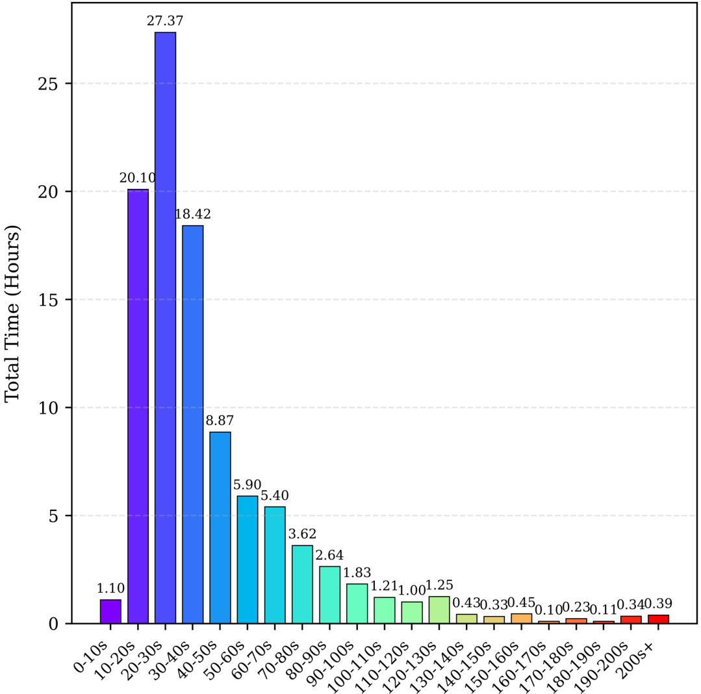

**[Image: figure_0176.png (1079x1069, 112.1KB)]**

Table 6: Coarse classes and fine-grianed genres distribution of the InfiniteDance dataset.

| Classes   | Genres              |   Duration (h) |
|-----------|---------------------|----------------|
| Ballet    | Ballet              |           8.31 |
| Modern    | Modern              |           3.77 |
| Folk      | Mix                 |           0.94 |
|           | Dai                 |           1.48 |
|           | Uygurs              |           2.48 |
|           | Mongol              |           1.34 |
|           | Korea               |           0.46 |
|           | Zang                |           0.74 |
|           | Hehai Yangge        |           0.10 |
|           | Northeastern Yangge |           0.54 |
|           | Jiaozhou Yangge     |           0.48 |
|           | Chinese             |           0.06 |
|           | Miao                |           0.02 |
| Popular   | Popular-Mix         |           5.03 |
|           | Locking             |           3.09 |
|           | Kpop                |          13.35 |
|           | HomeDance           |           6.87 |
|           | Jazz                |           7.93 |
|           | HipHop              |           9.60 |
|           | Choreography        |           6.50 |
|           | Popping-            |           0.77 |
|           | Breaking            |           0.17 |
| Classic   | Classic-Mix         |           8.93 |
|           | Dunhuang            |           1.27 |
|           | Shenyun             |           0.84 |
|           | Han-Tang            |           1.03 |
|           | Kun                 |           0.54 |
| Latin     | Latin-Mix           |           2.37 |
|           | Chacha              |           0.76 |
|           | Rumba               |           0.76 |
|           | Samba               |           0.51 |
|           | PasoDoble           |           0.21 |
|           | Jive                |           0.34 |
|           | Total Duration      |         100.69 |

Diverse Genre Coverage: Our dataset includes 6 major dance genres and over 30 fine-grained subcategories, such as Ballet, Folk (e.g., Dai, Uygurs, Mongol), Popular (e.g., K-pop, Jazz, HipHop), and Classic (e.g., Dunhuang, Shen Yun). Notably, it is the first large-scale dance dataset to feature Ballet, which is underrepresented in prior works [2, 23, 24].Addtionally,the genre taxonomy was reviewed and verified by professional dancers.

High-Quality Motion Data: Weobtained a high-quality InfiniteDance dataset through our carefully designed pipeline. After applying physical motion restoration and foot restoration, our sequences achieve lower FSR (5.09%) and Penetration (0.0559%) compared to marker-based MoCap (FineDance [23]: FSR 6.22%, Penetration 0.6954%), as detailed in Section B.3 and in the main paper. The dataset also preserves hand and facial movements, which are often omitted or poorly captured in existing datasets [23,24].

Rich and Complex Movements: The dataset not only features a wide range of popular dance styles such as choreography, jazz, and K-pop, but also includes technically demanding movements such as high leg lifts, pirouettes, floorwork, and single-leg spins, reflecting both artistic richness and technical diversity. Scale and Duration: Since the majority of the videos are sourced from mainstream short-video platforms, the genre distribution within the dataset naturally mirrors audience preferences on these platforms. Correspondingly, the clips vary in length, ranging from a minimum duration of 6 seconds to a maximum of 4 minutes, with an average duration of approximately 29 seconds.

## B. Details of FRDM

## B.1. Training Details of FRDM

We train FRDM on a high-quality dance dataset captured using an optical motion capture system. Without requiring paired motion data with artifacts, our FRDM can be trained in a self-supervised manner on the clean motion dataset. As shown in Alogrithm 1, at each training iteration, we sample x 0 from the high-quality motion dataset, and sample t ∼ Uniform (1 , · · · , T ) , ϵ ∼ N ( 0 , I ) . Then we add noise to x 0 and get x t by x t = √ ¯ α t x 0 + √ 1 -¯ α t ϵ , where ¯ α t is a noise schedule, ¯ α t → 0 when t → T . Since we only aim to fix foot-related artifacts such as foot skating and foot jitter, which are reflected in the motion of the root, knees, and feet. Therefore, we only denoise these specific parts while keeping the rest of the motion unchanged. Accordingly, we implement Merge by replacing the root, knee, and foot in x 0 with those from x t , corresponding to Line 8, Alogrithm 1, ´ x t ← Merge ( x t , x 0 ) . The we use a learnable neural network to denoise, ˆ x 0 = f θ (´ x 0 , t ) . Finally, we use MSE based losses L recon (ˆ x 0 , x 0 ) , L root (ˆ r 0 , r 0 ) to ensure that the corrected root, knee, and foot motions remain faithful to the original sequence, use foot loss L Foot (ˆ r 0 , ˆ j p 0 ) to implicitly enhance the foot stability. As shown in Equations (2) and (3) of the main paper, the foot loss L Foot is computed based on the global joint positions P , where P = Rec (ˆ r 0 , ˆ j p 0 ) . We also use

Next, we explain the computation details of Rec ( r , j p ) , r = [ ˙ r a , ˙ r x , ˙ r z , r y ] is the root data, ˙ r a is the angular velocity along the Y-axis (yaw angle), ˙ r x , ˙ r z are root linear velocities on the floor, r y is the root height. We first integrate over time to obtain [ r a , r x , r z ] . Subsequently, j p is rotated by r a around the y -axis, after which the root translation [ r a , r x , r z ] is added, resulting in P .

## B.2. Inference Details of FRDM

After training the foot denoising network, given a motion sequence x with foot artifacts, we can obtain the corrected version ˜ x . As shown in Algorithm 2, we first sample x T ∼ N ( 0 , I ) . The diffusion time step t is from T down to 1 during the denoising process. To ensure the upper body unchanged, we also get ´ x t ← Merge ( x t , x ) . Instead predict the eposion, our framework direclty predict the clean motion ˆ x 0 by the foot denoise network f θ .

## Algorithm 1 FRDM Training Algorithm

```
1: Input: Training data x 0 ∼ q ( x 0 ) , noise schedule β 1 , . . . , β T , ¯ α t = ∏ t s =1 α s , α s = 1 -β s 2: Output: Trained Foot Denoise Network f θ (´ x t , t ) 3: for Training Iterations do 4: x 0 ∼ q ( x 0 ) 5: t ∼ Uniform (1 , . . . , T ) 6: ϵ ∼ N ( 0 , I ) ▷ Diffuse x 0 to x t ; ¯ α t → 0 when t → T 7: x t = √ ¯ α t x 0 + √ 1 -¯ α t ϵ ▷ Merge means replace root, knee, and foot features in x 0 with those from x t ; 8: ´ x t ← Merge ( x t , x 0 ) 9: ˆ x 0 ← f θ (´ x t , t ) ▷ Compute losses 10: x 0 = [ r 0 , j v 0 , j p 0 , j r 0 ] 11: ˆ x 0 = [ˆ r 0 , ˆ j v 0 , ˆ j p 0 , ˆ j r 0 ] 12: L recon (ˆ x 0 , x 0 ) , L root (ˆ r 0 , r 0 ) 13: L foot (ˆ r 0 , ˆ j p 0 ) ▷ Reduce foot artifacts. 14: L vel ( ˆ j v 0 , ˆ j p 0 ) , L ϵI -rp ( ˆ j r 0 , ˆ j p 0 ) ▷ Regularize the ˆ j v 0 , ˆ j p 0 , and ˆ j r 0 to facilitate subsequent Geometric and Foot Vel Guidance in the inference phase. 15: Update f θ parameters 16: end for 17: return f θ
```

Then, we do diffusion guidance at ˆ x 0 . As illustrated in Algorithm 2, geometric guidance is applied in the early stages of denoising to ensure that the corrected motion remains geometrically consistent with the original motion. In the last stages of denoising, foot contact guidance is employed to explicitly address foot sliding artifacts.

## C. More Experiments

## C.1 RAG Module Analysis

Retrieval Sensitivity. We analyze the effect of reference quality by varying the similarity rank of retrieved dances, from Top-10 (most similar) to Top1000-1010 (least similar). As shown in Table 7, even low-similarity references consistently outperform the no-RAG baseline across all metrics, demonstrating that the model is robustly benefited by retrieved dances regardless of their exact similarity rank.

## Algorithm 2 FRDM Inference Algorithm

```
1: Input: Trained Foot Denoise Network f θ , full-body motion x with foot artifacts, hyperparameter t th . 2: Output: Restored motion ˜ x 3: Sample x T ∼ N ( 0 , I ) 4: for t ← T down to 1 do 5: ´ x t ← Merge ( x t , x ) 6: ˆ x 0 ← f θ (´ x t , t ) 7: x = [ r , j v , j p , j r ] , ˆ x 0 = [ˆ r 0 , ˆ j v 0 , ˆ j p 0 , ˆ j r 0 ] 8: w t ← t/T 9: if t ≥ t th then ▷ Geometric Guidance 10: ˜ j r 0 ← (1 -w t ) j r + w t ˆ j r 0 11: ˜ j p 0 ← (1 -w t ) j p + w t ˆ j p 0 12: ˜ j v 0 ← ˆ j v 0 13: else if t < t th then ▷ Foot Vel Guidance 14: ˜ j v 0 ← w t b ˆ j v 0 +(1 -b ) ˆ j v 0 15: ˜ j p 0 ← cumsum ( ˆ j v 0 ) 16: ˜ j r 0 ← ˆ j r 0 17: end if 18: ˜ x 0 = [ˆ r 0 , ˜ j v 0 , ˜ j p 0 , ˜ j r 0 ] 19: x t -1 ← √ ¯ α t -1 ˜ x 0 + √ 1 -¯ α t -1 x T 20: x t ← x t -1 21: end for 22: return ˜ x ← ˜ x 0
```

Table 7: Ablation on different retrieved reference similarity ranks.

| Reference Dances FID k ↓ FID m ↓ Div k ↑ BAS ↑   |   Reference Dances FID k ↓ FID m ↓ Div k ↑ BAS ↑ |   Reference Dances FID k ↓ FID m ↓ Div k ↑ BAS ↑ |   Reference Dances FID k ↓ FID m ↓ Div k ↑ BAS ↑ |   Reference Dances FID k ↓ FID m ↓ Div k ↑ BAS ↑ |
|--------------------------------------------------|--------------------------------------------------|--------------------------------------------------|--------------------------------------------------|--------------------------------------------------|
| Top-10                                           |                                            38.74 |                                            13.48 |                                             6.92 |                                           0.2340 |
| Top-100-110                                      |                                            47.16 |                                            17.34 |                                             6.56 |                                           0.2339 |
| Top-500-510                                      |                                            51.76 |                                            18.73 |                                             6.58 |                                           0.2335 |
| Top-1000-1010                                    |                                            58.97 |                                            18.92 |                                             6.39 |                                           0.2327 |
| No RAG                                           |                                            62.87 |                                           147.41 |                                             4.68 |                                           0.2269 |

Diferences between reference and generated dance. We measure featurespace distances among generated motions, retrieved references, and ground-truth (GT) motions to evaluate whether the model simply copies retrieved references. As shown in Table 8, the distance between generated and retrieved motions is substantially larger than inter-reference distances, yet generated motions remain close to the global GT distribution. This indicates that the model is influenced by retrieved choreographic priors without copying them. To further illustrate this, Fig. 7 visualizes the first three frames of a reference dance alongside the corresponding generated motion. The generated poses are visibly distinct from the reference frames, providing qualitative confirmation that the model synthesizes novel motions influenced by, but not identical to, the retrieved priors.

Table 8: Feature-space distance analysis: generated motions show influence without copying.

| Distance Type       |   Kinematic (K) |   Geometric (G) |   Joint Pos. (J) |
|---------------------|-----------------|-----------------|------------------|
| Retrieved-Retrieved |           11.67 |            7.97 |            27.39 |
| Generated-Retrieved |           23.52 |           10.11 |            43.13 |
| Generated-GT (avg.) |          297.94 |           20.87 |            57.11 |

Gt ar&amp;facts

Fig. 7: A case show the difference between reference dance and generated dance.

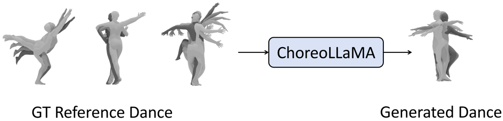

**[Image: figure_0203.png (1102x266, 78.3KB)]**

## C.2 Long-term Choreography Evaluation

We test long-sequence generation on sequences well beyond 30 seconds, observing stable FID and diversity without collapse. As shown in Table 9, ChoreoLLaMA significantly outperforms Lodge [22] in long-sequence settings, demonstrating coherent long-term choreography without quality degradation.

Table 9: Long-term choreography evaluation (sequences &gt; 30 seconds).

| Method             |   FID k ↓ |   FID m ↓ |   Div k |   ↑ Div m |   ↑ BAS ↑ |
|--------------------|-----------|-----------|---------|-----------|-----------|
| Lodge [22]         |    106.85 |     91.30 |    4.14 |      4.43 |    0.2306 |
| ChoreoLLaMA (Ours) |     39.72 |     24.45 |    6.01 |      4.38 |    0.2335 |

## C.3 Cadence-MoE Frequency Band Analysis

We study the effect of the number of frequency bands ( nbins ) used in CadenceMoE, conducting experiments on a 60% subset of the training data. As shown in Table 10, nbins = 2 outperforms nbins = 4 . As illustrated in Fig. 8, most informative motion dynamics are concentrated in the low-frequency band; overly fine-grained frequency partitioning disperses useful information and weakens cadence modeling, supporting our design choice of two frequency bands.

Per-band energy over time(mean|x|across264dims)

Fig. 8: Frequency energy distribution of reference dance motions. Most energy is concentrated in the low-frequency band, justifying the choice of nbins = 2 .

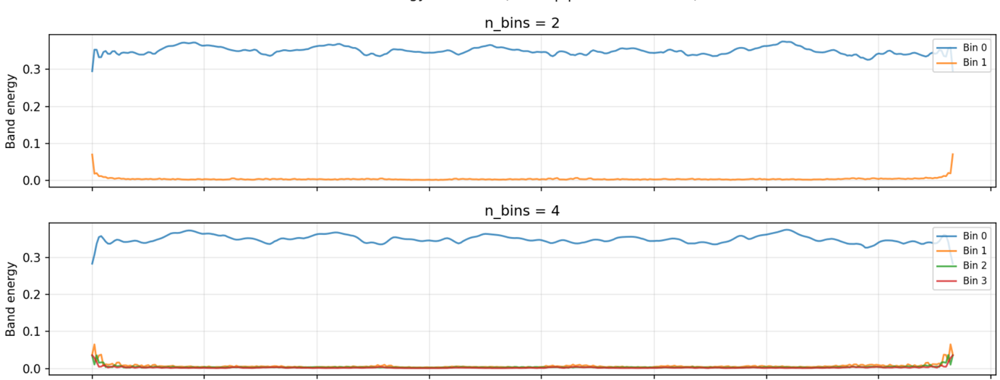

**[Image: figure_0212.png (1383x526, 96.7KB)]**

Table 10: Cadence-MoE frequency band ablation (60% training data subset).

|   nbins |   FID k ↓ |   FID m ↓ |   Div k ↑ |   Div m |   ↑ BAS ↑ |
|---------|-----------|-----------|-----------|---------|-----------|
|       2 |     43.19 |     18.38 |      9.05 |    7.03 |    0.2335 |
|       4 |    118.49 |     58.47 |     12.95 |   12.44 |    0.2375 |

## C.4 Additional Comparisons and Computational Cost

FineNet Comparison We additionally compare against FineNet [23] following the evaluation protocol in the main paper (Table 3). FineNet achieves FID k = 94.39, FSR = 13.53%, Div k = 4.42, and BAS = 0.2318, substantially lower than our ChoreoLLaMA (FID k = 32.37 , FSR = 5.33% , Div k = 7.34 , BAS = 0.2342 ).

Computational Cost Training the full ChoreoLLaMA model on 4 × A100 GPUs requires approximately 18 hours; removing RAG and MoE reduces training time to 14 hours. At inference, ChoreoLLaMA runs at 42.8 FPS on a single A100 GPU. The RAG module incurs a 34.2% overhead and the MoE module a 12.0% overhead, both manageable due to offline feature extraction and parallel retrieval.

## C.5 Addition Visualization Results

Visualization Results of Our 3D Motion Capture. We use GVHMR and SMPLest-X to reconstruct 3D full-body motion from monocular dance videos, capturing hand gestures and facial expressions. Fig. 9 shows results for diverse dances.

Fig. 9: Visualization of 3D motion capture results from monocular video using GVHMR and SMPLest-X. While this step already captures fine-grained motion details, the results still suffer from physically implausible artifacts. Therefore, we do not use these motions directly. Instead, we further refine them with a physical simulationbased correction and our Foot Restoration Diffusion Model (FRDM) to enforce accurate foot-ground contact.

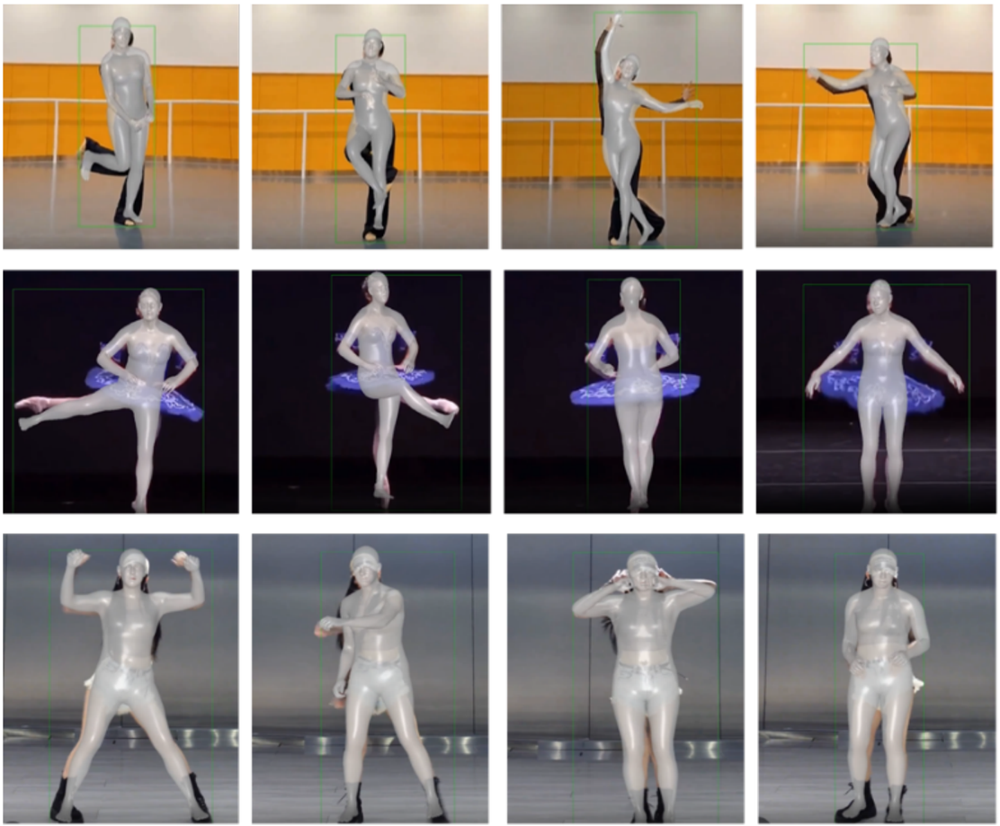

**[Image: figure_0221.png (1112x919, 672.6KB)]**

Visualization of InfiniteDance. Fig. 10 illustrates motion sequences sampled from our InfiniteDance dataset, which features high-quality motion without artifacts like foot sliding or penetration. It includes both common dance moves and challenging actions such as spins, flips, and jumps.

Fig. 10: Visualization of InfiniteDance.

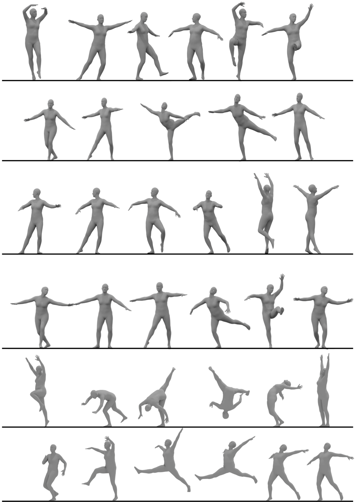

**[Image: figure_0224.png (1102x1555, 367.4KB)]**

## D. 2D Dance Video Generation

## D.1. Task

Pose-guided 2D human animation video generation has seen significant advancements, particularly with the incorporation of advanced pose estimation methods and powerful generative diffusion models. This task aims to synthesize animated video sequences utilizing a reference character image and a sequence of motion signals, which can be formulated as learning a function V 1: N = F im 2 v ( I ref , M 1: N ) , where I ref is reference image and M 1: N is motion sequence. To better support this task, our dataset provides a variety of motion signals, including dwpose, depth maps, normal maps, and dense pose. Furthermore, we expand the diversity of dance genres, which addresses a limitation of existing datasets.

## D.2. Method

We utilize the advanced video diffusion transformer model, wan2.1 [46], as the backbone for human animation. Our objective is to enable video generation models to synthesize human dance videos that retain the subject's identity and appearance while producing accurate and natural motion aligned with given signals. However, fine-tuning a pretrained model on new data often leads to overfitting and degradation of previously learned general knowledge.

To address this, we adopt the Low-Rank Adaptation (LoRA [12]) method, which introduces a small number of trainable parameters while freezing the original weights. This allows efficient adaptation to new tasks without compromising the model's generalization ability. Furthermore, we design an auxiliary motion guidance module consisting of 3D convolutional layers to extract spatiotemporal features from motion signals. These features are injected into the model by adding them to the patchified noise input, guiding the diffusion process in a motion-aware manner. In addition, we incorporate an auxiliary motion guidance module to enable the injection of motion signals. This module consists of multiple 3D convolutional layers designed to extract spatiotemporal features. The extracted features are then added to the patchified noise and subsequently fed into the baseline DiT.

## D.3. Expriments

We compare our approach against state-of-the-art pose-guided human video generation methods, including Disco [47], Moore-AnimateAnyone [13], and Champ [55]. For evaluation metrics, we evaluate image quality using L1 error, Peak Signal-to-Noise Ratio (PSNR), Structural Similarity Index Measure (SSIM), Learned Perceptual Image Patch Similarity (LPIPS), and Frechet Inception Distance (FID). In addition, video-level FID (FID-VID) and Frechet Video Distance (FVD) are employed to evaluate the quality of the generated videos.Additionally, visualization results are presented in Fig. 11.

Table 11: Quantitative comparison with SOTA methods.

| Method              |   FID ↓ |   SSIM ↑ |   PSNR |   ↑ LPIPS |   L1 ↓ |   FID-FVD |   ↓ FID ↓ |
|---------------------|---------|----------|--------|-----------|--------|-----------|-----------|
| DisCo [47]          |   57.84 |     0.51 |  10.66 |      0.47 | 2.4e-4 |     43.17 |    522.28 |
| Animate Anyone [13] |   45.90 |     0.54 |  12.82 |      0.44 | 1.5e-4 |     33.32 |    505.01 |
| Champ [55]          |   42.61 |     0.57 |  13.21 |      0.41 | 1.3e-4 |     31.27 |    447.21 |
| Ours                |   37.94 |     0.62 |  14.60 |      0.37 | 9.7e-5 |     24.34 |    405.27 |

Fig. 11: Visualization of pose-guided 2D dance generation

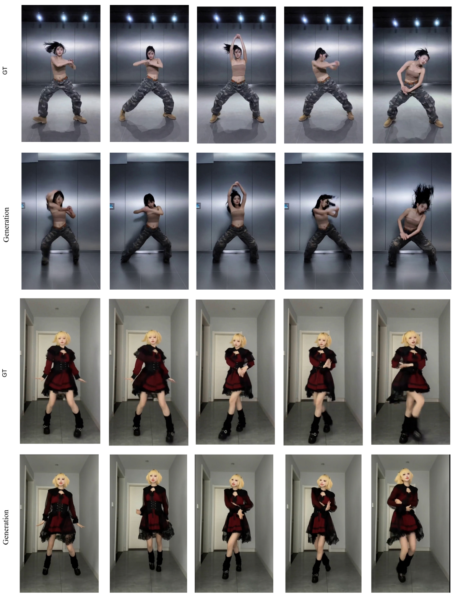

**[Image: figure_0236.png (1198x1568, 1502.4KB)]**
---

## Extracted Images

| # | File | Dimensions | Size |
|---|------|------------|------|
| 1 | figure_0005.png | 1169x615 | 365.0KB |
| 2 | figure_0038.png | 1185x347 | 183.5KB |
| 3 | figure_0045.png | 966x626 | 211.2KB |
| 4 | figure_0070.png | 962x702 | 208.1KB |
| 5 | figure_0082.png | 1317x454 | 217.8KB |
| 6 | figure_0176.png | 1079x1069 | 112.1KB |
| 7 | figure_0203.png | 1102x266 | 78.3KB |
| 8 | figure_0212.png | 1383x526 | 96.7KB |
| 9 | figure_0221.png | 1112x919 | 672.6KB |
| 10 | figure_0224.png | 1102x1555 | 367.4KB |
| 11 | figure_0236.png | 1198x1568 | 1502.4KB |
