## Listen to Rhythm, Choose Movements: Autoregressive Multimodal Dance Generation via Diffusion and Mamba with Decoupled Dance Dataset

Oran Duan ∗ Communication University of China

Beijing, China oranduan@cuc.edu.cn

## Luyang Jie †

Zhipu AI Beijing, China luyang.jie@aminer.cn Yinghua Shen Communication University of China Beijing, China shenwan@cuc.edu.cn Yaxin Liu Zhipu AI Beijing, China yaxin.liu@aminer.cn Yingzhu Lv Communication University of China Beijing, China bamboo\_lv@mails.cuc.edu.cn Qiong Wu Zhipu AI Beijing, China qiong.wu@aminer.cn

Figure 1: A conceptual overview of the proposed LRCM framework, showing the decoupling of the text modality from the Motorica Dance dataset, integrated into a multimodal autoregressive dance generation model based on the diffusion structure.

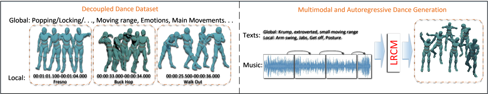

**[Image: figure_0005.png (2013x391, 455.9KB)]**

## Abstract

Advances in generative models and sequence learning have greatly promoted research in dance motion generation, yet current methods still suffer from coarse semantic control and poor coherence in long sequences. In this work, we present Listen to Rhythm, Choose Movements (LRCM), a multimodal-guided diffusion framework supporting both diverse input modalities and autoregressive dance motion generation. We explore a feature-decoupling paradigm for dance datasets and generalize it to the Motorica Dance dataset, separating motion capture data, audio rhythm, and professionally annotated global and local text descriptions. Our diffusion architecture integrates an audio-latent Conformer and a text-latent Cross-Conformer, and incorporates a Motion Temporal Mamba Module (MTMM) to enable smooth, long-duration autoregressive synthesis. Experimental results indicate that LRCM delivers strong performance in both functional capability and quantitative metrics, demonstrating notable potential in multimodal input scenarios and extended-sequence generation. The project page is available at https://oranduanstudy.github.io/LRCM/.

## CCS Concepts

- General and reference → General literature ; · Human-centered computing → Human computer interaction (HCI) .

∗ Work was done when interned at Zhipu AI.

† Corresponding author.

## Keywords

Dance Motion Generation, Multimodal Diffusion, Semantic Decoupling, Conformer, Cross-Conformer, Mamba, Autoregressive Sequence Modeling

## 1 Introduction

The task of dance motion generation aims to automatically produce sequences of dance movements that are highly synchronized with a given music track. Such generation requires precise alignment across rhythm, melody, and stylistic dimensions, while ensuring that the dynamical visual expression and emotional intent are deeply integrated with the music content [47]. Generative models have achieved remarkable advances in various domainsincluding image synthesis, text generation, speech synthesis, and video generation-and have also demonstrated strong potential in motion synthesis and other sequence generation tasks. By analyzing key features from the musical signal, such as beats, intensity, and tonality, a generative motion model should effectively produce spatial-temporal movement trajectories and amplitudes that accurately align the dancer's motion with musical variations.

With the evolution of generative architectures, the field of motion generation has gradually shifted towards higher-capacity models capable of richer expressiveness. Recent methods such as Variational Autoencoders (VAE) [4] and Vector Quantized VAE (VQVAE) [30] have become hotspots in the domain. While VAEs model the probabilistic distribution of the latent space to explore motion diversity, VQ-VAEs further employ a discrete codebook to enhance structural representation. Meanwhile, Diffusion Models (DM) [6] and Latent Diffusion Models (LDM) [31] have emerged as powerful generative frameworks for high-dimensional motion data, introducing iterative denoising and fine-grained sampling to approach real data distributions closely. These models significantly improve motion fidelity and structural detail, and effectively capture complex spatio-temporal dependencies of human movement.

However, the continued development of generative models poses new challenges, especially with the diversification and expansion of datasets. In dance generation tasks, semantic information has evolved from unimodal input to complex multimodal systems integrating text, audio, music, and contextual scene data. Early studies often relied on simple mappings between a single modality and motion (e.g., text-to-motion or audio-to-motion), whereas modern applications demand integration of rich multimodal semantics. This trend, together with the rise of large models, underscores the cross-disciplinary need for unified, generalizable motion generation models. Moreover, the introduction of multiple modalities imposes substantial challenges in efficiency, scalability, and precision-especially for deployment under regular hardware constraints. Furthermore, long-sequence generation remains difficult to reconcile between fidelity and efficiency. Breakthroughs in long-sequence modeling in computer vision and NLP motivate opportunities to adapt these advances for dance generation, potentially enabling higher-quality and more practical applications.

Motivated by these gaps, we focus on key research problems in dance generation and introduce a novel framework leveraging the Motorica Dance motion capture dataset. Our contributions include:

- Decoupled Multimodal Dance Dataset Paradigm: We propose a fine-grained semantic decoupling paradigm for multimodal dance datasets, which formalizes the separation of dance motion, audio rhythm, and professionally annotated textual descriptions into hierarchical global style and local movement levels. This paradigm is instantiated and validated on the Motorica Dance dataset, enabling systematic representation of multimodal dance data and supporting subsequent experiments on text-guided motion generation.
- Heterogeneous Multimodal-Guided Diffusion Architecture: We design a diffusion-based framework that asymmetrically fuses audio and text modalities. Audio-latent conformers are employed to capture persistent rhythmic cues, while text-latent cross-conformers incorporate finegrained semantics from global and local textual inputs. A jerk-based loss function is introduced to jointly maintain rhythmic smoothness and semantic consistency.
- State Space Model-based Autoregressive Temporal Module: We explore an autoregressive extension of the diffusion framework for long-sequence generation by integrating the Motion Temporal Mamba Module (MTMM), built upon state space modeling principles. This component is designed to efficiently capture long-range motion dependencies, supporting experiments on generation diversity and temporal continuity in extended dance sequences.

We term our complete pipeline the Listen to Rhythm, Choose Movements ( LRCM ) framework, a multimodal dance generation paradigm that combines audio rhythm and textual semantics in a dual-conditioning scheme. Designed to provide fine-grained and context-aware control over motion synthesis across both short and long time scales, LRCM integrates feature-decoupled dataset representations with a heterogeneous diffusion architecture and autoregressive temporal modeling. An overview of its components and workflow is illustrated in Figure 1.

## 2 Related Work

## 2.1 Motion Representation and Datasets

Humanmotiondataiscommonlyrepresented as temporal sequences of body poses. Existing research generally adopts either keypointbased representations or rotation-based formats [26, 42]. More recent studies explore statistical mesh models [46] for increased accuracy, with the Skinned Multi-Person Linear Model (SMPL) [25] being a representative approach for modeling body shapes and surface features.

Datasets for motion generation and dance synthesis have diversified over time. For general human motion generation tasks, core datasets such as HumanML3D [13] and KIT [29] use structured, detailed textual labels to annotate human motion clips. In contrast, dance motion datasets emphasize musical and artistic characteristics. Representative examples include AIST++ [18], FineDance [20], and MotoricaDance [36], whose primary annotations consist of music segments with corresponding dance motion sequences. Compared to general motion datasets, textual descriptions in dance datasets are typically coarse, often reduced to style tags or simple notes about music attributes, lacking systematic, fine-grained linguistic representations. This limitation poses challenges for textdriven dance modeling and multimodal fusion requiring precise semantic control.

## 2.2 3D Motion Generation

Single-modality motion-driven algorithms have matured considerably, particularly within architectures built upon Variational Autoencoders (VAEs) and Diffusion Models. In the VAE-based generation domain, for example, T2M-GPT [43] combines a pretrained GPT for text-driven motion synthesis. Similarly, Momask [12] employs residual VQ-VAE to enhance text-to-motion generation, while Bailando [21] extends the VQ-VAE approach for music-to-dance mapping. In parallel, diffusion-based motion generation has experienced rapid growth and has been widely adopted for both general motion and dance tasks. Notably, MDM [34] is among the first to apply diffusion models to motion data. Building upon this, EDGE [35] designs an editable diffusion framework for dance synthesis. Lodge [19] advances the field by applying multi-level granularity control for both coarse- and fine-style dance actions, and LGTM [32] integrates CLIP with diffusion to support multigranularity text-motion fusion.

When moving toward multimodal and hierarchical conditioning for dance generation, several works have explored combining diverse modalities. TM2D [10], for example, achieves preliminary fusion between dance-text and music-motion information. LM2D [41] further incorporates both lyrics and music for joint conditioning, while Beat-It [15] focuses specifically on the influence of drum beats and rhythm in motion generation. In addition, LMM [44] explores multi-dataset integration to support multi-task dance generation, and GCDance [24] investigates using category-based music input for motion editing. Despite these advancements, achieving deep and efficient alignment across modalities remains a core challenge for the field.

## 2.3 Long-Sequence Modeling Tasks

Long-sequence modeling has gained significant attention in recent deep learning research. Early methods include Recurrent Neural Networks (RNNs) [23] and Long Short-Term Memory (LSTMs) [22], which can capture temporal dependencies across frames but suffer from gradient vanishing and difficulty in handling extended sequences. For example, JL2P [1] introduced a gated recurrent unit (GRU) text encoder to align language and motion features; Ma et al. [27] trained a hybrid-density LSTM on modern dance motion-capture data; while Nelson Yalta et al. [38] explored weaklysupervised real-time dance generation using hybrid-LSTM architectures. Transformer-based methods [37] introduced self-attention to capture global dependencies, leading to breakthroughs in NLP and CV, and gaining popularity in dance generation. However, the quadratic complexity of self-attention limits scalability, making long-sequence training and inference costly.

Recently, Mamba [11] has emerged as an efficient state space model (SSM) architecture with linear complexity and hardwarefriendly design, ideal for long-sequence tasks. MotionMamba [45] pioneered applying Mamba to motion generation, enabling longspan dance synthesis; MatchDance [39] achieved SOTA results on FineDance by proposing a Mamba-Transformer hybrid; MambaDance [28] replaced self-attention entirely with Mamba for highprecision music-dance synchronization; MEGADance [40] introduced Mixture-of-Experts (MoE) mechanisms to improve style continuity and beat alignment. Additionally, architectures like TTT [33] further expand design choices for sequence modeling, with hybrid innovations steadily advancing controllable long-sequence motion synthesis.

## 3 Method

## 3.1 Preliminary

Conditional Diffusion Models. The primary objective of our neural network is to train a denoising diffusion generative model. Given a music waveform and a textual description, we encode them into conditional embedding vectors 𝑐 𝑎 and 𝑐 𝑡 . These embeddings are injected into the diffusion network to generate a latent motion sequence 𝑥 1: 𝑇 ∈ R 𝐵 × 𝐿 × 𝐽 , which is subsequently decoded by a motion decoder into a dance motion sequence usable in deployment scenarios.

Let 𝑥 follow an unknown density distribution 𝑞 ( 𝑥 ) . To construct the diffusion model of 𝑥 , we first define a diffusion process as a Markov chain 𝑞 ( 𝑥 𝑛 | 𝑥 𝑛 -1 ) for 𝑛 ∈ { 1 , . . . , 𝑁 } . During training, Gaussian noise is progressively added to the observation 𝑥 0 ( 𝑛 = 0) until it is fully destroyed, so that 𝑞 ( 𝑥 𝑛 | 𝑥 0 ) follows a standard normal distribution. The idea is to train a network to invert the 𝑞 process, reversing the diffusion steps to recover an observation from noise. This produces the reverse (denoising) process 𝑝 . Assuming the noise at each step is zero-mean Gaussian, we have:

<!-- formula-not-decoded -->

,

,

Here, N(· ; 𝜇, Σ ) denotes a multivariate Gaussian distribution at 𝑥 𝑛 with mean 𝜇 = 𝛼 𝑛 𝑥 𝑛 -1 and covariance matrix Σ = 𝛽 𝑛 𝐼 . By setting 𝛼 𝑛 = √︁ 1 -𝛽 𝑛 , the set { 𝛽 𝑛 } 𝑁 𝑛 = 1 fully specifies the diffusion process [14]. If the noise magnitude at step 𝑛 is small relative to 𝑥 𝑛 , the reverse distribution can also be approximated by a Gaussian [3]. This Gaussian approximation can be written as:

<!-- formula-not-decoded -->

<!-- formula-not-decoded -->

Training proceeds via score matching, similar to energy-based models. The loss function can be expressed as:

<!-- formula-not-decoded -->

Here, 𝑥 0 is uniformly sampled from the training set D , 𝑛 ∈ { 1 , . . . , 𝑁 } , and 𝜖 ∼ N( 0 , 𝐼 ) . ˆ 𝜖 ( 𝑥, 𝑛 ) denotes the network's prediction of the noise added to 𝑥 0. f 𝛼 𝑛 and e 𝛽 𝑛 are constants determined by { 𝛽 𝑛 } , and 𝜅 𝑛 is a weight (often set to 1 for better subjective performance). A secondary term -log 𝑝 ( 𝑥 0 | 𝑥 1 ) , based on negative log-likelihood, is also included.

For multi-conditional inputs (e.g., audio and text), the task becomes training a conditional diffusion model ˆ 𝜖 ( 𝑥 ; 𝑐 𝑎 , 𝑐 𝑡 ; 𝑛 ) . The relative influence of each condition is controlled via guided diffusion [7], which modifies the reverse process as:

<!-- formula-not-decoded -->

where 𝛾, 𝛿 &gt; 0 are scaling coefficients for conditional strength.

Mamba and State Space Models (SSMs). For long-sequence modeling, state space models (SSMs)-especially recent developments like S4 and Mamba- have proven effective [11]. These models process a one-dimensional input sequence 𝑥 ( 𝑡 ) ∈ R into an output 𝑦 ( 𝑡 ) ∈ R via a hidden state ℎ ( 𝑡 ) ∈ R 𝑁 . They define trainable evolution parameters 𝐴 ∈ R 𝑁 × 𝑁 , input projection 𝐵 ∈ R 𝑁 × 1 , and output projection 𝐶 ∈ R 1 × 𝑁 . The continuous-time dynamics are:

<!-- formula-not-decoded -->

<!-- formula-not-decoded -->

To enable practical computation, S4 and Mamba discretize these state space equations. Given discretization functions 𝑓 𝐴 ( Δ , 𝐴 ) and 𝑓 𝐵 ( Δ , 𝐴, 𝐵 ) , a common choice is zero-order hold (ZOH), yielding:

<!-- formula-not-decoded -->

After discretization ( Δ , 𝐴, 𝐵, 𝐶 ) ↦→ ( 𝐴, 𝐵,𝐶 ) , the model becomes:

<!-- formula-not-decoded -->

<!-- formula-not-decoded -->

For efficient output computation, a structured 1D convolution kernel 𝐾 is precomputed:

<!-- formula-not-decoded -->

<!-- formula-not-decoded -->

The Mamba model incorporates hardware-aware parallel scanning algorithms, integrating the selective SSM into an end-to-end neural network, and thus enabling efficient, scalable long-sequence modeling.

,

,

## 3.2 Decoupled Dance Dataset Paradigm

The spatiotemporal interaction between dance and music forms a fundamental basis for research in dance generation. Text, as another critical modality, is often overlooked in existing tasks. From the perspective of cross-modal semantic association, dance-related textual descriptions not only convey artistic style and motion semantics, but also provide high-level semantic cues that purely motion and audio signals cannot capture [5, 16, 17]. These textual annotations, when integrated with other modalities, enable more precise semantic conditioning and richer generative control.

Motivated by the need for systematic handling of multimodal data, we introduce a feature-decoupling paradigm for dance datasets. This paradigm formalizes the separation of motion capture sequences 𝐴 , audio signals 𝑆 , and textual descriptions obtained via professional dance artistry annotation, ensuring that each modality is independently modeled while preserving semantic consistency across modalities. The decoupling process treats these components as carriers of complementary motion semantics and organizes them into a structured, interpretable format suitable for downstream generative modeling.

Figure 2: Example of decoupled textual modality annotations within the proposed paradigm.

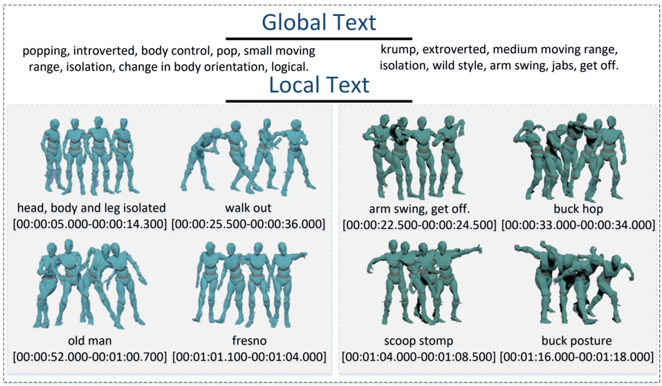

**[Image: figure_0067.png (957x558, 401.7KB)]**

From a dataset engineering standpoint, the paradigm employs motion feature modeling 𝑓 𝑚𝑜𝑡𝑖𝑜𝑛 and audio feature modeling 𝑓 𝑎𝑢𝑑𝑖𝑜 to generate representation vectors from raw motion and audio inputs:

<!-- formula-not-decoded -->

Furthermore, an engineered artistic decoupling method extracts professional textual features from the motion data:

<!-- formula-not-decoded -->

Finally, the multimodal decoupling paradigm represents each sample in a fully structured three-modality form:

<!-- formula-not-decoded -->

Wegeneralize this paradigm to the Motorica Dance dataset , applying the same decoupling process to produce motion-audio-text triples. To ensure annotation quality, seven professional street dancers contributed to the textual labeling. Annotations were organized into two levels: global labels , providing coarse-grained descriptions of dance category, spatial displacement range, artistic style, and core movements; and local labels , capturing fine-grained characteristics and variations of specific movements over time. This hierarchical design supports comprehensive separation of rhythm, motion, and semantics, providing fine-grained conditional control for subsequent multimodal and autoregressive generative tasks.

An example of the decoupled textual annotation, adhering to the proposed paradigm, is shown in Figure 2.

## 3.3 Main Model Architecture

Multimodal-guided dance generation. Given a set of multimodal audio embeddings 𝐶 𝑎 ∈ R 𝑇 seq × 𝐷 𝑎 and text embeddings 𝐶 𝑡 ∈ R 𝑇 seq × 𝐷 𝑡 , our goal is to train a dance-generation diffusion model such that, for noise steps 𝑡 ∈ [ 0 , timesteps ] , the network minimizes the distance between the predicted noise and true Gaussian noise on the conditioned input features.

After multi-step denoising, the model outputs motion representation 𝑃 ∈ R 𝑇 seq × 𝐷 𝑝 . The motion representation is encoded using exponent-map-based pose encoding, while audio representations are obtained via the librosa high-level semantic audio processing library.

Here, 𝑇 seq denotes the sequence length, 𝐷 𝑎 = 3 and 𝐷 𝑝 = 61 are the respective feature dimensions. Text features are embedded into the denoising network using a pretrained CLIP encoder (ViT-B/32), with dimension 𝐷 𝑡 = 512. Throughout the network, encoder-decoder components use frozen pretrained weights.

As shown in Figure 3, our primary network architecture is inspired by the single-modality diffusion model of LDA [2], which uses DiT with skip connections and stacked residual layers. It operates in a parallel, non-causal manner, allowing non-causal convolution when generating dance from a music segment.

For text inputs, we finetune a GLM-4-FLASH pretrained large language model [9] to refine user-provided non-professional dance descriptions into standardized textual prompts usable by the network. Texts are further separated into global and local descriptions. More details on text processing are provided in Appendix A

Core Diffusion Model and Loss Functions. The main diffusion model is composed of stacked denoising residual blocks. As shown in Figure 4, each residual block contains an audio-latent Conformer, a text-latent cross-Conformer, and a motion-temporal Mamba module (explained in Section 3.4).

Audio features are injected in a manner similar to the original backbone: after feature projection, they are linearly added to the latent noise sequence 𝑋 𝑛 representing motion poses. In the first audio-latent Conformer, the latents are enhanced via 1D convolution, processed by multi-head self-attention (MHSA), and then passed through residual and layer normalization (LN). This can be expressed as:

<!-- formula-not-decoded -->

Here, MHSA denotes multi-head self-attention, LN denotes layer normalization, and 𝑥 𝑎 is the latent output from the audio-latent Conformer block.

Text, as the second cross-modal embedding, is introduced using a different scheme from audio, because we consider music to be the dominant modality driving dance generation, while text provides semantic content to structure dance movement.

,

,

Figure 3: Overview of the proposed architecture. The main generation model is constructed using a DiT backbone. Text inputs are first processed through a fine-tuned LLM performing semantic tokenization, standardizing informal or non-standard prompts; the resulting tokens are then passed to a CLIP-based text encoder. Audio features are extracted via a high-level semantic encoder. The model stacks 𝑁 denoising residual blocks with residual and skip connections to integrate the encoded audio and text features for dance motion generation.

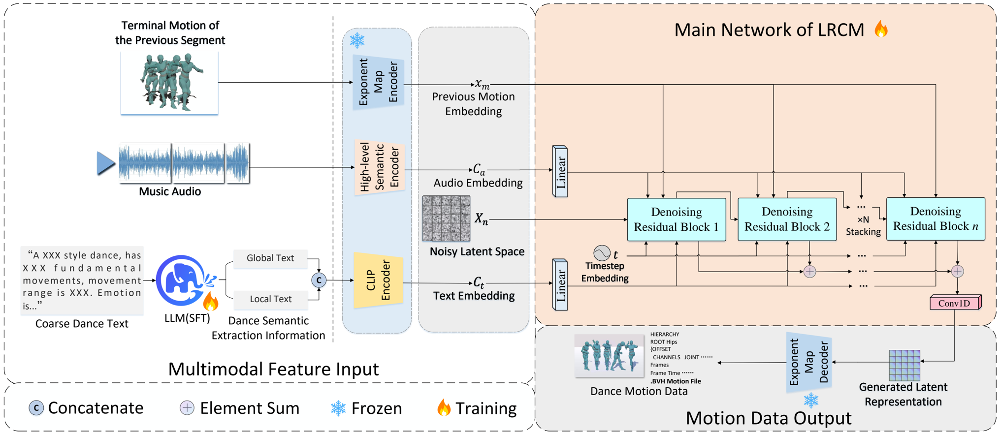

**[Image: figure_0090.png (2031x880, 484.6KB)]**

We design a text-latent cross-Conformer module: the input consists of global and local text embeddings, which are downsampled via bottleneck networks, activated, concatenated, and projected into a joint text feature 𝐶 𝑡 . After 1D convolution enhancement, 𝐶 𝑡 is projected into Key and Value matrices, while 𝑥 𝑎 from the audio module (also Conv1D-enhanced) serves as the Query. Multihead cross-attention (MHCA) is then applied, followed by residual connection and layer normalization:

<!-- formula-not-decoded -->

WeemployaGatedTanhUnit(GTU)astheactivation post-processing step. The latents are expanded in dimension, split into gating ℎ 𝑔 and filtering ℎ 𝑓 components, and activated via tanh (·) and 𝜎 (·) :

<!-- formula-not-decoded -->

<!-- formula-not-decoded -->

Here, ℎ skip denotes the latent skip connection to be linearly added in later stages, Split (·) indicates tensor splitting, Expand (·) indicates dimensional expansion, and 𝑋 𝑛 ′ is the latent input to the next residual block. In the non-autoregressive framework, 𝑋 𝑛 ′ can be directly passed to the next denoising block.

Motion Reconstruction Losses. To encourage accurate reconstruction of temporal motion dynamics, we design three derivative-based loss components: velocity, acceleration, and jerk. All derivatives are normalized by their respective L2 norms (with a small constant 𝜀 &gt; 0 added to ensure numerical stability) to focus on the variation pattern rather than magnitude.

The generic form of the motion derivative loss is:

<!-- formula-not-decoded -->

Here 𝑞 pred and 𝑞 gt denote the predicted and ground-truth derivative vectors, 𝑞 indexes over first-order ( velocity ), second-order ( acceleration ), and third-order ( jerk ) derivatives, and 𝐷 𝑝 is the pose feature dimension. The total training objective is defined as:

<!-- formula-not-decoded -->

## 3.4 Motion Temporal Mamba Module

From NAR to AR. Diffusion-based dance generation models are typically non-autoregressive, making it difficult to generate long dance sequences efficiently and maintain temporal coherence. Extending to long-sequence or full-audio inference significantly increases computational cost and reduces output quality. The Motion Temporal Mamba Module (MTMM) addresses this by incorporating autoregressive temporal context into the diffusion process. It leverages the Mamba state-space architecture to model long-range motion dependencies efficiently.

As shown in Figure 5, latent features from the previous segment (motion memory) are concatenated with the current segment's latents, followed by positional encoding. A bidirectional Mamba scan-consisting of forward and reversed sequence passes-processes this combined sequence. The output from both scans is merged, normalized, and split to yield the latent representation for the current motion segment, which is fed into the next generation step.

,

,

Figure 4: Internal structure of the denoising residual block. Each block stacks 𝐿 computation layers following the Conformer architecture, applying audio-specific and text-specific processing respectively. Two conditional embedding modes are employed: Self-Attention for intra-modal feature refinement, and Cross-Attention for cross-modal integration. A Motion Temporal Mamba module is appended after the attention layers to capture long-range temporal dependencies.

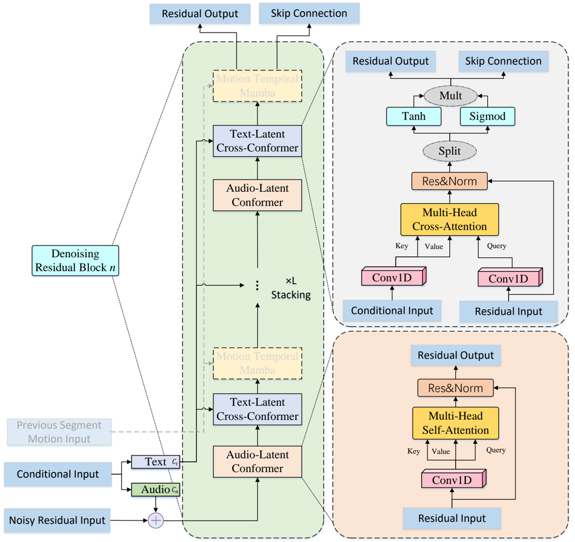

**[Image: figure_0108.png (970x915, 244.4KB)]**

This design enables smooth temporal transitions and coherent longduration dance synthesis.

Given the latent motion sequence for the current segment 𝑋 𝑛 ′ ∈ R 𝑇 seq × 𝐷 𝑝 (which is produced by the dual-layer Conformer integrating text and audio inside the previous denoising block) and the motion memory from the tail of the preceding segment 𝑥 𝑚 ∈ R 𝑇 𝑚 × 𝐷 𝑝 (where 𝑇 𝑚 denotes the number of tail frames), our autoregressive diffusion model aims to guide the generation of the next motion segment via temporal features from the previous segment.

Both 𝑥 𝑚 and 𝑋 𝑛 ′ are processed in a front-end layer implemented as Conv1D-based MLPs to project features into a common dimension 𝐶 𝑚 . They are then concatenated along the temporal dimension, and positional encoding 𝑃𝐸 ∈ R ( 𝑇 𝑚 + 𝑇 seq ) × 𝐶 𝑚 is added to form the input 𝑥 pos for the bidirectional Mamba scan:

<!-- formula-not-decoded -->

The MTMM performs a bidirectional scan: a forward SSM pass M 𝑓 (·) on 𝑥 pos and a backward SSM pass M 𝑏 (·) after sequence reversal. The backward output is then re-reversed and added elementwise to the forward result:

<!-- formula-not-decoded -->

The combined features 𝑥 mem are normalized and split along the temporal axis into 𝑥 ℎ (current motion features) and the preceding segment's portion. Residual connections and layer normalization are applied:

<!-- formula-not-decoded -->

<!-- formula-not-decoded -->

Following the structure in Section 3.3, 𝑥 res ′ is split into gated and filtered components ℎ 𝑔 ′ and ℎ 𝑓 ′ , activated via tanh (·) and 𝜎 (·) , and fused via a linear projection 𝑓 𝛿 (·) :

<!-- formula-not-decoded -->

<!-- formula-not-decoded -->

Here, 𝑋 𝑛 -1 is the processed latent motion for the next denoising step, and ℎ skip is passed through skip connections.

Training Strategy. For the multi-input autoregressive dance generation task, we adopt a three-phase training strategy (visualized in Figure 6):

- Phase 1 : Train the non-autoregressive backbone using only global text embeddings and audio embeddings. A relatively high learning rate is used to strengthen global text guidance for overall motion generation.
- Phase 2 : Fine-tune with both global and local text inputs alongside audio, lowering the learning rate to improve alignment between fine-grained textual descriptions and motion details.
- Phase3 : Enable the Motion Temporal Mamba Module (MTMM) while freezing prior audio-text fusion layers, focusing on temporal continuity and coherence in long-sequence dance synthesis.

## 4 Experience

## 4.1 Experimental Setup

Dataset. All experiments are conducted using the decoupled multimodal dance dataset constructed in Section 3. This dataset focuses on street dance styles and contains high-quality motion capture data, synchronized audio, and global/local textual annotations labeled by professional dancers. As summarized in Table 1, the extended Motorica Dance dataset exhibits a unique advantage in the richness of textual annotations, particularly in the number of local text segments. Detailed token statistics for each genre are provided in the Appendix B. For the scope of this work, we only perform decoupling and generalization on the Motorica Dance dataset. The dataset is split into dance clips, ensuring that no single clip appears in both the training and testing sets. This separation enables a reliable evaluation of the model's generalization capability.

Table 1: Statistics of the decoupled multimodal dance dataset.

| Genre      | Full Time   |   Global Tokens |   Local Tokens |   All Tokens |
|------------|-------------|-----------------|----------------|--------------|
| Hiphop     | 84 mins     |             233 |            629 |          862 |
| Krumping   | 18 mins     |              62 |            437 |          499 |
| Popping    | 42 mins     |             124 |            528 |          652 |
| Locking    | 18 mins     |              40 |            154 |          194 |
| Jazz       | 52 mins     |              89 |            345 |          434 |
| Charleston | 50 mins     |             134 |            465 |          599 |
| Tapping    | 11 mins     |              27 |             45 |           72 |

,

,

Figure 5: Motion Temporal Mamba Module (MTMM) architecture and process. Latent features from past motion memory and current motion are concatenated along the temporal axis, enriched with positional encoding, and processed by a bidirectional Mamba scan. The output is split to obtain the current segment's latent motion features for subsequent generation.

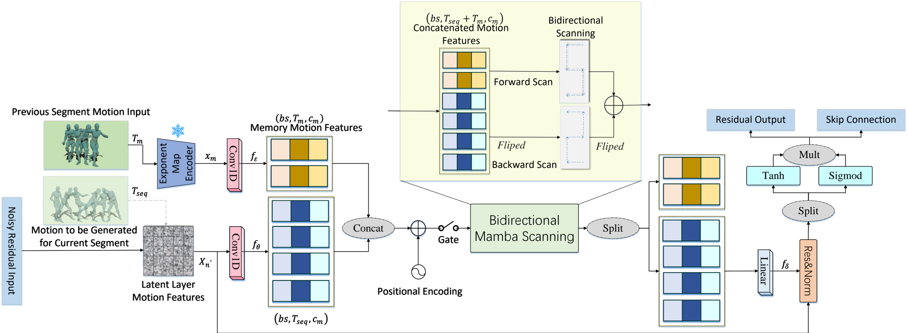

**[Image: figure_0134.png (2022x743, 354.8KB)]**

Figure 6: Full LRCM model training strategy showing threephase workflow and module freezing schedule.

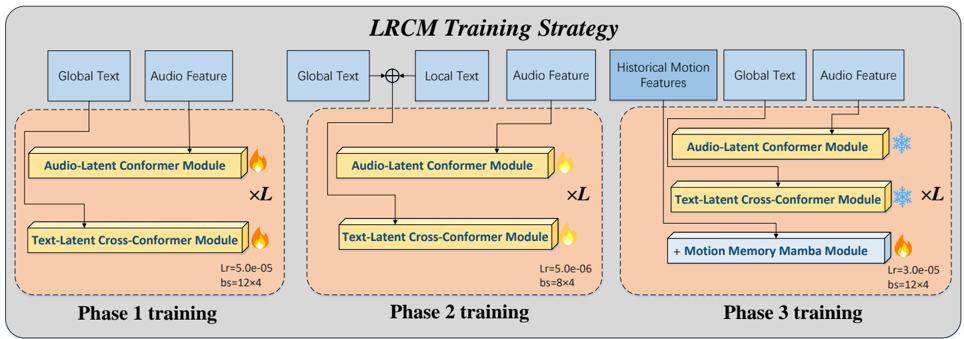

**[Image: figure_0136.png (964x339, 118.6KB)]**

Evaluation Metrics. We assess generated dance quality using: FID (FID 𝑘 : skeleton kinematics, FID 𝑔 : geometric features), Rhythm Alignment (Beat Alignment Score, BAS), Diversity (mean pairwise Euclidean distance, DIV 𝑘 : skeleton kinematics, DIV 𝑔 : geometric features), and an improved Freezing Analysis with Adaptive PFF (PFF), Rhythmic Score (RS), and Length Regularity (LR). Formal definitions are given in the Appendix C.

Implementation Details. Our PyTorch model is trained on 4 × RTX 4090 (24 GB), using the diffusers DDPM sampler (200 steps, 20 residual blocks). Phase 1: global text + audio, LR=5 . 0 × 10 -5 , bs=12, 100h. Phase 2: add local text, LR=5 . 0 × 10 -6 , bs=8, 5h. Phase 3: enable MTMM, freeze fusion layers, LR=3 . 0 × 10 -5 , bs=12, ∼ 20h. Optimizer: Adam, weight decay=1 . 0 × 10 -4 . 0.05 probability Gaussian noise injection per input modality improves robustness. Final model size: ∼ 316M parameters.

## 4.2 Quantitative Results

Comparison Models. We compare our method against several mainstream architectures: VQ-VAE-based models ( TM2D [10]), Danceba [8]), diffusion-based models ( GCDance [24]), Lodge [19]), and the baseline LDA [2]. All baselines are trained using the proposed decoupled dance dataset format.

The test set includes six full-length music tracks, covering all dance genres in Motorica Dance, with an average track length of approximately three minutes. Some baseline models only support genre-level input, which is encoded as a one-hot vector, and cannot process full textual descriptions. During evaluation, these models are trained and tested with genre one-hot input, while our model uses complete text prompts. Due to hardware constraints on RTX 4090 GPUs, most comparable models cannot support fulllength inference without running out of memory. We therefore perform long-sequence evaluation by segmenting the tracks and stitching results. A summary of supported functionalities for each model is shown in Table 2.

Table 2: Model capability comparison.

| Method   | Venue   | Audio   | Text   | Long Audio   | Memory Autoreg.   |
|----------|---------|---------|--------|--------------|-------------------|
| GCDance  | Arxiv25 | ✓       | -      | -            | -                 |
| Danceba  | ICCV25  | ✓       | -      | -            | -                 |
| Lodge    | CVPR24  | ✓       | -      | ✓            | -                 |
| TM2D     | ICCV23  | ✓       | ✓      | -            | -                 |
| LDA      | SIG23   | ✓       | -      | -            | -                 |
| Ours     | -       | ✓       | ✓      | ✓            | ✓                 |

Objective Metric Comparison. We compare our method against state-of-the-art dance motion generation models on the decoupled dataset using standard quantitative metrics (Table 3). Our method achieves lowest FID scores for both kinematic (FID 𝑘 ) and geometric (FID 𝑔 ) motion quality, outperforming all prior works by over 35% relative improvement. Compared to the baseline LDA, our method yields 7 . 5% and 10 . 8% improvements on FID 𝑘 and FID 𝑔 respectively.

In motion diversity, our approach records the highest scores in both kinematic and geometric diversity, exceeding all competitors by more than 42%. Unlike category label encoding, full textual descriptions do not impose overly strict constraints on the diversity of generated dances, allowing the model to produce a broader range

,

,

of motion styles while maintaining high quality. This flexibility yields a slight advantage over the ground truth (GT) data in diversity metrics. For Beat Alignment Score (BAS), Lodge attains the top result, surpassing ours by a small margin ( + 2 . 2%), while our method ranks second ahead of the baseline.

Overall, the results indicate that our framework delivers superior motion quality and diversity, while maintaining competitive rhythm alignment performance in long-sequence synthesis.

Table 3: Comparison with state-of-the-art methods on the decoupled dataset. GT denotes ground truth. Bold indicates best, underlined second-best. ↓ : lower is better, ↑ : higher is better.

| Method   | FID 𝑘 ↓   | FID 𝑔 ↓   |   DIV 𝑘 ↑ |   DIV 𝑔 ↑ |   BAS ↑ |
|----------|-----------|-----------|-----------|-----------|---------|
| GT       | -         | -         |     62.47 |     85.70 |  0.2941 |
| TM2D     | 1445.59   | 8708.70   |     36.97 |     15.62 |  0.1041 |
| Lodge    | 346.31    | 9169.34   |     45.36 |     23.26 |  0.2898 |
| Danceba  | 2339.61   | 9789.57   |      2.11 |      0.97 |  0.2574 |
| GCDance  | 906.04    | 9949.49   |     30.52 |     14.29 |  0.2187 |
| LDA      | 275.57    | 3556.10   |     61.63 |     70.65 |  0.2710 |
| Ours     | 256.42    | 3208.32   |     87.83 |     86.38 |  0.2835 |

Freezing and User Study Results. To evaluate whether generated motions exhibit unintended freezing, we use a motion freezing rate metric. Results are shown in Table 4.

From a numerical perspective, the ground truth is not necessarily the optimal score for freezing proportion; we evaluate each algorithm by its proximity to GT values. Our framework surpasses the baseline LDA and all other methods in Adaptive PFF , achieving the closest score to GT. For Rhythmic Score (RS), our method ties with LDA for first place, and ranks second for Length Regularity (LR). Overall, our generated motions maintain freezing statistics closest to the GT distribution.

Appropriate freezing at certain beats is desirable in dance generation. Although some algorithms have lower numerical freezing rates, they may still exhibit freezing subjectively; this will be further addressed in Section 4.3 with qualitative frame-by-frame analysis.

Table 4: Freezing rate and user study results. Bold: best, Underlined: second-best. Values indicate deviation from GT ( +/-higher/lower than GT).

| Method   |   PFF ( Δ ) |   RS ( Δ ) |   LR ( Δ ) |
|----------|-------------|------------|------------|
| GT       |      0.0748 |     0.9875 |     0.0768 |
| TM2D     |     +0.0596 |    -0.0390 |    -0.0259 |
| Lodge    |     -0.0335 |    +0.0018 |    +0.2654 |
| Danceba  |     -0.0706 |    +0.0039 |    +0.7181 |
| GCDance  |     -0.0534 |    -0.0041 |    +0.4105 |
| LDA      |     +0.0248 |    +0.0005 |    -0.0135 |
| Ours     |     +0.0143 |    -0.0005 |    +0.0244 |

Figure 7: Qualitative comparison of generated results across methods. Red boxes: abnormal overall motion; blue boxes: abnormal local motion.

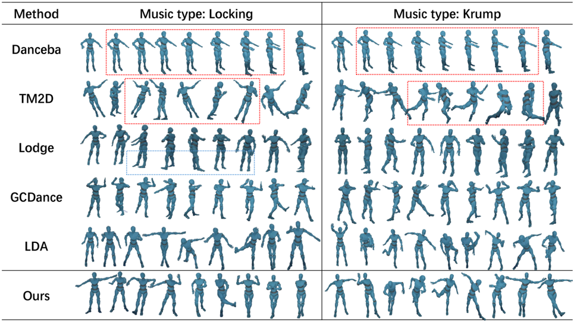

**[Image: figure_0158.png (965x542, 373.5KB)]**

| Method   | Music type: Locking   | Music type: Krump   |
|----------|-----------------------|---------------------|
| Danceba  |                       |                     |
| TM2D     |                       |                     |
| Lodge    |                       |                     |
| GCDance  |                       |                     |
| LDA      |                       |                     |
| Ours     |                       |                     |

## 4.3 Qualitative Results

Traditional qualitative evaluation of dance generation examines motion smoothness, music alignment, and style consistency. For our proposed architecture, we additionally assess the subjective influence of textual descriptions on the generated motion and evaluate clip-to-clip transitions under autoregressive inference for long audio sequences.

Figure 7 compares generation results from various SOTA methods using two sample music tracks. For encoder-decoder architectures with non-diffusion such as VAE and VQ-VAE, which perform well in video-based 3D reconstruction datasets, training and generalization to traditional motion-capture data remains challenging. Models like Danceba tend to collapse to a mean pose in generation, visually appearing frozen; TM2D yields mean-pose states with rotational artifacts; GCdance produces extremely uniform motion patterns. Diffusion-based approaches such as Lodge and LDA avoid full freezing on our dataset, but still exhibit varying degrees of motion blur, semantic-style inconsistency, and fragmented autoregressive transitions. In contrast, our model demonstrates high motion quality in long-sequence autoregressive inference when conditioned on both audio and text.

We further examine our model's text-audio guided generation by providing diverse textual instructions. Figure 8 shows full-audio inference results for several motions: (a) Krump, stomp - clear leg lift and step; (b) Hiphop, running man - running motion and arm swings; (c) Popping, walk out - stepping with clean upper body posture; (d) Locking, scoob walk - leg kick followed by knee joint locking/unlocking; (e) Locking, which away and Jazz, clap - high completion score with distinct hand/leg movements.

While some motions lack fine-detail reproduction, the core action aligns well with the textual and musical cues for common dance styles.

Effect of MTMM on Autoregressive Transitions. We study the impact of the MTMM module (Sec. 3.4) on clip-to-clip autoregressive generation. Each clip consists of 900 frames, and we focus on transitions at 30-second boundaries.

Figure 9 compares frame sequences before and after transitions for the non-autoregressive LDA and our MTMM-enhanced model.

Figure 8: Phase 2 results after fine-tuning with local text. Generated motions from diverse textual prompts.

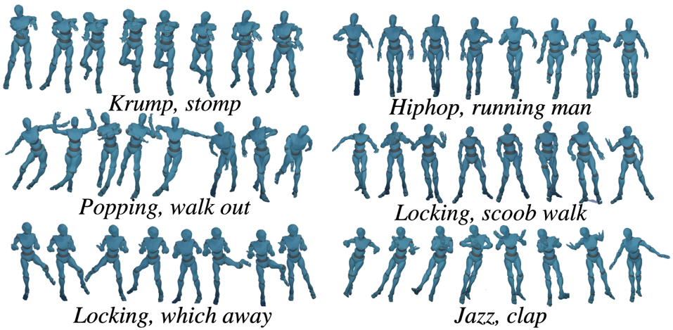

**[Image: figure_0168.png (957x469, 343.4KB)]**

Figure 9: MTMM transition comparison in Phase 3 training. (a) Non-autoregressive LDA; (b) Ours with MTMM. Red dashed lines indicate the clip boundary.

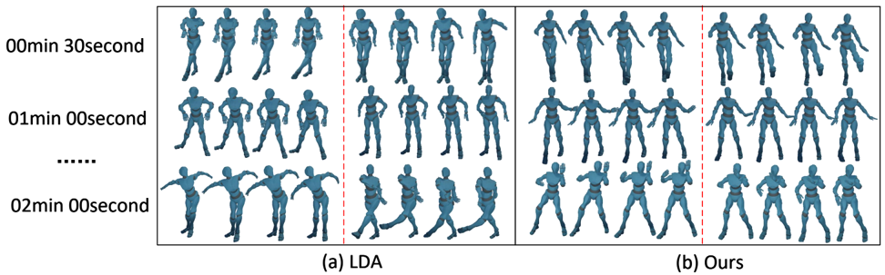

**[Image: figure_0170.png (972x303, 211.6KB)]**

The MTMM enables smooth temporal blending between clips, producing bolder motions with greater amplitude and richer joint rotations within and across clips-demonstrating its benefit for both intra-clip motion quality and inter-clip continuity.

## 4.4 Ablation Studies

We conduct ablation experiments to evaluate the contribution of key components in our framework-text conditioning, the MTMM, and local text guidance. Table 5 summarizes the results.

The full LRCM model consistently outperforms all ablated variants across all metrics. Removing textual prompts ( w/o text/"..." ) or the MTMM leads to significant drops in motion quality, diversity, and BAS. Notably, w/o local\_text exhibits performance closer to the ground truth (GT) in certain geometric attributes, suggesting that local text mainly enhances fine-grained semantic control rather than coarse geometric fidelity. In terms of semantic control, coarse-grained global text can preserve geometric properties similar to the GT, whereas local text provides finer control over motion semantics, though in GT-alignment metrics it may perform slightly worse than using only global text.

Table 5: Ablation results. Bold: best performance, Underlined: second-best. ↓ : lower is better, ↑ : higher is better.

| Method          |   FID 𝑘 ↓ |   FID 𝑔 ↓ |   DIV 𝑘 ↑ |   DIV 𝑔 |   ↑ BAS ↑ |
|-----------------|-----------|-----------|-----------|---------|-----------|
| w/o text/"... " |    294.10 |   3376.91 |     68.66 |   59.96 |    0.2739 |
| w/oMTMM         |    392.58 |   3935.48 |     41.89 |   48.88 |    0.2068 |
| w/o local_text  |    448.19 |   2496.13 |     83.14 |   87.67 |    0.2981 |
| Full LRCM       |    256.42 |   3208.32 |     87.83 |   86.38 |    0.2835 |

,

,

Figure 10: Noise scheduler 𝛽 and 𝛼 curves. Blue: baseline LDA configuration; Red: experimental setting used in this work; other curves: alternative reference.

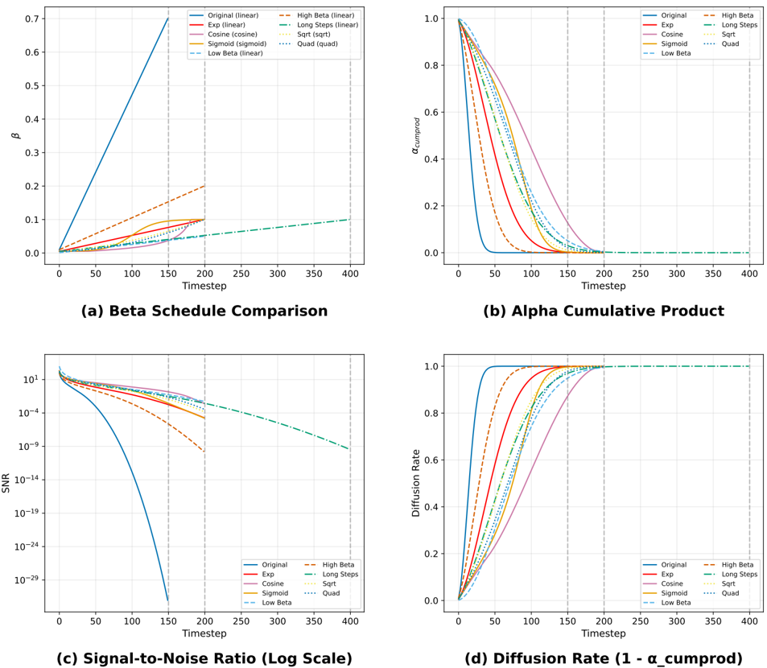

**[Image: figure_0180.png (953x830, 217.7KB)]**

Noise Scheduler Analysis. We also investigate the effect of the noise scheduler configuration. Using the baseline LDA with DDPM parameters 𝛽 ∈ [ 0 . 01 , 0 . 7 ] and a linear schedule with 150 diffusion steps, we observe that larger 𝛽 values prematurely push the model into high-noise regimes (around step 50), where little useful denoising information can be learned, leading to wasted computation.

In our configuration, we set 𝛽 ∈ [ 0 . 005 , 0 . 1 ] with 𝑇 = 200 diffusion steps, delaying the transition to high-noise steps. This adjustment reduces motion jitter in inference and improves utilization of high-noise training phases. Figure 10 plots the 𝛽 and 𝛼 curves for the original LDA setting (blue) and our modified configuration; additional curves are provided for reference.

## 5 Conclusion and Future Work

In this paper, we presented a novel framework for multimodal dance generation. Recognizing the importance of semantic textual information in dance studies, we proposed a semantic-decoupling paradigm based on the Motorica Dance dataset. The dataset was disentangled into motion, audio, and global/local textual modalities across seven dance genres, enabling fine-grained pairing of global and temporal segment descriptions.

We designed an audio-text multimodal diffusion model, leveraging Conformer and Cross-Conformer architectures for effective 1D sequence modeling in a non-autoregressive setting. For longduration autoregressive generation, we introduced the Motion Temporal Mamba Module (MTMM) based on the Mamba statespace architecture, bridging non-autoregressive and autoregressive paradigms.

Our complete LRCM framework was developed as an exploration of text-guided and long-sequence dance generation, and demonstrated strong performance across multiple objective metrics and qualitative evaluations. The experiments extend the study

,

,

of semantic-decoupling schemes, multimodal conditioning, and autoregressive temporal modeling, providing evidence of their potential benefits for complex and sustained motion synthesis tasks.

Future Work. The proposed dataset decoupling approach can be further refined and expanded to include richer annotations and additional modalities. Our current exploration of text input in an autoregressive framework represents an initial step; future work will focus on improving fine-detail synthesis, enhancing long-sequence generation stability, and extending the architecture for broader genre coverage and cross-domain motion tasks such as inpainting and editing.

## References

- [1] Chaitanya Ahuja and Louis-Philippe Morency. 2019. Language2pose: Natural language grounded pose forecasting. In 2019 International Conference on 3D Vision (3DV) . IEEE, 719-728.
- [2] Simon Alexanderson, Rafael Nagy, Jonas Beskow, et al. 2023. Listen, denoise, action! audio-driven motion synthesis with diffusion models. ACM Transactions on Graphics (TOG) 42, 4 (2023), 1-20.
- [3] Emily R Beyerle and Pratyush Tiwary. 2024. Inferring the isotropic-nematic phase transition with generative machine learning. arXiv preprint arXiv:2410.21034 (2024).
- [4] Martin Biquard, Matthieu Chabert, François Genin, et al. 2025. Variational Bayes image restoration with compressive autoencoders. IEEE Transactions on Image Processing 34 (2025), 2896-2909.
- [5] Steven Brown. 2024. The performing arts combined: the triad of music, dance, and narrative. Frontiers in Psychology 15 (2024), 1344354.
- [6] Florinel-Alin Croitoru, Vlad Hondru, Radu Tudor Ionescu, et al. 2023. Diffusion models in vision: A survey. IEEE Transactions on Pattern Analysis and Machine Intelligence 45, 9 (2023), 10850-10869.
- [7] Prafulla Dhariwal and Alexander Nichol. 2021. Diffusion models beat gans on image synthesis. In Advances in Neural Information Processing Systems , Vol. 34. 8780-8794.
- [8] Congyi Fan, Jian Guan, Xuanjia Zhao, et al. 2025. Align your rhythm: Generating highly aligned dance poses with gating-enhanced rhythm-aware feature representation. arXiv preprint arXiv:2503.17340 (2025).
- [9] Team GLM, :, Aohan Zeng, Bin Xu, Bowen Wang, Chenhui Zhang, Da Yin, Dan Zhang, Diego Rojas, Guanyu Feng, Hanlin Zhao, Hanyu Lai, Hao Yu, Hongning Wang, Jiadai Sun, Jiajie Zhang, Jiale Cheng, Jiayi Gui, Jie Tang, Jing Zhang, Jingyu Sun, Juanzi Li, Lei Zhao, Lindong Wu, Lucen Zhong, Mingdao Liu, Minlie Huang, Peng Zhang, Qinkai Zheng, Rui Lu, Shuaiqi Duan, Shudan Zhang, Shulin Cao, Shuxun Yang, Weng Lam Tam, Wenyi Zhao, Xiao Liu, Xiao Xia, Xiaohan Zhang, Xiaotao Gu, Xin Lv, Xinghan Liu, Xinyi Liu, Xinyue Yang, Xixuan Song, Xunkai Zhang, Yifan An, Yifan Xu, Yilin Niu, Yuantao Yang, Yueyan Li, Yushi Bai, Yuxiao Dong, Zehan Qi, Zhaoyu Wang, Zhen Yang, Zhengxiao Du, Zhenyu Hou, and Zihan Wang. 2024. ChatGLM: A Family of Large Language Models from GLM130B to GLM-4 All Tools. arXiv:2406.12793 [cs.CL] https://arxiv.org/abs/2406. 12793
- [10] Kaixuan Gong, Dong Lian, Hongjie Chang, et al. 2023. Tm2d: Bimodality driven 3d dance generation via music-text integration. In Proceedings of the IEEE/CVF International Conference on Computer Vision . 9942-9952.
- [11] Albert Gu and Tri Dao. 2023. Mamba: Linear-time sequence modeling with selective state spaces. arXiv preprint arXiv:2312.00752 (2023).
- [12] Chuan Guo, Yuxuan Mu, Muhammad Gohar Javed, Sen Wang, and Li Cheng. 2024. Momask: Generative masked modeling of 3d human motions. In Proceedings of the IEEE/CVF Conference on Computer Vision and Pattern Recognition . 1900-1910.
- [13] ChuanGuo,ShihaoZou, Xinxin Zuo, et al. 2022. Generating diverse and natural 3d human motions from text. In Proceedings of the IEEE/CVF Conference on Computer Vision and Pattern Recognition . 5152-5161.
- [14] Jonathan Ho, Ajay Jain, and Pieter Abbeel. 2020. Denoising diffusion probabilistic models. In Advances in Neural Information Processing Systems , Vol. 33. 6840-6851.
- [15] Zhaoyang Huang, Xiaoxuan Xu, Chen Xu, et al. 2024. Beat-it: Beat-synchronized multi-condition 3d dance generation. In European Conference on Computer Vision . Springer, 273-290.
- [16] Katsushi Ikeuchi, Zhen Ma, Zhilei Yan, et al. 2018. Describing upper-body motions based on labanotation for learning-from-observation robots. International Journal of Computer Vision 126 (2018), 1415-1429.
- [17] Min Li, Zhenjiang Miao, and Yantao Lu. 2023. LabanFormer: Multi-scale graph attention network and transformer with gated recurrent positional encoding for labanotation generation. Neurocomputing 539 (2023), 126203.
- [18] Ruilong Li, Shan Yang, David A Ross, et al. 2021. Ai choreographer: Music conditioned 3d dance generation with aist++. In Proceedings of the IEEE/CVF

international conference on computer vision . 13401-13412.

- [19] Ronghui Li, YuXiang Zhang, Yong Zhang, et al. 2024. Lodge: A coarse to fine diffusion network for long dance generation guided by the characteristic dance primitives. In Proceedings of the IEEE/CVF Conference on Computer Vision and Pattern Recognition . 1524-1534.
- [20] Ruilong Li, Jiafan Zhao, Yong Zhang, et al. 2023. Finedance: A fine-grained choreography dataset for 3d full body dance generation. In Proceedings of the IEEE/CVF International Conference on Computer Vision . 10234-10243.
- [21] Siyao Li, Weijiang Yu, Tianpei Gu, Chunze Lin, Quan Wang, Chen Qian, Chen Change Loy, and Ziwei Liu. 2022. Bailando: 3D dance generation by actor-critic GPT with choreographic memory. In Proceedings of the IEEE/CVF Conference on Computer Vision and Pattern Recognition . 11050-11059.
- [22] Benjamin Lindemann, Timo Müller, Hannes Vietz, Nasser Jazdi, and Michael Weyrich. 2021. A survey on long short-term memory networks for time series prediction. Procedia CIRP 99 (2021), 650-655.
- [23] Zachary C Lipton, John Berkowitz, and Charles Elkan. 2015. A critical review of recurrent neural networks for sequence learning. arXiv preprint arXiv:1506.00019 (2015).
- [24] Xinran Liu, Xu Dong, Diptesh Kanojia, et al. 2025. GCDance: Genre-controlled 3D full body dance generation driven by music. arXiv preprint arXiv:2502.18309 (2025).
- [25] Matthew Loper, Naureen Mahmood, Javier Romero, et al. 2023. SMPL: A skinned multi-person linear model. In Seminal Graphics Papers: Pushing the Boundaries, Volume 2 . ACM, 851-866.
- [26] Xiaoxuan Ma, Jiajun Su, Chunyu Wang, et al. 2023. 3d human mesh estimation from virtual markers. In Proceedings of the IEEE/CVF Conference on Computer Vision and Pattern Recognition . 534-543.
- [27] Xuan Ma and Kai Wang. 2022. Dance action generation model based on recurrent neural network. Mathematical Problems in Engineering 2022 (2022), 1-12.
- [28] Sangjune Park, Inhyeok Choi, Donghyeon Soon, et al. 2025. Not like transformers: Drop the beat representation for dance generation with mamba-based diffusion model. In 1st Workshop on Generative AI for Audio-Visual Content Creation .
- [29] Matthias Plappert, Christian Mandery, and Tamim Asfour. 2016. The kit motionlanguage dataset. Big data 4, 4 (2016), 236-252.
- [30] Mingyuan Qi, Zhiyuan Zhao, Haoyu Ma, et al. 2025. Human grasp generation for rigid and deformable objects with decomposed VQ-VAE. arXiv preprint arXiv:2501.05483 (2025).
- [31] Robin Rombach, Andreas Blattmann, Dominik Lorenz, Patrick Esser, and Björn Ommer. 2022. High-resolution image synthesis with latent diffusion models. In Proceedings of the IEEE/CVF conference on computer vision and pattern recognition . 10684-10695.
- [32] Hao Sun, Ruixiang Zheng, Haibin Huang, et al. 2024. LGTM: Local-to-global text-driven human motion diffusion model. In ACM SIGGRAPH 2024 Conference Papers . 1-9.
- [33] Yu Sun, Xinhao Li, Karan Dalal, Jiarui Xu, Arjun Vikram, Genghan Zhang, Yann Dubois, Xinlei Chen, Xiaolong Wang, Sanmi Koyejo, et al. 2024. Learning to (Learn at Test Time): RNNs with expressive hidden states. arXiv preprint arXiv:2407.04620 (2024).
- [34] Guy Tevet, Sigal Raab, Brian Gordon, Yoni Shafir, Daniel Cohen-or, and Amit Haim Bermano. 2023. Human motion diffusion model. In The Eleventh International Conference on Learning Representations .
- [35] Jonathan Tseng, Rafael Castellon, and Kexin Liu. 2023. Edge: Editable dance generation from music. In Proceedings of the IEEE/CVF Conference on Computer Vision and Pattern Recognition . 448-458.
- [36] Guillermo Valle-Pérez, Gustav Eje Henter, Jonas Beskow, et al. 2021. Transflower: Probabilistic autoregressive dance generation with multimodal attention. ACM Transactions on Graphics (TOG) 40, 6 (2021), 1-14.
- [37] Ashish Vaswani, Noam Shazeer, Niki Parmar, Jakob Uszkoreit, Llion Jones, Aidan N Gomez, Łukasz Kaiser, and Illia Polosukhin. 2017. Attention is all you need. In Advances in neural information processing systems . 5998-6008.
- [38] Nelson Yalta, Shinji Watanabe, Kazuhiro Nakadai, and Tetsuya Ogata. 2019. Weakly-supervised deep recurrent neural networks for basic dance step generation. In 2019 International Joint Conference on Neural Networks (IJCNN) . IEEE, 1-8.
- [39] Kaixing Yang, Xulong Tang, Yuxuan Hu, et al. 2025. MatchDance: Collaborative mamba-transformer architecture matching for high-quality 3d dance synthesis. arXiv preprint arXiv:2505.14222 (2025).
- [40] Kaixing Yang, Xulong Tang, Ziqiao Peng, et al. 2025. MEGADance: Mixtureof-experts architecture for genre-aware 3d dance generation. arXiv preprint arXiv:2505.17543 (2025).
- [41] Wenjie Yin, Xuejiao Zhao, Yi Yu, et al. 2024. LM2D: Lyrics-and music-driven dance synthesis. arXiv preprint arXiv:2403.09407 (2024).
- [42] Mihai Zanfir, Andrei Zanfir, Eduard Gabriel Bazavan, and Cristian Sminchisescu. 2021. Thundr: Transformer-based 3d human reconstruction with markers. In Proceedings of the IEEE/CVF International Conference on Computer Vision . 1297112980.
- [43] Jianrong Zhang, Yangsong Zhang, Xiaodong Cun, Yong Zhang, Hongwei Zhao, Hongtao Lu, Xi Shen, and Ying Shan. 2023. Generating human motion from

- textual descriptions with discrete representations. In Proceedings of the IEEE/CVF Conference on Computer Vision and Pattern Recognition . 14730-14740.
- [44] Mingyuan Zhang, Daisheng Jin, Chenyang Gu, et al. 2024. Large motion model for unified multi-modal motion generation. In European Conference on Computer Vision . Springer, 397-421.
- [45] Zhipeng Zhang, Andy Liu, Ian Reid, et al. 2024. Motion mamba: Efficient and long sequence motion generation. In European Conference on Computer Vision . Springer, 265-282.
- [46] Ce Zheng, Shuang Wu, Chao Chen, et al. 2023. Deep learning-based human pose estimation: A survey. Comput. Surveys 56, 1 (2023), 1-37.
- [47] Wentao Zhu, Xiaoxuan Ma, Dongwoo Ro, Hai Ci, Jinlu Zhang, Jiaxin Shi, Feng Gao, Qi Tian, and Yizhou Wang. 2023. Human motion generation: A survey. IEEE Transactions on Pattern Analysis and Machine Intelligence 46, 4 (2023), 2430-2449.

## A Large Language Model Fine-tuning Details

To enable professional-level textual guidance for dance motion generation, we fine-tuned a large language model (LLM) to serve as a domain-adapted text preprocessor. The model was trained to generate structured and semantically rich dance descriptions-including global style tokens and local movement tokens -from natural language prompts. In our work, we use the GLM-4-FLASH model [9] as the base LLM, chosen for its lightweight architecture and high efficiency within the overall framework.

## A.1 Fine-tuning Corpus

The fine-tuning dataset was manually constructed and stored in a JSONL conversational format, where each entry contained a multiturn dialogue between:

- System : Instructing the model to behave as a professional dance artist capable of choreographing dances based on user prompts.
- User : Providing informal or varied natural language prompts, often mixed with dance move names or style descriptions (e.g., running man, step torch, heel toe ).
- Assistant : Responding with a two-part structured annotation:
- (1) Dance style characteristics - a high-level global style descriptor (e.g., genre, expressiveness, moving range, key stylistic elements).
- (2) Dance movement sequence - a temporally segmented list of local action tokens with start/end timestamps.

## A.2 Annotation Format

Each assistant response is formatted as:

Dance style characteristics: &lt;global tokens&gt; Dance movement sequence:

- HH:MM:SS.sss - HH:MM:SS.sss:

...

## where:

- Global tokens capture coarse-grained style semantics (e.g., popping, extrovert, medium moving range, isolation ).
- Local tokens specify temporally localized actions (e.g., walk out, foot movement , head isolation , spin ).

## A.3 Purpose and Integration

The fine-tuned LLM is integrated into the LRCM pipeline as a textual semantic expansion module before the CLIP-based text encoder. It normalizes unstructured, noisy, or incomplete user prompts

&lt;local tokens&gt;

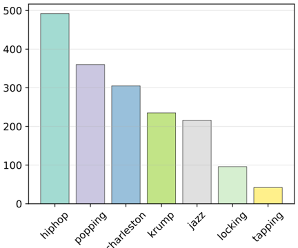

**[Image: figure_0262.png (432x360, 18.7KB)]**

(a) Total Tokens per Dance Style

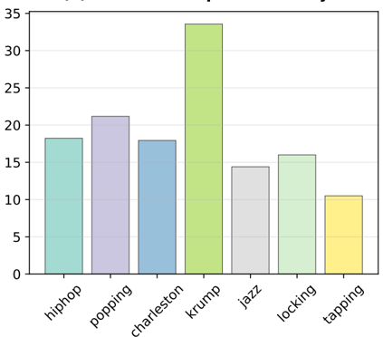

**[Image: figure_0264.png (423x372, 19.5KB)]**

(c) Average Tokens per File

,

,

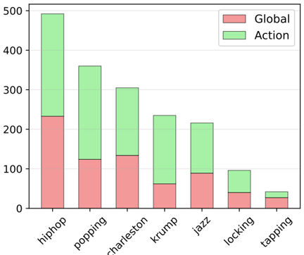

**[Image: figure_0268.png (432x362, 22.4KB)]**

(b) Token Type Distribution per Dance Style

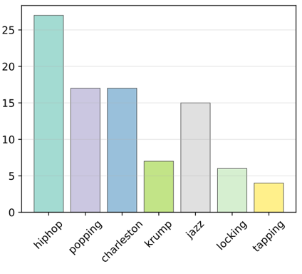

**[Image: figure_0270.png (424x384, 17.2KB)]**

(d) Number of Files per Dance Style

Figure 11: Token statistics for all dance styles in the Motorica Dance dataset.

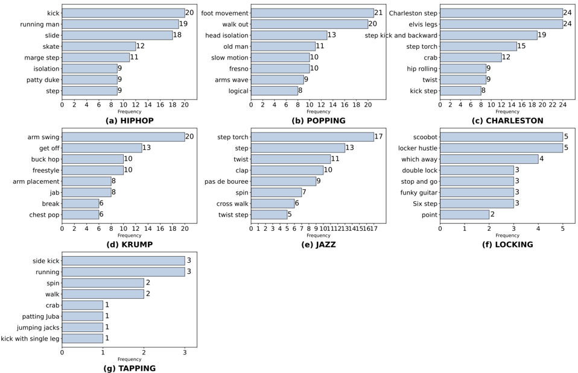

**[Image: figure_0272.png (958x619, 123.5KB)]**

Figure 12: Top eight most frequent semantic tokens for each dance style.

into consistent global/local token pairs, improving the precision of multimodal conditioning for the diffusion model. This step was crucial to handling non-expert or freestyle text inputs while retaining professional choreography quality.

## B Dataset Detail

In this work, we conduct professional motion-semantic decoupling for each of the seven dance styles in the Motorica Dance dataset.

Figure 11(a) shows the total number of tokens per style. Figures 11(b)-(d) illustrate global vs. local token counts, average text descriptions per dance clip by style, and the number of clips per style, respectively.

The variation across styles reflects the nature of the dance types. Figure 12 lists the most frequent token entries for each style, while Tokens Figure 13 provides the global summary of all dance action tokens, revealing style-specific semantics:

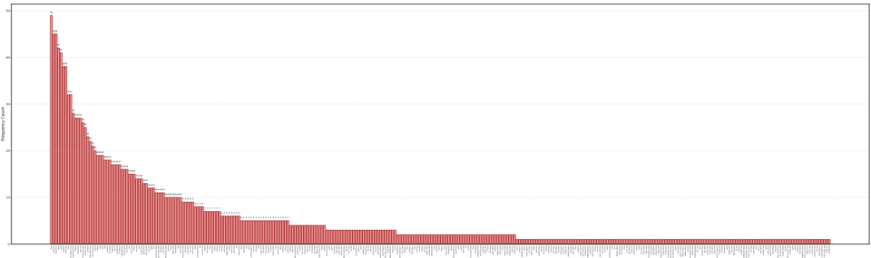

**[Image: figure_0280.png (960x285, 35.9KB)]**

Figure 13: Summary of all dance action tokens across the dataset.

- Hiphop : Dominated by groove-related terms such as up down and groove , repeated throughout the style. Signature actions like running man , step , and footwork entries are also prevalent.
- Krump : Prominent hand actions ( arm swing , jab ) and strong footwork such as stomp , often spanning the entire dance sequence.
- Popping : The term pop appears in every global token set; fundamental steps like walk out and toy man are linked to foot movement . Logical-style elements like tutting and wave are frequent in the global descriptions.
- Locking : Dominated by point-oriented actions like point lock , generally short in duration.
- Jazz , Charleston , Tapping : Belonging to the jazz family, featuring twist movements ( twist , torch ) and various step patterns, distinct from street dance styles.

## C Evaluation Metrics

To comprehensively evaluate dance generation performance, we adopt several quantitative metrics covering motion quality, rhythm synchronization, diversity, and freezing phenomena. Formal definitions are provided below.

## C.1 Motion Quality - Fréchet Inception Distance (FID)

FID measures the distributional difference between generated and real motions in the embedded feature space, assuming both follow Gaussian distributions:

<!-- formula-not-decoded -->

where 𝜇 𝑟 , Σ 𝑟 are the mean and covariance of real motion features, and 𝜇 𝑔 , Σ 𝑔 are from generated motions. FID 𝑘 is computed from kinematic features (velocity, acceleration) derived from joint positions, and FID 𝑔 from geometric features (mean, standard deviation) of joint rotations.

## C.2 Beat Alignment Score (BAS)

BAS evaluates synchronization between generated motion beats and musical beats, combining beat coverage and beat alignment :

<!-- formula-not-decoded -->

step kick and backward medium moving range medium moving rage step kick and backward.

changes body orienta ion Charleston step combo change body orienta ion head and body isolation Char sync with smal  fo where 𝑁 beats is the total number of music beats, 𝑏 is a beat index, 𝑚 is a generated motion beat frame, and 𝛿 𝑏 = 1 if 𝑏 is covered by a motion keyframe, otherwise 0. 𝜎 denotes temporal tolerance (set to 9 frames in implementation).

## C.3 Diversity Score (DIV)

Motion diversity is measured as the average Euclidean distance between pairs of generated motion feature vectors:

<!-- formula-not-decoded -->

where 𝐾 is the number of randomly sampled motion pairs, and x 𝑝 𝑖 , x 𝑞 𝑖 are their corresponding feature vectors.

## C.4 Improved Freezing Metrics

These metrics assess the occurrence and regularity of freezing in generated motion.

Adaptive Freezing Proportion (Adaptive PFF).

<!-- formula-not-decoded -->

where 𝐹 adaptive is the number of frames whose velocity falls below 𝜃 𝑣 for a duration in [ 𝑡 min , 𝑡 max ] , and 𝜃 𝑣 = Percentile 𝑝 ( 𝑣 𝑡 ) is the 𝑝 th percentile threshold of the velocity distribution ( 𝑝 = 25% by default). 𝑇 is the total number of motion frames.

Rhythmic Score (RS).

<!-- formula-not-decoded -->

where 𝐹 is the set of freeze points, 𝑏 is an expected beat location, and 𝜎 denotes beat tolerance (default 30 frames).

Length Regularity (LR).

<!-- formula-not-decoded -->

where 𝐿 is the set of durations of freezing segments, and Std (·) is the standard deviation.
---

## Extracted Images

| # | File | Dimensions | Size |
|---|------|------------|------|
| 1 | figure_0005.png | 2013x391 | 455.9KB |
| 2 | figure_0067.png | 957x558 | 401.7KB |
| 3 | figure_0090.png | 2031x880 | 484.6KB |
| 4 | figure_0108.png | 970x915 | 244.4KB |
| 5 | figure_0134.png | 2022x743 | 354.8KB |
| 6 | figure_0136.png | 964x339 | 118.6KB |
| 7 | figure_0158.png | 965x542 | 373.5KB |
| 8 | figure_0168.png | 957x469 | 343.4KB |
| 9 | figure_0170.png | 972x303 | 211.6KB |
| 10 | figure_0180.png | 953x830 | 217.7KB |
| 11 | figure_0262.png | 432x360 | 18.7KB |
| 12 | figure_0264.png | 423x372 | 19.5KB |
| 13 | figure_0268.png | 432x362 | 22.4KB |
| 14 | figure_0270.png | 424x384 | 17.2KB |
| 15 | figure_0272.png | 958x619 | 123.5KB |
| 16 | figure_0280.png | 960x285 | 35.9KB |
