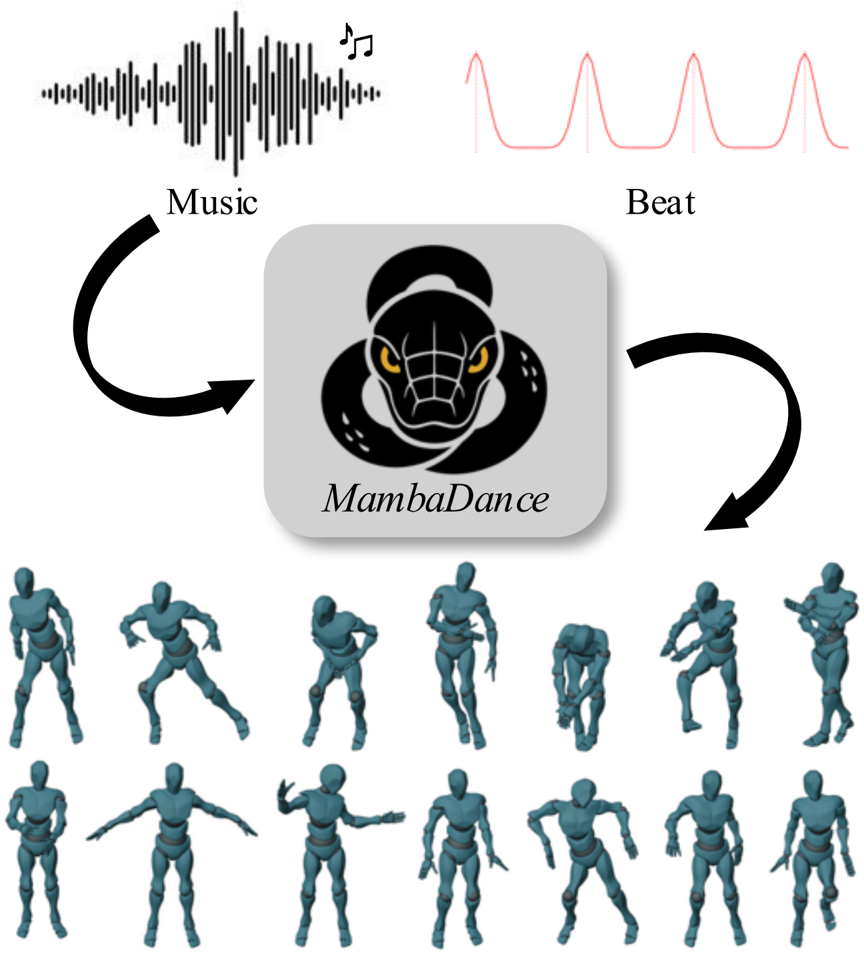
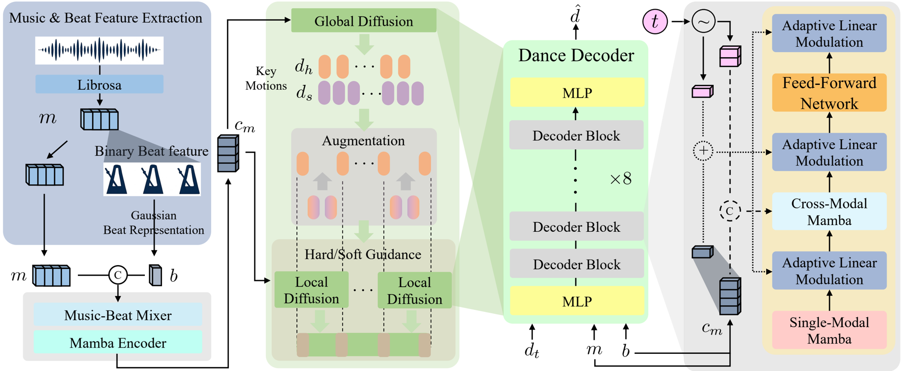
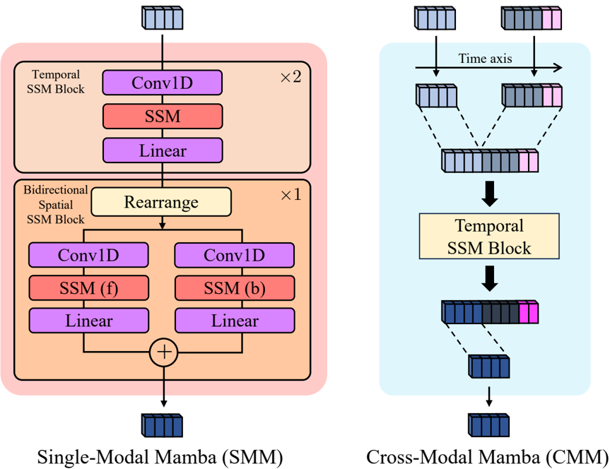
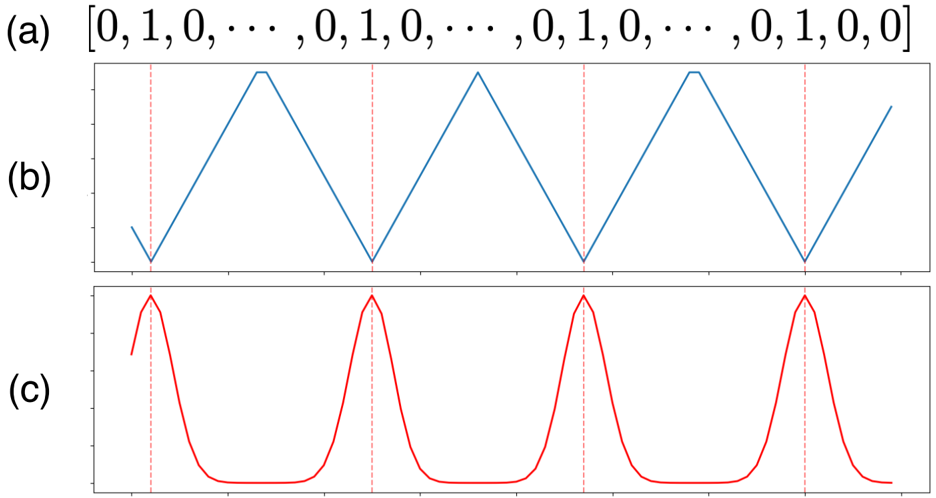
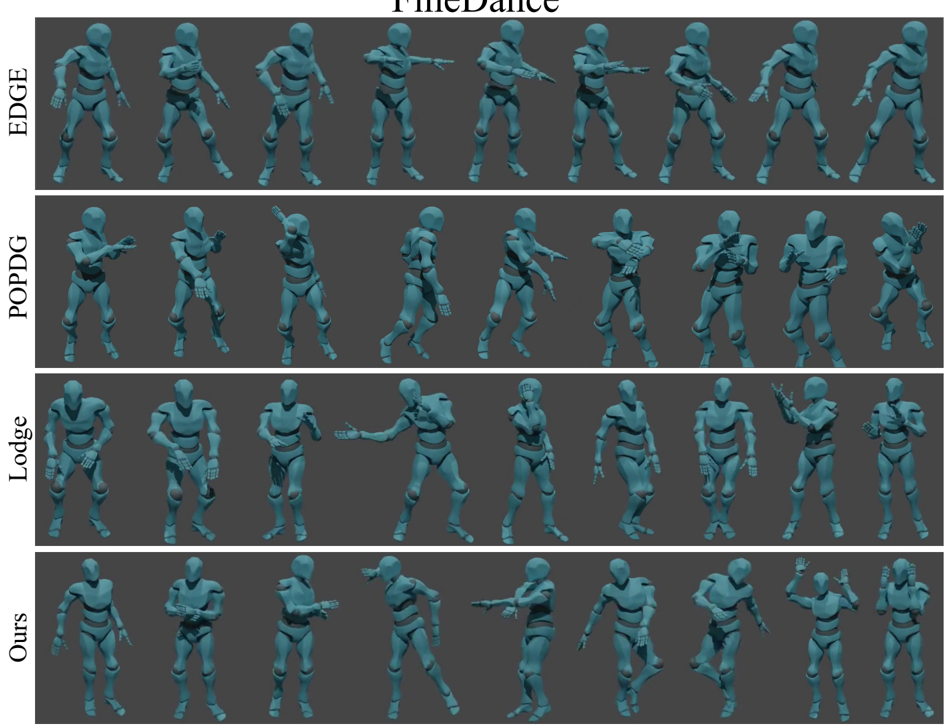
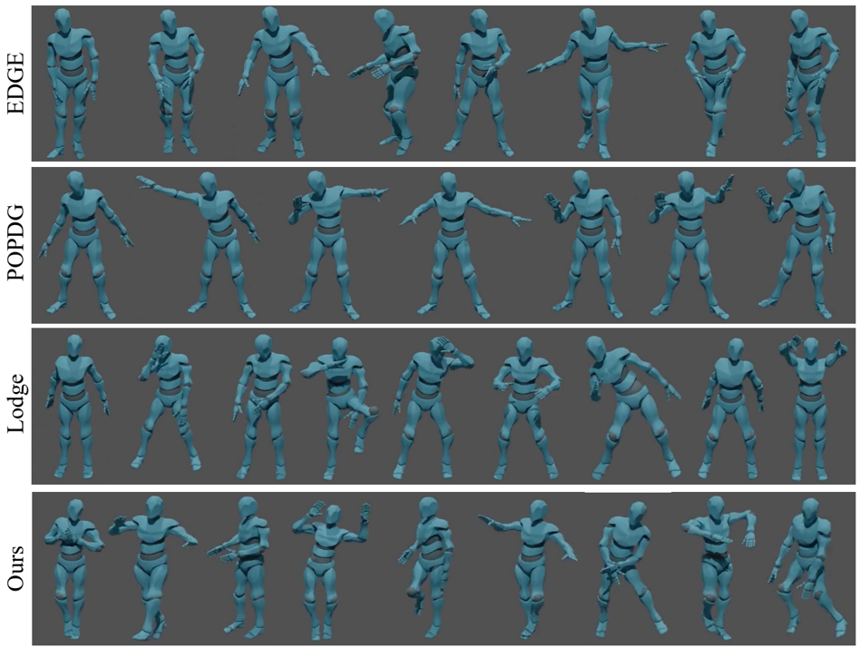

**[Image: figure_0000.png (175x120, 4.6KB)]**

This WACV paper is the Open Access version, provided by the Computer Vision Foundation. Except for this watermark, it is identical to the accepted version; the final published version of the proceedings is available on IEEE Xplore.

## Not Like Transformers: Drop the Beat Representation for Dance Generation with Mamba-Based Diffusion Model

Sangjune Park 1 Inhyeok Choi 1 Donghyeon Soon 2 Youngwoo Jeon 1 Kyungdon Joo 1 * 1 Ulsan National Institute of Science and Technology, South Korea 2 Daegu Gyeongbuk Institute of Science and Technology, South Korea

{ psj9116, inhyeok.choi, youngwoo.jeon, kyungdon } @unist.ac.kr dhsoon@dgist.ac.kr

## Abstract

Dance is a form of human motion characterized by emotional expression and communication, playing a role in various fields such as music, virtual reality, and content creation. Existing methods for dance generation often fail to adequately capture the inherently sequential, rhythmical, and music-synchronized characteristics of dance. In this paper, we propose MambaDance , a new dance generation approach that leverages a Mamba-based diffusion model. Mamba, well-suited to handling long and autoregressive sequences, is integrated into our two-stage diffusion architecture, substituting off-the-shelf Transformer. Additionally, considering the critical role of musical beats in dance choreography, we propose a Gaussian-based beat representation to explicitly guide the decoding of dance sequences. Experiments on AIST++ and FineDance datasets for each sequence length show that our proposed method effectively generates plausible dance movements while reflecting essential characteristics, consistently from short to long dances, compared to the previous methods. Additional qualitative results and demo videos are available at https://vision3d-lab.github.io/mambadance .

## 1. Introduction

Generating expressive and realistic dance movements synchronized with music is a long-standing challenge. Dance serves as a medium of embodied communication and artistic expression, characterized by its structured, rhythmic nature. Traditionally, choreography requires manual effort from experts or frame-by-frame animation, both of which are costly and time-consuming. Recent advances in generative models have enabled the automatic generation of music-driven dance [11, 12, 14, 16, 23, 24, 27] with applications spanning entertainment, content creation, gaming, and virtual reality. These developments offer scalable al- ternatives to manual choreography, but also introduce technical challenges in modeling the temporal complexity and rhythmic sensitivity inherent in dance.

* Corresponding author.

Figure 1. We propose MambaDance , a Mamba-based two-stage diffusion framework with an informative Gaussian beat representation. The result is coherent, beat-synchronized motion across variable lengths on AIST++ [12] and FineDance [13].

**[Image: figure_0010.png (864x955, 323.0KB)]**

Transformer-based architectures [11, 12, 14, 16, 23, 24, 27] are widely adopted in current 3D dance generation methods because of their ability to model global temporal dependencies. However, dance sequences require more than a general understanding of context. They demand strong temporal causality and consistent autoregressive structure over extended time horizons. Transformer [28] models fundamentally lack an inductive bias for sequential progression and often show inefficiency and inconsistency when generating long motion sequences. These limitations make it challenging to produce motion that is both rhythmically aligned and temporally coherent.

In addition to architectural limitations, the representation of musical beats plays a critical role in structuring dance motion. For example, in instruction, choreography is first segmented into beat-length phrases (e.g., 8counts), and learners practice following those anchors before performing to the full track with music. Many existing methods [12, 14, 16, 23, 24, 27] incorporate simple 1-dimensional beat features within the music feature vector. While such representations provide coarse alignment, they do not explicitly model how beats influence the motion sequence. Beat-It [9] decouple beat cues from audio features to strengthen beat-dance alignment while introducing a beat-distance estimator with an auxiliary alignment loss. Nevertheless, this approach encodes beat influence implicitly in network activations, rather than modeling an explicit temporal prior that shapes motion over time. These two challenges, namely long and autoregressive sequence modeling and effective beat conditioning, may seem independent, but they are closely related. Inadequate sequence modeling weakens rhythmic alignment, and insufficient beat representations limit the ability of the model to produce structured and expressive movements. A unified approach is necessary to address both aspects simultaneously, enabling the generation of dance that is both temporally consistent and rhythmically synchronized.

As illustrated in Fig. 1, we propose MambaDance , a music-to-dance generation framework built on a Mambabased, two-stage diffusion architecture. Unlike prior Transformer or hybrid designs, our model replaces attention entirely with state space modules to efficiently capture long and autoregressive dynamics. We follow the overall twostage paradigm of Lodge [14], but the decoder block in a denoising network of diffusion comprises (i) Single-Modal Mamba that processes motion features and (ii) Cross-Modal Mamba that fuses motion with music, followed by Adaptive Linear Modulation. To enforce rhythmic structure, we introduce a novel beat representation based on Gaussian decay, which provides smooth and interpretable temporal priors centered around musical beats. This representation enables the model to generate motion that follows the underlying rhythmic phrasing of the music. We evaluate on AIST++ [12] and FineDance [13] with different sequence lengths to systematically validate superior performance across multiple sequence lengths, demonstrating length-robust synthesis. Experimental results show that MambaDance consistently generates dance motions that are more physically plausible and rhythmically aligned than the off-the-shelf methods.

In summary, our contributions are as follows:

- We propose a novel framework, MambaDance , a fully
- Mamba-based diffusion model designed for autoregressive music-to-dance generation.
- We present a Gaussian-based beat representation that explicitly encodes rhythmic structure to guide motion decoding, considering key properties of music beats.
- We conduct comprehensive experiments and ablation studies demonstrating that our approach consistently outperforms previous baselines across fidelity and rhythm alignment metrics.

## 2. Related Work

## 2.1. Human Motion Generation

Human motion generation is crucial for realistic animation and interactive systems, drawing interest from vision, graphics, and robotics communities. Earlier methods focused on motion retrieval and interpolation, yielding plausible but limited results for simple actions like walking.

Recent advances in deep generative models have enabled neural networks to generate more flexible and expressive human motion. GAN-based methods [1] use adversarial training with multi-scale discriminators to enhance realism and model transition dynamics. Task-specific losses further help capture motion uncertainty. Autoencoder-based approaches compress motion into latent spaces, often using recurrent or transformer models [10, 21] to align motion with language. Recent work improves expressiveness via body-part-aware vector quantization [22, 25]. Diffusion models have emerged as a strong alternative, offering realism and controllability. Text-conditioned models [26, 31] treat motion as a denoising process, while latent-space variants [2] improve efficiency and structure.

However, efficiently handling long, autoregressive sequences remains challenging, especially for transformerbased diffusion models due to scalability issues. Recent work such as MotionMamba [32] addresses this with a state-space model (SSM) that uses hierarchical temporal and bidirectional spatial modeling, improving both longterm consistency and generation speed. Nevertheless, effectively modeling long sequences and incorporating temporal structure or rhythmic cues remain important challenges to be addressed.

## 2.2. Dance Generation

Early studies on music-driven dance generation regarded the task as an autoregressive modeling problem and adopted conventional machine learning techniques. While these approaches captured basic motion-music alignment, they lacked adaptability to diverse musical inputs and struggled to generate long and varied motion sequences.

Transformer-based models, such as FACT [12], have demonstrated strong capabilities in modeling temporal dynamics. In addition, approaches that combine VQ- VAE with GPT, exemplified by Bailando [23], as well as diffusion-based frameworks including EDGE [27], Lodge [14], and POPDG [16], further enhance the realism, diversity, and editability of generated dance motions. However, as these methods are based on Transformer architectures, they face challenges in modeling dance data, which is typically long and exhibits autoregressive dependencies. Recently, several works [29, 30] adopt Mamba structure [3, 6] to well capture the autoregressive nature of dance data. However, most of these studies adopt hybrid architectures, where Mamba is only partially combined with Transformers. While such designs improve local continuity, they still inherit the quadratic complexity and discontinuities of attention.

Figure 2. The overall architecture of MambaDance . We extract music feature m , and a novel beat representation b from the binary mask of beat of the feature (blue box). Two-stage diffusion architecture makes our approach enable length-agnostic generation in a single inference (green box). Decoder of the diffusion consists of the proposed Mamba [3, 6]-based modules, e.g., Single-Modal Mamba (SMM), Cross-Modal Mamba (CMM), and Adaptive Linear Modulation (AdaLM) (gray box).

**[Image: figure_0028.png (1885x778, 357.2KB)]**

## 2.3. State-Space Model for Motion and Dance

Recent approaches in dance generation have emphasized the importance of long-sequence modeling and synchronization with music. Transformer-based models have been widely adopted due to their ability to capture global dependencies, but they often struggle with autoregressive consistency and computational efficiency when generating long sequences. State-space models (SSMs) have recently emerged as a promising alternative for sequence modeling. In particular, Mamba [3, 6] has been developed to efficiently model long-range autoregressive dependencies in sequential data such as human motion and dance. By leveraging time-varying parameters, Mamba captures long-term dependencies more effectively than Transformers while maintaining linear-time complexity. In addition, its structure inherently embeds a sequential inductive bias, which facili- tates smooth temporal continuity.

Several recent works leverage Mamba structure for human motion and dance generation. MotionMamba [32] utilizes hierarchical SSMs to enhance temporal coherence and spatial motion modeling in human motion generation. AlignYourRhythm [5] integrates a rhythm-aware module based on Mamba to improve music-motion alignment. MegaDance [30] and MatchDance [29] adopt MambaTransformer hybrid architectures, leveraging Mamba for local dependency modeling and Transformer to capture global context. While these studies successfully exploit the advantages of Mamba, they adopt hybrid architectures, partially combining Mamba with Transformers.

In contrast, to the best of our knowledge, our work is the first to fully replace Transformer-based modules with Mamba-based modules for dance generation, including single-modal and cross-modal components. We achieve structured, rhythmically aligned 3D dance generation with temporal consistency and improved computational efficiency, while fully leveraging autoregressive inductive bias of Mamba for long-sequence modeling.

## 3. Method

In this work, we propose MambaDance , a two-stage diffusion framework that leverages effective long and autoregressive sequence modeling capacity of Mamba [3, 6] for music-driven 3D dance generation. The model generates plausible and natural dance motion while exploiting the inductive bias to model long and autoregressive 3D motion sequences of the state-space model. Considering the role of music beats that structure and anchor movements in choreography, we propose a new beat representation that explicitly enhances beat influence. This representation provides an intuitive control signal and improves rhythmic guidance during dance generation.

As illustrated in Fig. 2, MambaDance takes music and beat features extracted both from single raw music, and outputs 3D dance sequences. To produce a long sequence of dance with a single inference, a global diffusion generates key motions. The key motions are augmented by mirroring and connecting adjacent motions. Then a local diffusion generates detailed movements based on the primitives with hard/soft guidance. The two diffusion models share same dance decoder structure, which consists of two MLPs and 8 decoder blocks. Each decoder block mainly comprises (i) a Single-Modal Mamba (SMM), (ii) a Cross-Modal Mamba (CMM), and (iii) Adaptive Linear Modulation (AdaLM), which is fully designed with Mamba while substituting all attention modules.

## 3.1. Mamba for Dance Generation

Following prior works [14, 27], we represent sliced dance motion as a sequence of SMPL [15, 19] poses d ∈ R l × D motion . Here, l ∈ { N,n } denotes length sliced from total L -length motion or music sequences, where N and n for global and local diffusion, respectively. Given music feature m ∈ R l × D music and beat representation b ∈ R l × 1 , an MLP-based Music-Beat Mixer and a Mamba encoder produce a beat-highlighted condition c m ∈ R l × E that injects other modality information during decoding. In a Mambabased dance decoder, an input MLP lifts a noisy motion sequence d t in timestep t to a latent z d ∈ R l × E , a stack of decoder blocks processes the latent with conditions, and an output MLP projects back to ˆ d ∈ R l × D motion . Each decoder block contains a Single-Modal Mamba (SMM) , a Cross-Modal Mamba (CMM) , a lightweight feed-forward network (FFN), and Adaptive Linear Modulation (AdaLM) . Replacing self-attention with SSM and cross-attention with CMM yields linear-time sequence processing and stable long-horizon generation compared with attention-based designs [3, 6].

Single-Modal Mamba (SMM) operates solely on motion latents, whereas Cross-Modal Mamba (CMM) fuses motion latents with musical and diffusion timestep tokens (Fig. 3). SMM transforms input noisy motion latent with two Temporal SSM Blocks and a Bidirectional Spatial SSM Block. The Temporal SSM Block, following [3, 6], propagates a sequence a ∈ R l × E along the length axis l . The Spatial SSM Block rearranges a sequence to a ′ ∈ R E × l and propagates along the latent-channel axis E in a bidirectional manner to encourage cross-channel coordination. In contrast, CMM performs cross-modal integration by concatenating the motion latent z d , the musical condi- tion c m (mixture of music and beat information), and the diffusion timestep tokens e t ∈ R 2 × E as [ z d , c m , e t ] , applying a Temporal SSM over the concatenated sequence, and slicing the motion part of the output. These modules serve as an effective alternative to attention modules, especially for the 3D dance data:long, complex, and time-sequential.

Figure 3. Single-Modal Mamba (left) and Cross-Modal Mamba (right). For the input sequences to the Cross-Modal Mamba, Light blue, dark blue, and pink blocks correspond to motion, condition, and timestep tokens, respectively.

**[Image: figure_0040.png (863x664, 111.4KB)]**

We introduce Adaptive Linear Modulation (AdaLM), an alternative to FiLM [20], which is a simple normalizationbased modulator that conditions 1D input sequences. Analogous to adaptive normalization techniques [4, 8] in the 2D vision, we apply feature-wise affine modulation to groupnormalized latents:

<!-- formula-not-decoded -->

where the parameters γ, β ∈ R E are obtained by a linear projection of a mean-pooled conditioning vector c mod ∈ R E , computed from c m and e t .

## 3.2. Beat Representation

Prior works have identified a strong consistency between musical beats and the dance motion beats [9, 12, 14, 16, 23, 27]. Capturing this rhythmic link is essential for coherent and expressive generation. In many existing approaches [12, 14, 16, 23, 27], beat information is included in the music features. For instance, Librosa [17] is commonly used to extract music feature m total ∈ R L × D music , where D music = 35 whose last channel dimension corresponds to a binary beat signal b raw ∈ R L × 1 . Beat-It [9] mitigates the sparsity by encoding, for each frame, the temporal distance to the nearest beat, but the resulting signals are still monotonic and do not explicitly model the decaying influence of off-beat frames.

In practice, beats segment choreography into phrases and anchor high-kinetic movements. Therefore, an effective representation should satisfy two key properties: (i) frames closer to beats carry stronger signals, and (ii) this strength decays rapidly yet smoothly with temporal distance . We propose Gaussian beat representation , an intuitive beat representation b total ∈ R L × 1 based on Gaussian decay function, that meets both criteria and yields an interpretable, timelocalized cue for decoding. We omit the subscription 'total' in this subsection for simplicity.

Figure 4. Visualizations of raw beat (a), Nearest Beat Distance (NBD) (b), and our Gaussian beat representation (c). Horizontal axis denotes frame indices (time step) of a sequence and vertical axis indicates signal. The signal range of NBD and the proposed representation are [0 , 11] and [0 , 1] , respectively.

**[Image: figure_0048.png (936x498, 75.6KB)]**

As illustrated in Fig. 4, let b raw denote the binary beat sequence b raw ( i ) ∈ { 0 , 1 } at frame i ∈ { 0 , . . . , L -1 } . We formulate the Nearest Beat Distance (NBD) in the spirit of Beat-It as the minimum distance from each frame to the closest preceding or following beat frame:

<!-- formula-not-decoded -->

where dist -( i ) = i -max( j ≤ i | b j =1) if previous beat exists else + ∞ , and dist + ( i ) = min( j ≥ i | b j =1) -i if following beat exists else + ∞ . Here, j indexes frames in the sequence. Let the beat frames be τ 0 &lt; τ 1 &lt; · · · &lt; τ M -1 . To cover the full sequence and obtain a local tempo measure, we augment boundaries with τ -1 = 0 and τ M = L -1 , and define the inter-beat interval l ( i ) = τ k +1 -τ k for τ k ≤ i ≤ τ k +1 . To satisfy the two desiderata, i.e. , stronger signals near beats and smooth, rapidly decaying influence away from beats, while normalizing across different tempos, we use Gaussian decay with smoothing factor α ∈ (0 , 1) for our beat representation:

<!-- formula-not-decoded -->

The Gaussian provides a bell-shaped smooth, localized emphasis around beat frames, and the tempo-adaptive bandwidth α · l ( i ) yields consistent guidance under varying beat spacings. The resulting signal is an explicit and interpretable rhythmic prior that aligns with the phrasing structure of dance motion.

## 3.3. Training and Inference

Training schemes and losses. Following Lodge [14], we train the global and local diffusion models independently, and use the global key motions (hard cues d h and soft cues d s ) to guide the local model at inference time only. Directly controlling only a few boundary frames via diffusion inpainting can cause incoherent transitions within each local window, so we fine-tune the local diffusion by replacing the first and last L key / 2 frames of the noisy input d t with the corresponding ground-truth frames d 0 during training.

We basically use a standard reconstruction loss of the diffusion models [7] for the dance decoder f θ of our MambaDance , defined as:

<!-- formula-not-decoded -->

Additional auxiliary losses make training stable and improve physical plausibility, containing position loss L pos , velocity loss L vel, acceleration loss L acc, and contact consistency loss on foot L foot. Position loss measures the similarity of joint positions between ground truth and predicted dance movements:

<!-- formula-not-decoded -->

where FK( · ) denotes the forward kinematic function that converts joint angles into joint positions. Similarly, the contact consistency loss ensures accurate foot-ground contacts:

<!-- formula-not-decoded -->

where FK foot ( · ) operates the forward kinematic function for foot joints only, and ˆ y stands for the predicted binary foot contact label. The velocity loss and acceleration loss assess the similarity of joint velocities and accelerations:

<!-- formula-not-decoded -->

Note that the joint acceleration can be calculated with the joint velocity v i = d i +1 -d i . The total loss is defined as combined all losses with weights:

<!-- formula-not-decoded -->

Table 1. Quantitative results on the FineDance and AIST++ datasets. GT motion is used as the reference. ↓ indicates lower is better, and → indicates closer to the real motion is better. The best and second-best results are highlighted in bold and underline, respectively.

| Dataset   | Model            | Fidelity                                                      | Fidelity                                                      | Fidelity                                                               | Beat                                                                    | Diversity                                  | Diversity                                            | Wins ( ↑ )   |
|-----------|------------------|---------------------------------------------------------------|---------------------------------------------------------------|------------------------------------------------------------------------|-------------------------------------------------------------------------|--------------------------------------------|------------------------------------------------------|--------------|
| Dataset   | Model            | FID k ( ↓ )                                                   | FID g ( ↓ )                                                   | PFC ( ↓ )                                                              | BAS ( ↑ )                                                               | Div k ( → )                                | Div g ( → )                                          | Wins ( ↑ )   |
| FineDance | GT               | -                                                             | -                                                             | 0.1852                                                                 | -                                                                       | 10.9924                                    | 7.7424                                               | -            |
|           | EDGE POPDG Lodge | 179.01 ± 3 . 10 190.23 ± 1 . 18 84.99 ± 2 . 07 51.36 ± 0 . 67 | 1234.28 ± 236 . 95 1479.14 ± 6 . 44 64.57 ± 10 . 74 ± 10 . 54 | 0.3994 ± 0 . 0177 0.3765 ± 0 . 0124 0.0585 ± 0 . 014 0.0119 ± 0 . 0008 | 0.2261 ± 0 . 0013 0.2361 ± 0 . 0033 0.2410 ± 0 . 0063 0.2441 ± 0 . 0044 | 10.34 ± 0 . 36 7.22 ± 0 . 14 7.98 ± 0 . 20 | 31.74 ± 2 . 76 14.53 ± 0 . 12 7.67 ± 0 . 68 ± 0 . 88 | 3.5% 5.5%    |
|           |                  |                                                               |                                                               |                                                                        |                                                                         |                                            |                                                      | 35.0%        |
|           | Ours             |                                                               | 43.11                                                         |                                                                        |                                                                         | 6.38 ± 0 . 17                              | 6.44                                                 | 56.0%        |
|           | GT               | -                                                             | -                                                             | 1.2544                                                                 | -                                                                       | 9.61                                       | 7.78                                                 | -            |
| AIST++    | EDGE             | 125.99 ± 128 . 69                                             | 28.72 ± 4 . 29                                                | 3.1883 ± 0 . 5318                                                      | 0.2572 ± 0 . 0112                                                       | 11.45 ± 3 . 25                             | 4.91 ± 0 . 56                                        | 10.5%        |
| AIST++    | POPDG            | 777.32 ± 711 . 65                                             | 60.08 ± 5 . 98                                                | 4.8615 ± 0 . 6010                                                      | 0.2318 ± 0 . 0129                                                       | 24.08 ± 7 . 40                             | 7.87 ± 0 . 59                                        | 9.0%         |
| AIST++    | Lodge            | 67.13 ± 2 . 79                                                | 28.93 ± 0 . 47                                                | 1.4087 ± 0 . 1296                                                      | 0.2397 ± 0 . 0158                                                       | 3.34 ± 0 . 32                              | 3.54 ± 0 . 14                                        | 32.0%        |
| AIST++    | Ours             | 65.86 ± 3 . 11                                                | 26.58 ± 1 . 02                                                | 1.0622 ± 0 . 2343                                                      | 0.2701 ± 0 . 0116                                                       | 3.57 ± 0 . 37                              | 4.98 ± 0 . 43                                        | 48.5%        |

To further suppress unnecessary drift in the root, we add a root translation term λ trans L trans (Eq. (7) on the root position) when fine-tuning the local model.

Parallel inference with two-stage diffusion model. Inspired by two-stage diffusion model for long dance generation [14], we generalize the inference pipeline to handle variable lengths. Given total music features m total ∈ R L × D music and Gaussian beat representations b total ∈ R L × 1 , we partition them into k non-overlapping segments of length N . Recall that the length of the sliced motion and music sequences is l ∈ { N,n } , where N for global diffusion and n for local diffusion. Whereas the prior method targets only long sequences with ( N,n ) = (1024 , 256) , our inference supports N ∈ { 128 , 256 , 1024 } and n ∈ { 64 , 256 } , enabling generation at multiple temporal resolutions while preserving the coarse-to-fine design.

Specifically, in the dance decoder, using full mixture of musical condition c m,g ∈ R N × E , the global diffusion predicts characteristic key motions m key that capture high-level choreographic patterns with elevated kinetic energy. The key motions m key ∈ R L key × D motion includes hard cues d h (to anchor window boundaries) and soft cues d s (to shape intrawindow dynamics). To exploit bilateral symmetry, we mirror d s and place d s in a n -length sequence for soft guidance. For sequences spanning multiple segments, we ensure continuity by copying the last L key frames of segment i into the first L key frames of segment i + 1 before extracting midregion primitives.

Each segment c i m,g is further divided into windows { c j m,l } N//n j =1 , where c m,l ∈ R n × E . We inject d h via diffusion inpainting at the start and end of each window to fix boundary poses for reliable stitching, and we apply d s as early-step guidance for &gt; (1000 · s ) denoising steps, where soft cue guidance scale s controls the strength. Because boundaries are anchored, windows decode independently and can be generated in parallel, and the resulting clips are concatenated to form the total dance sequence.

## 4. Experiments

## 4.1. Experiment Design

We evaluate MambaDance on AIST++ [12] and FineDance [13]. AIST++ consists of 1,408 high-quality short 3D dance sequences, performed by professional dancers across 10 genres. We use a sliced motion parameterization of D motion = 151 following EDGE [27] and train with sequence length N = 128 . FineDance provides long-form dance sequences collected from online videos, covering diverse dance styles and music durations, spanning 16 genres. We use 139-dimensional representation with sequence length N = 1024 as in Lodge [14]. These datasets jointly cover complementary regimes-short and long clips at 30 FPS-allowing us to assess robustness across temporal resolutions and data distribution.

We compare against recent Transformer-based diffusion approaches for music-conditioned 3D dance generation:our method with the following baselines, which show recent advances by leveraging Transformer-based diffusion architectures in music-conditioned 3D dance generation.

- EDGE [27]: The first approach to use Transformer-based diffusion model for 3D dance generation with rich music representation from Jukebox.
- POPDG [16]: A follow-up method utilizing an improved diffusion model (iDDPM [18]) based on additional alignment module and space augmentation algorithm.
- Lodge [14]: An EDGE-based two-stage diffusion framework with foot refine block and a multi genre discriminator, focusing on long-term dance generation.

Table 2. Ablation on Mamba and beat representation (FineDance). In contrast to the Transformer-based Lodge [14], 'Mamba-only' denotes a fully Mamba-based model without an explicit beat prior. 'Mamba+NBD' uses Nearest Beat Distance [9] as a beat representation.

| Model      | Fidelity       | Fidelity        | Fidelity          | Beat              | Diversity       | Diversity     |
|------------|----------------|-----------------|-------------------|-------------------|-----------------|---------------|
| Model      | FID k ( ↓ )    | FID g ( ↓ )     | PFC ( ↓ )         | BAS ( ↑ )         | Div k ( → )     | Div g ( → )   |
| GT         | -              | -               | 0.1852            | -                 | 10.9924         | 7.7424        |
| Lodge      | 84.99 ± 2 . 07 | 64.57 ± 10 . 74 | 0.0585 ± 0 . 014  | 0.2410 ± 0 . 0063 | 7.98 ± 0 . 20   | 7.67 ± 0 . 68 |
| Mamba-only | 60.94 ± 2 . 01 | 43.46 ± 7 . 29  | 0.0180 ± 0 . 0017 | 0.2402 ± 0 . 0044 | 6.48 ± 0 . 40   | 7.21 ± 0 . 79 |
| Mamba+NBD  | 83.55 ± 1 . 35 | 38.43 ± 0 . 71  | 0.0687 ± 0 . 0046 | 0.2478 ± 0 . 0054 | 5.3958 ± 0 . 17 | 5.78 ± 0 . 30 |
| Ours       | 51.36 ± 0 . 67 | 43.11 ± 10 . 54 | 0.0119 ± 0 . 0008 | 0.2441 ± 0 . 0044 | 6.38 ± 0 . 17   | 6.44 ± 0 . 88 |

## 4.2. Evaluation Metrics

We evaluate generated dances using standard metrics following EDGE and Lodge. To measure motion realism, we report Fr´ echet Inception Distance, computed over kinematic ( FID k ) and geometric ( FID g ) variants. Physical plausibility is assessed using the Physical Foot Contact score ( PFC ). The Beat Alignment Score ( BAS ) measures how well the generated motion beats-moments where motion energy peaks (e.g., local maxima of joint speed or kinetic energy)-align with the music beats. Motion diversity is quantified by the Diversity metric, which computes the average pairwise distance over kinematic ( Div k ) and geometric ( Div g ) features. Since the metrics do not exactly reflect human perception, we conduct user studies and report the win rate ( Wins ) of ours over the baselines.

Unlike prior works [14, 16, 27], we calculate all metrics on full-length sequences rather than sliced with length N , better reflecting global temporal coherence, aligned with the goal of generating complete dances for an entire music. In addition, we report mean and standard deviation across 10 independent runs to indicate statistical reliability. Further details regarding the evaluation metrics and the user study protocol are provided in the supplementary material.

## 4.3. Comparisons

We evaluate MambaDance with recent Transformer-based diffusion models, EDGE, POPDG, and Lodge, on AIST++ and FineDance. The global/local lengths are ( N,n ) = (128 , 64) for AIST++ and (1024 , 256) for FineDance.

Across both datasets, our method achieves the best scores on motion fidelity and beat alignment ( FID k , FID g , PFC , BAS ) (Table 1). On FineDance, our model reduces FID k to 51.36 (vs. 84.99 for Lodge) and FID g to 43.11 (vs. 64.57), and lowers PFC to 0.0119 (vs. 0.0585), indicating more realistic dynamics and substantially more stable foot-ground interaction. BAS increases slightly to 0.2441 (vs. 0.2410 for Lodge), reflecting a consistent and noticeable gain in rhythm-motion alignment. On AIST++, MambaDance attains 65.86 FID k (vs. 67.13 for Lodge), 26.58 FID g (vs. 28.72 for EDGE), 1.0622 PFC (vs. 1.4087 for FineDance AIST++

**[Image: figure_0088.png (946x727, 495.2KB)]**

Figure 5. Qualitative comparison on the FineDance (top) and AIST++ (bottom) dataset. Each row shows a set of sampled frames captured at consistent intervals from the full sequence.

**[Image: figure_0089.png (948x714, 478.3KB)]**

Lodge), and the highest BAS at 0.2701 (vs. 0.2572 for EDGE). Notably, our standard deviations are small across metrics, suggesting stable behavior over runs, whereas some baselines show very large variance, e.g., FID k on AIST++ and FID g on FineDance for EDGE and POPDG.

Table 3. Ablation study on different decoder structures. The last row corresponds to our MambaDance .

| Ablations   | Ablations   | Metrics        | Metrics           | Metrics           | Metrics       | Metrics       |
|-------------|-------------|----------------|-------------------|-------------------|---------------|---------------|
| AdaLM       | CMM         | FID k ( ↓ )    | PFC ( ↓ )         | BAS ( ↑ )         | Div k ( → )   | Div g ( → )   |
| GT          | GT          | -              | -                 | 0.1852            | 10.99         | 7.74          |
| ✗           | ✗           | 61.28 ± 1 . 72 | 0.6316 ± 0 . 0066 | 0.2465 ± 0 . 0044 | 8.59 ± 0 . 16 | 5.77 ± 0 . 41 |
| ✗           | ✓           | 62.93 ± 1 . 80 | 0.7878 ± 0 . 0070 | 0.2479 ± 0 . 0057 | 9.93 ± 0 . 18 | 6.11 ± 0 . 60 |
| ✓           | ✓           | 51.36 ± 0 . 67 | 0.0119 ± 0 . 0008 | 0.2441 ± 0 . 0044 | 6.38 ± 0 . 17 | 6.44 ± 0 . 88 |

In terms of the diversity, Div g 7.67 of Lodge is closest to GT (7.74), with ours second (6.44) on FineDance. On AIST++, Div g 7.87 of POPDG is closest to GT (7.78), and ours is second (4.98). EDGE and POPDG often reports the highest diversity, but these cases coincide with elevated FID / PFC , indicating that some of the extra variability stem from artifacts such as foot sliding. Overall, our method favors physical plausibility and beat alignment, with diversity values that are competitive but somewhat conservative relative to GT.

Results support two conclusions: (i) replacing attention with state-space decoding improves autoregressive motion fidelity and physical plausibility according to the large improvements in PFC ; and (ii) an explicit beat prior yields consistently large BAS gains. The diversity is balanced rather than maximized, trading off against fidelity and physics. Furthermore, as reflected in the Wins metric from our user study, dance sequences generated by our model are consistently preferred by human evaluators over those from baseline methods. Notably, our approach maintains stable performance across both short and long sequences, whereas EDGE and POPDG tend to degrade in quality when generating longer videos.

As described in Fig. 5, although diversity metrics may suggest reduced variation, the qualitative results reveal dynamic and rhythm-aligned movements. EDGE and POPDG frequently exhibit artifacts such as foot-sliding that coincide with elevated FID and Div metrics and unnaturally staring at one side, as visible in the supplementary videos. We strongly encourage watching the supplementary videos for complete and detailed comparisons.

## 4.4. Ablation Studies

We analyze the effects of the proposed beat representation and model architecture on the FineDance dataset.

We use three variants on FineDance [13]: (i) Lodge [14], a Transformer-based two-stage diffusion model, (ii) 'Mamba-only' which fully replaces Transformer [28] to Mamba [3, 6] without any beat representation, and (iii) 'Mamba+NBD' which uses Nearest Beat Distance [9] in place of the Gaussian beat representation with our MusicBeat Mixer. Compared to Lodge, 'Mamba-only' markedly improves motion fidelity and physics (lower FID k , FID g , PFC ) with only a minor change in BAS , indicating that state-space model makes a dance decoder generate more realistic dynamics and more stable foot-ground interaction. Introducing the NBD prior yields the highest BAS and the lowest FID g , but it degrades not only kinematic realism and stability a lot (e.g., even higher PFC than Lodge) but also the diversity (farther Div k and Div g from GT). Our Gaussian beat representation strikes a balance: BAS remains high (second-best and close to NBD), while FID k and PFC improve to the best values and diversity increases. Taken together, these results suggest that Mamba is the primary driver of fidelity gains, and our Gaussian beat prior preserves rhythm alignment without sacrificing naturalness.

We ablate the Cross-Modal Mamba (CMM) which is our replacement of cross-attention and Adaptive Linear Modulation (AdaLM) which is our group normalization based linear modulation. When a model is designed with CMM instead of cross-attention module, BAS and diversity raise (more varied motion and tighter audio-motion coupling). Adding AdaLM on top of CMM recovers stability and yields the best overall fidelity and plausibility, with BAS remaining comparable and diversity decreasing modestly. This pattern indicates that CMM supplies effective musicmotion fusion, while AdaLM regularizes the fused states, acting as a lightweight stabilizer for contact and dynamics.

## 5. Conclusion

In this paper, we have proposed MambaDance , a novel approach for music-to-3D dance generation, fully substituting Mamba for Transformer. Furthermore, we introduce an informative beat representation based on Gaussian decay, considering the important nature of musical beats. Experimental results on two datasets with different sequence lengths demonstrate the robustness and superiority of our approach over baselines. Although there is potential for advancements in applications, our work focuses on generating human motion conditioned on music, not addressing the downstream stages of the production pipeline, such as rendering. A natural extension can be an end-to-end system that maps music to a dancing 3D avatar, including a rendering stack for camera, materials, and lighting.

## Acknowledgements

This work was supported by Institute of Information &amp; communications Technology Planning &amp; Evaluation (IITP) grant funded by the Korea government (MSIT) (No.RS2020-II201336, Artificial Intelligence Graduate School Program (UNIST); No.RS-2022-II220612, Geometric and Physical Commonsense Reasoning based Behavior Intelligence for Embodied AI; No.RS-2025-25442149, LG AI STAR Talent Development Program for Leading LargeScale Generative AI Models in the Physical AI Domain; No.RS-2025-25442824, AI Star Fellowship Program (UNIST)), and by the InnoCORE program of the Ministry of Science and ICT (25-InnoCORE-01).

## References

- [1] Emad Barsoum, John Kender, and Zicheng Liu. Hp-gan: Probabilistic 3d human motion prediction via gan. In CVPRW , 2018. 2
- [2] Xin Chen, Biao Jiang, Wen Liu, Zilong Huang, Bin Fu, Tao Chen, and Gang Yu. Executing your commands via motion diffusion in latent space. In CVPR , 2023. 2
- [3] Tri Dao and Albert Gu. Transformers are ssms: Generalized models and efficient algorithms through structured state space duality. In ICML , 2024. 3, 4, 8
- [4] Prafulla Dhariwal and Alexander Nichol. Diffusion models beat gans on image synthesis. In NeurIPS , 2021. 4
- [5] Congyi Fan, Jian Guan, Xuanjia Zhao, Dongli Xu, Youtian Lin, Tong Ye, Pengming Feng, and Haiwei Pan. Align your rhythm: Generating highly aligned dance poses with gatingenhanced rhythm-aware feature representation. In ICCV , 2025. 3
- [6] Albert Gu and Tri Dao. Mamba: Linear-time sequence modeling with selective state spaces, 2023. arXiv preprint arXiv:2312.00752. 3, 4, 8
- [7] Jonathan Ho, Ajay Jain, and Pieter Abbeel. Denoising diffusion probabilistic models. In NeurIPS , 2020. 5
- [8] Xun Huang and Serge Belongie. Arbitrary style transfer in real-time with adaptive instance normalization. In ICCV , 2017. 4
- [9] Zikai Huang, Xuemiao Xu, Cheng Xu, Huaidong Zhang, Chenxi Zheng, Jing Qin, and Shengfeng He. Beat-it: Beat-synchronized multi-condition 3d dance generation. In ECCV , 2024. 2, 4, 7, 8
- [10] Boeun Kim, Jungho Kim, Hyung Jin Chang, and Jin Young Choi. Most: Motion style transformer between diverse action contents. In CVPR , 2024. 2
- [11] Jiaman Li, Yihang Yin, Hang Chu, Yi Zhou, Tingwu Wang, Sanja Fidler, and Hao Li. Learning to generate diverse dance motions with transformer, 2020. arXiv preprint arXiv:2008.08171. 1
- [12] Ruilong Li, Shan Yang, David A Ross, and Angjoo Kanazawa. Ai choreographer: Music conditioned 3d dance generation with aist++. In ICCV , 2021. 1, 2, 4, 6
- [13] Ronghui Li, Junfan Zhao, Yachao Zhang, Mingyang Su, Zeping Ren, Han Zhang, Yansong Tang, and Xiu Li.
14. Finedance: A fine-grained choreography dataset for 3d full body dance generation. In ICCV , 2023. 1, 2, 6, 8
- [14] Ronghui Li, YuXiang Zhang, Yachao Zhang, Hongwen Zhang, Jie Guo, Yan Zhang, Yebin Liu, and Xiu Li. Lodge: A coarse to fine diffusion network for long dance generation guided by the characteristic dance primitives. In CVPR , 2024. 1, 2, 3, 4, 5, 6, 7, 8
- [15] Matthew Loper, Naureen Mahmood, Javier Romero, Gerard Pons-Moll, and Michael J Black. Smpl: A skinned multiperson linear model. ACM TOG , 2015. 4
- [16] Zhenye Luo, Min Ren, Xuecai Hu, Yongzhen Huang, and Li Yao. Popdg: Popular 3d dance generation with popdanceset. In CVPR , 2024. 1, 2, 3, 4, 6, 7
- [17] Brian McFee, Colin Raffel, Dawen Liang, Daniel P.W. Ellis, Matt McVicar, Eric Battenberg, and Oriol Nieto. librosa: Audio and music signal analysis in python. In Proceeding of the 14th Python in Science Conference , 2015. 4
- [18] Alexander Quinn Nichol and Prafulla Dhariwal. Improved denoising diffusion probabilistic models. In ICML , 2021. 6
- [19] Georgios Pavlakos, Vasileios Choutas, Nima Ghorbani, Timo Bolkart, Ahmed A. A. Osman, Dimitrios Tzionas, and Michael J. Black. Expressive body capture: 3d hands, face, and body from a single image. In CVPR , 2019. 4
- [20] Ethan Perez, Florian Strub, Harm De Vries, Vincent Dumoulin, and Aaron Courville. Film: Visual reasoning with a general conditioning layer. In AAAI , 2018. 4
- [21] Mathis Petrovich, Michael J. Black, and G¨ ul Varol. Actionconditioned 3d human motion synthesis with transformer vae. In ICCV , 2021. 2
- [22] Mathis Petrovich, Michael J. Black, and G¨ ul Varol. Temos: Generating diverse human motions from textual descriptions. In ECCV , 2022. 2
- [23] Li Siyao, Weijiang Yu, Tianpei Gu, Chunze Lin, Quan Wang, Chen Qian, Chen Change Loy, and Ziwei Liu. Bailando: 3d dance generation via actor-critic gpt with choreographic memory. In CVPR , 2022. 1, 2, 3, 4
- [24] Li Siyao, Weijiang Yu, Tianpei Gu, Chunze Lin, Quan Wang, Chen Qian, Chen Change Loy, and Ziwei Liu. Bailando++: 3d dance gpt with choreographic memory. IEEE TPAMI , 2023. 1, 2
- [25] Guy Tevet, Brian Gordon, Amir Hertz, Amit H Bermano, and Daniel Cohen-Or. Motionclip: Exposing human motion generation to clip space. In ECCV , 2022. 2
- [26] Guy Tevet, Jonathan Gordon, Amir Hertz, et al. Human motion diffusion model. In ICLR , 2023. 2
- [27] Jonathan Tseng, Rodrigo Castellon, and Karen Liu. Edge: Editable dance generation from music. In CVPR , 2023. 1, 2, 3, 4, 6, 7
- [28] Ashish Vaswani, Noam Shazeer, Niki Parmar, Jakob Uszkoreit, Llion Jones, Aidan N Gomez, Łukasz Kaiser, and Illia Polosukhin. Attention is all you need. NeurIPS , 2017. 1, 8
- [29] Kaixing Yang, Xulong Tang, Yuxuan Hu, Jiahao Yang, Hongyan Liu, Qinnan Zhang, Jun He, and Zhaoxin Fan. Matchdance: Collaborative mamba-transformer architecture matching for high-quality 3d dance synthesis, 2025. arXiv preprint arXiv:2505.14222. 3

- [30] Kaixing Yang, Xulong Tang, Ziqiao Peng, Yuxuan Hu, Jun He, and Hongyan Liu. Megadance: Mixture-of-experts architecture for genre-aware 3d dance generation, 2025. arXiv preprint arXiv:2505.17543. 3
- [31] Wen Zhang, Xiaojie Peng, Yebin Ma, et al. Motiondiffuse: Text-driven human motion generation with diffusion model. IEEE TPAMI , 2024. 2
- [32] Zeyu Zhang, Akide Liu, Ian Reid, Richard Hartley, Bohan Zhuang, and Hao Tang. Motion mamba: Efficient and long sequence motion generation. In ECCV , 2024. 2, 3
---

## Extracted Images

| # | File | Dimensions | Size |
|---|------|------------|------|
| 1 | figure_0000.png | 175x120 | 4.6KB |
| 2 | figure_0010.png | 864x955 | 323.0KB |
| 3 | figure_0028.png | 1885x778 | 357.2KB |
| 4 | figure_0040.png | 863x664 | 111.4KB |
| 5 | figure_0048.png | 936x498 | 75.6KB |
| 6 | figure_0088.png | 946x727 | 495.2KB |
| 7 | figure_0089.png | 948x714 | 478.3KB |
