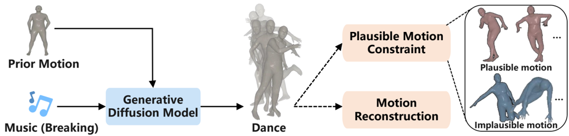
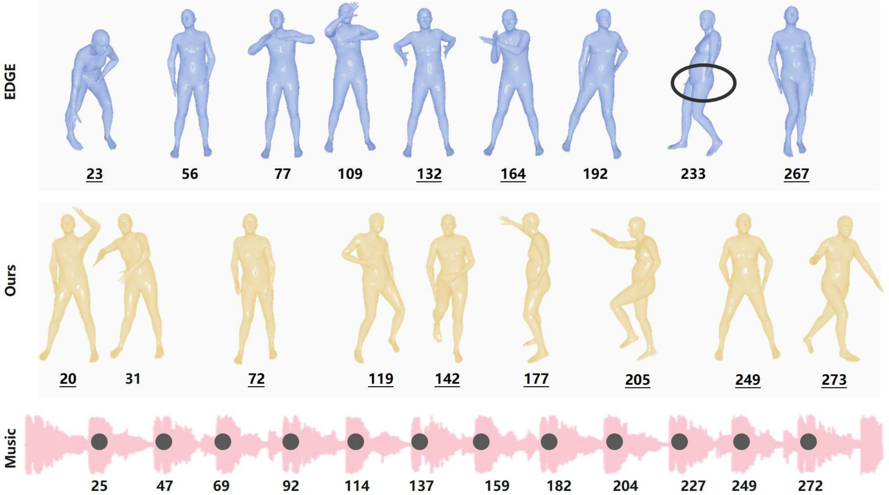
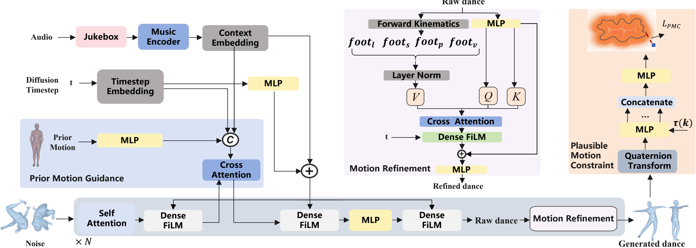
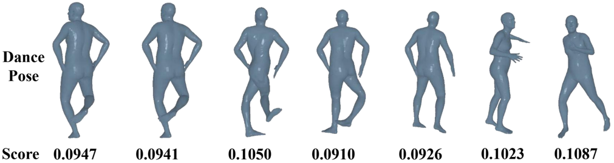
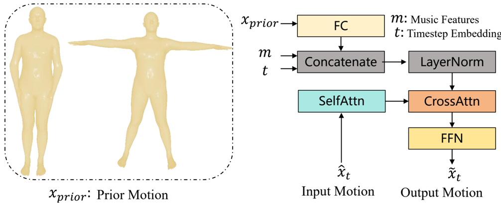
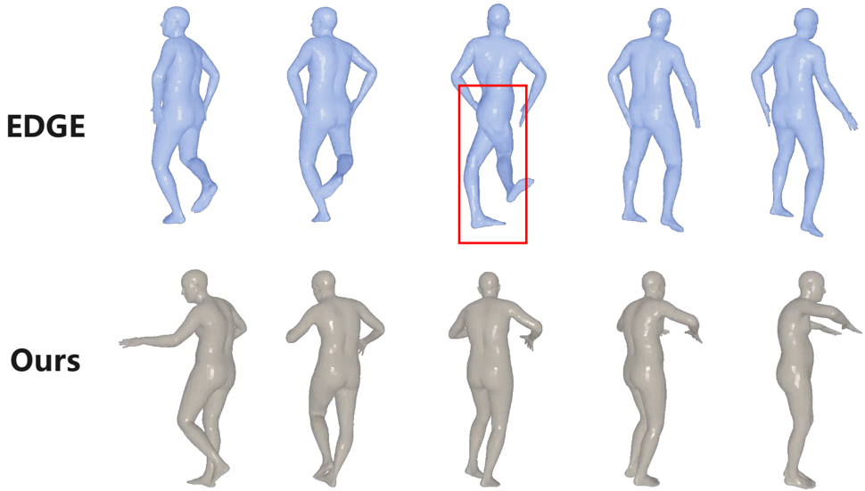
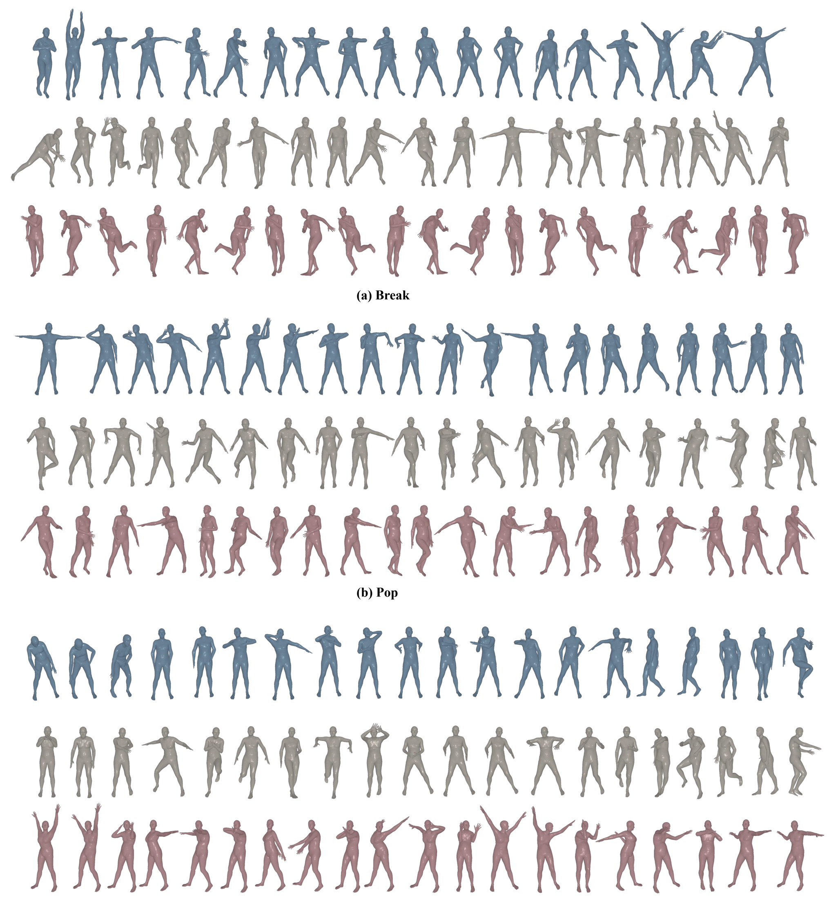

1

## PAMD: Plausibility-Aware Motion Diffusion Model for Long Dance Generation

Hongsong Wang, Yin Zhu, Qiuxia Lai, Yang Zhang, Guo-Sen Xie, and Xin Geng, Senior Member, IEEE

Abstract -Computational dance generation is crucial in many areas, such as art, human-computer interaction, virtual reality, and digital entertainment, particularly for generating coherent and expressive long dance sequences. Diffusion-based musicto-dance generation has made significant progress, yet existing methods still struggle to produce physically plausible motions. To address this, we propose Plausibility-Aware Motion Diffusion (PAMD), a framework for generating dances that are both musically aligned and physically realistic. The core of PAMD lies in the Plausible Motion Constraint (PMC), which leverages Neural Distance Fields (NDFs) to model the actual pose manifold and guide generated motions toward a physically valid pose manifold. To provide more effective guidance during generation, we incorporate Prior Motion Guidance (PMG), which uses standing poses as auxiliary conditions alongside music features. To further enhance realism for complex movements, we introduce the Motion Refinement with Foot-ground Contact (MRFC) module, which addresses foot-skating artifacts by bridging the gap between the optimization objective in linear joint position space and the data representation in nonlinear rotation space. Extensive experiments show that PAMD significantly improves musical alignment and enhances the physical plausibility of generated motions. This project page is available at: https: //mucunzhuzhu.github.io/PAMD-page/.

Index Terms -Computational dance generation, diffusionbased music-to-dance generation.

## I. INTRODUCTION

D ANCE is an art form that harmonizes rhythmic body movements with musical accompaniment. It allows for the expression of emotions [1], the preservation of cultural heritage [2], and the promotion of social connections [3]. However, traditional choreography is complex and labor-intensive, often requiring extensive professional expertise. Recent advances in computational methods provide an innovative alternative, pushing beyond the limitations of manual approaches by automatically generating dance movements synchronized with music. These methods can not only inspire new forms of artistic expression, but also offer immersive interaction experiences when paired with VR or AR technologies [4].

H. Wang, Y. Zhu and X. Geng are with School of Computer Science and Engineering, Key Laboratory of New Generation Artificial Intelligence Technology and Its Interdisciplinary Applications, Ministry of Education, Southeast University, Nanjing 210096, China ( { hongsongwang, zhuy, xgeng } @seu.edu.cn).

Q. Lai is with State Key Laboratory of Media Convergence and Communication, Communication University of China (qxlai@cuc.edu.cn).

Y. Zhang is with School of Computer Science and Software Engineering, National Engineering Laboratory for Big Data System Computing Technology, Guangdong Key Laboratory of Intelligent Information Processing, Shenzhen University, Shenzhen 518060, China (yangzhang@szu.edu.cn).

G. Xie is with School of Computer Science and Engineering, Nanjing University of Science and Technology, Nanjing, China (gsxiehm@gmail.com).

Fig. 1. Motivation of our approach for diffusion-based music-to-dance generation. To generate plausible and correct motion sequences for musicto-dance, we introduce prior motion and plausible motion constraints during the training of the generative diffusion model.

**[Image: figure_0011.png (961x230, 100.4KB)]**

Furthermore, computational music-to-dance generation fosters interdisciplinary collaboration among computer science, performing arts, and human-computer interaction [5], [6].

A key challenge of computational music-to-dance generation lies in generating realistic and physically plausible dance sequences over long durations. Early autoregressive musicto-dance methods [7], [8], [9] generate dance movements iteratively by predicting each frame based on previously generated frames and corresponding music features. These methods, however, suffer from error accumulation over time, leading to issues like motion freezing [4] and an inability to generate plausible long sequences. In contrast, diffusion-based models [4] generate entire dance sequences at once, partially mitigating the problem of error accumulation. Despite this advantage, both autoregressive and diffusion-based methods share a significant limitation: they rely on a latent space to represent motion, yet this latent space is not specifically designed to guarantee physically plausible poses. As a result, both approaches struggle to generate realistic and physically plausible outputs.

In general, seed motion is commonly utilized in autoregressive models, where the model predicts subsequent motions based on observed preceding motions [7]. Although the seed motion renders the predicted motions physically plausible in short-term prediction, prediction errors of these models may accumulate for long-term dance prediction. Besides, many existing methods, such as [7] and [10], rely on auto-regressive inference to produce long dance sequences. This paradigm of long-term generation is inefficient and also leads to error accumulation.

To address the limitations outlined earlier, this paper proposes Plausibility-Aware Motion Diffusion (PAMD), a diffusion-based framework for generating dances that are both musically aligned and physically realistic. Figure 1 illustrates the outline of the proposed method. PAMD consists of three key components, namely, Plausible Motion Constraint (PMC), Prior Motion Guidance (PMG), and Motion Refinement with Foot-Ground Contact (MRFC). PMC , inspired by human pose prior modeling [11], employs Neural Distance Fields (NDFs) to represent plausible human poses in a continuous, highdimensional space. This constraint ensures the generation of physically valid motions by guiding outputs toward a realistic pose manifold. To the best of our knowledge, this is the first work to leverage NDFs for signal-conditioned human motion generation tasks, such as music-to-dance synthesis. PMG further enhances dance generation by providing a stable starting point for sequence generation, utilizing standing poses as auxiliary conditions. While conceptually similar to seed motions [12], [13] for predicting future movements, PMG does not depend on real motion data. Instead, it seamlessly integrates standing poses commonly seen in transitions, beginnings, or endings of dance sequences with music features, a strategy that has proven highly effective in our experiments. MRFC is inspired by [14] and designed to improve the realism of complex movements by bridging the gap between the optimization objective in linear joint position space and the data representation in nonlinear rotation space. Unlike [14], MRFC is more lightweight, avoiding multiple training stages and reducing the computational costs, while still achieving comparable refinement quality. As shown in Figure 2, these components enable PAMD to generate high-quality, plausible dance sequences efficiently and effectively. Our contributions are summarized as follows:

Fig. 2. Our PAMD model generates long dances that are better synchronized and visually coherent. The black dots on the pink music waveform indicate music beats, while the grey and blue motions denote dance beats generated by PAMD (ours) and EDGE, respectively. The underlined dance beats indicate close alignment, which falls within five frames of the nearest music beat. PAMD produces eight closely aligned dance beats compared to only four from EDGE. Moreover, PAMD generates more natural and fluid movements. For example, EDGE lacks hand motion in frame 233, while PAMD maintains consistent and expressive hand movements in frame 205.

**[Image: figure_0017.png (1953x1089, 928.0KB)]**

- We introduce Plausibility-Aware Motion Diffusion (PAMD), a diffusion-based framework for music-to-dance

generation. PAMD generates dances that are both musically aligned and physically realistic.

- To ensure realistic dance generation, we design Plausible Motion Constraint (PMC), which uses NDFs to model plausible human poses on a continuous manifold, the first application of NDFs in music-to-dance generation.
- To provide a stable starting point for sequence generation, we introduce Prior Motion Guidance (PMG), which uses standing poses as auxiliary conditions.

## II. RELATED WORK

## A. Music-Driven Dance Generation

Music-driven dance generation has become increasingly popular recently. Early approaches [15], [16], [17], [18] generate dance by viewing this task as a motion retrieval problem. However, these approaches are limited by the quality and diversity of motion databases, lack flexibility in adapting to new music, and often produce mechanically repetitive movements.

Subsequently, deep learning approaches have gradually been applied to music-driven dance generation task, including autoregression-based methods [7], [19], [10], GANbased methods [8], [20], VAE-based methods [9], [21], and Diffusion-based methods [4], [14], [22], [23], [24]. Li et al. [7] learn the correspondence between music and motion with a cross-modal transformer block. Apart from the music itself, Huang et al. [10] embed the genre one-hot vector into the decoder based on a transformer-based architecture. However, these methods generate dance sequences in an autoregressive manner, which may lead to error accumulation. Based on GAN, Kim et al. [8] use a transformer-based conditional GAN with a genre discriminator to generate diverse dance motions. Based on VQ-VAE, Li et al. [9] achieve alignment between music beats and motion tempos with an actor-critic-based reinforcement learning scheme. Liang et al. [25] propose a framework that establishes rhythmic and stylistic correlations between dance and music. Recently, there have been a few diffusion-based methods for dance generation. Li et al. [14] propose a two-stage coarse-to-fine diffusion architecture, that first generates characteristic dance primitives and subsequently utilizes these primitives to generate longer dance sequences. Zhang et al. [22] focus on local and bidirectional motion and employs a bidirectional encoder to process forward noise distributions and backward dance sequences.

Although deep learning-based methods have advanced the development of the music-to-dance generation task, they share a notable limitation: they rely on a latent space to encode motion, yet this latent space is not explicitly optimized to guarantee physically plausible poses. In contrast, our method leverages Neural Distance Fields (NDFs) to model the motion directly in the physical space. This approach ensures that the generated poses are not only more realistic but also physically plausible, as the NDF framework constrains the motion to adhere to natural physical laws. Therefore, our method overcomes the limitations of traditional latent space representations and enhances the overall plausibility of the generated poses.

## B. Conditional Human Motion Generation

Most research within the human motion generation field focuses on generating human motions based on conditional signals [26]. The conditional signals are usually class [27], [28], text prompts [29], [30], audio features [31], observed motions [32], or scene contexts [33]. Conditioned on class information, Guo et al. [27] propose a novel VAE framework to iteratively generate human motion sequences given a prescribed action type. Based on text prompts, Zhang et al. [29] propose the first diffusion-based framework conditioned on text descriptions with multi-level manipulation. Considering audio styles, Ao et al. [31] propose a neural network framework that synthesizes stylized co-speech gestures with flexible style control. Ling et al. [33] combine reinforcement learning with motion generative model to produce precise goal-directed movements under joystick control.

Conditioned on prior motions, many methods utilize prior motion information to guide and refine the generation or prediction of human motion. Holden et al. [34] train a feedforward control network to generate realistic motion sequences based on terrain trajectory or a target location. Rempe et al. [12] introduce a 3D human motion model and leverage this model as a motion prior for the prediction of temporal pose. Duan et al. [13] propose a trainable mixture embedding module to model temporal information, which controls the completion of motion. These approaches require a large amount of prior motion data for training, whereas our method only uses standing poses as auxiliary conditions commonly observed in transitions, beginnings, or endings of dance sequences, reducing computational and time costs significantly.

## C. Plausible Human Motion Generation

Despite notable progress in recent years, the task of human motion generation remains challenging due to the complex nature of human movement and its implicit connection with conditional signals. Therefore, to prioritize the plausibility of the generated motions, Shimada et al. [35] utilize a combination of ground reaction force and residual force for plausible root control. Then, Shimada et al. [36] propose a method called 'physionical', which is aware of physical and environmental constraints. Yuan et al. [37] combine a dynamics-based control generation unit with a kinematic pose refinement unit to achieve plausible pose generation. In addition to considering kinematics, Zhang et al. [38] develop a physics-driven body representation and a contact force model. Huang et al. [39] introduce a proxemics and physics-guided diffusion model, enabling the interaction to be modeled through cross-attention. Lodge [14] uses a foot refine block, which extracts footstep information as an additional input condition to mitigate artifacts. However, this block exhibits a structure similar to that of a transformer and incurs considerable computational cost. To achieve a more refined understanding of foot-ground contact while minimizing computational overhead, we introduce a Motion Refinement with Foot-Ground Contact Module, which is not only lightweight but also effectively ensures the generation of plausible motions.

## III. PLAUSIBILITY-AWARE MOTION DIFFUSION

To pull the generated dance motions toward a physically plausible space, we propose a method called PlausibilityAware Motion Diffusion (PAMD). This model instills physical principles of dances in multiple aspects, including Plausible Motion Constraint, Prior Motion Guidance and Motion Refinement with Foot-Ground Contact, and possesses the capability to generate long dances of arbitrary lengths. The pipeline overview of our method is shown in Figure 3. Before elaborating on our approach, we first present a baseline for music-to-dance generation as preliminaries.

## A. Preliminaries

We refer to EDGE [4] and use Motion Diffusion Model (MDM) [40] for dance generation. For music features, we use Jukebox to extract music features as conditions. Given a music clip, music features can be represented as m ∈ R L × 4800 , in which L is the frame number and 4800 is the music feature channel. For motion representation, we obey the SMPL [41] format and employ the 6 degrees of freedom rotation representation [42] for each joint along with a single root translation: ω ∈ R 24 · 6+3=147 . We additionally incorporate a binary contact label for both the heel and toe of each foot: f ∈ { 0 , 1 } 2 · 2=4 . Therefore, the total motion representation for each time step is x = { f, w } ∈ R 4+147=151 .

The motion diffusion model is composed of two main processes: a forward noise addition process and a reverse denoising process. The forward noise addition process is described as a Markov noising process:

Fig. 3. PAMD Pipeline Overview: Conditioned on music and prior motion, PAMD learns to denoise dance sequences from time t = T to t = 0 . Music features are extracted by Jukebox and then pass through the Transformer Music Encoder. The prior motion, timestep, and music features are concatenated and undergo cross-attention with noise. The noisy sequence ˆ x t is processed by a transformer-based dance decoder, which generates the raw dance . Motion Refinement Module takes raw dance as input, extracts foot l , foot s , foot p and foot v , goes through a cross-attention, and outputs the final refined dance sequences. During the training process, the generated dance is passed through the Plausible Motion Constraint to produce an auxiliary loss.

**[Image: figure_0038.png (2051x734, 307.7KB)]**

<!-- formula-not-decoded -->

where x 0 is ground truth dance data, ϵ ∼ N (0 , I ) and α t ∈ (0 , 1) are constants that are monotonically decreasing. The forward process aims to perturb x 0 into x t over t steps.

The reverse process mainly uses a network g θ to recover the motion from noise, generating ˆ x 0 conditioned on music m . We optimize g θ using the reconstruction loss [43]:

<!-- formula-not-decoded -->

where ˆ x 0 = g θ ( x t , t, m ) and m denotes the music features.

Following the approach [44], we incorporate classifierfree guidance by introducing a low probability (e.g. 20%) of randomly replacing c = ∅ during training. The guided inference is formulated as:

<!-- formula-not-decoded -->

where w is the guidance weight with a positive value. The influence of condition m can be amplified by setting w &gt; 1 .

For human motion synthesis, auxiliary losses are commonly employed to enhance the physical realism of the generated motions [28]. We follow Tevet et al. [40] to incorporate three auxiliary losses: joint position loss L joint, velocity loss L vel and foot contact loss L foot :

<!-- formula-not-decoded -->

Fig. 4. Implausible poses of dance generation: The score indicates the implausibility of dance poses, with higher scores indicating less plausible poses. It is predicted by the trained auxiliary network in the PMC module.

**[Image: figure_0050.png (1011x269, 122.4KB)]**

where FK( · ) denotes the forward kinematic that converts joint angles to positions, ˆ f ( i ) is the binary contact label for foot and the superscript ( i ) indicates the frame index.

## B. Plausible Motion Constraint

In diffusion models, motion is represented in a latent space, which makes it challenging to ensure that the generated motions are physically plausible. In the dance generation task, some typical implausible poses for the task of dance generation are shown in Figure 4. These abnormal poses diminish the quality and visual appeal of the generated dance.

Therefore, we introduce the Plausible Motion Constraint (PMC), which employs Neural Distance Fields (NDFs) to represent plausible human motions in a continuous, highdimensional space to serve as a constraint in dance generation. This module aims to learn a neural network f that maps a human pose θ ∈ SO (3) K to a non-negative scalar, i.e., f : SO (3) K → R + . The manifold of plausible poses is represented as the zero-level set:

<!-- formula-not-decoded -->

where SO (3) K denotes the pose space, K is the number of body joints, and the value of f ( θ ) signifies the unsigned distance from the pose θ to the manifold of plausibility.

The PMC module consists of an encoder f enc and a decoder f dec , following the practice of modeling pose manifolds with neural distance fields [11]. Given a pose θ = { θ 1 , ..., θ K } , where θ k is the pose for joint k , f enc encodes each human pose using an MLP as:

<!-- formula-not-decoded -->

where τ ( k ) is a function that maps the index of each joint to the index of its parent joint. To model a continuous manifold of human poses, the quaternion transform [45] is employed first to map joint angles of rotation representations to unit quaternion representations.

Given an input pose and the encoded feature of the parent joint for each joint in the pose, f enc outputs the encoded feature v i for each joint in the pose. Then these features are concatenated to form V = [ v 1 || ... || v K ] . Subsequently, V is fed into the decoder f dec , which predicts the unsigned distance between the given pose and the corresponding plausible pose manifold using an MLP:

<!-- formula-not-decoded -->

where d measures the motion plausibility, d = 0 indicates that the pose is plausible, and a larger value of d signifies a more implausible pose.

The plausible motion constraint L PMC is defined as:

<!-- formula-not-decoded -->

where ˆ x i is the generated motion of the i -th time step and q ( · ) denotes the function of quaternion transform. Compared to previous methods that transform human pose into Gaussian distributions [12], the PMC module models the actual pose manifold, preserving distances between real poses. Therefore, the total training loss is:

<!-- formula-not-decoded -->

## C. Prior Motion Guidance

Seed motion refers to the small number of initial frames provided, which are used to represent the start of human motion. FACT [7] and GCDG [10] generate subsequent motions automatically based on given seed motions. It has been found that providing a seed motion can effectively guide the generation of subsequent short-term motions.

Based on the effectiveness of the seed motion, we design a prior motion as an additional condition to guide dance generation. Unlike the seed motion, which represents the beginning of a real motion, the prior motion signifies the prior knowledge of movement patterns, and we treat it as a fixed condition of the model rather than observed data. We choose a standard standing pose as the prior motion, as we observe that this pose or its slight variations are universally involved in nearly all dances, often serving as the beginning, end, or transition between movements. Specifically, the input

Fig. 5. Prior Motion Guidance: x prior is the chosen prior motion; m and t are music features and timestep token; ˆ x t is the input noisy dance sequence. ˜ x 0 denotes the output raw dance.

**[Image: figure_0071.png (1006x409, 112.8KB)]**

## Algorithm 1 Long dance generation algorithm

Input : The conditioned music. Parameter : Diffusion time step T , the slice length L .

Output : Generated long dance sequences ˜ x .

- 1: Slice the music, ensuring the latter half of previous slice is the same as the former half of next slice; get a total of N slices; each slice has L frames; h = L/ 2
- 2: Extract features m ∈ R N × L × 4800 from music slices
- 3: Generate a random noise ˆ x T ∈ R N × L × 151
- 4: for t = T to 1 do
- 5: Generate dance slices ˆ x 0 = PAMD(ˆ x t )
- 6: Add noise to time step t -1 as ˆ x t -1 = q (ˆ x t -1 | ˆ x 0 )
- 7: Assign the latter half of the previous dance slice to the former half of the next dance slice as: ˆ x t -1 [1 : , : h ] = ˆ x t -1 [: -1 , h :]
- 8: end for
- 9: Set the weight β = torch.linspace(1, 0, h )
- 10: Initialize dance ˜ x of length L +( N -1) · h with zeros
- 11: for i = 0 to N -1 do
- 12: if i &gt; 0 then
- ]
- 13: ˆ x 0 [ i, 0 : h ] = β ⊙ ˆ x 0 [ i, 0 : h
- 14: end if
- 15: if i &lt; N -1 then
- 16: ˆ x 0 [ i, h :] = (1 -β ) ⊙ ˆ x 0 [ i, h :]
- 17: end if
- 18: ˜ x [ h · i : h · i + L ]+ = ˆ x 0 [ i ]
- 19: end for

noisy dance sequence, music features, timestep token and prior motion are denoted as ˆ x t , m , t and x prior , respectively. As shown in Figure 5, ˆ x t first undergoes a self-attention module, then serves as Q and K in a cross-attention module. m , t and x prior are projected into the same dimension and then concatenated as V in the cross-attention module. Finally, it passes through a Feedforward Neural Network to output raw dance.

## D. Motion Refinement with Foot-Ground Contact

Compared to other body joints, foot joints can better reflect the quality of generated motion. Foot joints serve as leaf nodes in the SMPL model. If parent nodes rotate, such as the leg and knee, the foot joints may change a lot. However, most of the existing works of human motion generation only add a foot contact loss L foot. Lodge [14] employs a module aimed at eliminating artifacts. However, this module shares a similar structure with the dance decoder and is computationally expensive.

To gain deep insights into foot contact and avoid excessive computational overhead, we introduce a Motion Refinement with Foot-Ground Contact Module following the dance decoder block, as shown in Figure 3. Following ProxyCap [46], this module first calculates joint positions through forward kinematics, then extracts the positions of the foot joints f p , computes foot velocities f v , and records foot contact labels f l . Subsequently, it calculates the contact score f s :

<!-- formula-not-decoded -->

where h i and v i denote the height and velocity of the given joint. Referring to the ProxyCap, we set k h = 5 · h max and k v = 5 · v max.

Next, the raw dance generated by the dance decoder block is projected into latent dimension and serves as Q and K in a cross-attention module. f l , f s , f p and f v are concatenated and then projected into latent dimension to serve as V in the crossattention module. Finally, it passes through an FC to output the refined dance.

## E. Parallel Long Dance Generation

Generating long dance sequences is essential in real applications. Long dance generation is challenging, requiring the model to maintain long-term dependencies in temporal patterns and transitions. Many existing approaches employ autoregressive inference to generate long motion sequences, which is not efficient for parallel computing. Instead, we introduce a method for parallel long dance generation. Specifically, we first slice the music, ensuring the latter half of the previous music slice is the same as the former half of the next music slice. At each time step of the inference, PAMD first generates the dance slices according to music slices in parallel and then assigns the latter half of the previous dance slice to the former half of the next dance slice. Eventually, the dance slices are merged and the dance slices with the same music part are combined via weighted summation to generate the long dance. The whole inference process is presented in Algorithm 1.

## IV. EXPERIMENTS

## A. Experimental Setup

Dataset: We use the AIST++ dataset [7], which contains 1408 dance sequences ranging from 7 seconds to 50 seconds. For short-term dance prediction, we follow the setting of EDGE [4] that uses 5-second clips at 30 FPS with a stride of 0.5 seconds for the training process. Instances in the testing set are also segmented into 5-second clips at 30 FPS with a stride of 2.5 seconds.

Evaluation Metrics: Beat Alignment Score (BAS) measures the synchronization between the music and the generated dance, which is calculated as the average time distance between each music beat and its closest dance beat. The music beats are extracted using the Librosa [47] package, and the kinematic beats are derived from local minima in the velocity of motion joints.

Physical Foot Contact (PFC) score is a metric that can measure the realism of foot-ground contact [4]. Any generated dance must adhere to physical plausibility; otherwise, its practical application is severely limited.

Frechet Inception Distance (FID) represents the distance between the distribution of generated dance motions and that of real motions. It reflects the motion quality of generated dance sequences. We compute FID k in the kinetic feature space and FID g in the geometric feature space. FID k quantifies the physical reality of the motion, while FID g assesses the overall quality of the dance choreography.

Diversity (Div) evaluates the diversity of generated dance sequences by computing the mean Euclidean distances within the motion feature space. Likewise, we calculate the diversity metrics Div k and Div g for the kinetic feature space and the geometric feature space, respectively.

Implementation Details: The proposed model has 207.44 million (M) parameters. The training batch size is 128, the number of epochs is 2000, the learning rate is 0.0004 and the weight decay is 0.02. To reduce the influence of stochastic randomness, we perform the test process 100 times and average the results of the evaluation metrics.

Settings of Long Dance Generation: With few research focused on long dance generation, there is a lack of wellrecognized benchmarks. Consequently, we construct benchmarks for long dance generation using the AIST++ dataset. We first slice the music into 5-second clips, ensuring the latter 2.5-second clips of the previous music slice are the same as the former 2.5-second clips of the next music slice. Next, PAMD generates dance slices based on each of these 5-second clips. Then, dance slices with the same music part are combined via the weighted summation to generate the long dance sequence. According to Algorithm 1, we generate dance sequences of 7.5 seconds and 10 seconds durations, respectively.

## B. Results of Dance Generation

Short-Term Generation: The short-term generation is the standard setting that generates dances lasting 5 seconds (s). We compare PAMD with other existing dance generation methods, as shown in Table I. Bailando [9] and TM2D [21] are dance generation methods based on VQ-VAE, while EDGE [4], Lodge [14] and the proposed PAMD are diffusion-based method.

As shown in Table I, our method PAMD outperforms all previous work in Beat Alignment Score, which is one of the most important metrics in choreography. This indicates that our method can generate dances that are better aligned with music. Additionally, our method achieves a minimum on PFC, demonstrating that PAMD can generate physically more plausible motions. Furthermore, our approach also outperforms previous methods in FID g . This indicates that the dance quality generated by PAMD has achieved significant improvement in the geometric feature space. Next, compared to EDGE and Lodge, both using Diffusion model, PAMD performs best on FID k and Div k , overcoming the poor quality and diversity of dances generated using Diffusion model in kinematic feature space.

TABLE I

RESULTS OF DANCE GENERATION ON THE AIST++. ↑ MEANS HIGHER VALUES INDICATE BETTER PERFORMANCE, ↓ MEANS LOWER VALUES INDICATE BETTER PERFORMANCE AND → MEANS CLOSER TO THE GROUND TRUTH IS BETTER. DURING INFERENCE, SIMILAR TO EDGE [4], THE DEFAULT SETTING FOR THE GUIDANCE WEIGHT w IS 2. ADDITIONALLY, RESULTS USING w = 1 ARE PRESENTED TO INVESTIGATE THE EFFECTS UNDER DIMINISHED CONDITIONS.

| Method            | Model     |   BAS ↑ | PFC ↓   | FID k ↓   | FID g ↓   | Div k →   | Div g →   |
|-------------------|-----------|---------|---------|-----------|-----------|-----------|-----------|
| EDGE (w=2) [4]    | Diffusion |    0.26 | 1.56    | 35.35     | 18.92     | 5.32      | 4.90      |
| EDGE (w=1) [4]    | Diffusion |    0.25 | 1.19    | 45.41     | 19.42     | 4.82      | 5.24      |
| PAMD (w=2) (Ours) | Diffusion |    0.31 | 1.44    | 35.13     | 17.59     | 5.94      | 4.72      |
| PAMD (w=1) (Ours) | Diffusion |    0.27 | 1.03    | 42.67     | 17.46     | 4.99      | 5.00      |
| FACT [7]          | Others    |    0.20 | 30.39   | 561.14    | 170.36    | -         | -         |
| Bailando [9]      | VQ-VAE    |    0.21 | 1.72    | 24.30     | 20.81     | 6.83      | 7.69      |
| TM2D [21]         | VQ-VAE    |    0.19 | 3.28    | 15.37     | 28.35     | 9.10      | 7.91      |
| BADM [22]         | Diffusion |    0.24 | 1.42    | -         | -         | -         | -         |
| Lodge [14]        | Diffusion |    0.24 | -       | 37.09     | 18.79     | 5.58      | 4.85      |
| Ground Truth      |           |    0.35 | 1.33    | -         | -         | 9.29      | 7.46      |

TABLE II RESULTS OF LONG DANCE GENERATION ON THE AIST++ DATASET. WE CHOOSE EDGE [4] AS THE COMPARATIVE METHOD, AND DO NOT COMPARE OUR METHOD WITH OTHER METHODS BECAUSE THEY ARE NOT DESIGNED FOR LONG-TERM GENERATION AND THEIR TRAINED MODELS ARE NOT RELEASED.

| Method         | Generation Length 7.5s   | Generation Length 7.5s   | Generation Length 7.5s   | Generation Length 7.5s   | Generation Length 7.5s   | Generation Length 7.5s   | Generation Length 10s   | Generation Length 10s   | Generation Length 10s   | Generation Length 10s   | Generation Length 10s   | Generation Length 10s   |
|----------------|--------------------------|--------------------------|--------------------------|--------------------------|--------------------------|--------------------------|-------------------------|-------------------------|-------------------------|-------------------------|-------------------------|-------------------------|
| Method         | BeatAlign ↑              | PFC ↓                    | FID k ↓                  | FID g ↓                  | Div k →                  | Div g →                  | BeatAlign ↑             | PFC ↓                   | FID k ↓                 | FID g ↓                 | Div k →                 | Div g →                 |
| EDGE (w=2) [4] | 0.26                     | 1.11                     | 59.43                    | 25.44                    | 2.93                     | 3.52                     | 0.25                    | 0.89                    | 68.31                   | 32.04                   | 2.52                    | 3.13                    |
| EDGE (w=1) [4] | 0.25                     | 1.05                     | 58.84                    | 23.13                    | 3.16                     | 4.24                     | 0.25                    | 0.86                    | 68.11                   | 31.19                   | 2.68                    | 3.52                    |
| PAMD (w=2)     | 0.30                     | 1.16                     | 57.98                    | 21.37                    | 3.12                     | 3.77                     | 0.31                    | 0.83                    | 67.23                   | 28.65                   | 2.72                    | 3.35                    |
| PAMD (w=1))    | 0.26                     | 1.04                     | 60.36                    | 20.21                    | 3.16                     | 4.35                     | 0.27                    | 0.81                    | 67.72                   | 28.36                   | 2.91                    | 3.81                    |
| Ground Truth   | 0.38                     | 1.04                     | -                        | -                        | 9.29                     | 7.46                     | 0.49                    | 1.7                     | -                       | -                       | 9.29                    | 7.46                    |

TABLE III RESULTS OF ABLATION STUDIES OF OUR APPROACH ON THE AIST++ DATASET.

| Method              | PMC     | PMG   | MRFC   | BAS ↑                    | PFC ↓                    | FID k ↓                       | FID g                         | Div k →                  | Div g →                  |
|---------------------|---------|-------|--------|--------------------------|--------------------------|-------------------------------|-------------------------------|--------------------------|--------------------------|
| 0 ⃝ 1 ⃝ 2 ⃝ 3 ⃝ 4 ⃝ | ✓ ✓ ✓ ✓ | ✓ ✓   | ✓ ✓    | 0.27 0.28 0.29 0.29 0.31 | 2.04 1.66 1.62 1.56 1.44 | 43.72 39.14 36.35 35.49 35.13 | 21.05 19.53 18.79 18.25 17.59 | 4.53 4.98 5.12 5.03 5.94 | 4.24 4.46 4.60 4.68 4.72 |

Long-Term Generation: Long-term dance generation results are presented in Table II. It can be seen that our approach still maintains a clear advantage in Beat Alignment Score metric in long dance generation. Even as the dance duration increases, the advantage of our method in Beat Alignment Score becomes more obvious. Specifically, for EDGE (w=2), the Beat Alignment Score is 0.26 at 7.5s and decreases to 0.25 at 10s. Conversely, for PAMD (w=2) (ours), the Beat Alignment Score is 0.30 at 7.5s and increases to 0.31 at 10s. Furthermore, as time increases, PAMD consistently outperforms EDGE in PFC metric. Additionally, we visualize the spinning movements in the dance, as shown in Figure 6. During the spinning process, EDGE exhibits implausible movements, while PAMD achieves a much smoother spinning motion. Furthermore, in the geometric feature space, FID g and Div g outperform EDGE, indicating that the long dances generated by PAMD better conform to predefined movement templates.

## C. Ablation Studies, Analysis, and Visualizations

We perform ablation experiments to evaluate the impact of different parts in PAMD. The results are shown in Table III. Effect of the MRFC: Based on the results from 1 ⃝ and Method 3 ⃝ presented in Table 3, it is observed that the inclusion of MRFC results in overall improvements in various performance metrics. Notably, the PFC score drops from 1.66

Fig. 6. Visualization of the Spinning Movement: Grey and blue motions are dance motions generated by our method (PAMD) and EDGE, respectively. The motions generated by PAMD are smoother compared to those generated by EDGE, which displays a noticeable implausibility in the third frame.

**[Image: figure_0127.png (970x551, 192.5KB)]**

to 1.56, representing a reduction of approximately 6%. This indicates that MRFC can further effectively assist the model in generating plausible motions.

We also compare our method with Lodge [14], which also incorporates a refine dance module. Table IV reveals that our approach not only has fewer parameters in terms of total model and refine module but also outperforms Lodge in Beat Alignment Score.

Effect of the PMC: As shown in Table III, it is evident that in the absence of PMC, Method 0 ⃝ performs the worst in both Beat Alignment score and PFC. However, when PMC is incorporated, Method 1 ⃝ outperforms Method 0 ⃝ in both metrics. Notably, in Method 4 ⃝ , where the model benefits from the combined influence of PMC, PMG, and MRFC, all metrics reach their optimal values. Specifically, compared to Method 0 ⃝ , the Beat Alignment Score increases from 0.27 to 0.31, a 15% improvement, while the PFC decreases from 2.04 to 1.44, a 29% reduction. This indicates that PMC not only effectively helps to generate dances that are better synchronized and more plausible but, when combined with PMG and MRFC, enables PAMD to perform even better, demonstrating the effectiveness of our strategy.

TABLE IV COMPARISON BETWEEN LODGE AND OUR APPROACH.

| Method      | BAS ↑   | Parameters   | Parameters    |
|-------------|---------|--------------|---------------|
|             | BAS ↑   | Method       | Refine Module |
| Lodge [14]  | 0.24    | 804.72 M     | 4.51 M        |
| PAMD (ours) | 0.31    | 207.44 M     | 1.50 M        |

TABLE V THE EFFECTIVENESS OF PMC.

| Method        |   Skating ↓ |   floating ↓ |   Penetration ↓ |
|---------------|-------------|--------------|-----------------|
| Ours (w/ PMC) |       0.179 |        0.567 |           0.369 |
| Ours w/o PMC  |       0.221 |        0.641 |           0.374 |

In addition, we also conduct an ablation experiment on the PMC module on physical metrics. According to Table V, it can be seen that with the addition of PMC, the generated dances will be less likely to have the implausible movements of skating, floating and penetration.

Effect of the PMG: We conduct experiments regarding the selection of Prior Motion and the results are shown in Table VI. We consider two types of poses: a standard standing pose and a legs and feet open pose, both commonly observed across various dances. From the results, it is evident that the selection of the standard standing pose performs better in terms of Beat Alignment Score and exhibits superior quality and diversity in kinematic features.

Based on Method 1 ⃝ and Method 2 ⃝ presented in Table III, it can be observed that the incorporation of PMG leads to a modest improvement across all performance metrics. Specifically, the Beat Alignment Score increases from 0.28 to 0.29, representing a 4% improvement. And the PFC metric decreases from 1.66 to 1.62, reflecting a 2% reduction. Additionally, both the FID and Diversity scores perform better. This suggests that the inclusion of PMG has a positive effect on our model performance.

User Studies: To gain deeper insights into the real visual quality of our approach, we invite 11 participants to rate the generated dance performances. We present 21 pairs of comparison videos with the ground truth data from the AIST++ test set, which includes 10 pairs with a duration of 5 seconds,

TABLE VI THE EFFECTIVENESS OF THE PRIOR MOTION.

| Prior Motion       |   BAS ↑ |   FID k ↓ |   Div k → |
|--------------------|---------|-----------|-----------|
| Standard standing  |    0.29 |     39.47 |      5.21 |
| Legs and feet open |    0.28 |     45.60 |      4.88 |

8 pairs with a duration of 7.5 seconds, and 3 pairs with a duration of 10 seconds. We ask the participants: 'On a scale from 0 to 5, how would you rate this dance performance?' The data is shown in Table VII. The majority (81.43%) prefer the dances generated by our method. Notably, our method surpasses the ground truth with a 61.42% winning rate.

TABLE VII THE RESULTS OF USER STUDY OF DANCE GENERATION.

| Method       | Ours Wins   |
|--------------|-------------|
| Ground Truth | 61.42%      |
| EDGE         | 81.43%      |

Visualization: We visualize the generated movements in Figure 7. We generate 10-second dance sequences for Break, Pop, and Waack. The visualized results show that our method is capable of generating plausible long dances that are well aligned with the ground truth dances. More visualizations are available at: https://mucunzhuzhu.github.io/PAMD-page/.

## V. CONCLUSION

In this paper, we study the problem of motion plausibility and propose a Plausibility-Aware Motion Diffusion (PAMD) for long dance generation. To enhance the physical plausibility of generating dances, PAMD introduces three modules in the diffusion model: Plausible Motion Constraint, Prior Motion Guidance, and Motion Refinement with Foot-Ground Contact. Through extensive experiments, the PAMD can generate long dances that not only align better with the conditioned music, but also exhibit higher physical plausibility. Ablation studies demonstrate the effectiveness and complementarity of these modules. Visualizations and user studies also demonstrate the visual plausibility of the generated long dance. This work has potential for music-driven human motion generation, automatic dance creation, and dance editing.

## REFERENCES

- [1] M. Sawada, K. Suda, and M. Ishii, 'Expression of emotions in dance: Relation between arm movement characteristics and emotion,' Perceptual and Motor Skills , vol. 97, no. 3, pp. 697-708, 2003.
- [2] L. Georgios, 'The transformation of traditional dance from its first to its second existence: The effectiveness of music-movement education and creative dance in the preservation of our cultural heritage.' Journal of Education and Training Studies , vol. 6, no. 1, pp. 104-112, 2018.
- [3] B. Fink, B. Bl¨ asing, A. Ravignani, and T. K. Shackelford, 'Evolution and functions of human dance,' Evolution and Human Behavior , vol. 42, no. 4, pp. 351-360, 2021.
- [4] J. Tseng, R. Castellon, and K. Liu, 'Edge: Editable dance generation from music,' in IEEE/CVF Conference on Computer Vision and Pattern Recognition , 2023, pp. 448-458.
- [5] T. Shiratori, A. Nakazawa, and K. Ikeuchi, 'Dancing-to-music character animation,' in Computer Graphics Forum , vol. 25, no. 3, 2006, pp. 449458.
- [6] A. Kitsikidis, K. Dimitropoulos, D. U˘ gurca, C. Bayc ¸ay, E. Yilmaz, F. Tsalakanidou, S. Douka, and N. Grammalidis, 'A game-like application for dance learning using a natural human computer interface,' in International Conference on Universal Access in Human-Computer Interaction , 2015, pp. 472-482.
- [7] R. Li, S. Yang, D. A. Ross, and A. Kanazawa, 'Ai choreographer: Music conditioned 3d dance generation with aist++,' in IEEE/CVF International Conference on Computer Vision , 2021, pp. 13 401-13 412.
- [8] J. Kim, H. Oh, S. Kim, H. Tong, and S. Lee, 'A brand new dance partner: Music-conditioned pluralistic dancing controlled by multiple dance genres,' in IEEE/CVF Conference on Computer Vision and Pattern Recognition , 2022, pp. 3490-3500.

EDGE

Ours

GT

EDGE

Ours

GT

EDGE

Ours

GT

**[Image: figure_0166.png (2030x2227, 1808.6KB)]**

(c) Waack

Fig. 7. Visualization of Long Dance Generation: The dances with a duration of 10 seconds are shown in (a) break, (b) pop, and (c) waack. Each frame is sampled at 0.5-second intervals, resulting in 20 frames for each 10-second dance sequence.

- [9] S. Li, W. Yu, T. Gu, C. Lin, Q. Wang, C. Qian, C. C. Loy, and Z. Liu, 'Bailando: 3d dance generation by actor-critic gpt with choreographic memory,' in IEEE/CVF Conference on Computer Vision and Pattern Recognition , 2022, pp. 11 050-11 059.
- [10] Y. Huang, J. Zhang, S. Liu, Q. Bao, D. Zeng, Z. Chen, and W. Liu, 'Genre-conditioned long-term 3d dance generation driven by music,' in IEEE International Conference on Acoustics, Speech and Signal Processing . IEEE, 2022, pp. 4858-4862.
- [11] G. Tiwari, D. Anti´ c, J. E. Lenssen, N. Sarafianos, T. Tung, and G. PonsMoll, 'Pose-ndf: Modeling human pose manifolds with neural distance fields,' in European Conference on Computer Vision . Springer, 2022, pp. 572-589.
- [12] D. Rempe, T. Birdal, A. Hertzmann, J. Yang, S. Sridhar, and L. J. Guibas, 'Humor: 3d human motion model for robust pose estimation,' in IEEE/CVF International Conference on Computer Vision , 2021, pp. 11 488-11 499.
- [13] Y. Duan, Y. Lin, Z. Zou, Y. Yuan, Z. Qian, and B. Zhang, 'A unified framework for real time motion completion,' in Proceedings of the AAAI Conference on Artificial Intelligence , vol. 36, no. 4, 2022, pp. 44594467.
- [14] R. Li, Y. Zhang, Y. Zhang, H. Zhang, J. Guo, Y. Zhang, Y. Liu, and X. Li, 'Lodge: A coarse to fine diffusion network for long dance generation guided by the characteristic dance primitives,' in Proceedings of the IEEE/CVF Conference on Computer Vision and Pattern Recognition , 2024, pp. 1524-1534.
- [15] F. Ofli, E. Erzin, Y. Yemez, and A. M. Tekalp, 'Learn2dance: Learning statistical music-to-dance mappings for choreography synthesis,' IEEE Transactions on Multimedia , vol. 14, no. 3, pp. 747-759, 2011.
- [16] R. Fan, S. Xu, and W. Geng, 'Example-based automatic music-driven conventional dance motion synthesis,' IEEE Transactions on Visualization and Computer Graphics , vol. 18, no. 3, pp. 501-515, 2011.
- [17] A. Berman and V. James, 'Kinetic imaginations: Exploring the possibilities of combining ai and dance.' in IJCAI , 2015, p. 2431.
- [18] M. Lee, K. Lee, and J. Park, 'Music similarity-based approach to generating dance motion sequence,' Multimedia tools and applications , vol. 62, pp. 895-912, 2013.
- [19] G. Valle-P´ erez, G. E. Henter, J. Beskow, A. Holzapfel, P.-Y. Oudeyer, and S. Alexanderson, 'Transflower: probabilistic autoregressive dance generation with multimodal attention,' ACM Transactions on Graphics (TOG) , vol. 40, no. 6, pp. 1-14, 2021.
- [20] G. Sun, Y. Wong, Z. Cheng, M. S. Kankanhalli, W. Geng, and X. Li, 'Deepdance: music-to-dance motion choreography with adversarial learning,' IEEE Transactions on Multimedia , vol. 23, pp. 497-509, 2020.
- [21] K. Gong, D. Lian, H. Chang, C. Guo, Z. Jiang, X. Zuo, M. B. Mi, and X. Wang, 'Tm2d: Bimodality driven 3d dance generation via musictext integration,' in IEEE/CVF International Conference on Computer Vision , 2023, pp. 9942-9952.
- [22] C. Zhang, Y. Tang, N. Zhang, R.-S. Lin, M. Han, J. Xiao, and S. Wang, 'Bidirectional autoregessive diffusion model for dance generation,' in IEEE/CVF Conference on Computer Vision and Pattern Recognition , 2024, pp. 687-696.
- [23] Z. Luo, M. Ren, X. Hu, Y. Huang, and L. Yao, 'Popdg: Popular 3d dance generation with popdanceset,' in Proceedings of the IEEE/CVF Conference on Computer Vision and Pattern Recognition , 2024, pp. 26 984-26 993.
- [24] Z. Huang, X. Xu, C. Xu, H. Zhang, C. Zheng, J. Qin, and S. He, 'Beat-it: Beat-synchronized multi-condition 3d dance generation,' arXiv preprint arXiv:2407.07554 , 2024.
- [25] X. Liang, W. Li, L. Huang, and C. Gao, 'Dancecomposer: Dance-tomusic generation using a progressive conditional music generator,' IEEE Transactions on Multimedia , 2024.
- [26] W. Zhu, X. Ma, D. Ro, H. Ci, J. Zhang, J. Shi, F. Gao, Q. Tian, and Y. Wang, 'Human motion generation: A survey,' IEEE Transactions on Pattern Analysis and Machine Intelligence , 2023.
- [27] C. Guo, X. Zuo, S. Wang, S. Zou, Q. Sun, A. Deng, M. Gong, and L. Cheng, 'Action2motion: Conditioned generation of 3d human motions,' in 28th ACM International Conference on Multimedia , 2020, pp. 2021-2029.
- [28] M. Petrovich, M. J. Black, and G. Varol, 'Action-conditioned 3d human motion synthesis with transformer vae,' in IEEE/CVF International Conference on Computer Vision , 2021, pp. 10 985-10 995.
- [29] M. Zhang, Z. Cai, L. Pan, F. Hong, X. Guo, L. Yang, and Z. Liu, 'Motiondiffuse: Text-driven human motion generation with diffusion model,' IEEE Transactions on Pattern Analysis and Machine Intelligence , 2024.
- [30] M. Petrovich, M. J. Black, and G. Varol, 'Temos: Generating diverse human motions from textual descriptions,' in European Conference on Computer Vision . Springer, 2022, pp. 480-497.
- [31] T. Ao, Z. Zhang, and L. Liu, 'Gesturediffuclip: Gesture diffusion model with clip latents,' ACM Transactions on Graphics , vol. 42, no. 4, pp. 1-18, 2023.
- [32] J. Shi, J. Zhong, and W. Cao, 'Multi-semantics aggregation network based on the dynamic-attention mechanism for 3d human motion prediction,' IEEE Transactions on Multimedia , vol. 26, pp. 5194-5206, 2023.
- [33] H. Y. Ling, F. Zinno, G. Cheng, and M. Van De Panne, 'Character controllers using motion vaes,' ACM Transactions on Graphics (TOG) , vol. 39, no. 4, pp. 40-1, 2020.
- [34] D. Holden, J. Saito, and T. Komura, 'A deep learning framework for character motion synthesis and editing,' ACM Transactions on Graphics , vol. 35, no. 4, pp. 1-11, 2016.
- [35] S. Shimada, V. Golyanik, W. Xu, and C. Theobalt, 'Physcap: Physically plausible monocular 3d motion capture in real time,' ACM Transactions on Graphics (ToG) , vol. 39, no. 6, pp. 1-16, 2020.
- [36] S. Shimada, V. Golyanik, W. Xu, P. P´ erez, and C. Theobalt, 'Neural monocular 3d human motion capture with physical awareness,' ACM Transactions on Graphics (ToG) , vol. 40, no. 4, pp. 1-15, 2021.
- [37] Y. Yuan, S.-E. Wei, T. Simon, K. Kitani, and J. Saragih, 'Simpoe: Simulated character control for 3d human pose estimation,' in Proceedings of the IEEE/CVF conference on computer vision and pattern recognition , 2021, pp. 7159-7169.
- [38] Y. Zhang, J. O. Kephart, Z. Cui, and Q. Ji, 'Physpt: Physics-aware pretrained transformer for estimating human dynamics from monocular videos,' in Proceedings of the IEEE/CVF Conference on Computer Vision and Pattern Recognition , 2024, pp. 2305-2317.
- [39] B. Huang, C. Li, C. Xu, L. Pan, Y. Wang, and G. H. Lee, 'Closely interactive human reconstruction with proxemics and physics-guided adaption,' in Proceedings of the IEEE/CVF Conference on Computer Vision and Pattern Recognition , 2024, pp. 1011-1021.
- [40] G. Tevet, S. Raab, B. Gordon, Y. Shafir, D. Cohen-or, and A. H. Bermano, 'Human motion diffusion model,' in International Conference on Learning Representations , 2022.
- [41] M. Loper, N. Mahmood, J. Romero, G. Pons-Moll, and M. J. Black, 'Smpl: A skinned multi-person linear model,' Acm Transactions on Graphics , vol. 34, no. Article 248, 2015.
- [42] Y. Zhou, C. Barnes, J. Lu, J. Yang, and H. Li, 'On the continuity of rotation representations in neural networks,' in IEEE/CVF Conference on Computer Vision and Pattern Recognition , 2019, pp. 5745-5753.
- [43] J. Ho, A. Jain, and P. Abbeel, 'Denoising diffusion probabilistic models,' Advances in Neural Information Processing Systems , vol. 33, pp. 68406851, 2020.
- [44] J. Ho and T. Salimans, 'Classifier-free diffusion guidance,' in NeurIPS Workshop on Deep Generative Models and Downstream Applications , 2021.
- [45] H. Wang, J. Dong, B. Cheng, and J. Feng, 'Pvred: A position-velocity recurrent encoder-decoder for human motion prediction,' IEEE Transactions on Image Processing , vol. 30, pp. 6096-6106, 2021.
- [46] Y. Zhang, H. Zhang, L. Hu, J. Zhang, H. Yi, S. Zhang, and Y. Liu, 'Proxycap: Real-time monocular full-body capture in world space via human-centric proxy-to-motion learning,' in IEEE/CVF Conference on Computer Vision and Pattern Recognition , 2024, pp. 1954-1964.
- [47] B. McFee, C. Raffel, D. Liang, D. P. Ellis, M. McVicar, E. Battenberg, and O. Nieto, 'librosa: Audio and music signal analysis in python.' in SciPy , 2015, pp. 18-24.
---

## Extracted Images

| # | File | Dimensions | Size |
|---|------|------------|------|
| 1 | figure_0011.png | 961x230 | 100.4KB |
| 2 | figure_0017.png | 1953x1089 | 928.0KB |
| 3 | figure_0038.png | 2051x734 | 307.7KB |
| 4 | figure_0050.png | 1011x269 | 122.4KB |
| 5 | figure_0071.png | 1006x409 | 112.8KB |
| 6 | figure_0127.png | 970x551 | 192.5KB |
| 7 | figure_0166.png | 2030x2227 | 1808.6KB |
