## Do You Have Freestyle? Expressive Humanoid Locomotion via Audio Control

Zhe Li 1 * , Cheng Chi 1 † , Yangyang Wei 3 ∗ , Boan Zhu 4 ♡ , Tao Huang 5 , Zhenguo Sun 1 , Yibo Peng 1 , Pengwei Wang 1 , Zhongyuan Wang 1 , Fangzhou Liu 3 , Chang Xu 2 , Shanghang Zhang 6 † 1 BAAI, 2 University of Sydney, 3 Harbin Institute of Technology

4 Hong Kong University of Science and Technology, 5 Shanghai Jiao Tong University 6 Peking University

Figure 1. RoboPerform makes humanoid perform as dancer and talker, which utilizes audio as signal to control humanoid locomotion, enabling poolicy to generate rhythm-aligned co-speech gestures and dance movements via input speech or music.

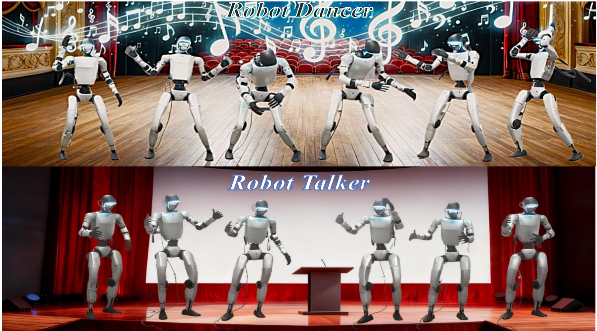

**[Image: figure_0003.png (1778x987, 1895.0KB)]**

**[Image: figure_0005.png (67x81, 6.3KB)]**

## Abstract

Humans intuitively move to sound, but current humanoid robots lack expressive improvisational capabilities, confined to predefined motions or sparse commands. Generating motion from audio and then retargeting it to robots relies on explicit motion reconstruction, leading to cascaded errors, high latency, and disjointed acoustic-actuation mapping. We propose RoboPerform, the first unified audio-to-locomotion framework that can directly generate music-driven dance and speech-driven co-speech gestures from audio. Guided by the core principle of 'motion = content + style', the framework treats audio as implicit style signals and eliminates the need for explicit motion reconstruction. RoboPerform integrates a ResMoE teacher policy for adapting to diverse motion patterns and a diffusion-based student policy for audio style injection. This retargeting-free design ensures low latency and high fidelity. Experimental validation shows that RoboPerform achieves promising results in physical plausibility and audio alignment, successfully transforming robots into responsive performers capable of reacting to audio.

## 1. Introduction

Humans move to sound. A drumbeat invites a step; a rising melody prompts a leap; spoken emphasis naturally evokes a gesture. These responses are not mere kinematic mimicry but arise from an intrinsic understanding of rhythm, phrasing, and intent, which is a process where perception precedes imitation. In contrast, most humanoid locomotion systems today are either constrained to mimic pre-defined motion clips [4, 7, 8, 10, 16, 28, 43] or to follow sparse language commands [23, 36, 45]. While effective for simple scripting, these interfaces lack the capacity for expressive, contextsensitive control, and they bypass a crucial question for performative robots: Do you have freestyle?

We argue that humanoid locomotion is fundamentally a generative problem: given a conditioning signal, synthesize physically plausible, stylistically aligned, and semantically grounded motion. This view invites richer modalities beyond text and motion capture, particularly audio, which is dense in temporal structure yet compact to transmit. Music encodes beat, tempo, and timbre that shape movement style; speech carries prosody, emphasis, and discourse rhythm that cue co-speech gestures. Treating audio as a first-class control signal transforms the robot from a replica to a performer: from mechanically replaying dance poses to improvising to the soundtrack; from reading a script to speaking with embodied gestures.

However, dominant pipelines are ill-suited for audioconditioned control. Explicitly generating human motion via audio-driven motion generators [2, 24, 26], followed by retargeting and tracking to the robot via a controller, inherently introduces three systemic issues: (1) cascaded error accumulation across decoding, retargeting, and tracking, which degrades both expressive fidelity and physical consistency; (2) significant inference latency induced by sequential multi-stage processing, which hinders practical deployment and rapid iteration; (3) loose coupling between high-level acoustic cues and low-level joint actuation, each module is optimized in isolation, failing to preserve fine-grained expressions such as style, timing, and dynamics. Building on this observation, a more direct and natural insight emerges: bypass explicit motion reconstruction, directly encode raw audio, and treat stylistic elements (e.g., beats, prosody, and energy envelopes) as implicit control signals to modulate and refine humanoid locomotion.

Our key insight is simple: motion = content + style . Building on latent motion representations [23], we define content as a high-level motion latent which is encoded from a text command (e.g., 'a person is dancing') via a text-tomotion model to specify the core task. We treat style as the audio signal (e.g., music beats or speech prosody), which dictates how that task is performed. We introduce RoboPerform , a teacher-student framework designed to realize this decomposition. The teacher policy utilizes a ∆ MoE, a residual mixture-of-experts architecture, where its experts specialize in diverse motion regimes and complement one another. This knowledge is then distilled into the student policy, a diffusion-based generator. This student policy explicitly decomposes the generation: it is conditioned on the content latent to preserve the core task, while simultaneously injecting the audio-driven style latents. This design achieves our goal, enabling the robot to perform the core task while precisely aligning its movements with acoustic details, such as synchronized steps to the beat and nuanced gestures aligned with prosody.

Concretely, RoboPerform guides its diffusion policy using two distinct sets of latents: high-level content latents that define the core task, and temporally-aligned style latents that encode kinematic and prosodic details. These combined latents serve as expressive anchors that guide the student policy to denoise executable actions on the humanoid. This retargeting-free, latent-driven design improves overall inference efficiency, enhances motion fidelity, and ensures finegrained temporal alignment via the motion latent space. It scales across behaviors, from rhythm- and genre-conditioned freestyle dance to presenter-style co-speech gestures that improve clarity and engagement.

Extensive experiments validate the effectiveness and practicality of RoboPerform across both music-to-dance and speech-to-gesture. RoboPerform delivers temporally aligned, physically plausible motion with smoother style control and significantly higher inference efficiency than retargetingbased pipelines. We further demonstrate its capabilities, enabling humanoids to perform freestyle dance to music and function as hosts, which are presented in Figure 1. In short, RoboPerform reframes humanoid control around audio, moving from motion replay to responsive performance.

Our contributions can be summarized as follows:

- To our knowledge, RoboPerform is the first framework to utilize audio as an implicit control modality for unified humanoid locomotion and gestural expression, bridging what is heard with how a humanoid moves.
- We propose ∆ MoE in the teacher policy specializes in diverse motion regimes via a mixture-of-experts design, while the student policy decomposes motion into content and style to inject audio-driven style signals into a diffusion-based generator, preserving timing fidelity and reducing end-to-end latency.
- We validate RoboPerform through extensive experiments across music-to-dance and speech-to-gesture tasks, demonstrating physically plausible, stylistically aligned, and realtime synchronized motion, enabling freestyle performance and embodied speech gestures.

## 2. Related Work

## 2.1. Humanoid Whole-body Control

Traditional model-based whole-body control methods achieve precise task execution via accurate dynamics models [5, 38], but suffer from intricate modeling and limited generalization across skills or unmodeled dynamics. Learning-based paradigms rely on manually designed taskspecific rewards, succeeding in locomotion [41], jumping [33], and fall recovery [11, 14, 21] while requiring elaborate reward engineering and struggling to generate humanlike motions. Some studies decompose control into independent policies [19, 48], compromising inter-body coordi- nation, while others use hierarchical frameworks for tasks like table tennis [39]. Whole-body motion tracking offers a paradigm shift [7]: it takes human motion as reference, formulating a unified control goal that obviates task-specific reward design and inherently fosters human-like coordination across diverse skills.

## 2.2. Humanoid Motion Tracking

Humanoid motion tracking learns lifelike behaviors from human motion data. DeepMimic [32] pioneers a phase-based framework with random initialization and early termination for single-motion imitation. ASAP [9] addresses the simto-real gap via a multi-stage pipeline with a delta-action model for dynamic skills. HuB [47] and KungfuBot [43] use elaborate processing to accurately imitate highly dynamic single motions.

For unified multi-motion policies, OmniH2O [8] introduces a universal controller inspiring subsequent works. ExBody2 [16] enhances expressiveness via target decomposition and filtering. TWIST [46] and CLONE [20] achieve high-quality tracking but are tailored to teleoperation and low-dynamic motions. BumbleBee [42] uses motion clustering, expert policy training, and distillation. GMT [4] enables robust dynamic motion tracking by prioritizing root velocity and pose over global position. UniTracker [44] supports dynamic tracking but lacks stability in long sequences due to global target dependence. BeyondMimic [25] achieves highfidelity single-motion tracking via specialized objectives and system identification, further using a distilled diffusion policy for task control. Kungfubot2 proposes an orthogonal MoE for general motion tracking, enabling versatile skill learning. Building on these, we develop a universal policy for audio-driven humanoid action generation, endowing humanoids with the ability to perform.

## 2.3. Modality-driven Humanoid Locomotion

Recent works explore language-guided locomotion. LangWBC [36] trains a compact auxiliary network for online motion generation but lacks scalability to complex distributions and unseen instructions. RLPF [45] finetunes an LLM with physical feasibility feedback from a tracking policy to align semantics with kinematics, but risks catastrophic forgetting due to decoder-focused gradient updates. RoboGhost [23] proposes a latent-driven retargeting-free framework to reduce error accumulation and latency, treating locomotion as a generation task but only using language as input. In this work, we first leverage audio modality as a conditioning signal for humanoid locomotion, achieving "motion synchronized with sound."

## 3. Method

## 3.1. Overview

We present a novel audio-driven framework for humanoid motion generation, eliminating error-prone retargeting to enable stylistically aligned, physically plausible actions via fused audio semantics and motion control. As shown in Figure 2, its core includes three components: a Delta Mixture of Experts ( ∆ MoE) teacher policy, an InfoNCE-optimized audio-motion alignment module, and a diffusion-based student policy with content-style disentanglement. It addresses generating expressive motions (e.g., dance and gesture) directly from audio without motion templates or pose estimation.

It begins with audio-motion alignment: an adaptor augmented with temporal attention processes raw audio latents l audio, aligning them with motion latents l motion via the InfoNCE loss. This design embeds kinematic priors into audio latents, obviating the need for a dedicated audio-tomotion generator and ensuring rhythmic consistency between audio and motion. For robust teacher policy training, we propose ∆ MoE, which partitions 3D conditional inputs into nested subspaces { S i } 4 i =1 for four experts. A gating network dynamically weights experts via residual fusion ( a = w 1 a 1 + ∑ 4 i =2 w i ( a i -a i -1 ) ), eliminating redundancy and enhancing expert complementarity. We then distill this oracle policy into a diffusion-based student policy grounded in the "motion=content+style" insight: motion latents from pretrained motion generator guide denoising, while aligned audio latents are injected across diffusion layers to modulate rhythmic expression.

By integrating alignment, specialized teaching, and disentangled diffusion control, our framework achieves direct audio-to-action mapping with low latency and strong generalization. It uniquely enables audio-driven freestyle dance and speech-accompanied gestures, setting a new paradigm for retargeting-free, expressive humanoid control.

## 3.2. Delta Mixture of Experts

To maximize the diversity and complementarity of knowledge learned by different components, each of which processes a distinct subset of input conditions, we propose ∆ MoE as the teacher policy in Figure 3. The core design of ∆ MoE hinges on nested conditional subspace partitioning and residual incremental learning, which enforces mutual complementarity among experts while eliminating information redundancy. Fundamentally, ∆ MoE can be interpreted as a structured generalization of Classifier-Free Guidance (CFG) [12] to continuous, multi-dimensional conditional settings, providing a rigorous theoretical foundation for its residual fusion mechanism.

We formalize conditional inputs as a 3D vector c = [ c 1 , c 2 , c 3 ] T ∈ R 3 . In standard CFG, models are trained in both conditional p ( a | c ) and unconditional p ( a ) forms, with inference leveraging interpolated fusion:

Figure 2. Overview of RoboPerform. We propose a two-stage approach: train an adaptor to inject kinematic information into audio modality, then a ∆ MoE teacher policy is trained with RL and a diffusion-based student policy is trained to denoise actions conditioned on audio latent. We propose that motion=content+style. Thus, we fix the motion latent as a constant condition and leverage different audio signals as style modulation signals to generate actions adaptive to diverse rhythms.

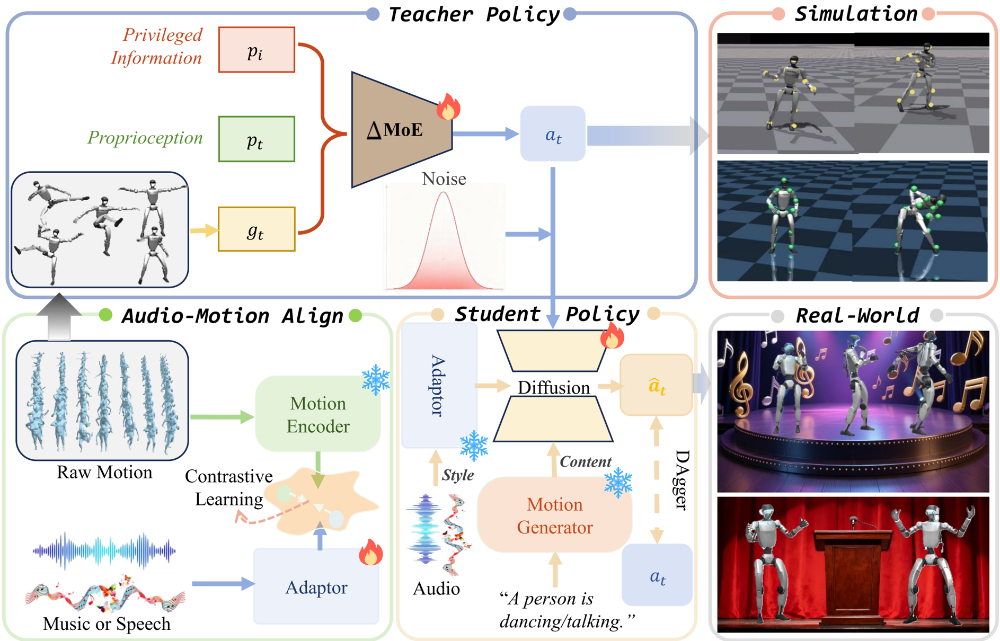

**[Image: figure_0035.png (1887x1210, 1034.2KB)]**

Figure 3. Overview of ∆ MoE.

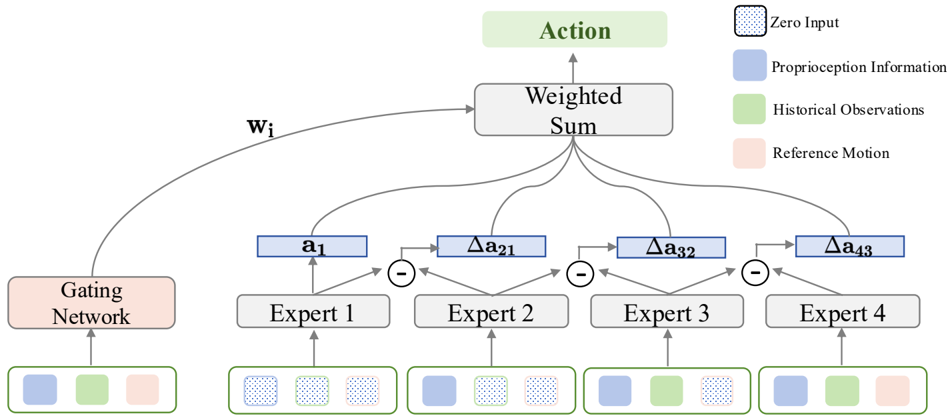

**[Image: figure_0037.png (947x419, 81.2KB)]**

<!-- formula-not-decoded -->

In the log-space, this translates to an additive update that balances conditional alignment and unconditional diversity:

<!-- formula-not-decoded -->

∆ MoE extends this core insight to a nested hierarchy of partial conditions, defining a filtration of conditional subspaces:

<!-- formula-not-decoded -->

∆ MoE employs 4 experts { e i } 4 i =1 , where each expert e i models a policy π i ( a | c S i ) that depends solely on the subspace S i : e 1 takes S 1 = { 0 } as input (modeling the unconditional prior p ( a ) ), e 2 conditions on S 2 = { c 1 , 0 , 0 } , e 3 uses S 3 = { c 1 , c 2 , 0 } as input, e 4 conditions on S 4 = { c 1 , c 2 , c 3 } , modeling the full conditional p ( a | c ) .

A gating network processes c to output normalized weights w = [ w 1 , ..., w 4 ] T ( ∑ w k = 1 ). Residual fusion yields the final action:

<!-- formula-not-decoded -->

where a i is e i 's output, and ∆ a i = a i -a i -1 ( a 0 = 0 ) denotes the marginal contribution of introducing the i -th conditional dimension. This formulation is equivalent to a weighted sum of conditional increments:

<!-- formula-not-decoded -->

Each ∆ a i directly analogizes to the guidance term in CFG, quantifying the 'information gain' from adding the i -th conditional dimension, just as CFG's residual term disentangles conditional and unconditional signals, ∆ a i ensures non-overlapping contributions across experts. This disentanglement eliminates information redundancy while enforcing mutual complementarity: experts do not compete for shared signals but instead specialize in distinct conditional increments.

We adopt ∆ MoE as our oracle policy, which takes both robot state observations and reference motion as input, and outputs the final action a t optimized with several rewards. By generalizing CFG's residual contrast to hierarchical conditional subspaces, ∆ MoE achieves both precise conditional alignment via structured incremental learning and robust generalization via complementary expert knowledge.

## 3.3. Audio-Motion Alignment

To directly guide action generation by conditioning the policy on the audio latent, thereby circumventing the need to train a dedicated audio-to-motion generator, we endow the audio latent with kinematic information. Specifically, we train an audio adaptor to align the audio latent l audio with the motion latent l motion. The adaptor consists of a 6-layer Transformer [40] that processes the audio latent, augmented with temporal attention to capture rhythmic structures inherent in the audio. The motion latent is extracted from our pretrained VAE, and the entire alignment process is optimized using the InfoNCE loss [30], effectively embedding kinematic priors into the audio latent through the adaptor.

̸

Formally, given a batch of N paired audio-motion latents { ( l ( i ) audio , l ( i ) motion ) } N i =1 , we treat each pair ( i, i ) as a positive sample and all other ( i, j ) with j = i as negative samples. Let sim ( u, v ) = u ⊤ v τ denote the scaled cosine similarity between two normalized latent vectors, where τ &gt; 0 is a temperature hyperparameter. The InfoNCE loss is then defined as:

<!-- formula-not-decoded -->

This objective encourages the adaptor to map audio latents closer to their corresponding motion latents in the embedding space while pushing them away from unrelated ones.

## 3.4. Audio-conditioned Policy Distill

We posit that motion=content+style . In the context of dance or gesture, the audio serves primarily as a style cue, modu- lating the underlying motion content in accordance with its rhythmic and temporal structure. To instantiate this disentanglement, we first encode high-level semantic descriptions, e.g., 'The person is dancing to the music' or 'The person is giving a speech' into a motion latent using a pretrained motion generator. During training, all motions share the same motion latent, which provides the content of the generated action. This motion latent is then employed as the primary conditioning signal to guide the denoising process in the diffusion model.

Subsequently, the aligned audio latent is injected as an external style control signal into the diffusion backbone at multiple layers, which can be formulated as:

<!-- formula-not-decoded -->

where o i denotes the output of layer i . This progressive injection steers the denoising trajectory toward rhythmically stylized motion, effectively modulating the base motion content in an audio-aware manner.

Follwing a DAgger-like approach [34], we roll out the student policy in simulation and query the teacher for optimal actions ˆ a at visited states. We employ a diffusion model as the student policy to perform action denoising. The forward process progressively corrupts the clean action a by adding Gaussian noise over T timesteps, yielding noisy samples x t = √ ¯ α t a + √ 1 -¯ α t ϵ , where ϵ ∼ N ( 0 , I ) and ¯ α t = ∏ t s =1 α s denotes the cumulative signal-to-noise ratio at timestep t . For tractability, we adopt an x 0 -prediction parameterization, where the student policy ϵ θ ( x t , t ) is trained to predict the original clean action a . Specifically, we define the reconstructed action as ˆ a t = x t - √ 1 -¯ α t ϵ θ ( x t ,t ) √ ¯ α t and supervise the model by minimizing the mean squared error loss L = ∥ a -ˆ a t ∥ 2 2 .

## 4. Experiments

We evaluate RoboPerform on two tasks, including musicdriven and speech-driven humanoid control, and rigorously assess whether humanoid locomotion can be effectively generated from audio alone. Specifically, the input audio is first encoded and then processed by a pretrained adaptor to produce a representation aligned with the motion latent space, which is subsequently fed into a policy network to generate executable actions. In our experiments, both the teacher and student policies are trained in the IsaacGym simulation environment, and the student policy is directly deployed on the Unitree G1 humanoid robot for real-world validation.

## 4.1. Experimental Setups

Dataset We train our model on FineDance [18] and BEAT2 [26] datasets. BEAT2 has 76 hours of data from 30 speakers, standardized into a mesh representation with paired audio. FineDance is a fine-grained 3D full-body dataset, which has 7.7 hours of dance motion. It provides the SMPL-H [31] format motion data and music feature extracted by librosa. All motions are sampled at 30FPS. Due to the excessive length of the original data, we segment each motion sequence and its corresponding audio into 10-second clips for both training and evaluation.

Figure 4. T-SNE visualization results of each component for ∆ MoE and vanilla MoE.

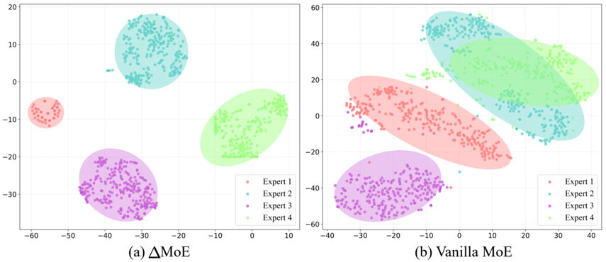

**[Image: figure_0067.png (855x370, 148.6KB)]**

Table 1. Audio-motion alignment performance on the BEAT2 and FineDance test sets.

| Method        |   R@1 ↑ |   R@2 ↑ |   R@3 ↑ |   MM-Dist ↓ |
|---------------|---------|---------|---------|-------------|
| Music-Motion  |    66.7 |    78.8 |    83.5 |       1.154 |
| Speech-Motion |    64.6 |    76.5 |    82.1 |       1.232 |

Metrics We adopt two categories of evaluation metrics: audio-motion retrieval and motion tracking. For audiomotion retrieval, we only report retrieval precision R@1,2,3 to evaluate the ability of audio adaptor. For motion tracking, evaluated in physics simulators aligning with prior works [8], we use success rate as the core indicator, supplemented by mean per-joint position error ( E MPJPE) and mean perkeypoint position error ( E MPKPE). Detailed metric definitions are provided in the Appendix.

Implementation Details In ∆ MoE, we employ 4 MLPbased experts together with an MLP gating network that assigns a weight to each expert. Since the FineDance dataset provides pre-encoded music features, we do not train a music encoder; however, for speech from the BEAT2 dataset, we adopt the temporal convolutional network from EMAGE [26] to learn speech representations. We train a 9-layer, 4-head transformer as the motion V AE and a 6-layer, 4-head transformer as the music adaptor, where temporal attention is explicitly incorporated to capture temporal dynamics. During DAgger training, we utilize a 4-layer MLP as the backbone of the diffusion model, with conditioning injected via AdaLN [15]. At inference, we employ a two-step DDIM sampling [37] schedule to ensure real-time performance during deployment. Further details regarding policy training can be found in the Appendix.

Figure 5. Ablation study on tracking performance of music-todance and speech-to-gesture tasks in IsaacGym and MuJoCo. The baseline uses pretrained motion generators for each task to generate motions, which drive the student policy for action generation.

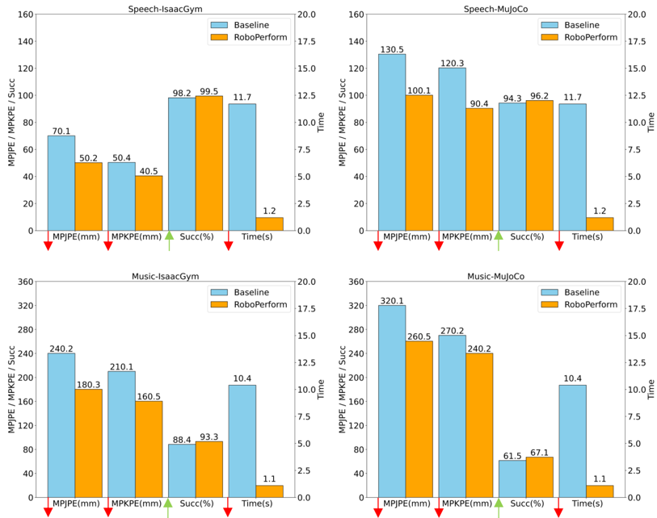

**[Image: figure_0073.png (813x642, 112.9KB)]**

## 4.2. Evaluation of Audio-Motion Retrieval

To evaluate the alignment capability of the audio adaptor, we conduct alignment evaluation on the test sets of FineDance and BEAT2, specifically assessing whether the model can accurately align a given audio segment to the motion latent space to retrieve the corresponding motion latent. The results are shown in Table 1.

## 4.3. Evaluation of Motion Tracking

To further validate the motion tracking performance of our policy, we evaluate it on two audio-driven locomotion tasks: speech-to-locomotion and music-to-locomotion, reporting task success rate, E mpjpe, E mpkpe in IsaacGym and MuJoCo. The pipeline operates as follows: (i) the input audio is encoded and processed by our trained adaptor to inject kinematic priors into the audio features; (ii) the resulting motionaligned latent representation conditions the student policy to generate physically executable actions. As shown in Table 2, our method achieves high task success rates on both the FineDance and BEAT2 datasets, along with low joint and keypoint errors, indicating strong alignment between audio semantics and feasible locomotion trajectories. The baseline employs pretrained models EMAGE [26] and FineNet [18] to first generate a deterministic motion, which is then retargeted to G1 and executed by an explicit motion-driven policy based MLP.

## 4.4. Qualitative Results

We conduct a qualitative assessment of the motion tracking policy across three deployment settings: simulation (IsaacGym), cross-simulator transfer (MuJoCo), and real-world execution on the Unitree G1 humanoid robot. Figure 6 presents representative tracking sequences, highlighting the policy's ability to adhere to audio rhythm, maintain balance during dynamic transitions, and generalize across diverse physics engines and hardware platforms. Additional qualitative results in simulation and real-world settings are provided in Appendix.

Figure 6. Qualitative results in the IsaacGym and MuJoCo. The upper half presents the tracking performance of music-to-locomotion, and the lower half presents that of speech-to-locomotion.

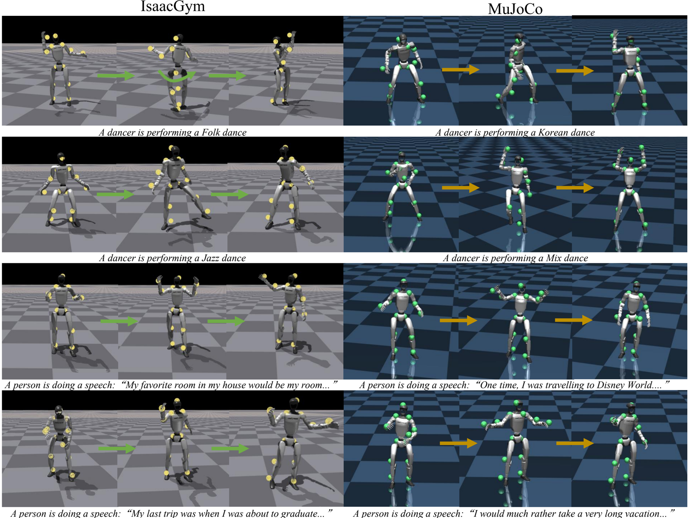

**[Image: figure_0081.png (1652x1243, 1340.3KB)]**

Table 2. Motion tracking performance comparison in simulation on the BEAT2 and FineDance test sets.

| Method    | IsaacGym   | IsaacGym   | IsaacGym    | MuJoCo    | MuJoCo    | MuJoCo    |
|-----------|------------|------------|-------------|-----------|-----------|-----------|
| Method    | Succ ↑     | E mpjpe    | ↓ E mpkpe ↓ | Succ ↑    | E mpjpe ↓ | E mpkpe ↓ |
| BEAT2     | BEAT2      | BEAT2      | BEAT2       | BEAT2     | BEAT2     | BEAT2     |
| Baseline  | 0.98       | 0.07       | 0.05        | 0.94      | 0.13      | 0.12      |
| Ours      | 0.99       | 0.05       | 0.04        | 0.96      | 0.10      | 0.09      |
| FineDance | FineDance  | FineDance  | FineDance   | FineDance | FineDance | FineDance |
| Baseline  | 0.88       | 0.24       | 0.21        | 0.61      | 0.32      | 0.27      |
| Ours      | 0.93       | 0.18       | 0.16        | 0.67      | 0.26      | 0.24      |

## 4.5. Ablation Studies

To systematically validate the effectiveness of the proposed method, we present a set of ablation studies in this section, covering four key aspects: (1) the efficacy of ∆ MoE, (2) a comparison between pose-driven and audio-driven locomotion, (3) the necessity of semantic content for locomotion generation, and (4) the necessity of audio adaptor. More ablation studies can be seen in the Appendix.

Table 3. Ablation study on vanilla MoE and ∆ MoE across both BEAT2 and FineDance datasets.

| Method      | IsaacGym   | IsaacGym   | IsaacGym   | MuJoCo    | MuJoCo    | MuJoCo    |
|-------------|------------|------------|------------|-----------|-----------|-----------|
| Method      | Succ ↑     | E mpjpe    | E mpkpe ↓  | Succ ↑    | E mpjpe ↓ | E mpkpe ↓ |
| BEAT2       | BEAT2      | BEAT2      | BEAT2      | BEAT2     | BEAT2     | BEAT2     |
| Vanilla MoE | 0.97       | 0.14       | 0.1        | 0.94      | 0.16      | 0.14      |
| ∆ MoE       | 0.99       | 0.05       | 0.04       | 0.96      | 0.10      | 0.09      |
| FineDance   | FineDance  | FineDance  | FineDance  | FineDance | FineDance | FineDance |
| Vanilla MoE | 0.89       | 0.24       | 0.22       | 0.61      | 0.29      | 0.26      |
| ∆ MoE       | 0.93       | 0.18       | 0.16       | 0.67      | 0.26      | 0.24      |

Audio-driven Vs Pose-driven To compare against explicit pose-driven approaches, we generate motions using EMAGE and FineNet and deploy the resulting explicit motion se- quences for execution. The time cost reports the full inference latency, baseline encompasses both motion generation and retargeting; specifically, we employ a 1000-iteration PBHC retargeting [43] procedure. As shown in Figure 5, such explicit action generation not only incurs additional computational overhead but also degrades task success rates and introduces extra tracking error.

Table 4. Ablation study on whether to incorporate content information. Herein, the content for both tasks is fixed, with the same content latent used in each inference.

| Method              | IsaacGym   | IsaacGym   | IsaacGym    | MuJoCo    | MuJoCo    | MuJoCo    |
|---------------------|------------|------------|-------------|-----------|-----------|-----------|
| Method              | Succ ↑     | E mpjpe    | ↓ E mpkpe ↓ | Succ ↑ E  | mpjpe ↓   | E mpkpe ↓ |
| BEAT2               | BEAT2      | BEAT2      | BEAT2       | BEAT2     | BEAT2     | BEAT2     |
| - Content           | 0.96       | 0.11       | 0.09        | 0.91      | 0.12      | 0.10      |
| + Content           | 0.99       | 0.05       | 0.04        | 0.96      | 0.10      | 0.09      |
| FineDance           | FineDance  | FineDance  | FineDance   | FineDance | FineDance | FineDance |
| - Content + Content | 0.91       | 0.20       | 0.17        | 0.66      | 0.25      | 0.24      |
|                     | 0.93       | 0.18       | 0.16        | 0.67      | 0.26      | 0.24      |

∆ MoE Vs Vanilla MoE To investigate the performance gain introduced by our ∆ MoE, we conduct an ablation study comparing the tracking performance of vanilla MoE and ∆ MoE. As shown in Table 3, ∆ MoE yields consistently more accurate tracking.

Additionally, we visualize every component in MoE using t-SNE. For vanilla MoE, each component corresponds to the output of an individual expert. As illustrated in Figure 4 (b), the features learned by each expert exhibit significant overlap, failing to achieve mutually independent information specialization across experts. In contrast, the components of ∆ MoE correspond to the differences between experts conditioned on distinct signals (except for the first expert, which is conditioned on a zero vector). As shown in Figure 4 (a), we perform clustering on { a 1 , a 2 -a 1 , . . . , a 4 -a 3 } . The results demonstrate that each component is mutually independent, which fully exploits the capacity of individual experts and enhances generalization. This mechanism is analogous to creating a complete painting: starting with a blank canvas, we incrementally add contour and color information, where each stroke introduces non-redundant details until the artwork is fully realized.

With Content Vs Without Content We posit that motion can be decomposed into content and style. For expressive motions such as dance and speech gestures, audio serves primarily as a style modulation signal that shapes the temporal structure, such as rhythm and beat patterns, rather than prescribing fine-grained kinematics. Accordingly, we treat the content latent from a pretrained motion generative model as the primary control signal, and progressively inject audio features into the diffusion process to modulate the denoising trajectory. Herein, LaMP-T2M [22] is adopted as the motion generator for both tasks. For the music-to-dance task, the input text is "The person is dancing to the music" , while for the speech-to-gesture task, the input text is "The person is giving a speech" . This design ensures that the generated actions preserve semantic content while aligning with the temporal dynamics of the input audio. As shown in Table 4, policies conditioned on the content latent achieve significantly more accurate tracking performance.

Table 5. Ablation study on whether to use adaptor inject kinematic information into audio modality. It can be observed that adaptor successfully aligns the audio and motion, improving the tracking performance and success rate.

| Method      | IsaacGym   | IsaacGym   | IsaacGym    | MuJoCo    | MuJoCo    | MuJoCo      |
|-------------|------------|------------|-------------|-----------|-----------|-------------|
|             | Succ ↑     | E mpjpe    | ↓ E mpkpe ↓ | Succ ↑    | E mpjpe   | ↓ E mpkpe ↓ |
| BEAT2       | BEAT2      | BEAT2      | BEAT2       | BEAT2     | BEAT2     | BEAT2       |
| - Adaptor   | 0.88       | 0.29       | 0.27        | 0.83      | 0.36      | 0.35        |
| + Adaptor   | 0.99       | 0.05       | 0.04        | 0.96      | 0.10      | 0.09        |
| FineDance   | FineDance  | FineDance  | FineDance   | FineDance | FineDance | FineDance   |
| - Adaptor + | 0.79       | 0.49       | 0.48        | 0.51      | 0.58      | 0.53        |
| Adaptor     | 0.93       | 0.18       | 0.16        | 0.67      | 0.26      | 0.24        |

With Adaptor Vs Without Adaptor To demonstrate that enriching the control signal with kinematic information leads to more accurate and rhythmically coherent action generation, we conduct an ablation study on the use of the audio adaptor. As shown in Table 5, when the control signal is aligned with the motion latent space and imbued with kinematic cues via the adaptor, it more effectively guides motion synthesis, yielding improved tracking accuracy and stronger rhythmic alignment. Additionally, we report the rhythm hit rate, a metric quantifying the temporal correspondence between generated motions and musical beats.

## 5. Conclusion

We present RoboPerform, a retargeting-free audio-tolocomotion framework that unifies music-driven dance and speech-driven co-speech gesture generation for humanoids. By formulating motion = content + style, our approach leverages a pretrained motion latent for semantic grounding and injects rhythm-aware audio features into a diffusion-based policy. Our proposed ∆ MoE enhances behavioral diversity, while content-style disentanglement ensures temporally coherent and physically plausible execution. RoboPerform achieves better tracking performance and faster speed during deployment. It reframes humanoid control as an expressive act, answering the question: Yes, humanoids can freestyle.

## Do You Have Freestyle? Expressive Humanoid Locomotion via Audio Control

## Supplementary Material

action is obtained through a weighted sum of the outputs of all experts, where the weights w i are generated by a gating network. The student policy is trained with DAgger, lacking access to privileged information and explicit reference motion, instead relying on extended observation histories and audio latent representations to enable a retargeting-free, audio latent-driven pipeline. First, audio features are extracted from the input audio. Then, our pretrained adaptor is utilized to infuse kinematic information into the audio features, enabling them to guide humanoid action generation more effectively. The inputs of student policy are concatenated and fed as conditions to a diffusion model with an MLP backbone, where AdaLN injects conditional signals throughout the denoising process. A final MLP layer projects the backbone output to the 23-dimensional action space, with conditional signals further integrated for alignment. Detailed hyperparameters for both policies are listed in Table 8.

## Appendix Overview

This appendix provides additional details and results, organized as follows:

- Section 6 : Elaboration on some details during training, including dataset details, motion filter and retargeting, simulator, domain randomization, regularization, reward functions, curriculum learning, and adaptive sigma.
- Section 7 : Details about evaluation, including metrics about motion tracking and motion-audio alignment.
- Section 8 : Additional experiments, including audiomotion alignment evaluation, ablation studies on ∆ MoE and diffusion policy.
- Section 9 : Extra qualitative experiment results and visualizations, including in the simulation and in the real-world.

## 6. Implementation Details

This section details the state representation for policy training, including proprioceptive states, privileged information, and network hyperparameters. As summarized in Table 6, the proprioceptive state components are shared between the teacher and student policies, with a critical distinction: the student policy leverages an extended observation history to compensate for the absence of privileged information, substituting temporal context for direct auxiliary signals.

Our proprioceptive information includes joint positions, joint velocities, root angular velocity, root projected gravity, and the aforementioned information from four historical frames, which is elaborated in Table 6. For privileged information, it forms the observation of the critic network together with proprioceptive information. Unlike prior works where both teacher and student policies receive explicit reference motion as part of observations, our framework restricts these target signals exclusively to the teacher. By contrast, the student policy additionally takes proprioceptive states from 25 historical frames, motion latents for content representation, and audio latents for style representation as inputs. The audio latents first feed into a pretrained adaptor to infuse kinematic information. Full details of the target state are provided in Table 7. Both policies output 23-dimensional target joint positions.

The teacher policy is trained via PPO [35], taking privileged information, motion tracking targets, and proprioceptive states as inputs, which are concatenated and processed by ∆ MoE. The first expert takes all zeros as conditions to predict action a 1 . The second expert only receives proprioceptive states as conditions, with all remaining positions filled with zeros. This pattern continues such that the fourth expert accepts all conditions to output action a 4 . The final Motion Filter and Retargeting Following [43], we quantify stability by computing the ground-projected distance between the center of mass (CoM) and center of pressure (CoP) for each frame, with a predefined stability threshold. Let ¯ p CoM t = ( p CoM t,x , p CoM t,y ) and ¯ p CoP t = ( p CoP t,x , p CoP t,y ) represent the 2D ground projections of CoM and CoP at frame t , respectively. We define ∆ d t = ∥ ¯ p CoM t -¯ p CoP t ∥ 2 as this distance. A frame is considered stable if ∆ d t &lt; ϵ stab. A motion sequence is retained if its first and last frames are stable, and the longest consecutive unstable segment has fewer than 100 frames.

Simulator Following established protocols in motion tracking policy research [9, 16], we adopt a three-stage evaluation pipeline: first, large-scale reinforcement learning training in IsaacGym; second, zero-shot transfer to MuJoCo to assess cross-simulator generalization; third, physical deployment on the Unitree G1 humanoid platform to validate real-world performance.

Reference State Initialization Task initialization is critical for reinforcement learning (RL) training. We observe that naively initializing episodes at the start of reference motions often leads to policy failure, especially for complex motions. This can cause the environment to overfit to simpler frames, neglecting the most challenging motion segments.

To address this, we adopt the Reference State Initialization (RSI) framework [32]. Specifically, we uniformly sample time-phase variables over [0,1] to randomize the starting point within the reference motion that the policy must track.

Table 6. Proprioceptive states and privileged information.

| Proprioceptive States           | Proprioceptive States   |
|---------------------------------|-------------------------|
| State Component                 | Dim.                    |
| DoF position                    | 23 × (1+4)              |
| DoF velocity                    | 23 × (1+4)              |
| Last action                     | 23 × (1+4)              |
| Root angular velocity           | 3 × (1+4)               |
| Projected gravity               | 3 × (1+4)               |
| Total dim                       | 75 × 5                  |
| Privileged Information          | Privileged Information  |
| Root linear velocity            | 3 × (1+4)               |
| Reference body position         | 81                      |
| Body position difference        | 81                      |
| Randomized base CoM offset      | 3                       |
| Randomized link mass            | 22                      |
| Randomized stiffness            | 23                      |
| Randomized damping              | 23                      |
| Randomized friction coefficient | 1                       |
| Randomized control delay        | 1                       |
| Total dim                       | 250                     |

Table 8. Hyperparameters for teacher and student policy training.

| Hyperparameter            | Value                  |
|---------------------------|------------------------|
| Optimizer                 | Adam                   |
| β 1 ,β 2                  | 0.9, 0.999             |
| Learning Rate             | 1 × 10 - 3             |
| Batch Size                | 8192                   |
| Teacher Policy            | Teacher Policy         |
| GAE Discount factor ( γ ) | 0.99                   |
| GAE Decay factor ( γ )    | 0.95                   |
| Clip Parameter            | 0.2                    |
| Entropy Coefficient       | 0.01                   |
| Max Gradient Norm         | 1                      |
| Learning Epochs           | 5                      |
| Mini Batches              | 4                      |
| Value Loss Coefficient    | 1.0                    |
| Value MLP Size            | [512, 256, 128]        |
| Actor MLP Size            | [768, 512, 128]        |
| Experts                   | 4                      |
| Student Policy            | Student Policy         |
| MLP Layers                | 4 + 1 (final layer)    |
| MLP Size                  | [1792, 1792, 1792, 23] |

The robot's state, including root position, orientation, linear and angular velocities, and joint positions and velocities, is then initialized to the reference motion's values at the sampled phase. This approach enhances motion tracking performance, particularly for highly dynamic whole-body motions, by enabling the policy to learn diverse movement segments in parallel rather than being constrained to strictly sequential learning.

Table 7. Reference information in the teacher and student policies.

| Teacher Policy        | Teacher Policy   |
|-----------------------|------------------|
| State Component       | Dim.             |
| Proprioceptive states | 75 × 5           |
| DoF position          | 23               |
| Keypoint position     | 81               |
| Root Velocity         | 3                |
| Root Angular Velocity | 3                |
| Root Orientation      | 3                |
| Total dim             | 489              |
| Student Policy        | Student Policy   |
| Motion Latent         | 64               |
| Audio Latent          | 256              |
| Proprioceptive States | × (25+1)         |
| Total dim             | 2270             |

Domain Randomization and Regularization To improve the robustness and generalization of the pretrained policy, we utilize the domain randomization techniques and regularization items, which are listed in Table 9.

Table 9. Domain randomization settings.

| Term                       | Value                       |
|----------------------------|-----------------------------|
| Dynamics Randomization     |                             |
| Friction                   | U (0 . 2 , 1 . 5)           |
| PD gain                    | U (0 . 75 , 1 . 25)         |
| Link mass (kg)             | U (0 . 9 , 1 . 1) × default |
| Ankle inertia (kg · m²)    | U (0 . 9 , 1 . 1) × default |
| Base CoM offset (m)        | U ( - 0 . 05 , 0 . 05)      |
| ERFI [3] (N · m/kg)        | 0 . 05 × torque limit       |
| Control delay (ms)         | U (0 , 40)                  |
| External Perturbation      |                             |
| Random push interval (s)   | [5 , 10]                    |
| Random push velocity (m/s) | 0 . 5                       |

Motion Tracking Rewards As shown in Table 10, we define the reward function as the sum of task rewards and regularization, which are meticulously designed to improve both the performance and motion realism of the humanoid robot. Following [43], we enforce penalties for joint positions exceeding soft limits, which are symmetrically derived from hard limits via a fixed scaling ratio ( α = 0 . 95 ). Specifically, the midpoint m and range d of hard limits are first computed as:

<!-- formula-not-decoded -->

<!-- formula-not-decoded -->

where q min and q max denote the hard limits of joint position q . The soft limits are then determined by:

<!-- formula-not-decoded -->

<!-- formula-not-decoded -->

This computation extends to joint velocity ˙ q and torque τ for their respective soft limits.

Table 10. Reward terms and weights.

| Category       | Term                                                                                                                                                                                     | Expression &Weight                                                                                                                                                                                                                                                                                                                                                                                                                                                            |
|----------------|------------------------------------------------------------------------------------------------------------------------------------------------------------------------------------------|-------------------------------------------------------------------------------------------------------------------------------------------------------------------------------------------------------------------------------------------------------------------------------------------------------------------------------------------------------------------------------------------------------------------------------------------------------------------------------|
| Reward         | Joint position Joint velocity Body position Body rotation Body velocity Body angular velocity Body position VR 3 points                                                                  | exp ( - ∥ q t - ˆ q t ∥ 2 2 σ jpos ) , 1 . 0 exp ( - ∥ ˙ q t - ˆ ˙ q t ∥ 2 2 σ jvel ) , 1 . 0 exp ( - ∥ p t - ˆ p t ∥ 2 2 σ pos ) , 1 . 0 exp ( - ∥ θ t ⊖ ˆ θ t ∥ 2 2 σ rot ) , 0 . 5 exp ( - ∥ v t - ˆ v t ∥ 2 2 σ vel ) , 0 . 5 exp ( - ∥ ω t - ˆ ω t ∥ 2 2 σ ang ) , 0 . 5 exp ( - ∥ p vr ,t - ˆ p vr ,t ∥ 2 2 σ pos_vr ) , 1 . 6 exp ( - ∥ p feet ,t - ˆ p feet ,t ∥ 2 2 σ pos_feet ) , 1                                                                                 |
| Regularization | Body position feet Max Joint position Contact Mask Joint position limits Joint velocity limits Joint torque limits Slippage Feet contact forces Feet air time Stumble Torque Action rate | . 0 exp ( - ∥ q t - ˆ q t ∥ ∞ σ max_jpos ) , 1 . 0 1 - ∥ c t - ˆ c t ∥ 1 2 , 0 . 5 I ( q / ∈ [ q soft-min , q soft-max ]) , - 10 . 0 I ( ˙ q / ∈ [ ˙ q soft-min , ˙ q soft-max ]) , - 5 . 0 I ( τ / ∈ [ τ soft-min , τ soft-max ]) , - 5 . 0 ∥ v feet ,xy ∥ 2 2 · I [ ∥ F feet ∥ 2 ≥ 1] , - 1 . min ( ∥ F feet - 400 ∥ 2 2 , 0 ) , - 0 . 01 I [ T air > 0 . 3] , - 1 . 0 I [ ∥ F feet ,xy ∥ > 5 · F feet ,z ] , - 2 . 0 ∥ τ ∥ 2 2 , - 10 - 6 ∥ a t - a t - 1 ∥ 2 2 , - 0 . 02 |

Curriculum Learning To imitate highly dynamic motions, we follow [43], introduce two curriculum mechanisms: a termination curriculum that gradually reduces tracking error tolerance, and a penalty curriculum that progressively increases the weight of regularization terms to promote more stable and physically plausible behaviors.

- Termination Curriculum: The episode is terminated early when the humanoid's motion deviates from the reference beyond a termination threshold θ . During training, this threshold is gradually decreased to increase the difficulty:

<!-- formula-not-decoded -->

where the initial threshold θ = 1 . 5 , with bounds θ min = 0 . 3 , θ max = 2 . 0 , and decay rate δ = 2 . 5 × 10 -5 .

- Penalty Curriculum: To facilitate learning in the early training stages while gradually enforcing stronger regularization, we introduce a scaling factor α that increases progressively to modulate the influence of the penalty term:

<!-- formula-not-decoded -->

where the initial penalty scale α = 0 . 1 , with bounds α min = 0 . 0 , α max = 1 . 0 , and growth rate δ = 1 . 0 × 10 -4 .

Adaptive Sigma Inspired by [43], we employ adaptive sigma in the reward function. Task-specific rewards enforce alignment of joint states, rigid body states, and foot contact masks. All except the foot contact term adopt a bounded exponential form:

<!-- formula-not-decoded -->

where x denotes tracking error and σ controls error tolerance. This form outperforms negative error terms by stabilizing training and simplifying reward weighting.

## 7. Evaluation Details

Motion Tracking Metrics For motion tracking evaluation, we employ metrics standard in prior work [16]: Success Rate (Succ), Mean Per Joint Position Error ( E MPJPE), and Mean Per Keybody Position Error ( E MPKPE).

- Success Rate (Succ): Evaluates whether the humanoid successfully follows the reference motion without falling. A trial fails if the average trajectory deviation exceeds 0.5 meters at any point, or if the root pitch angle exceeds a predefined threshold.
- Mean Per Joint Position Error ( E MPJPE, in rad): Quantifies joint-level tracking accuracy via the average error in degree-of-freedom (DoF) rotations between reference and generated motions.
- Mean Per Keybody Position Error ( E MPKPE, in m): Assesses keypoint tracking performance using the average positional discrepancy between reference and generated keypoint trajectories.

Motion-Audio Alignment Metrics We evaluate our audio adaptor using motion-audio alignment metrics: retrieval accuracy (R@1, R@2, R@3), Multimodal Distance (MMDist), and Beat Alignment Score (BAS) [17].

- Retrieval Accuracy (R-Precision): These metrics measure the relevance of audio to corresponding motion in a retrieval setup. R@1 denotes the fraction of audio queries for which the correct motion is retrieved as the top match, reflecting the model's precision in identifying the most relevant motion. R@2 and R@3 extend this notion, indicating recall within the top two and three retrieved motions, respectively.
- Multimodal Distance (MMDist): This quantifies the average feature-space distance between audios and their corresponding motions, typically extracted via a pretrained retrieval model. Smaller MMDist values indicate stronger semantic alignment between audio and motion.
- Beat Alignment Score (BAS): This metric evaluates the temporal alignment quality between kinematic beats and music beats. Audio beats are detected from audio signals using Librosa [29], yielding a timestamp sequence B y = { t j y } where t j y denotes the time of the j -th music beat. Kinematic beats are identified as the local minima of the motion's kinetic velocity, capturing the key rhythmic frames of the motion sequence, resulting in a timestamp sequence B x = { t i x } where t i x denotes the time of the i -th kinematic beat. The BAS metric is defined as the average of exponential-weighted distances between each kinematic beat and its nearest music beat. This exponential formulation emphasizes closer alignments while mitigating the impact of large discrepancies, and it is normalized via a parameter σ to adapt to sequences with fixed FPS. The formal definition is:

<!-- formula-not-decoded -->

where m is the number of kinematic beats in B x . Consistent with our experimental setup (30 FPS), we fix σ = 3 across all evaluations.

## 7.1. Deployment Details

Sim-to-Sim Transfer As noted in Humanoid-Gym [6], MuJoCo delivers more realistic dynamics than Isaac Gym. Aligning with standard protocols in motion tracking policy research [16], we conduct reinforcement learning training in Isaac Gym to capitalize on its high computational efficiency. To evaluate policy robustness and generalization capability, we perform zero-shot transfer to the MuJoCo simulator. This sim-to-sim transfer serves as an intermediate validation step before deploying the policy on a physical humanoid robot to verify the real-world motion tracking efficacy of our framework.

| Method    | IsaacGym   | IsaacGym   | IsaacGym   | MuJoCo    | MuJoCo    | MuJoCo    | BAS ↑     |
|-----------|------------|------------|------------|-----------|-----------|-----------|-----------|
|           | Succ ↑     | E mpjpe ↓  | E mpkpe ↓  | Succ ↑    | E mpjpe   | ↓ E mpkpe | ↓         |
| BEAT2     | BEAT2      | BEAT2      | BEAT2      | BEAT2     | BEAT2     | BEAT2     | BEAT2     |
| Baseline  | 0.98       | 0.08       | 0.06       | 0.94      | 0.16      | 0.14      | 0.163     |
| Ours      | 0.99       | 0.05       | 0.04       | 0.96      | 0.10      | 0.09      | 0.197     |
| FineDance | FineDance  | FineDance  | FineDance  | FineDance | FineDance | FineDance | FineDance |
| Baseline  | 0.86       | 0.26       | 0.23       | 0.58      | 0.35      | 0.32      | 0.176     |
| Ours      | 0.93       | 0.18       | 0.16       | 0.67      | 0.26      | 0.24      | 0.214     |

Table 11. Ablation study on whether to use adaptor to inject kinematic information into the audio modality. It can be observed that the adaptor successfully aligns the audio and motion, improving the tracking performance and success rate.

Sim-to-Real Deployment Real-world experiments are conducted on a Unitree G1 humanoid robot, integrated with an onboard Jetson Orin NX module for computation and communication. The control policy processes motion tracking targets to generate target joint positions, then transmits control commands to the robot's low-level controller at 50Hz, with a communication latency of 18-30ms. The low-level controller operates at 500Hz to guarantee stable real-time actuation. Communication between the high-level policy and low-level interface is implemented via Lightweight Communications and Marshalling (LCM) [13].

## 8. Additional Experiments

Audio-Motion Alignment To evaluate whether the cospeech gestures or dance motions generated by the robot adhere to rhythmic patterns, we compute the BAS for successful cases in the test set. Specifically, we retrieve the joint velocity of the robot's motors and calculate the BAS value by correlating it with music beats. The results are presented in Table 11, where the Baseline corresponds to the outcome of concatenating music latents with other observations and motion latents as inputs to the student policy. It can be observed that when music is treated as an external condition to further modulate the content, the generated actions exhibit superior rhythmic alignment.

Denoising Steps in Student Policy We evaluate DDIM sampling with different denoising steps, measuring average per-action step time. Table 12 shows that increasing steps leads to higher latency, which is critical for real-world humanoid robot deployment as latency degrades execution outcomes.

Noise Scale in Student Policy We ablate the noise scale β max for DDIM sampling to study its impact on performance and latency. Table 13 shows that β max = 0 . 20 achieves optimal success rate.

| Method           |   Avg Time (s) × 10 - 3 |
|------------------|-------------------------|
| DDIM-2 sampling  |                     5.3 |
| DDIM-4 sampling  |                    11.6 |
| DDIM-6 sampling  |                    13.4 |
| DDIM-8 sampling  |                    17.6 |
| DDIM-10 sampling |                    18.9 |

Table 12. Average inference time across DDIM sampling steps.

|   Noise Scale ( β max ) |   Denoising Steps |   Success Rate (%) |
|-------------------------|-------------------|--------------------|
|                    0.10 |                 2 |               92.0 |
|                    0.15 |                 2 |               92.0 |
|                    0.20 |                 2 |               93.0 |
|                    0.25 |                 2 |               91.0 |
|                    0.30 |                 2 |               91.0 |

Note: Fixed settings: cosine noise schedule, DDIM sampling ( η = 0 ), β max denotes the maximum β t over 50 training timesteps.

Table 13. Fine-grained ablation on noise scale.

| Sampling Strategy   |   Denoising Steps |   Success Rate (%) |   Latency (s × 10 - 3 ) |
|---------------------|-------------------|--------------------|-------------------------|
| DDIM ( η = 0 )      |                 2 |               93.0 |                     5.3 |
| DDIM ( η = 0 . 5 )  |                 2 |               86.0 |                     5.3 |
| DDPM (Stochastic)   |                 2 |               65.0 |                     8.6 |

Note: Fixed settings: cosine noise schedule, β max = 0 . 20 , η controls DDIM stochasticity.

Table 14. Fine-grained ablation on sampling strategies in the FineDance dataset.

| Method          | IsaacGym   | IsaacGym   | IsaacGym   | MuJoCo   | MuJoCo   | MuJoCo      |
|-----------------|------------|------------|------------|----------|----------|-------------|
|                 | Succ ↑     | E mpjpe ↓  | E mpkpe    | Succ ↑   | E mpjpe  | ↓ E mpkpe ↓ |
| ϵ -prediction   | 0.72       | 0.46       | 0.43       | 0.49     | 0.58     | 0.56        |
| x 0 -prediction | 0.93       | 0.18       | 0.16       | 0.67     | 0.26     | 0.24        |

Table 15. Tracking performance across optimization objectives in the FineDance dataset.

Noise Schedule Strategies in Student Policy Wecompare three sampling strategies: DDIM ( η = 0 , deterministic), DDIM ( η = 0 . 5 , semi-stochastic), and DDPM (stochastic). Table 14 shows that deterministic DDIM achieves the highest success rate and lowest latency. Stochastic strategies reduce performance and increase latency.

Optimization Objective in Student Policy We ablate two supervision targets for the diffusion policy: ϵ -prediction and x 0 -prediction. Table 15 shows that x 0 -prediction achieves significantly better tracking performance compared to ϵ -prediction.

Experts Number in ∆ MoE We conduct ablation experiments on the number of experts in our ∆ MoE. Since the number of experts in ∆ MoE determines the dimensionality of the condition space, we split the condition into N -1 partitions when training ∆ MoE with different N experts. A critical constraint is that each condition partition c i must contain complete information. For instance, the dof positions in proprioceptive states must not be split in both c 1 and c 2 .

Table 16. Tracking performance across different numbers of experts in the FineDance dataset.

| IsaacGym   | IsaacGym   | IsaacGym   | MuJoCo   | MuJoCo    | MuJoCo   |
|------------|------------|------------|----------|-----------|----------|
| Succ       | ↑ E mpjpe  | E mpkpe ↓  | Succ ↑ E | mpjpe ↓ E | mpkpe ↓  |
| 3          | 0.90 0.23  | 0.21       | 0.63     | 0.30      | 0.28     |
| 4 0.93     | 0.18       | 0.16       | 0.67     | 0.26      | 0.24     |
| 5 0.91     | 0.22       | 0.18       | 0.66     | 0.30      | 0.27     |
| 6 0.92     | 0.21       | 0.18       | 0.67     | 0.27      | 0.24     |

Table 17. Ablation study on the impact of different condition space partitioning methods on tracking performance in the FineDance Dataset.

| Method   | IsaacGym   | IsaacGym   | IsaacGym   | MuJoCo   | MuJoCo    | MuJoCo    |
|----------|------------|------------|------------|----------|-----------|-----------|
|          | Succ ↑ E   | mpjpe ↓ E  | mpkpe      | Succ ↑   | E mpjpe ↓ | E mpkpe ↓ |
| Random   | 0.93       | 0.19       | 0.16       | 0.67     | 0.26      | 0.25      |
| Ours     | 0.93       | 0.18       | 0.16       | 0.67     | 0.26      | 0.24      |

As shown in Table 16, the optimal performance is achieved when the number of experts is set to 4. Furthermore, we verify that with a fixed number of experts, the partitioning of conditions has a negligible impact on the results, which is presented in Table 17.

## 9. Qualitative Results

Simulation To validate the advantages of the diffusion policy in such conditional control tasks, we visualize two cases in simulation. As shown in the upper part of Figure 7, the MLP policy exhibits poor tracking performance. In contrast, the diffusion policy achieves superior tracking results by leveraging its enhanced robustness and ability to model distributions.

Furthermore, we verify the freestyle capability of our policy. As illustrated in the lower part of Figure 7, when fed with a piece of music unseen during training to generate actions, the diffusion policy successfully completes the entire motion sequence due to its strong generalization ability, whereas the MLP policy immediately results in a fall.

Retargeting Method When training the teacher oracle policy, we investigate diverse retargeting approaches, encompassing PHC [27] and GMR [1]. While GMR demonstrates robust performance in mitigating motion penetration, it gives rise to abrupt motion transitions, as visualized in Figure 8. Thus, we ultimately select PHC as the designated retargeting method for subsequent experimental evaluations. The related

## Ours Diffusion Policy

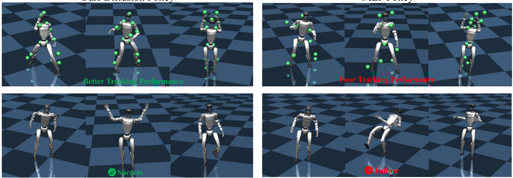

**[Image: figure_0188.png (1889x656, 888.6KB)]**

## MLP Policy

Figure 8. Qualitative results of PHC and GMR retargeting.

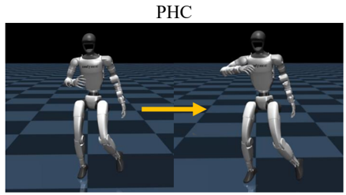

**[Image: figure_0190.png (438x247, 64.5KB)]**

Figure 7. Qualitative results in the MuJoCo. The upper half presents the tracking performance of the MLP policy and the diffusion policy on the same motion; the lower half demonstrates their respective freestyle capabilities when confronted with unseen music.

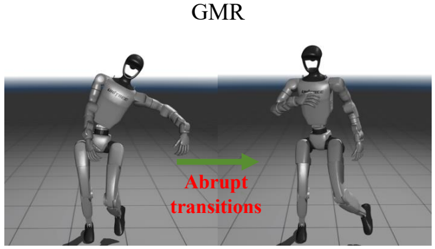

**[Image: figure_0192.png (435x249, 53.3KB)]**

video can be found in the supplementary material.

Real-World We present real-world deployment for musicto-locomotion and speech-to-locomotion tasks, as shown in Figures 9, 10, and 11. A supplementary video showcasing real-robot deployments is provided in the supplementary material.

## References

- [1] Joao Pedro Araujo, Yanjie Ze, Pei Xu, Jiajun Wu, and C Karen Liu. Retargeting matters: General motion retargeting for humanoid motion tracking. arXiv preprint arXiv:2510.02252 , 2025. 5
- [2] Yuxuan Bian, Ailing Zeng, Xuan Ju, Xian Liu, Zhaoyang Zhang, Wei Liu, and Qiang Xu. Motioncraft: Crafting wholebody motion with plug-and-play multimodal controls. In Proceedings of the AAAI Conference on Artificial Intelligence , pages 1880-1888, 2025. 2
- [3] Luigi Campanaro, Siddhant Gangapurwala, Wolfgang Merkt, and Ioannis Havoutis. Learning and deploying robust locomotion policies with minimal dynamics randomization. In 6th Annual Learning for Dynamics &amp; Control Conference , pages 578-590. PMLR, 2024. 2
- [4] Zixuan Chen, Mazeyu Ji, Xuxin Cheng, Xuanbin Peng, Xue Bin Peng, and Xiaolong Wang. Gmt: General motion tracking for humanoid whole-body control. arXiv preprint arXiv:2506.14770 , 2025. 1, 3
- [5] Hartmut Geyer, Andre Seyfarth, and Reinhard Blickhan. Positive force feedback in bouncing gaits? Proceedings of the Royal Society of London. Series B: Biological Sciences , 270 (1529):2173-2183, 2003. 2
- [6] Xinyang Gu, Yen-Jen Wang, and Jianyu Chen. Humanoidgym: Reinforcement learning for humanoid robot with zeroshot sim2real transfer. arXiv preprint arXiv:2404.05695 , 2024. 4
- [7] Jinrui Han, Weiji Xie, Jiakun Zheng, Jiyuan Shi, Weinan Zhang, Ting Xiao, and Chenjia Bai. Kungfubot2: Learning versatile motion skills for humanoid whole-body control. arXiv preprint arXiv:2509.16638 , 2025. 1, 3
- [8] Tairan He, Zhengyi Luo, Xialin He, Wenli Xiao, Chong Zhang, Weinan Zhang, Kris Kitani, Changliu Liu, and Guanya Shi. Omnih2o: Universal and dexterous humanto-humanoid whole-body teleoperation and learning. arXiv preprint arXiv:2406.08858 , 2024. 1, 3, 6
- [9] Tairan He, Jiawei Gao, Wenli Xiao, Yuanhang Zhang, Zi Wang, Jiashun Wang, Zhengyi Luo, Guanqi He, Nikhil Sobanbab, Chaoyi Pan, et al. Asap: Aligning simulation and realworld physics for learning agile humanoid whole-body skills. arXiv preprint arXiv:2502.01143 , 2025. 3, 1
- [10] Tairan He, Wenli Xiao, Toru Lin, Zhengyi Luo, Zhenjia Xu, Zhenyu Jiang, Jan Kautz, Changliu Liu, Guanya Shi, Xiaolong Wang, et al. Hover: Versatile neural whole-body controller for humanoid robots. In 2025 IEEE International Conference on Robotics and Automation (ICRA) , pages 99899996. IEEE, 2025. 1
- [11] Xialin He, Runpei Dong, Zixuan Chen, and Saurabh Gupta. Learning getting-up policies for real-world humanoid robots. arXiv preprint arXiv:2502.12152 , 2025. 2
- [12] Jonathan Ho and Tim Salimans. Classifier-free diffusion guidance. arXiv preprint arXiv:2207.12598 , 2022. 3
- [13] Albert S Huang, Edwin Olson, and David C Moore. Lcm: Lightweight communications and marshalling. In 2010 IEEE/RSJ International Conference on Intelligent Robots and Systems , pages 4057-4062. IEEE, 2010. 4
- [14] Tao Huang, Junli Ren, Huayi Wang, Zirui Wang, Qingwei Ben, Muning Wen, Xiao Chen, Jianan Li, and Jiangmiao Pang. Learning humanoid standing-up control across diverse postures. arXiv preprint arXiv:2502.08378 , 2025. 2
- [15] Xun Huang and Serge Belongie. Arbitrary style transfer in
16. real-time with adaptive instance normalization. In Proceedings of the IEEE international conference on computer vision , pages 1501-1510, 2017. 6
- [16] Mazeyu Ji, Xuanbin Peng, Fangchen Liu, Jialong Li, Ge Yang, Xuxin Cheng, and Xiaolong Wang. Exbody2: Advanced
18. expressive humanoid whole-body control. arXiv preprint arXiv:2412.13196 , 2024. 1, 3, 4
- [17] Ruilong Li, Shan Yang, David A. Ross, and Angjoo Kanazawa. Ai choreographer: Music conditioned 3d dance generation with aist++, 2021. 4
- [18] Ronghui Li, Junfan Zhao, Yachao Zhang, Mingyang Su,
21. Zeping Ren, Han Zhang, Yansong Tang, and Xiu Li. Finedance: A fine-grained choreography dataset for 3d full body dance generation. In Proceedings of the IEEE/CVF International Conference on Computer Vision , pages 1023410243, 2023. 5, 6
- [19] Yitang Li, Yuanhang Zhang, Wenli Xiao, Chaoyi Pan,

Figure 9. Real-world music-to-locomotion.

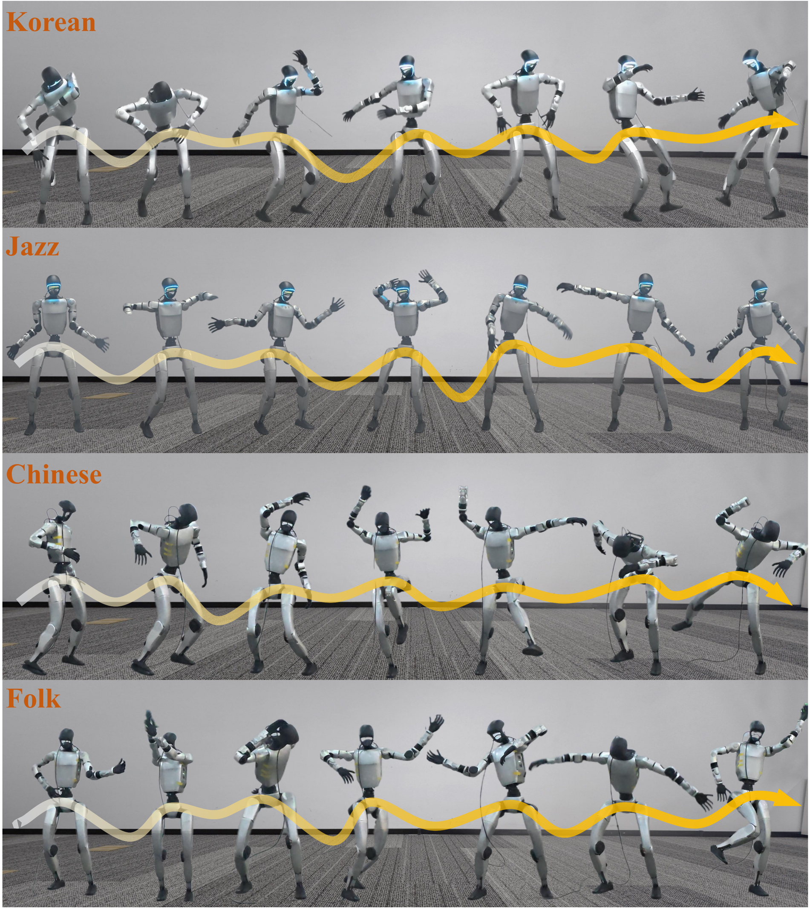

**[Image: figure_0219.png (1901x2132, 3863.3KB)]**

Figure 10. Real-world music-to-locomotion.

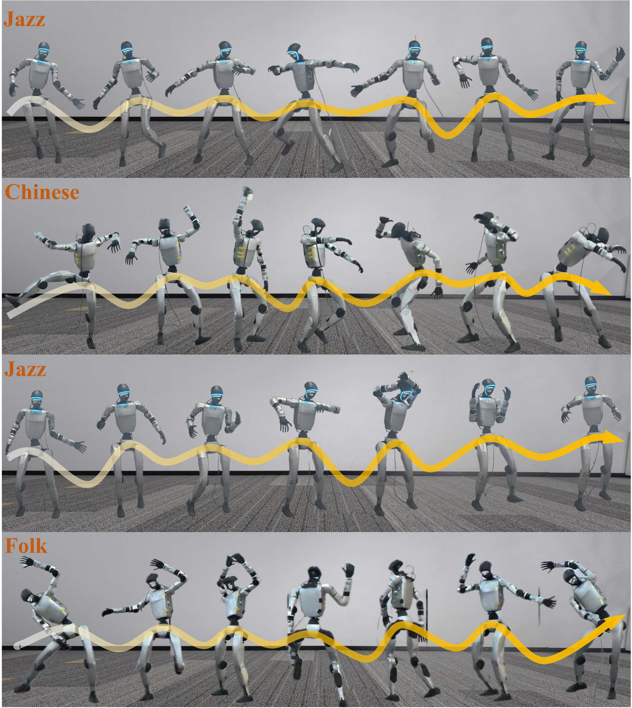

**[Image: figure_0221.png (1900x2127, 3902.3KB)]**

Figure 11. Real-world speech-to-locomotion.

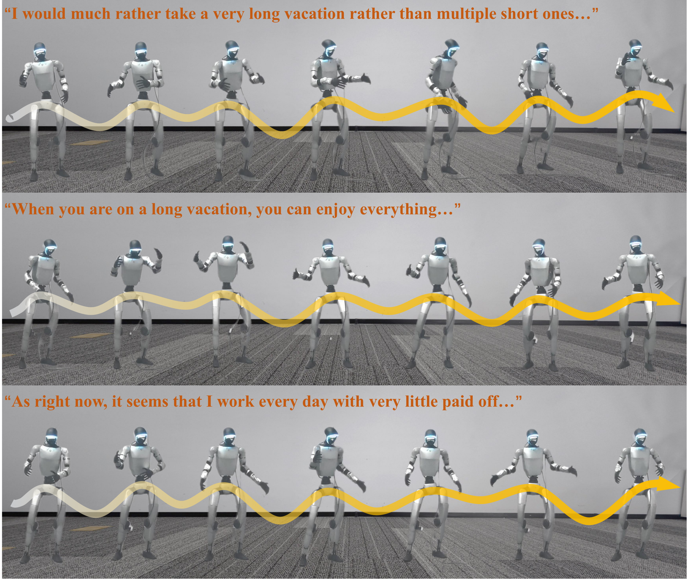

**[Image: figure_0223.png (1900x1598, 2836.1KB)]**

Haoyang Weng, Guanqi He, Tairan He, and Guanya Shi. Hold my beer: Learning gentle humanoid locomotion and end-effector stabilization control. In RSS 2025 Workshop on Whole-body Control and Bimanual Manipulation: Applications in Humanoids and Beyond . 2

- [20] Yixuan Li, Yutang Lin, Jieming Cui, Tengyu Liu, Wei Liang, Yixin Zhu, and Siyuan Huang. Clone: Closed-loop wholebody humanoid teleoperation for long-horizon tasks. arXiv preprint arXiv:2506.08931 , 2025. 3
- [21] Zhongyu Li, Xue Bin Peng, Pieter Abbeel, Sergey Levine, Glen Berseth, and Koushil Sreenath. Robust and versatile bipedal jumping control through reinforcement learning. arXiv preprint arXiv:2302.09450 , 2023. 2
- [22] Zhe Li, Weihao Yuan, Yisheng He, Lingteng Qiu, Shenhao Zhu, Xiaodong Gu, Weichao Shen, Yuan Dong, Zilong Dong, and Laurence T Yang. Lamp: Language-motion pretraining for motion generation, retrieval, and captioning. arXiv preprint arXiv:2410.07093 , 2024. 8
- [23] Zhe Li, Cheng Chi, Yangyang Wei, Boan Zhu, Yibo Peng, Tao Huang, Pengwei Wang, Zhongyuan Wang, Shanghang Zhang, and Chang Xu. From language to locomotion: Retargetingfree humanoid control via motion latent guidance. arXiv preprint arXiv:2510.14952 , 2025. 1, 2, 3
- [24] Zhe Li, Weihao Yuan, Weichao Shen, Siyu Zhu, Zilong Dong, and Chang Xu. Omnimotion: Multimodal motion generation with continuous masked autoregression. arXiv preprint arXiv:2510.14954 , 2025. 2
- [25] Qiayuan Liao, Takara E Truong, Xiaoyu Huang, Guy Tevet, Koushil Sreenath, and C Karen Liu. Beyondmimic: From motion tracking to versatile humanoid control via guided diffusion. arXiv preprint arXiv:2508.08241 , 2025. 3
- [26] Haiyang Liu, Zihao Zhu, Giorgio Becherini, Yichen Peng, Mingyang Su, You Zhou, Xuefei Zhe, Naoya Iwamoto, Bo Zheng, and Michael J Black. Emage: Towards unified holistic co-speech gesture generation via expressive masked audio gesture modeling. In Proceedings of the IEEE/CVF Con-

ference on Computer Vision and Pattern Recognition , pages 1144-1154, 2024. 2, 5, 6

- [27] Zhengyi Luo, Jinkun Cao, Alexander W. Winkler, Kris Kitani, and Weipeng Xu. Perpetual humanoid control for real-time simulated avatars. In International Conference on Computer Vision (ICCV) , 2023. 5
- [28] Jiageng Mao, Siheng Zhao, Siqi Song, Chuye Hong, Tianheng Shi, Junjie Ye, Mingtong Zhang, Haoran Geng, Jitendra Malik, Vitor Guizilini, et al. Universal humanoid robot pose learning from internet human videos. In 2025 IEEE-RAS 24th International Conference on Humanoid Robots (Humanoids) , pages 1-8. IEEE, 2025. 1
- [29] Brian McFee, Colin Raffel, Dawen Liang, Daniel PW Ellis, Matt McVicar, Eric Battenberg, and Oriol Nieto. librosa: Audio and music signal analysis in python. SciPy , 2015: 18-24, 2015. 4
- [30] Aaron van den Oord, Yazhe Li, and Oriol Vinyals. Representation learning with contrastive predictive coding. arXiv preprint arXiv:1807.03748 , 2018. 5
- [31] Georgios Pavlakos, Vasileios Choutas, Nima Ghorbani, Timo Bolkart, Ahmed AA Osman, Dimitrios Tzionas, and Michael J Black. Expressive body capture: 3d hands, face, and body from a single image. In Proceedings of the IEEE/CVF conference on computer vision and pattern recognition , pages 10975-10985, 2019. 6
- [32] Xue Bin Peng, Pieter Abbeel, Sergey Levine, and Michiel Van de Panne. Deepmimic: Example-guided deep reinforcement learning of physics-based character skills. ACM Transactions On Graphics (TOG) , 37(4):1-14, 2018. 3, 1
- [33] Xue Bin Peng, Ze Ma, Pieter Abbeel, Sergey Levine, and Angjoo Kanazawa. Amp: Adversarial motion priors for stylized physics-based character control. ACM Transactions on Graphics (ToG) , 40(4):1-20, 2021. 2
- [34] Stéphane Ross, Geoffrey Gordon, and Drew Bagnell. A reduction of imitation learning and structured prediction to no-regret online learning. In Proceedings of the fourteenth international conference on artificial intelligence and statistics , pages 627-635. JMLR Workshop and Conference Proceedings, 2011. 5
- [35] John Schulman, Filip Wolski, Prafulla Dhariwal, Alec Radford, and Oleg Klimov. Proximal policy optimization algorithms. arXiv preprint arXiv:1707.06347 , 2017. 1
- [36] Yiyang Shao, Xiaoyu Huang, Bike Zhang, Qiayuan Liao, Yuman Gao, Yufeng Chi, Zhongyu Li, Sophia Shao, and Koushil Sreenath. Langwbc: Language-directed humanoid whole-body control via end-to-end learning. arXiv preprint arXiv:2504.21738 , 2025. 1, 3
- [37] Jiaming Song, Chenlin Meng, and Stefano Ermon. Denoising diffusion implicit models. arXiv preprint arXiv:2010.02502 , 2020. 6
- [38] Koushil Sreenath, Hae-Won Park, Ioannis Poulakakis, and Jessy W Grizzle. A compliant hybrid zero dynamics controller for stable, efficient and fast bipedal walking on mabel. The International Journal of Robotics Research , 30(9):1170-1193, 2011. 2
- [39] Zhi Su, Bike Zhang, Nima Rahmanian, Yuman Gao, Qiayuan Liao, Caitlin Regan, Koushil Sreenath, and S Shankar Sastry.

Hitter: A humanoid table tennis robot via hierarchical planning and learning. arXiv preprint arXiv:2508.21043 , 2025. 3

- [40] Ashish Vaswani, Noam Shazeer, Niki Parmar, Jakob Uszkoreit, Llion Jones, Aidan N Gomez, Łukasz Kaiser, and Illia Polosukhin. Attention is all you need. Advances in neural information processing systems , 30, 2017. 5
- [41] Huayi Wang, Zirui Wang, Junli Ren, Qingwei Ben, Tao Huang, Weinan Zhang, and Jiangmiao Pang. Beamdojo: Learning agile humanoid locomotion on sparse footholds. arXiv preprint arXiv:2502.10363 , 2025. 2
- [42] Yuxuan Wang, Ming Yang, Ziluo Ding, Yu Zhang, Weishuai Zeng, Xinrun Xu, Haobin Jiang, and Zongqing Lu. From experts to a generalist: Toward general whole-body control for humanoid robots. arXiv preprint arXiv:2506.12779 , 2025. 3
- [43] Weiji Xie, Jinrui Han, Jiakun Zheng, Huanyu Li, Xinzhe Liu, Jiyuan Shi, Weinan Zhang, Chenjia Bai, and Xuelong Li. Kungfubot: Physics-based humanoid whole-body control for learning highly-dynamic skills. arXiv preprint arXiv:2506.12851 , 2025. 1, 3, 8
- [44] Kangning Yin, Weishuai Zeng, Ke Fan, Minyue Dai, Zirui Wang, Qiang Zhang, Zheng Tian, Jingbo Wang, Jiangmiao Pang, and Weinan Zhang. Unitracker: Learning universal whole-body motion tracker for humanoid robots. arXiv preprint arXiv:2507.07356 , 2025. 3
- [45] Junpeng Yue, Zepeng Wang, Yuxuan Wang, Weishuai Zeng, Jiangxing Wang, Xinrun Xu, Yu Zhang, Sipeng Zheng, Ziluo Ding, and Zongqing Lu. Rl from physical feedback: Aligning large motion models with humanoid control. arXiv preprint arXiv:2506.12769 , 2025. 1, 3
- [46] Yanjie Ze, Zixuan Chen, Joao Pedro Araújo, Zi-ang Cao, Xue Bin Peng, Jiajun Wu, and C Karen Liu. Twist: Teleoperated whole-body imitation system. arXiv preprint arXiv:2505.02833 , 2025. 3
- [47] Tong Zhang, Boyuan Zheng, Ruiqian Nai, Yingdong Hu, YenJen Wang, Geng Chen, Fanqi Lin, Jiongye Li, Chuye Hong, Koushil Sreenath, et al. Hub: Learning extreme humanoid balance. arXiv preprint arXiv:2505.07294 , 2025. 3
- [48] Yuanhang Zhang, Yifu Yuan, Prajwal Gurunath, Tairan He, Shayegan Omidshafiei, Ali-akbar Agha-mohammadi, Marcell Vazquez-Chanlatte, Liam Pedersen, and Guanya Shi. Falcon: Learning force-adaptive humanoid loco-manipulation. arXiv preprint arXiv:2505.06776 , 2025. 2
---

## Extracted Images

| # | File | Dimensions | Size |
|---|------|------------|------|
| 1 | figure_0003.png | 1778x987 | 1895.0KB |
| 2 | figure_0005.png | 67x81 | 6.3KB |
| 3 | figure_0035.png | 1887x1210 | 1034.2KB |
| 4 | figure_0037.png | 947x419 | 81.2KB |
| 5 | figure_0067.png | 855x370 | 148.6KB |
| 6 | figure_0073.png | 813x642 | 112.9KB |
| 7 | figure_0081.png | 1652x1243 | 1340.3KB |
| 8 | figure_0188.png | 1889x656 | 888.6KB |
| 9 | figure_0190.png | 438x247 | 64.5KB |
| 10 | figure_0192.png | 435x249 | 53.3KB |
| 11 | figure_0219.png | 1901x2132 | 3863.3KB |
| 12 | figure_0221.png | 1900x2127 | 3902.3KB |
| 13 | figure_0223.png | 1900x1598 | 2836.1KB |
