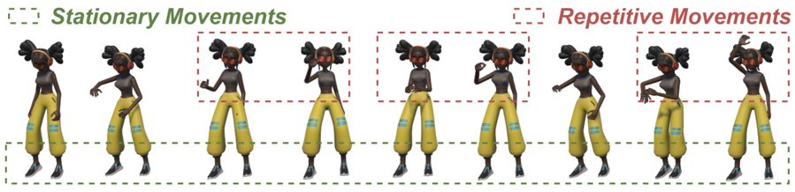
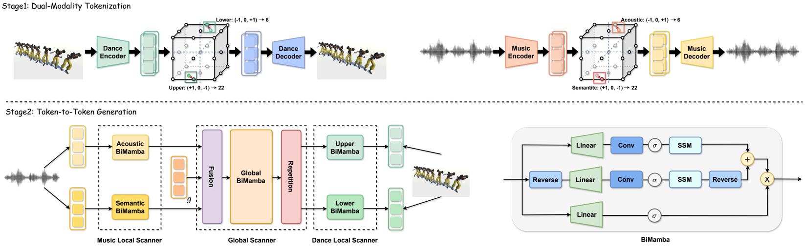
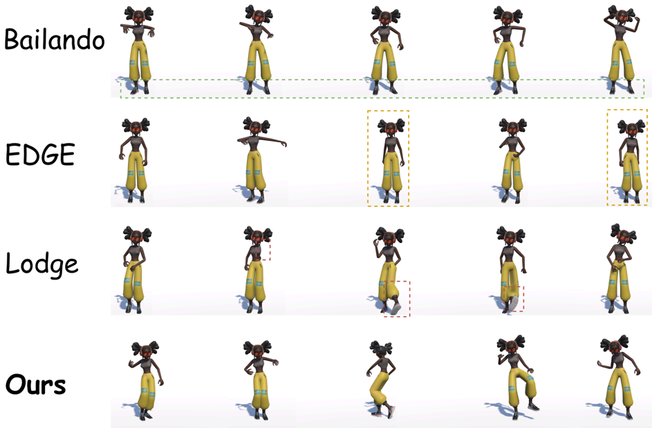
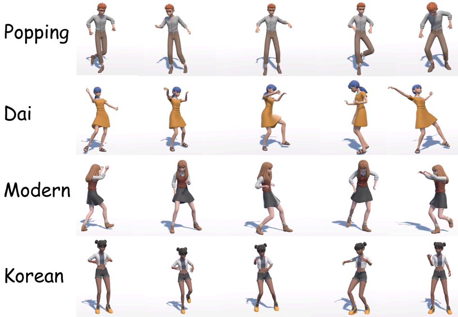

## TokenDance: Token-to-Token Music-to-Dance Generation with Bidirectional Mamba

Ziyue Yang Brown University

ziyue yang@brown.edu

## Abstract

Music-to-dance generation has broad applications in virtual reality, dance education, and digital character animation. However, the limited coverage of existing 3D dance datasets confines current models to a narrow subset of music styles and choreographic patterns, resulting in poor generalization to real-world music. Consequently, generated dances often become overly simplistic and repetitive, substantially degrading expressiveness and realism. To tackle this problem, we present TokenDance , a twostage music-to-dance generation framework that explicitly addresses this limitation through dual-modality tokenization and efficient token-level generation. In the first stage, we discretize both dance and music using Finite Scalar Quantization, where dance motions are factorized into upperand lower-body components with kinematicdynamic constraints, and music is decomposed into semantic and acoustic features with dedicated codebooks to capture choreography-specific structures. In the second stage, we introduce a Local-Global-Local token-to-token generator built on a Bidirectional Mamba backbone, enabling coherent motion synthesis, strong music-dance alignment, and efficient non-autoregressive inference. Extensive experiments demonstrate that TokenDance achieves overall stateof-the-art (SOTA) performance in both generation quality and inference speed, highlighting its effectiveness and practical value for real-world music-to-dance applications.

## 1. Introduction

With the rapid expansion of internet big data, AIGC tasks have garnered increasing attention from researchers [4346], particularly in the field of AI for Art [37]. Dance is an important form of human artistic expression, while music often provides its structural foundation [18, 25]. As a result, the Music-to-Dance generation task has emerged, holding broad application prospects [19, 28] in fields such as virtual

* Corresponding author.

Kaixing Yang Renmin University of China

yangkaixing@ruc.edu.cn Xulong Tang * The University of Texas at Dallas xulong.tang@utdallas.edu

Figure 1. Generated dance from in-the-wild music.

**[Image: figure_0010.png (899x218, 149.6KB)]**

reality, dance education, and digital character animation.

Existing 3D dance generation methods can be broadly categorized into one-stage and two-stage types. One-stage methods directly regress human motion parameters from audio features [17, 18, 50]. Representative models include Generative Adversarial Network (GAN)-based (CoheDancers [36]), and Diffusion-based models (EDGE [31], FineNet [19], and Lodge [21]). However, as these methods operate in a continuous regression space without an explicit learned motion prior, they are more susceptible to accumulated errors and manifold drift. Two-stage methods first construct choreographic units and then learn their probability distributions conditioned on music [28, 29], simplifying the generation task into a token-based classification problem. By leveraging strong dance priors, these methods enhance motion plausibility, including Bailando [28], Bailando++ [29], MEGADance [39]. However, mainstream 3D dance datasets remain limited in scale, e.g., FineDance [19] with 8 hours, AIST++ [18] with 5 hours, and PopDanceSet [24] with 3.56 hours. Existing methods either directly regress motion in a continuous space or treat music as a continuous conditioning signal, which weakens explicit modeling of fine-grained rhythmic cues and higher-level musical structure. As a result, they are more prone to repetitive phrases and conservative choreography on structurally complex in-the-wild music, as illustrated in Fig. 1, leading to reduced expressiveness and realism.

While music appears infinitely diverse from a listener's perspective, from a choreographic standpoint it can be abstracted into a finite set of composable elements [25, 27]. Specifically, at the semantic level, dance choreography is typically associated with a limited number of style categories (e.g., Popping, Jazz, Hip-hop), while at the acoustic level, music follows a finite set of rhyth- mic structures (e.g., 2/4, 3/4, and 4/4 time signatures). This observation suggests that, despite surface-level diversity, choreography-relevant musical information lies on a structured and low-dimensional manifold. Motivated by this property, we propose to capture such core features through music tokenization-analogous to dance tokenization in [28, 29]-which discovers finite and reusable patterns from complex audio signals and establishes a stable and generalizable prior for dance generation.

Following the above observations, we propose TokenDance , a two-stage music-to-dance generation framework designed to explicitly leverage the structured and composable nature of choreography-relevant musical information. In the Dual-Modality Tokenization stage, both music and dance are discretized using Finite Scalar Quantization (FSQ) [26]. For dance, SMPL [23] parameters are factorized into upper- and lower-body motions, with kinematic and dynamic constraints applied during reconstruction to ensure physical plausibility. For music, Librosa-based [18] audio representations are decomposed into semantic features and acoustic features, which are quantized using dedicated codebooks to preserve their heterogeneous characteristics. In the Token-to-Token Generation stage, we introduce a Local-Global-Local generator built upon a Bidirectional Mamba (BiMamba) [48] backbone. Specifically, Music Local Scanners independently encode semantic and acoustic music tokens, while a Global Scanner performs joint fusion and refinement with genre-aware modeling. Finally, two Dance Local Scanners predict upper- and lowerbody motion tokens, respectively. The BiMamba backbone efficiently captures long-range contextual dependencies that are essential for modeling intricate music-dance relationships, leading to improved motion coherence and stronger music-dance alignment. Moreover, the proposed generator naturally supports non-autoregressive inference, substantially improving generation efficiency.

Our contributions to music-to-dance generation are threefold: (1) We propose TokenDance , an efficient twostage music-to-dance generation framework that achieves state-of-the-art (SOTA) performance in both generation quality and inference speed. (2) We introduce music tokenization in the dual-modality tokenization stage, which substantially improves model generalization. Extensive experiments further demonstrate its model-agnostic effectiveness. (3) We design a Local-Global-Local token-totoken generator, enabling more coherent motion generation and stronger music-dance alignment. Additionally, we adopt FSQ for tokenization and BiMamba as the backbone from prior work, while our main contribution lies in dualmodality tokenization and the Local-Global-Local token-totoken generation design.

## 2. Related Work

## 2.1. One-Stage Music-to-Dance Generation

Music-driven 3D dance generation has attracted increasing attention due to the strong coupling between musical structure and human motion. Most existing approaches rely on explicit musical representations extracted using audio analysis tools such as Librosa [18], Jukebox [31], and MERT [35], and aim to predict corresponding human motion representations, including SMPL parameters [23] or body keypoints [28].

Early studies typically adopt encoder-decoder architectures to directly regress entire motion sequences from music features [4, 14, 15, 18, 30]. While conceptually simple, such approaches often struggle to capture complex spatial dependencies among human joints. To address this issue, later works exploit the hierarchical structure of the human body by incorporating Graph Convolutional Networks (GCNs) [6, 34], which explicitly model joint-level interactions and improve biomechanical plausibility.

From a generative modeling perspective, recent advances in AIGC have significantly influenced music-to-dance research. Generative Adversarial Networks (GANs) have been introduced to enhance motion realism by adversarial supervision, where discriminators guide generators toward more natural and expressive dance motions [3, 12, 36]. Recently, Diffusion Models have shown remarkable success in various AIGC tasks, with notable applications extending to the music-to-dance domain [19-21, 31, 40, 41], but the computational cost of the sampling process remains high.

Overall, one-stage methods directly regress motion from music in a continuous space, making them more prone to accumulated errors and manifold drift during inference, especially for long sequences. This motivates two-stage formulations, whose main advantage is the learned discrete latent space or codebook built from real human motion, which provides a stronger motion prior for generation and thus improves motion stability.

## 2.2. Two-Stage Music-to-Dance Generation

Motivated by the inherent periodicity and compositional structure of dance kinematics, two-stage music-to-dance generation methods have been widely explored. These approaches typically consist of two sequential stages: (1) a Dance Quantization stage, which extracts discrete choreographic units from motion datasets, and (2) a Dance Generation stage, which learns music-conditioned probability distributions over these units. Since the choreographic units are derived from real human motion data, two-stage methods naturally inherit strong biomechanical priors, leading to improved motion realism and physical plausibility in generated dances.

Early approaches [1, 3, 13, 42] construct choreographic units via uniform temporal segmentation of motion sequences. While conceptually simple, such strategies incur considerable computational overhead and often fail to capture meaningful motion primitives. More recent works [8] adopt vector-quantized autoencoders (VQ-VAE) to learn discrete motion units in a data-driven manner, significantly reducing time and space complexity while improving reconstruction quality. To further exploit the relative independence between upper- and lower-body motions, [28, 29] construct separate codebooks for different body parts, effectively expanding the representational capacity of the motion space from L to L × L and enabling more expressive motion reconstruction. However, VQ-VAE-based methods often suffer from suboptimal codebook utilization and collapse. To address this issue, recent studies [38, 39] introduce Finite Scalar Quantization (FSQ) as an alternative to VQVAE, achieving more balanced code usage and improved reconstruction fidelity. In addition, more sophisticated kinematic and dynamic constraints are incorporated during reconstruction [39], enabling accurate modeling of SMPL parameters and surpassing earlier representations based solely on 3D human keypoints [28].

Figure 2. Overview of TokenDance.

**[Image: figure_0026.png (1647x507, 265.9KB)]**

Given discrete choreographic units, the second stage focuses on modeling their music-conditioned temporal distributions. Early two-stage methods rely on recurrent architectures to capture motion dependencies, such as GRUbased backbones [3] and RNN-based [12] designs. While effective for short-term modeling, these approaches are limited in capturing long-range musical structure. To address this limitation, more recent methods adopt Transformerbased architectures to enhance temporal reasoning and cross-modal alignment. [28, 29] introduce cross-modal Transformers that significantly improve music-motion synchronization and global choreographic coherence. Beyond backbone design, several studies enhance conditioning signals by incorporating explicit genre information. [19, 21, 49] introduce genre cues through lightweight fusion strategies, including cross-attention [13] and featurelevel addition [49]. In parallel, some works explore leveraging large-scale pretrained motion models. [8] adapt textto-motion pretrained models [11] to music-driven settings, achieving improved motion realism but often sacrificing choreographic diversity and creative variability.

However, mainstream 3D dance datasets remain limited in scale, e.g., FineDance [19] with 8 hours, AIST++ [18] with 5 hours, and PopDanceSet [24] with 3.56 hours. Existing methods either directly regress motion in a continuous space or treat music as a continuous conditioning signal, which weakens explicit modeling of fine-grained rhythmic cues and higher-level musical structure. As a result, they are more prone to repetitive phrases and conservative choreography on structurally complex in-the-wild music, leading to reduced expressiveness and realism.

## 3. Methodology

## 3.1. Problem Definition

Given a genre label g and a music sequence M = { m 0 , m 1 , . . . , m T } , our goal is to synthesize the corresponding dance sequence D = { d 0 , d 1 , . . . , d T } , where m t and d t denote the music and dance features at time step t . Each m t ∈ R 35 is extracted with Librosa [21], and g is encoded as a one-hot vector. Each dance feature d t ∈ R 147 is represented as s t = [ τ ; θ ] , where τ and θ denote the root translation and the 6D rotation representation [47] of the SMPL parameters [23], respectively.

## 3.2. Framework Overview

During training, the Dual-Modality Tokenization stage learns modality-specific codebooks via self-reconstruction with music and dance encoders-decoders, while the Tokento-Token Generation stage trains a generator to map music tokens to dance tokens.

At inference, the first-stage 1D CNN-based Music Encoder extracts music tokens, which are then transformed into dance tokens by the second-stage generator, and finally decoded into motion sequence by the first-stage 1D CNNbased Dance Decoder .

## 3.3. Dual-Modality Tokenization Stage

## 3.3.1. Finite Scalar Quantization.

Most existing token-based dance generation methods [28, 29] adopt VQ-VAE-style quantization for motion discretization. However, VQ-VAE often suffers from codebook collapse and uneven code usage, especially when modeling long and complex motion sequences, which limits representational diversity and degrades generation quality [26].

To address these issues, we adopt Finite Scalar Quantization (FSQ) [26], which performs channel-wise discretization without maintaining an explicit codebook. Specifically, an encoder produces latent features z ∈ R d , which are quantized independently along each channel into discrete indices ˆ z ∈ { 1 , . . . , L } d using a bounded scalar function (e.g., sigmoid) followed by differentiable rounding:

<!-- formula-not-decoded -->

where f ( · ) denotes the bounding function and sg represents the stop-gradient operator. The decoder then reconstructs the input signal from ˆ z .

Unlike VQ-VAE, FSQ does not require auxiliary codebook or commitment losses. Each channel is constrained to fully utilize all L quantization levels, leading to an effective codebook size of k = ∏ d i =1 L i . This design guarantees balanced code utilization by construction, effectively eliminating codebook collapse while maintaining stable gradient propagation during training.

In our implementation, we set ˆ z ∈ { 8 , 5 , 5 , 5 } with d = 4 channel groups, resulting in a codebook size of k = 1000 . The models are trained on sequences of 240 frames for 200 epochs using the Adam optimizer with β 1 = 0 . 5 and β 2 = 0 . 99 and with a batch size of 32.

## 3.3.2. Dance Tokenization.

Dance Decomposed Tokenization . To capture the compositional structure of human motion, we tokenize dance sequences into reusable motion units and construct separate codebooks for the upper and lower body. This design is motivated by the observation that upper- and lowerbody movements often exhibit different temporal patterns and levels of independence in dance choreography. Decoupling these components allows the model to recombine them more flexibly, thereby enriching motion diversity. Specifically, a Dance Encoder E d , consisting of a 3-layer 1D-CNN followed by a 2-layer MLP, encodes the input dance sequence D = { D u , D l } into context-aware latent features z = { z u , z l } . These features are quantized using FSQ to obtain discrete representations ˆ z = { ˆ z u , ˆ z l } . A Dance Decoder D d , implemented as a 2-layer MLP followed by a 3-layer 1D transposed convolution, reconstructs the motion sequence ˆ D = { ˆ D u , ˆ D l } from the quantized tokens.

Dynamic-Kinematic Constraint. The dance encoder and decoder are trained jointly using a reconstruction objective that enforces consistency in joint positions, velocities, and accelerations, both in joint space and forward kinematics space:

<!-- formula-not-decoded -->

where ′ and ′′ denote firstand second-order temporal derivatives, respectively, and FK ( · ) represents the forward kinematics operation [23].

## 3.3.3. Music Tokenization.

3Ddata limitations . Due to the high cost of acquiring highquality 3D dance motion, existing datasets remain limited in scale and coverage (e.g., FineDance [19] with 8 hours, AIST++ [18] with 5 hours, PhantomDance [17] with 9.6 hours, PopDanceSet [24] with 3.56 hours). In practice, this often leads to overfitting to frequent audio-motion correlations and poor generalization under diverse or unseen music, manifesting as repetitive and overly conservative dance patterns, as shown in Fig. 1.

Composable Music Representation. At first glance, music appears to exhibit unbounded diversity. However, from a choreographic perspective, music can be abstracted into a finite set of composable elements [25, 27]. Choreographyrelevant musical cues operate at distinct abstraction levels and serve different functional roles. At the acoustic level, music is governed by a limited set of rhythmic primitives (e.g., 2/4, 3/4, and 4/4 time signatures), which directly constrain motion timing and synchronization. At the semantic level, choreography is typically associated with a finite number of style categories (e.g., Popping, Jazz, and Hiphop), which shape motion vocabulary and expressive intent. Importantly, while surface-level audio realizations may vary continuously, these choreography-relevant cues are drawn from a bounded and repeatedly reused set. Dance-relevant musical information is therefore not uniformly distributed in the raw audio space, but concentrated on a structured and low-dimensional manifold defined by rhythmic regularities and stylistic semantics.

This observation suggests that directly modeling music as a continuous signal is unnecessarily expressive for choreography modeling. Music Tokenization provides a principled way to exploit this structure. By discretizing continuous audio features into a finite vocabulary, tokenization explicitly constrains the conditioning space to reusable and compositionally meaningful units. This reformulation transforms music-dance generation from a regression problem into a structured sequence prediction task, which significantly reduces learning complexity under limited data.

As a result, the model is encouraged to reuse learned musical patterns and compose them into novel sequences, yielding improved robustness and generalization to out-ofdistribution music.

Music Decomposed Tokenization . However, effective music tokenization must respect the multi-level nature of choreographic perception. Naively collapsing all musical cues into a single discrete space risks entangling heterogeneous factors that operate at different abstraction levels, thereby limiting expressive capacity.

To address this issue, we explicitly decompose music representations into acoustic components { M a , ˆ M a } and semantic components { M s , ˆ M s } prior to tokenization. Specifically, the 20-dim MFCC is treated as the semantic component, while the remaining 15 dims are treated as the acoustic component. This decomposition offers two advantages. (1) it decouples acoustic-driven and semantic-driven information, preventing mutual interference during discrete modeling. (2) assigning dedicated FSQ codebooks to each component effectively expands the expressive capacity of the discrete representation from O ( L ) to O ( L 2 ) through compositional combinations of acoustic and semantic tokens.

The Music Encoder E m and Decoder D m are trained jointly using a reconstruction objective:

<!-- formula-not-decoded -->

Through this structured tokenization process, continuous audio signals are mapped into a compact, discrete, and choreography-oriented representation space. These music tokens provide a stable and generalizable conditioning prior for the subsequent token-to-token generation stage, enabling robust music-conditioned dance synthesis under limited data and diverse musical inputs.

## 3.4. Token-to-Token Generation Stage

## 3.4.1. Model Architecture.

As illustrated in Fig. 2, the Token-to-Token Generation stage adopts a Local-Global-Local architecture built upon a Bidirectional Mamba backbone. This hierarchical design explicitly separates local temporal modeling from global choreographic reasoning. First, a 2-layer Music Local Scanner captures modality-specific temporal dependencies within acoustic and semantic music tokens, focusing on short-range rhythmic and structural cues. Next, a 4-layer Global Scanner integrates information from both modalities and refines the fused representation through a genre-aware gating mechanism. By conditioning the global representation on genre embeddings, the model enforces stylistic consistency across long motion sequences. Finally, a 2-layer Dance Local Scanner decomposes the global features into upper- and lower-body branches, followed by task-specific classification heads that predict discrete motion tokens.

This Local-Global-Local formulation enables TokenDance to jointly model local rhythmic alignment, global choreographic coherence, and body-part-specific motion patterns within a unified framework.

In our implementation, the Mamba block is configured with a model dimension of 512, state size of 16, convolution kernel size of 4, and expansion factor of 2. The model is optimized using Adam with exponential decay rates of 0.9 and 0.99 for the first and second moment estimates, respectively, trained on sequences of 240 frames for 100 epochs with a batch size of 64. Following [28, 39], we train the second-stage generator using a cross-entropy loss over the predicted dance tokens.

## 3.4.2. Selective State Space Model.

In TokenDance, we apply independent Mamba modules to the acoustic-music, semantic music, upper-body motion stream, and lower-body motion stream, respectively, enabling each modality to model its intra-modal temporal dynamics.

High-Quality. While Transformer-based architectures excel at modeling long-range dependencies, they are inherently position-invariant and rely on positional encodings to capture sequence order [32], which can limit their ability to model fine-grained local continuity. In contrast, musicto-dance generation critically depends on strong local temporal consistency between successive movements. Owing to its intrinsic sequential inductive bias, Mamba [9] has demonstrated superior capability in modeling local dependencies and smooth temporal evolution [7, 33].

High-Efficiency. Moreover, Mamba inherently enables non autoregression sequence generation. Through its parallel scan formulation, Mamba eliminates the need for step-bystep autoregressive decoding, allowing motion sequences to be synthesized in a fully parallel manner. This design substantially improves generation efficiency and scalability, which is particularly critical for 3D dance generation, as inference speed directly impacts interactive scenarios such as real-time motion synthesis, iterative choreography refinement, and user-in-the-loop control.

Mamba. The Selective State Space Model (Mamba) integrates a selection mechanism with a scan module (S6) [9] to dynamically emphasize salient input segments during sequence processing. Unlike classical S4 models [10] with fixed state-space parameters A , B , C , and discretization step ∆ , Mamba adaptively generates these parameters via fully connected layers, resulting in improved flexibility and generalization. Formally, for each time step t , the input x t , hidden state h t , and output y t evolve as:

<!-- formula-not-decoded -->

where ¯ A t , ¯ B t , and C t are dynamically predicted. After dis- cretization with sampling interval ∆ , the state transition matrices are given by:

Table 1. Quantitative analysis on the AIST++ dataset.

|               | FID k ↓   | FID g ↓   |   DIV k ↑ |   DIV g ↑ |   BAS ↑ |
|---------------|-----------|-----------|-----------|-----------|---------|
| GT            | /         | /         |      8.19 |      7.45 |  0.2374 |
| FACT [18]     | 35.35     | 22.11     |      5.94 |      6.18 |  0.2209 |
| Bailando [28] | 28.16     | 9.62      |      7.83 |      6.34 |  0.2332 |
| EDGE [31]     | 42.16     | 22.12     |      3.96 |      4.61 |  0.2334 |
| Lodge [21]    | 37.09     | 18.79     |      5.58 |      4.85 |  0.2423 |
| TokenDance    | 21.55     | 11.85     |      8.05 |      7.12 |  0.2313 |

Table 2. Quantitative analysis on the FineDance dataset.

|               | FID k ↓   | FID g ↓   |   DIV k ↑ |   DIV g ↑ |   BAS ↑ |
|---------------|-----------|-----------|-----------|-----------|---------|
| GT            | /         | /         |      9.73 |      7.44 |  0.2120 |
| FACT [18]     | 113.38    | 97.05     |      3.36 |      6.37 |  0.1831 |
| Bailando [28] | 82.81     | 28.17     |      7.74 |      6.25 |  0.2029 |
| EDGE [31]     | 94.34     | 50.38     |      8.13 |      6.45 |  0.2116 |
| Lodge [21]    | 45.56     | 34.29     |      6.75 |      5.64 |  0.2397 |
| TokenDance    | 47.20     | 31.85     |      6.62 |      6.81 |  0.2385 |

<!-- formula-not-decoded -->

with I denoting the identity matrix. The scan operation efficiently propagates state information across time, allowing the model to capture long sequences with linear complexity.

## 3.4.3. Bidirectional Mamba.

Temporal dependencies in music-to-dance generation are inherently bidirectional. Musical phrasing often depends on both preceding context and upcoming beats, while choreographic continuity requires anticipating future movements to ensure smooth transitions. However, the standard Mamba block processes sequences in a unidirectional manner, limiting its ability to leverage future context.

To address this limitation, we introduce Bidirectional Mamba , which enhances sequence-wide representations by jointly modeling forward and backward temporal dependencies. As shown in Fig. 2, the input sequence is processed through a forward Mamba pathway, while a temporally reversed sequence is fed into a backward pathway and subsequently re-inverted. The outputs from both directions are fused via element-wise addition and further refined through a multiplicative skip connection, which facilitates efficient gradient flow and preserves salient temporal features. This bidirectional design enables more coherent motion prediction and improves alignment between music structure and generated dance movements.

## 4. Experiment

## 4.1. Experimental Setup

Datasets (1) AIST++ [18] is a widely used benchmark dataset comprising 5.2 hours of 3D street dance motions captured at 60 fps, covering 10 dance genres. (2)

Table 3. Quantitative analysis on the PopDanceSet dataset.

|               | FID k ↓   | FID g ↓   |   DIV k ↑ |   DIV g ↑ |   BAS ↑ |
|---------------|-----------|-----------|-----------|-----------|---------|
| GT            | /         | /         |      8.32 |      7.68 |  0.2603 |
| FACT [18]     | 37.62     | 26.32     |      5.63 |      6.13 |  0.2162 |
| Bailando [28] | 29.56     | 22.47     |      5.92 |      6.29 |  0.2253 |
| EDGE [31]     | 34.58     | 23.72     |      6.13 |      6.48 |  0.2334 |
| POPDG [24]    | 27.13     | 21.41     |      6.52 |      6.37 |  0.2403 |
| TokenDance    | 17.77     | 15.95     |      6.25 |      6.94 |  0.2326 |

FineDance [19] is the largest publicly available dataset for 3D music-to-dance generation, providing 7.7 hours of motion data at 30 fps across 16 distinct dance genres. (3) PopDanceSet [24] is an in-the-wild dataset collected from Bilibili, comprising 3.56 hours of dance videos across 19 dance styles, and a challenging benchmark for youth-oriented dance generation.

Evaluation Metrics. Following prior works [18, 28, 29], we use FID k and FID g to measure motion quality, DIV k and DIV g to assess motion diversity, and Beat Alignment Score (BAS) to evaluate rhythmic synchronization.

## 4.2. Quantitative Results

## 4.2.1. Generation Quality

AIST++. TokenDance achieves the best overall performance on AIST++ (Tab. 1), obtaining the lowest FID k of 21.55 and the highest motion diversity with DIV k = 8.05 and DIV g = 7.12 . These results indicate that TokenDance generates high-quality motions while maintaining rich and diverse movement patterns. Although its FID g (11.85) is slightly higher than that of Bailando (9.62), TokenDance demonstrates a favorable trade-off between motion quality and diversity, validating the effectiveness of its representation and generation strategy.

FineDance. On the more challenging FineDance dataset, TokenDance delivers competitive results across most metrics, as shown in Tab. 2. Specifically, it achieves the lowest FID g of 31.85 and the highest DIV g of 6.81 , indicating strong global motion consistency and diversity. While Lodge attains the best FID k (45.56) and BAS (0.2397), TokenDance remains highly competitive with a comparable BAS of 0.2385, suggesting robust rhythmic alignment under complex choreographic settings.

PopDanceSet. As reported in Tab. 3, TokenDance establishes a new state of the art on PopDanceSet in terms of motion quality, achieving the lowest FID k of 17.77 and FID g of 15.95 among all methods. In addition, TokenDance attains the highest DIV g of 6.94 , reflecting superior global motion diversity. Although POPDG slightly outperforms TokenDance in DIV k (6.52 vs. 6.25) and BAS (0.2403 vs. 0.2326), TokenDance significantly improves motion realism while maintaining competitive rhythmic alignment across diverse music genres and dance styles.

Table 4. Comparison on computational latency.

| Method        | Latency@1024 ↓   | Latency@4096 ↓   |
|---------------|------------------|------------------|
| FACT [18]     | 35.88 s          | 142.12 s         |
| Bailando [28] | 5.46 s           | 14.72 s          |
| EDGE [31]     | 8.59 s           | 27.91 s          |
| Lodge [21]    | 4.57 s           | 11.96 s          |
| TokenDance    | 1.22 s           | 2.31 s           |

## 4.2.2. Computational Complexity.

As shown in Table 4, TokenDance achieves the lowest inference latency at both sequence lengths (1.22 s at 1024 and 2.31 s at 4096). Compared with prior methods, latency grows much more slowly with sequence length, validating the efficiency and scalability of the non-autoregressive token-to-token design.

## 4.3. Qualitative Results

Note: All qualitative results in this figure are obtained using models trained on FineDance and evaluated on in-thewild music. (1) Comparison. Figure 3 shows that TokenDance produces more diverse motions than EDGE [31], Lodge [21], and Bailando [28], with smoother transitions and better perceptual quality. EDGE and Lodge more frequently exhibit repeated short motion loops and occasional unstable foot contacts, while Bailando tends to produce conservative motions with limited spatial coverage. In contrast, TokenDance preserves longer choreographic phrases and more natural upper-lower body coordination. (2) Cross-Genre. As shown in Fig. 4, TokenDance generalizes well across genres (e.g., Dai, modern, popping, and Korean styles), preserving style-specific motion patterns while maintaining music alignment. For example, it captures fluid arm trajectories in Dai dance and sharper isolations in popping without sacrificing temporal smoothness. These observations are consistent with the quantitative improvements in diversity and beat alignment.

## 4.4. User Study

Following [16, 39], we conduct a double-blind user study with 40 participants on 30 in-the-wild music clips, comparing Bailando [28], EDGE [31], Lodge [21], and TokenDance using 5-point scores on Dance Synchronization (DS), Dance Quality (DQ), and Dance Creativity (DC). As shown in Table 5, TokenDance achieves the highest scores across all criteria (DS: 4 . 12 ± 0 . 39 , DQ: 4 . 09 ± 0 . 37 , DC: 3 . 96 ± 0 . 41 ), indicating better perceptual quality, synchronization, and creativity. Compared with the strongest baseline Lodge [21], TokenDance improves DS by 0.41, DQ by 0.31, and DC by 0.27. The remaining gap to GT is also relatively small for DS and DQ, suggesting that the generated motions are close to human choreography in perceived rhythm and realism.

Figure 3. Qualitative comparison with SOTAs on in-the-wild test samples by models trained on FineDance..

**[Image: figure_0100.png (943x620, 227.3KB)]**

Figure 4. Qualitative analysis across dance genres on in-the-wild test samples by models trained on FineDance.

**[Image: figure_0102.png (946x654, 255.4KB)]**

## 4.5. Model Agnostic Analysis

Model Architecture. Music Tokenization (MT) is designed to capture choreography-relevant musical structure in a compact and discrete form, independent of the specific model architecture. To verify whether its benefit is modelspecific or generalizable, we incorporate MT into three representative baselines with distinct modeling paradigms: FACT [18] (one-stage regression), Bailando [28] (two-stage token-based generation), and our TokenDance framework. Quantitative results are summarized in Table 6.

Across all three models, MT consistently improves motion quality, diversity, and rhythmic alignment. As shown in Table 6, FACT improves from 113.38/97.05 to 105.12/89.45 on FID k /FID g , Bailando improves from 82.81/28.17 to 68.34/24.50, and TokenDance further improves from 47.20/31.85 to 45.95/30.42.

Music Representation. To evaluate the generalization of Music Tokenization (MT) under different music representations, we replace the semantic component (MFCC) in 35dim Librosa feature of TokenDance with features extracted by MERT [22], Jukebox [5], and Wav2Vec2.0 [2]. We further consider a w/o. MT setting, where semantic features are directly concatenated with acoustic features for prediction without tokenization. This design allows us to disentangle the effect of music representation from that of tokenization.

Table 5. User study on in-the-wild test samples using models trained on the FineDance dataset.

| Method        | DS ↑            | DQ ↑            | DC ↑            |
|---------------|-----------------|-----------------|-----------------|
| GT            | 4 . 52 ± 0 . 41 | 4 . 45 ± 0 . 38 | 4 . 37 ± 0 . 43 |
| FACT [18]     | 2 . 11 ± 0 . 62 | 2 . 03 ± 0 . 58 | 1 . 98 ± 0 . 64 |
| Bailando [28] | 3 . 48 ± 0 . 51 | 3 . 44 ± 0 . 49 | 3 . 32 ± 0 . 53 |
| EDGE [31]     | 3 . 52 ± 0 . 47 | 3 . 46 ± 0 . 50 | 3 . 41 ± 0 . 48 |
| Lodge [21]    | 3 . 71 ± 0 . 44 | 3 . 78 ± 0 . 42 | 3 . 69 ± 0 . 46 |
| TokenDance    | 4 . 12 ± 0 . 39 | 4 . 09 ± 0 . 37 | 3 . 96 ± 0 . 41 |

Table 6. The model-agnostic effect of Music Tokenization (MT) for model architecture on the FineDance dataset.

| Method             |   FID k ↓ |   FID g ↓ |   DIV k ↑ |   DIV g ↑ |   BAS ↑ |
|--------------------|-----------|-----------|-----------|-----------|---------|
| TokenDance         |     47.20 |     31.85 |      6.62 |      6.81 |  0.2385 |
| TokenDance + MT    |     45.95 |     30.42 |      6.75 |      6.89 |  0.2412 |
| Bailando [28]      |     82.81 |     28.17 |      7.74 |      6.25 |  0.2029 |
| Bailando [28] + MT |     68.34 |     24.50 |      8.01 |      6.52 |  0.2147 |
| FACT [18]          |    113.38 |     97.05 |      3.36 |      6.37 |  0.1831 |
| FACT [18] + MT     |    105.12 |     89.45 |      3.68 |      6.48 |  0.1893 |

Table 7. The model-agnostic effect of Music Tokenization (MT) for music representation on the FineDance dataset.

| Method                   |   FID k ↓ |   FID g ↓ |   DIV k ↑ |   DIV g ↑ |   BAS ↑ |
|--------------------------|-----------|-----------|-----------|-----------|---------|
| MFCC → MERT [22]         |     42.40 |     45.90 |      6.62 |      6.78 |   0.232 |
| MERT [22] (w/o. MT)      |     35.10 |     48.60 |      6.42 |      6.50 |   0.228 |
| MFCC → Jukebox [5]       |     36.80 |     32.46 |      6.15 |      6.53 |   0.202 |
| Jukebox [5] (w/o. MT)    |     49.30 |     31.97 |      5.20 |      5.12 |   0.223 |
| MFCC → Wav2Vec2.0 [2]    |     60.90 |     32.60 |      6.32 |      5.95 |   0.225 |
| Wav2Vec2.0 [2] (w/o. MT) |     84.31 |     65.10 |      5.91 |      6.21 |   0.215 |
| TokenDance (Full)        |     47.20 |     31.85 |      6.62 |      6.81 |   0.239 |

As shown in Table 7, MT consistently improves performance across representations; TokenDance (Full) remains the most balanced setting, while Wav2Vec2.0 is the weakest. These results support that MT is robust to feature choice and that structured tokenization is the key contributor.

## 4.6. Ablation Study

Music Decomposition. We investigate the effect of decomposing music into acoustic and semantic components by removing this design and directly quantizing concatenated music features. As shown in Tables 8 and 9, Music Decomposition consistently brings substantial improvements in both music reconstruction and music-to-dance generation tasks. In the reconstruction task, introducing decomposition significantly reduces MAE across all levels, with MAE@Full decreasing from 0.544 to 0.345, indicating more accurate and stable modeling of music representations. In the downstream generation task, removing Music Decomposition leads to clear performance degrada- Table 9. Ablation study in music-to-dance generation task.

Table 8. Ablation study in music reconstruction task on the FineDance dataset. S, A, and F represent the Semantic, Acoustic, and Full settings, respectively.

| Method             |   MAE@S ↓ |   MAE@A ↓ |   MAE@F ↓ |
|--------------------|-----------|-----------|-----------|
| w/o. Music Decomp. |     0.642 |     0.358 |     0.544 |
| TokenDance (Full)  |     0.519 |     0.269 |     0.345 |

| Method                |   FID k ↓ |   FID g ↓ |   DIV k ↑ |   DIV g |   BAS ↑ |
|-----------------------|-----------|-----------|-----------|---------|---------|
| w/o. Music Decomp.    |     53.12 |     36.45 |      6.10 |    6.22 |   0.225 |
| BiMamba → Mamba       |     46.95 |     34.20 |      6.55 |    6.48 |   0.231 |
| BiMamba → Transformer |     61.37 |     42.78 |      5.75 |    5.89 |   0.210 |
| TokenDance (Full)     |     47.20 |     31.85 |      6.62 |    6.81 |   0.239 |

tion across all metrics, including higher FID k (53.12 vs. 47.20), higher FID g (36.45 vs. 31.85), and lower diversity and rhythmic alignment. These results demonstrate that music decomposition is critical for both faithful reconstruction and downstream dance generation.

Model Backbone. We evaluate the impact of the backbone design by replacing the proposed Bidirectional Mamba (BiMamba) with a unidirectional Mamba and a Transformer, as reported in Table 9. BiMamba achieves the best overall performance. Compared with unidirectional Mamba, BiMamba improves global motion quality and rhythmic alignment, reducing FID g from 34.20 to 31.85 and increasing BAS from 0.231 to 0.239, while maintaining comparable local motion quality (FID k : 46.95 vs. 47.20). In contrast, Transformer performs substantially worse across all metrics, with FID k rising to 61.37, FID g to 42.78, and BAS dropping to 0.210. These results support using BiMamba to jointly model local continuity and global context for better music-dance alignment.

## 5. Conclusion

In this work, we present TokenDance , a two-stage musicto-dance generation framework that exploits the structured and composable nature of choreography-relevant musical information. Through Dual-Modality Tokenization, both music and dance are discretized into reusable and semantically meaningful tokens, enabling a more structured formulation of music-to-dance generation under limited 3D dance data. On top of these discrete representations, we introduce a Local-Global-Local token-to-token generator with a Bidirectional Mamba backbone, which jointly captures local rhythmic continuity and global choreographic coherence while enabling efficient non-autoregressive inference. Extensive experiments across multiple datasets show that TokenDance achieves strong overall performance in both generation quality and inference efficiency. Future work will extend the framework with larger and more diverse datasets, as well as text-based conditioning, to enable more flexible and user-specified choreographic control.

## References

- [1] Andreas Aristidou, Anastasios Yiannakidis, Kfir Aberman, Daniel Cohen-Or, Ariel Shamir, and Yiorgos Chrysanthou. Rhythm is a dancer: Music-driven motion synthesis with global structure. IEEE Transactions on Visualization and Computer Graphics , 2022. 2
- [2] Alexei Baevski, Yuhao Zhou, Abdelrahman Mohamed, and Michael Auli. wav2vec 2.0: A framework for self-supervised learning of speech representations. Advances in neural information processing systems , 33:12449-12460, 2020. 8
- [3] Kang Chen, Zhipeng Tan, Jin Lei, Song-Hai Zhang, YuanChen Guo, Weidong Zhang, and Shi-Min Hu. Choreomaster: choreography-oriented music-driven dance synthesis. ACM Transactions on Graphics (TOG) , 40(4):1-13, 2021. 2, 3
- [4] Andr´ e Correia and Lu´ ıs A Alexandre. Music to dance as language translation using sequence models. arXiv preprint arXiv:2403.15569 , 2024. 2
- [5] Prafulla Dhariwal, Heewoo Jun, Christine Payne, Jong Wook Kim, Alec Radford, and Ilya Sutskever. Jukebox: A generative model for music. arXiv preprint arXiv:2005.00341 , 2020. 8
- [6] Joao P Ferreira, Thiago M Coutinho, Thiago L Gomes, Jos´ e F Neto, Rafael Azevedo, Renato Martins, and Erickson R Nascimento. Learning to dance: A graph convolutional adversarial network to generate realistic dance motions from audio. Computers &amp; Graphics , 94:11-21, 2021. 2
- [7] Chencan Fu, Yabiao Wang, Jiangning Zhang, Zhengkai Jiang, Xiaofeng Mao, Jiafu Wu, Weijian Cao, Chengjie Wang, Yanhao Ge, and Yong Liu. Mambagesture: Enhancing co-speech gesture generation with mamba and disentangled multi-modality fusion. In Proceedings of the 32nd ACM International Conference on Multimedia , pages 10794-10803, 2024. 5
- [8] Kehong Gong, Dongze Lian, Heng Chang, Chuan Guo, Zihang Jiang, Xinxin Zuo, Michael Bi Mi, and Xinchao Wang. Tm2d: Bimodality driven 3d dance generation via music-text integration. In Proceedings of the IEEE/CVF International Conference on Computer Vision , pages 9942-9952, 2023. 3
- [9] Albert Gu and Tri Dao. Mamba: Linear-time sequence modeling with selective state spaces. arXiv preprint arXiv:2312.00752 , 2023. 5
- [10] Albert Gu, Karan Goel, and Christopher R´ e. Efficiently modeling long sequences with structured state spaces. arXiv preprint arXiv:2111.00396 , 2021. 5
- [11] Chuan Guo, Xinxin Zuo, Sen Wang, and Li Cheng. Tm2t: Stochastic and tokenized modeling for the reciprocal generation of 3d human motions and texts. In European Conference on Computer Vision , pages 580-597. Springer, 2022. 3
- [12] Ruozi Huang, Huang Hu, Wei Wu, Kei Sawada, Mi Zhang, and Daxin Jiang. Dance revolution: Long-term dance generation with music via curriculum learning. arXiv preprint arXiv:2006.06119 , 2020. 2, 3
- [13] Yuhang Huang, Junjie Zhang, Shuyan Liu, Qian Bao, Dan Zeng, Zhineng Chen, and Wu Liu. Genre-conditioned longterm 3d dance generation driven by music. In ICASSP 20222022 IEEE International Conference on Acoustics, Speech
14. and Signal Processing (ICASSP) , pages 4858-4862. IEEE, 2022. 2, 3
- [14] Nhat Le, Thang Pham, Tuong Do, Erman Tjiputra, Quang D Tran, and Anh Nguyen. Music-driven group choreography. In Proceedings of the IEEE/CVF Conference on Computer Vision and Pattern Recognition , pages 8673-8682, 2023. 2
- [15] Juheon Lee, Seohyun Kim, and Kyogu Lee. Listen to dance: Music-driven choreography generation using autoregressive encoder-decoder network. arXiv preprint arXiv:1811.00818 , 2018. 2
- [16] Doroth´ ee Legrand and Susanne Ravn. Perceiving subjectivity in bodily movement: The case of dancers. Phenomenology and the Cognitive Sciences , 8:389-408, 2009. 7
- [17] Buyu Li, Yongchi Zhao, Shi Zhelun, and Lu Sheng. Danceformer: Music conditioned 3d dance generation with parametric motion transformer. In Proceedings of the AAAI Conference on Artificial Intelligence , pages 1272-1279, 2022. 1, 4
- [18] Ruilong Li, Shan Yang, David A Ross, and Angjoo Kanazawa. Ai choreographer: Music conditioned 3d dance generation with aist++. In Proceedings of the IEEE/CVF International Conference on Computer Vision , pages 1340113412, 2021. 1, 2, 3, 4, 6, 7, 8
- [19] Ronghui Li, Junfan Zhao, Yachao Zhang, Mingyang Su, Zeping Ren, Han Zhang, Yansong Tang, and Xiu Li. Finedance: A fine-grained choreography dataset for 3d full body dance generation. In Proceedings of the IEEE/CVF International Conference on Computer Vision , pages 1023410243, 2023. 1, 2, 3, 4, 6
- [20] Ronghui Li, Hongwen Zhang, Yachao Zhang, Yuxiang Zhang, Youliang Zhang, Jie Guo, Yan Zhang, Xiu Li, and Yebin Liu. Lodge++: High-quality and long dance generation with vivid choreography patterns. arXiv preprint arXiv:2410.20389 , 2024.
- [21] Ronghui Li, YuXiang Zhang, Yachao Zhang, Hongwen Zhang, Jie Guo, Yan Zhang, Yebin Liu, and Xiu Li. Lodge: A coarse to fine diffusion network for long dance generation guided by the characteristic dance primitives. In Proceedings of the IEEE/CVF Conference on Computer Vision and Pattern Recognition , pages 1524-1534, 2024. 1, 2, 3, 6, 7, 8
- [22] Yizhi Li, Ruibin Yuan, Ge Zhang, Yinghao Ma, Xingran Chen, Hanzhi Yin, Chenghao Xiao, Chenghua Lin, Anton Ragni, Emmanouil Benetos, et al. Mert: Acoustic music understanding model with large-scale self-supervised training. arXiv preprint arXiv:2306.00107 , 2023. 8
- [23] Matthew Loper, Naureen Mahmood, Javier Romero, Gerard Pons-Moll, and Michael J Black. Smpl: A skinned multiperson linear model. In Seminal Graphics Papers: Pushing the Boundaries, Volume 2 , pages 851-866. 2023. 2, 3, 4
- [24] Zhenye Luo, Min Ren, Xuecai Hu, Yongzhen Huang, and Li Yao. Popdg: Popular 3d dance generation with popdanceset. In Proceedings of the IEEE/CVF Conference on Computer Vision and Pattern Recognition , pages 26984-26993, 2024. 1, 3, 4, 6
- [25] Paul H Mason. Music, dance and the total art work: choreomusicology in theory and practice. Research in dance education , 13(1):5-24, 2012. 1, 4
- [26] Fabian Mentzer, David Minnen, Eirikur Agustsson, and Michael Tschannen. Finite scalar quantization: Vq-vae made simple. arXiv preprint arXiv:2309.15505 , 2023. 2, 4
- [27] Robert W Mitchell and Matthew C Gallaher. Embodying music: Matching music and dance in memory. Music Perception , 19(1):65-85, 2001. 1, 4
- [28] Li Siyao, Weijiang Yu, Tianpei Gu, Chunze Lin, Quan Wang, Chen Qian, Chen Change Loy, and Ziwei Liu. Bailando: 3d dance generation by actor-critic gpt with choreographic memory. In Proceedings of the IEEE/CVF Conference on Computer Vision and Pattern Recognition , pages 1105011059, 2022. 1, 2, 3, 4, 5, 6, 7, 8
- [29] Li Siyao, Weijiang Yu, Tianpei Gu, Chunze Lin, Quan Wang, Chen Qian, Chen Change Loy, and Ziwei Liu. Bailando++: 3d dance gpt with choreographic memory. IEEE Transactions on Pattern Analysis and Machine Intelligence , 2023. 1, 2, 3, 4, 6
- [30] Taoran Tang, Jia Jia, and Hanyang Mao. Dance with melody: An lstm-autoencoder approach to music-oriented dance synthesis. In Proceedings of the 26th ACM international conference on Multimedia , pages 1598-1606, 2018. 2
- [31] Jonathan Tseng, Rodrigo Castellon, and Karen Liu. Edge: Editable dance generation from music. In Proceedings of the IEEE/CVF Conference on Computer Vision and Pattern Recognition , pages 448-458, 2023. 1, 2, 6, 7, 8
- [32] A Vaswani. Attention is all you need. Advances in Neural Information Processing Systems , 2017. 5
- [33] Zunnan Xu, Yukang Lin, Haonan Han, Sicheng Yang, Ronghui Li, Yachao Zhang, and Xiu Li. Mambatalk: Efficient holistic gesture synthesis with selective state space models. In The Thirty-eighth Annual Conference on Neural Information Processing Systems , 2024. 5
- [34] Sijie Yan, Zhizhong Li, Yuanjun Xiong, Huahan Yan, and Dahua Lin. Convolutional sequence generation for skeletonbased action synthesis. In Proceedings of the IEEE/CVF International Conference on Computer Vision , pages 43944402, 2019. 2
- [35] Kaixing Yang, Xulong Tang, Ran Diao, Hongyan Liu, Jun He, and Zhaoxin Fan. Codancers: Music-driven coherent group dance generation with choreographic unit. In Proceedings of the 2024 International Conference on Multimedia Retrieval , pages 675-683, 2024. 2
- [36] Kaixing Yang, Xulong Tang, Haoyu Wu, Qinliang Xue, Biao Qin, Hongyan Liu, and Zhaoxin Fan. Cohedancers: Enhancing interactive group dance generation through music-driven coherence decomposition. arXiv preprint arXiv:2412.19123 , 2024. 1, 2
- [37] Kaixing Yang, Xukun Zhou, Xulong Tang, Ran Diao, Hongyan Liu, Jun He, and Zhaoxin Fan. Beatdance: A beat-based model-agnostic contrastive learning framework for music-dance retrieval. In Proceedings of the 2024 International Conference on Multimedia Retrieval , pages 11-19, 2024. 1
- [38] Kaixing Yang, Xulong Tang, Yuxuan Hu, Jiahao Yang, Hongyan Liu, Qinnan Zhang, Jun He, and Zhaoxin Fan. Matchdance: Collaborative mamba-transformer architecture matching for high-quality 3d dance synthesis. arXiv preprint arXiv:2505.14222 , 2025. 3
- [39] Kaixing Yang, Xulong Tang, Ziqiao Peng, Yuxuan Hu, Jun He, and Hongyan Liu. Megadance: Mixture-of-experts architecture for genre-aware 3d dance generation. arXiv preprint arXiv:2505.17543 , 2025. 1, 3, 5, 7
- [40] Kaixing Yang, Xulong Tang, Ziqiao Peng, Xiangyue Zhang, Puwei Wang, Jun He, and Hongyan Liu. Flowerdance: Meanflow for efficient and refined 3d dance generation. arXiv preprint arXiv:2511.21029 , 2025. 2
- [41] Kaixing Yang, Jiashu Zhu, Xulong Tang, Ziqiao Peng, Xiangyue Zhang, Puwei Wang, Jiahong Wu, Xiangxiang Chu, Hongyan Liu, and Jun He. Mace-dance: Motion-appearance cascaded experts for music-driven dance video generation. arXiv preprint arXiv:2512.18181 , 2025. 2
- [42] Zijie Ye, Haozhe Wu, Jia Jia, Yaohua Bu, Wei Chen, Fanbo Meng, and Yanfeng Wang. Choreonet: Towards music to dance synthesis with choreographic action unit. In Proceedings of the 28th ACM International Conference on Multimedia , pages 744-752, 2020. 2
- [43] Xiangyue Zhang, Yifan Jia, Jiaxu Zhang, Yijie Yang, and Zhigang Tu. Robust 2d skeleton action recognition via decoupling and distilling 3d latent features. IEEE Transactions on Circuits and Systems for Video Technology , 2025. 1
- [44] Xiangyue Zhang, Jianfang Li, Jiaxu Zhang, Ziqiang Dang, Jianqiang Ren, Liefeng Bo, and Zhigang Tu. Semtalk: Holistic co-speech motion generation with frame-level semantic emphasis. In Proceedings of the IEEE/CVF International Conference on Computer Vision , pages 13761-13771, 2025.
- [45] Xiangyue Zhang, Jianfang Li, Jiaxu Zhang, Jianqiang Ren, Liefeng Bo, and Zhigang Tu. Echomask: Speech-queried attention-based mask modeling for holistic co-speech motion generation. In Proceedings of the 33rd ACM International Conference on Multimedia , pages 10827-10836, 2025.
- [46] Xiangyue Zhang, Jianfang Li, Jianqiang Ren, and Jiaxu Zhang. Mitigating error accumulation in co-speech motion generation via global rotation diffusion and multi-level constraints. In Proceedings of the AAAI Conference on Artificial Intelligence , pages 12834-12842, 2026. 1
- [47] Yi Zhou, Connelly Barnes, Jingwan Lu, Jimei Yang, and Hao Li. On the continuity of rotation representations in neural networks. In Proceedings of the IEEE/CVF conference on computer vision and pattern recognition , pages 5745-5753, 2019. 3
- [48] Lianghui Zhu, Bencheng Liao, Qian Zhang, Xinlong Wang, Wenyu Liu, and Xinggang Wang. Vision mamba: Efficient visual representation learning with bidirectional state space model. arXiv preprint arXiv:2401.09417 , 2024. 2
- [49] Haolin Zhuang, Shun Lei, Long Xiao, Weiqin Li, Liyang Chen, Sicheng Yang, Zhiyong Wu, Shiyin Kang, and Helen Meng. Gtn-bailando: Genre consistent long-term 3d dance generation based on pre-trained genre token network. In ICASSP 2023-2023 IEEE International Conference on Acoustics, Speech and Signal Processing (ICASSP) , pages 1-5. IEEE, 2023. 3
- [50] Wenlin Zhuang, Congyi Wang, Jinxiang Chai, Yangang Wang, Ming Shao, and Siyu Xia. Music2dance: Dancenet for music-driven dance generation. ACM Transactions on Multimedia Computing, Communications, and Applications (TOMM) , 18(2):1-21, 2022. 1
---

## Extracted Images

| # | File | Dimensions | Size |
|---|------|------------|------|
| 1 | figure_0010.png | 899x218 | 149.6KB |
| 2 | figure_0026.png | 1647x507 | 265.9KB |
| 3 | figure_0100.png | 943x620 | 227.3KB |
| 4 | figure_0102.png | 946x654 | 255.4KB |
